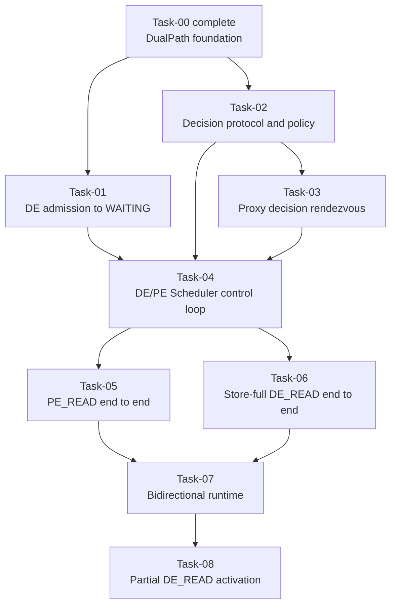

# DualPath Stage 1 Task Catalog

## 1. Purpose

This catalog defines the remaining DualPath Stage 1 delivery units after the
completed Task-00 foundation. It replaces the historical PR-01 through PR-07
implementation order with a lifecycle-first Task graph.

The target architecture remains:

- HBM-complete Decode requests stay local and do not enter DualPath decision.
- Every other Decode request first allocates its final Decode HBM slots and
  enters `WAITING_FOR_REMOTE_KVS`.
- The Prefill Scheduler owns the unique `PE_READ` or `DE_READ` decision.
- A committed route is immutable and authorizes exactly one explicit data
  plan.
- Decode returns to `WAITING` only after the committed route's typed completion
  predicate is satisfied.

## 2. Shared terminology

For an initial request:

```text
P    = prompt token count
R    = max(P - 1, 0), Decode-ready KV prefix required before first DE forward
L_DE = contiguous Decode HBM prefix
K_DE = usable, aligned Decode KVPool prefix after clamp to the request target
L_PE = contiguous Prefill HBM prefix
E_DE = R - L_DE, when L_DE < R
```

Store classification is derived from `(L_DE, K_DE, R,
store_available)` when needed. Stage 1 does not require a public
`StoreCoverage` object.

Task-01 does not introduce a `StoreProbeHandle`. Before allocation, the Decode
Scheduler retains only a minimal detached lookup result. After allocation,
`update_state_after_alloc()` consumes that result and creates a complete
`DecodeKVSnapshot` with final block IDs. Neither object owns Store or P2P I/O.

## 3. Global invariants

The following requirements apply to every Task:

- `L_DE >= R` returns `(0, False)`, performs no Store lookup, creates no
  candidate, and does not enter decision.
- Store lookup never starts an HBM load, Store Worker operation, Forward, or
  Reverse.
- For `L_DE < R`, Decode Scheduler admission returns `E_DE`, not the number of
  tokens hit in Store.
- Receiving real block IDs does not authorize a connector to start I/O.
- The PE Scheduler is the sole producer of `PathDecisionCommit`.
- Scheduler threads do not perform blocking HTTP operations.
- Proxy routes and validates decisions but does not choose a path.
- A committed path never falls back to the other path. Failure may use the
  explicitly defined vLLM recompute/error behavior, but it cannot re-decide.
- Worker completion retains direction and source provenance until the owning
  request-level completion predicate consumes it.
- Cancellation is drain-first for submitted data movement: stop new work,
  retain referenced blocks, then clean up after completion, failure, or
  timeout.
- Ordinary Layerwise requests remain behavior-compatible throughout the
  series.

## 4. Task dependency graph



Task-01 and Task-02 may proceed independently after Task-00. Task-05 and
Task-06 may be developed independently after the control loop is complete, but
Store-full round-robin activation waits until both routes are complete.

## 5. Merge-state summary

| Task | Merge-state after acceptance | Production route activation |
|---|---|---|
| 00 | Selectable Layerwise-compatible DualPath subclass | Ordinary Layerwise only |
| 01 | Non-HBM-complete DE request allocates final slots and waits | None; request intentionally remains waiting |
| 02 | Decision schemas, identity, eligibility, and policy are executable pure logic | None |
| 03 | Proxy decision Future round trip works with constrained/fake endpoints | None |
| 04 | Real DE and PE Scheduler hooks exchange one commit; no data I/O is authorized | None; fail-closed |
| 05 | A committed `PE_READ` request completes through Forward | `PE_READ`-only safe activation |
| 06 | A Store-full committed `DE_READ` request completes through Decode Store | Full-candidate `PE_READ`/`DE_READ` activation |
| 07 | Injected partial plans execute on one bidirectional runtime | No partial selection |
| 08 | Partial `DE_READ` executes and completes with all barriers | Complete Stage 1 route set |

## 6. Task-00 — DualPath foundation

**Status:** Complete.

**Merge-state contract:**

`DualPathConnector`, `DualPathConnectorScheduler`, and
`DualPathConnectorWorker` exist as behavior-preserving Layerwise subclass
seams. Their foundation configuration and parent-parity evidence remain owned
by the historical PR-00 documents.

No remaining Task may weaken the Task-00 construction, configuration,
inheritance, or ordinary Layerwise parity gates without explicitly revising
that completed contract.

## 7. Task-01 — Decode admission to `WAITING_FOR_REMOTE_KVS`

**Depends on:** Task-00.

**Detailed spec:**
[`tasks/TASK-01-decode-admission.md`](tasks/TASK-01-decode-admission.md).

**Goal:**

Implement the live Decode Scheduler path from initial HBM lookup through final
slot allocation and `WAITING_FOR_REMOTE_KVS`, while collecting a side-effect-
free KVPool lookup result for later decisions.

**Merge-state contract:**

For `L_DE < R`, `DualPathConnectorScheduler.get_num_new_matched_tokens()`
returns `(R - L_DE, True)`. vLLM allocates the final Decode blocks,
`update_state_after_alloc()` binds those blocks to a Scheduler-owned pending
request record, and vLLM places the request in
`WAITING_FOR_REMOTE_KVS`.

No Proxy request, decision, Store Worker load, Forward, Reverse, or
`finished_recving` publication occurs. The request intentionally remains
waiting until a later Task provides a committed data path.

**In scope:**

- A minimal KVPool lookup adapter that calls the existing non-layerwise
  `KVPoolScheduler.get_num_new_matched_tokens()` implementation, immediately
  detaches its `LoadSpec`, and leaves no entry in the adapter-owned
  `KVPoolScheduler.load_specs`.
- A Decode-side KVPool adapter returning a detached `LoadSpec` or an explicit
  miss/unavailable result.
- A minimal pre-allocation lookup cache and an immutable post-allocation
  `DecodeKVSnapshot`. `L_DE` and usable `K_DE` are derived from existing fields
  instead of stored twice; final block IDs are never optional in an admission.
- Pass-through acceptance of the existing lookup-only KVPool settings,
  including deployment-provided `consumer_is_to_load=True`; Task-01 does not
  override or silently default that KVPool policy.
- HBM-complete bypass, duplicate scheduling, allocation-failure retry, final
  block binding, request finish, cancellation, and shutdown cleanup.
- Full, partial, miss, unavailable, alignment, clamp, duplicate lookup, and
  no-side-effect tests.

**Out of scope:**

- Public `StoreCoverage` or `StoreProbeHandle` types.
- `commit_after_alloc()`, Store Worker metadata, or Store load.
- Candidate submission, Proxy interaction, PE request, or path decision.
- Forward, Reverse, Worker completion, or request promotion from waiting.

**Acceptance endpoint:**

A Scheduler-focused integration test must exercise the actual vLLM call order
and prove that a non-HBM-complete request has final allocated blocks and status
`WAITING_FOR_REMOTE_KVS`, while Worker connector metadata contains no active
Store or P2P request.

## 8. Task-02 — Decision protocol and PE-owned policy

**Depends on:** Task-00.

**Goal:**

Define the complete, transport-independent language for one PE-owned route
decision.

**Merge-state contract:**

Request identity, candidate, commit, error, path eligibility, and round-robin
policy are executable and fully tested as pure logic. They have no Scheduler,
HTTP, Store, or P2P side effects.

**In scope:**

- Attempt-safe request/candidate identity.
- `PathKind.PE_READ` and `PathKind.DE_READ`.
- Candidate, commit, and typed error schemas with strict validation.
- Capability-aware eligibility calculation.
- PE-owned round-robin: advance only when both paths are eligible; identical
  duplicate input must not advance policy state twice.
- Serialization round trips and invalid/untrusted input rejection.

**Out of scope:**

- Proxy endpoints, Coordinator clients, Scheduler hooks, and Worker plans.
- Production activation of any path.

**Acceptance endpoint:**

Pure unit tests prove deterministic eligibility, round-robin behavior,
idempotency, conflict rejection, and schema compatibility.

## 9. Task-03 — Proxy decision rendezvous

**Depends on:** Task-02.

**Goal:**

Extend the existing Decode-first Proxy with a DualPath-only decision Future
rendezvous while preserving the ordinary Layerwise flow.

**Merge-state contract:**

For a valid DualPath candidate, Proxy registers a decision Future before
dispatching the real Prefill request, accepts one validated PE decision, and
returns that decision as the Decode `/v1/metaserver` response. Ordinary
requests continue through the existing metaserver behavior.

**In scope:**

- DualPath envelope detection and strict request correlation.
- Decision Future registration before PE dispatch.
- `/v1/path-decision` commit-once resolution.
- Identical duplicate, conflicting duplicate, timeout, PE dispatch failure,
  client cancellation, and terminal map cleanup.
- Mixed ordinary/DualPath concurrency and request isolation.
- Fake or constrained DE/PE endpoint integration tests.

**Out of scope:**

- Path selection inside Proxy.
- Real Scheduler integration and data-plane I/O.

**Acceptance endpoint:**

A Proxy-only integration test exercises one complete candidate-to-commit HTTP
round trip and proves Future-before-dispatch ordering and terminal cleanup.

## 10. Task-04 — DE/PE Scheduler decision control loop

**Depends on:** Task-01, Task-02, and Task-03.

**Goal:**

Connect real DE and PE Scheduler lifecycle hooks to the decision rendezvous
without authorizing a data path.

**Merge-state contract:**

After Decode allocation, the DE Scheduler freezes and submits one candidate.
The PE Scheduler computes and commits one path. The DE Coordinator writes the
response to a thread-safe inbox, and the DE Scheduler drains that inbox during
`build_connector_meta()` on a later schedule tick. The DE request retains its
final blocks and remains in `WAITING_FOR_REMOTE_KVS`.

**In scope:**

- Non-blocking PE and DE `PathDecisionCoordinator` ownership.
- Candidate submission only after final DE block binding.
- PE Scheduler eligibility and unique policy invocation.
- Scheduler-thread decision inbox consumption on every connector metadata
  build tick, including zero-model-token ticks.
- Commit/error persistence, timeout, cancellation, and duplicate scheduling.
- Fail-closed configuration and a no-Store/no-P2P closed-loop harness.

**Out of scope:**

- Scheduler-visible positive accounting for an active `DE_READ` route.
- Store load, Forward, Reverse, or `finished_recving` publication.
- Production route activation.

**Acceptance endpoint:**

A control-plane integration test uses real Scheduler hooks and proves one
candidate reaches PE policy and one immutable commit reaches DE Scheduler
state while both Workers observe no data operation.

## 11. Task-05 — `PE_READ` end-to-end

**Depends on:** Task-04.

**Goal:**

Complete the first active DualPath route by reusing PE Store/compute behavior
and transferring the required prefix to Decode through explicit Forward plans.

**Merge-state contract:**

After a local PE `PE_READ` commit, outer PE Store may load available KV or PE
may compute missing KV. The PE Worker forwards the frozen `[L_DE, R)` plan to
the final DE blocks. Typed Forward completion publishes DE
`finished_recving`; vLLM caches the prepared prefix and promotes the DE request
back to `WAITING`.

**In scope:**

- Explicit, immutable Forward block-pair plans frozen by Scheduler metadata.
- PE Store winner, PE Store miss, and ordinary PE compute behavior.
- Just-in-time parent extraction of send runtime startup, send metadata
  preparation, and per-layer send enqueue helpers.
- Forward start gates, raw completion/failure reconciliation, cancellation,
  timeout, and terminal cleanup.
- CPU integration and NPU `PE_READ` acceptance.

**Out of scope:**

- Decode Store commit and active `DE_READ`.
- Receive/bidirectional parent helper extraction and Reverse.

**Acceptance endpoint:**

Production-safe `PE_READ`-only activation completes requests for PE Store hit
and PE compute cases without Decode Store I/O.

## 12. Task-06 — Store-full `DE_READ` end-to-end

**Depends on:** Task-04 and Task-05 for activation.

**Goal:**

Complete Store-full `DE_READ` using the Task-01 detached lookup and final DE
blocks, then safely activate round-robin only when both full-candidate routes
are complete.

**Merge-state contract:**

For `K_DE == R`, a committed `DE_READ` converts the detached `LoadSpec` and
frozen blocks into one Decode KVPool Worker load for `[L_DE, R)`. Typed Store
DONE publishes DE `finished_recving`. The PE request performs no Store load,
model computation, Reverse, or Forward and terminates through an explicitly
validated no-work lifecycle.

**In scope:**

- `commit_after_alloc(load_spec, final_block_ids)` metadata construction.
- Decode Store Worker composition, typed DONE/FAILED, invalid-block
  provenance, and request promotion/failure handling.
- Prevention and cleanup of non-winning PE Store state.
- A proven PE no-work terminal mechanism for full `DE_READ`.
- Full-candidate round-robin activation only after both `PE_READ` and
  `DE_READ` NPU paths pass.

**Out of scope:**

- Partial Store execution, Reverse, or split completion barriers.
- Post-commit fallback to `PE_READ`.

**Acceptance endpoint:**

Alternating full candidates complete through `PE_READ` and `DE_READ`; the
`DE_READ` trace contains one Decode Store load and zero PE Store/model/P2P
operations.

The detailed Task-06 spec must choose and validate the PE no-work mechanism.
Proxy cancellation after commit is the current preferred design, but it is not
accepted until an integration test proves that it prevents ModelRunner
execution and releases PE request resources.

## 13. Task-07 — Bidirectional runtime and injected partial plans

**Depends on:** Task-05 and Task-06.

**Goal:**

Extend one inherited Layerwise Worker runtime to own Forward send/receive and
Reverse send/receive capabilities, while keeping production partial selection
disabled.

**Merge-state contract:**

Injected partial plans can execute Store, Reverse, PE compute gates, and
Forward with explicit direction/source completion provenance. No production
request can select partial `DE_READ`.

**In scope:**

- Just-in-time parent extraction of receive runtime startup and receive
  metadata binding.
- One-time KV buffer registration with send and receive capabilities.
- Immutable Reverse block-pair plans and registered layer ordering.
- Mapping-first metadata binding and preservation of early raw DONE/FAILED.
- Store DONE, Reverse DONE, compute, and Forward gates.
- Cross-direction tombstones, timeout, cancellation, block retention, and
  drain-first cleanup.
- Injected success, failure, race, duplicate, and cancellation tests.

**Out of scope:**

- Partial `DE_READ` eligibility or production activation.

**Acceptance endpoint:**

An injected partial-plan harness proves the bidirectional runtime and all
ordering/completion invariants without changing the production selector.

## 14. Task-08 — Partial `DE_READ` activation

**Depends on:** Task-07.

**Goal:**

Connect partial Store candidates to the previously tested bidirectional runtime
and complete Stage 1 route activation.

**Merge-state contract:**

For a partial committed `DE_READ`, Decode loads `[L_DE, K_DE)`, Reverse sends
`[L_PE, K_DE)` when non-empty, PE computes `[K_DE, R)`, and Forward sends
`[K_DE, R)`. Decode publishes `finished_recving` only after Store DONE and
Forward DONE. PE does not compute before Reverse DONE when Reverse is required.

**In scope:**

- Partial eligibility and PE round-robin integration.
- Exact logical ranges and frozen physical mappings for Store, Reverse, and
  Forward.
- Empty-Reverse handling when `L_PE >= K_DE` if admitted by the detailed
  eligibility contract.
- MultiConnector winner/sibling lifecycle isolation.
- Failure, invalid-block, timeout, cancellation, observability, and no-
  redecision behavior.
- Complete CPU, NPU, HBM, topology, and supported-configuration acceptance.

**Out of scope:**

- Adaptive routing, Value Function, LinkMonitor, relay, or post-commit route
  changes.

**Acceptance endpoint:**

The NPU matrix covers full and partial `PE_READ`/`DE_READ`, verifies exact
transfer ranges and completion predicates, and establishes the complete Stage
1 activation boundary.

## 15. Parent helper extraction ownership

The historical standalone parent-refactor task is intentionally removed.

| Parent extension seam | Owning Task | Reason |
|---|---|---|
| Send runtime startup | Task-05 | First concrete consumer is Forward |
| Send metadata preparation | Task-05 | Defined by the Forward plan contract |
| Per-layer send enqueue | Task-05 | Must preserve current save callback behavior |
| Receive runtime startup | Task-07 | First new consumer is Reverse receive/bidirectional runtime |
| Receive metadata binding | Task-07 | Requires mapping-first partial lifecycle semantics |

An implementation may place a behavior-preserving extraction in a separate
mechanical commit or review PR, but its acceptance remains part of the owning
Task and it must not introduce unused protected APIs.

## 16. Old-to-new mapping

| Historical unit | Current disposition |
|---|---|
| PR-00 foundation | Preserved as completed Task-00 |
| PR-01 Store coverage/probe handle | Replaced by Task-01 admission and Scheduler pending record |
| PR-02 parent Worker helper extraction | Split into Task-05 send and Task-07 receive ownership |
| PR-03 unified control plane | Split into Task-02 protocol, Task-03 Proxy, and Task-04 Scheduler loop |
| PR-04 Store-full `DE_READ` | Reworked as Task-06 after `PE_READ` is complete |
| PR-05 Forward | Reworked and moved earlier as Task-05 |
| PR-06 bidirectional runtime | Reworked as Task-07 |
| PR-07 partial activation | Reworked as Task-08 |

## 17. Detailed-spec order

Detailed specs are written and approved in dependency order:

1. Task-01 Decode admission to `WAITING_FOR_REMOTE_KVS`.
2. Task-02 decision protocol and policy.
3. Task-03 Proxy decision rendezvous.
4. Task-04 Scheduler decision control loop.
5. Task-05 `PE_READ` end-to-end.
6. Task-06 Store-full `DE_READ` end-to-end.
7. Task-07 bidirectional runtime.
8. Task-08 partial activation.

Writing a detailed spec authorizes design elaboration and review only. Code
implementation begins only after that Task's detailed spec is approved.
