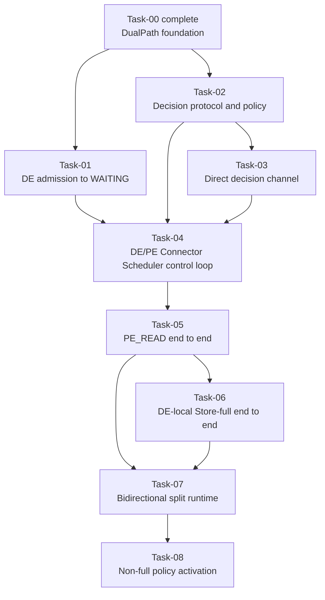

# DualPath Stage 1 Task Catalog

## 1. Purpose

This catalog defines the remaining DualPath Stage 1 delivery units after the
completed Task-00 foundation. It replaces the historical PR-01 through PR-07
implementation order with a lifecycle-first Task graph.

The target architecture remains:

- HBM-complete Decode requests stay local and do not enter DualPath decision.
- A DE Store-full request allocates through the Decode-ready boundary and
  completes through a DE-local KVPool load without Proxy or Prefill.
- A DE Store-non-full request allocates through the parent Layerwise transfer
  target and enters the remote decision flow.
- The Prefill `DualPathConnectorScheduler` owns the unique `PE_READ` or
  `DE_READ` decision only for Store-non-full requests.
- A committed route is immutable and authorizes exactly one explicit data
  plan.
- Decode returns to `WAITING` only after the committed route's typed completion
  predicate is satisfied.

## 2. Shared terminology

For an initial request:

```text
P    = prompt token count
R    = max(P - 1, 0), Decode-ready KV prefix required before Decode resumes
T    = parent Layerwise transfer target: P for ordinary Attention, R for
       Attention-Mamba hybrid
L_DE = contiguous Decode HBM prefix
K_DE = usable, aligned Decode KVPool prefix after clamp to the ready boundary R
L_PE = contiguous Prefill HBM prefix
E_DE = R - L_DE for DE Store-full
       T - L_DE for DE Store-non-full
```

Store classification is derived from `(L_DE, K_DE, R)` when needed. Stage 1
does not require a public `StoreCoverage` object.

Task-01 does not introduce a `StoreProbeHandle`. Before allocation, the Decode
Scheduler retains only a minimal detached lookup result. After allocation,
`update_state_after_alloc()` consumes that result and creates a complete
`DecodeKVSnapshot` with final block IDs. Neither object owns Store or P2P I/O.

## 3. Global invariants

The following requirements apply to every Task:

- `L_DE >= R` returns `(0, False)`, performs no Store lookup, creates no
  decision request, and does not enter decision.
- Store lookup never starts an HBM load, Store Worker operation, Forward, or
  Reverse.
- For `L_DE < R`, Decode Scheduler admission returns `R - L_DE` when Store
  covers `R`, otherwise `T - L_DE`. It never returns a partial Store delta.
- Receiving real block IDs does not authorize a connector to start I/O.
- A Store-full snapshot authorizes only an explicit post-allocation local
  Store commit; it creates no request key, Proxy notification, PE request, or
  path decision.
- The PE `DualPathConnectorScheduler` is the sole producer of
  `PathDecisionResult` for Store-non-full requests.
- Scheduler threads do not perform blocking network operations.
- Proxy dispatches the real Prefill request and forwards the DE control
  endpoint, but it does not choose or relay a committed path.
- A committed path never falls back to the other path. Failure may use the
  explicitly defined vLLM recompute/error behavior, but it cannot re-decide.
- Worker completion retains direction and source provenance until the owning
  request-level completion predicate consumes it.
- Stage 1 does not define user abort or cross-engine cancellation. Request-
  terminal hooks clean local Connector records only; they do not promise to
  stop work on another engine.
- Ordinary Layerwise requests remain behavior-compatible throughout the
  series.

### Known limitations (Stage 1)

- **Prefill-side preemption after decision delivery retains a late-DMA
  risk.** Stage 2 preserves attempt-based Reverse re-execution, the
  `reverse_attempt_id` epoch, the I4 current-attempt completion gate, and the
  normal recovery path designed in
  `.specs/dual-path-stage2-preemption/2026-08-11-dual-path-stage2-preemption-safety-design.md`
  and implemented in `vllm_ascend/distributed/kv_transfer/kv_p2p/dual_path/`.
  The Forward block hold and sender fence were not retained, and the Reverse
  destination hold plus `CloseReverseAttempt` protocol have been retired.
  Forward preemption and exceptional Reverse termination therefore follow the
  parent connector's immediate-free semantics: blocks may be reused before a
  late DMA has stopped. This accepted risk has unit coverage for the retained
  epoch, I4, recovery, watchdog, and topology behavior under
  `tests/ut/distributed/kv_transfer/dual_path/`.

## 4. Task dependency graph



Task-01 and Task-02 may proceed independently after Task-00. Tasks 01 through
08 are implemented. The full Stage 1 route set is active: HBM-complete bypass,
DE-local Store-full, eligibility-forced `PE_READ`, policy-selected `PE_READ`,
and split `DE_READ`.

## 5. Merge-state summary

| Task | Merge-state after acceptance | Production route activation |
|---|---|---|
| 00 | Selectable Layerwise-compatible DualPath subclass | Ordinary Layerwise only |
| 01 | Non-HBM-complete DE request allocates final slots and waits | None; request intentionally remains waiting |
| 02 | Store-non-full decision schemas, identity, and replaceable policy are executable pure logic | None |
| 03 | Direct PE-to-DE Store-non-full decision delivery works with ACK, bounded retry, and observable exhaustion | None |
| 04 | Real DE and PE hooks exchange one Store-non-full Result; no data I/O is authorized | None; fail-closed |
| 05 | A test-forced Store-non-full `PE_READ` request completes through Forward | None; non-full production policy remains disabled |
| 06 | A Store-full request completes through DE-local Decode Store without a Decision/PE request | Deterministic DE-local Store-full |
| 07 | Injected non-full split plans execute on one bidirectional runtime | No non-full policy activation |
| 08 | Non-full `PE_READ`/`DE_READ` policy results execute with all barriers | Complete Stage 1 route set |

Rows record each Task's acceptance-time state. With Task-08 merged, the final
production state is the complete Stage 1 route set described in row 08.

## 6. Task-00 — DualPath foundation

**Status:** Complete.

**Merge-state contract:**

`DualPathConnector`, `DualPathConnectorScheduler`, and
`DualPathConnectorWorker` exist as behavior-preserving Layerwise subclass
seams. Their foundation configuration and parent-parity evidence remain owned
by the historical PR-00 documents.

No remaining Task may weaken the Task-00 construction, configuration,
inheritance, or ordinary Layerwise parity gates without explicitly revising
that completed contract.

## 7. Task-01 — Decode admission to `WAITING_FOR_REMOTE_KVS`

**Depends on:** Task-00.

**Detailed spec:**
[`tasks/TASK-01-decode-admission.md`](tasks/TASK-01-decode-admission.md).

**Goal:**

Implement the live Decode Scheduler path from initial HBM lookup through final
slot allocation and `WAITING_FOR_REMOTE_KVS`, while collecting a side-effect-
free KVPool lookup result for later decisions.

**Merge-state contract:**

For `L_DE < R`, `DualPathConnectorScheduler.get_num_new_matched_tokens()`
returns `(R - L_DE, True)` for Store-full and `(T - L_DE, True)` otherwise.
vLLM allocates the final Decode blocks,
`update_state_after_alloc()` binds those blocks to a Scheduler-owned pending
request record, and vLLM places the request in
`WAITING_FOR_REMOTE_KVS`.

No Proxy request, decision, Store Worker load, Forward, Reverse, or
`finished_recving` publication occurs. The request intentionally remains
waiting until a later Task provides a committed data path.

**In scope:**

- A minimal KVPool lookup adapter that calls the existing non-layerwise
  `KVPoolScheduler.get_num_new_matched_tokens()` implementation, immediately
  detaches its `LoadSpec`, and leaves no entry in the adapter-owned
  `KVPoolScheduler.load_specs`.
- A Decode-side KVPool adapter returning a detached `LoadSpec` or an explicit
  miss/unavailable result.
- A minimal pre-allocation lookup cache and an immutable post-allocation
  `DecodeKVSnapshot`. Post-Task-06, `L_DE` is explicit because external-token
  accounting has route-dependent boundaries; usable `K_DE` remains derived
  from `LoadSpec`; final block IDs are never optional.
- Pass-through acceptance of the existing lookup-only KVPool settings,
  including deployment-provided `consumer_is_to_load=True`; Task-01 does not
  override or silently default that KVPool policy.
- HBM-complete bypass, duplicate scheduling, allocation-failure retry, final
  block binding, request-terminal, and shutdown cleanup.
- Full, partial, miss, unavailable, alignment, clamp, duplicate lookup, and
  no-side-effect tests.

**Out of scope:**

- Public `StoreCoverage` or `StoreProbeHandle` types.
- `commit_after_alloc()`, Store Worker metadata, or Store load.
- Candidate submission, Proxy interaction, PE request, or path decision.
- Forward, Reverse, Worker completion, or request promotion from waiting.

**Acceptance endpoint:**

A Scheduler-focused integration test must exercise the actual vLLM call order
and prove that a non-HBM-complete request has final allocated blocks and status
`WAITING_FOR_REMOTE_KVS`, while Worker connector metadata contains no active
Store or P2P request.

## 8. Task-02 — Decision protocol and PE-owned policy

**Depends on:** Task-00.

**Goal:**

Define the complete, transport-independent language for one PE-owned route
decision.

**Merge-state contract:**

Request identity, one concrete result type, and a replaceable round-robin
policy for Store-non-full requests are executable and fully tested as pure
logic. They have no Scheduler, network, Store, or P2P side effects.

**In scope:**

- `DualPathRequestKey(decode_engine_instance_id, decode_request_id)`.
- `Path.PE_READ` and `Path.DE_READ`.
- Minimal `PathDecisionRequest` and concrete `PathDecisionResult` schemas with
  strict validation; no public `StoreCoverage`, candidate, Commit, or wire
  Error type.
- A lightweight `PathPolicy.choose(request)` protocol.
- PE-owned `RoundRobinPathPolicy`: choose a random first path, then alternate
  for subsequent unique Store-non-full requests.
- Identical duplicate replay and local conflicting-input rejection without
  policy-state replay.
- Serialization round trips and invalid/untrusted input rejection.

**Out of scope:**

- Proxy endpoints, Coordinator clients, Scheduler hooks, and Worker plans.
- Production activation of any path.

**Acceptance endpoint:**

Pure unit tests prove Store-full input rejection, strict schemas,
seeded-random round-robin behavior, duplicate replay, local conflict
rejection, and policy substitutability.

The detailed contract is
[`tasks/TASK-02-decision-protocol.md`](tasks/TASK-02-decision-protocol.md).

## 9. Task-03 — Direct PE-to-DE decision channel

**Depends on:** Task-02.

**Goal:**

Establish a dedicated direct ZMQ control channel from the PE
`PathDecisionCoordinator` to the DE `PathDecisionCoordinator` without routing
the Result back through Proxy.

**Merge-state contract:**

Each DE Scheduler instance exposes one control endpoint derived from
`dual_path_control_port + data_parallel_rank` and one boot-specific Decode
Engine instance ID. A nested `kv_transfer_params["dual_path"]` schema carries
a validated Store-non-full Task-02 request and DE endpoint through the
existing Proxy path. The PE
Coordinator sends one immutable `PathDecision` directly to that endpoint with
temporary REQ sockets. The DE Coordinator makes its Result available exactly
once, then returns `b"ACK"`. Delivery exhaustion is observable without a
second decision attempt.

**In scope:**

- `dual_path_control_port` in connector extra configuration, with one endpoint
  per DE Scheduler/DP rank and no TP Worker port reuse.
- A boot UUID appended to logical Engine ID and DP rank for restart-safe
  `decode_engine_instance_id`.
- Strict nested bootstrap metadata containing `PathDecisionRequest` and the DE
  endpoint; Proxy forwards it unchanged and retains no decision Future.
- A DE ZMQ `ROUTER` receiver and PE asynchronous temporary-REQ sender owned by
  their local `PathDecisionCoordinator` instances.
- ACK semantics meaning only "validated, retained, and made available through
  `take_received_results()`", not Scheduler consumption or data readiness.
- Three attempts with a fresh REQ socket, one-second send and receive bounds,
  exact `b"ACK"`, and 0.1-second spacing; no NACK or persistent endpoint pool.
- Minimal pending/accepted registries and a received-result queue: identical
  duplicates ACK without a second Result; conflicting, stale, unknown, and
  malformed input receive no ACK.
- Sender-Future cancellation, delivery exhaustion, Coordinator shutdown, and
  terminal cleanup; no cross-engine request-abort protocol.
- Direct-channel integration tests with constrained sender/receiver endpoints.

**Out of scope:**

- Path selection inside the transport.
- Proxy `/v1/path-decision`, decision Futures, or response-carried Result.
- Real per-request Scheduler hooks, DE Decision-wait timeout, and data-plane
  I/O.

**Acceptance endpoint:**

A direct-channel integration test proves request-driven endpoint use, Result
delivery, literal-ACK retry idempotency, stale/conflict silence, observable
exhaustion, restart-safe identity, and clean endpoint shutdown without real
per-request Scheduler hooks or data-plane I/O.

The detailed contract is
[`tasks/TASK-03-direct-decision-channel.md`](tasks/TASK-03-direct-decision-channel.md).

## 10. Task-04 — DE/PE Connector Scheduler decision control loop

**Depends on:** Task-01, Task-02, and Task-03.

**Goal:**

Connect real DE and PE `DualPathConnectorScheduler` lifecycle hooks to the
direct decision channel without authorizing a data path.

**Merge-state contract:**

After Store-non-full Decode allocation, the DE
`DualPathConnectorScheduler` registers the request with its Coordinator,
freezes one `PathDecisionRequest`, and submits
the Task-03 nested `dual_path` metadata through the existing Proxy path. The PE
`DualPathConnectorScheduler` invokes its policy once and produces one
`PathDecisionResult`. The DE Coordinator exposes
the received Result once through `take_received_results()`, and the DE
Scheduler consumes it during `build_connector_meta()` on a later schedule
tick. The DE request retains its final blocks and remains in
`WAITING_FOR_REMOTE_KVS`.

**In scope:**

- Non-blocking PE and DE `PathDecisionCoordinator` ownership.
- Decision-request submission only after final DE block binding and only for
  Store-non-full admission.
- Unique Store-non-full policy invocation.
- PE retained-result ownership so identical duplicate requests replay the same
  Result and conflicting facts fail locally without advancing policy state.
- Scheduler-thread received-result consumption on every connector metadata
  build tick, including zero-model-token ticks.
- `VLLM_ASCEND_DUALPATH_DECISION_TIMEOUT`, Result-or-timeout state,
  request-terminal cleanup, and duplicate scheduling.
- Control-only timeout metadata that reuses the existing
  `invalid_block_ids + finished_recving` failure path.
- Decode-side single-KV-cache-group and `kv_load_failure_policy="fail"`
  fail-fast validation.
- A no-Store/no-P2P closed-loop harness. PE may compute temporarily, but its
  DualPath request never enters `_reqs_need_send_layerwise`.

**Out of scope:**

- Scheduler-visible positive accounting for an active `DE_READ` route.
- Store load, Forward, Reverse, or successful `finished_recving` publication.
- PE no-work termination after a Result.
- Production route activation.

**Acceptance endpoint:**

A control-plane integration test uses real Connector Scheduler hooks and
proves one Store-non-full request reaches PE policy, one immutable Result
reaches DE Scheduler state, and timeout becomes `FINISHED_ERROR`, while both
Workers observe no Store or P2P operation.

The detailed contract is
[`tasks/TASK-04-scheduler-decision-control-loop.md`](tasks/TASK-04-scheduler-decision-control-loop.md).

## 11. Task-05 — `PE_READ` end-to-end

**Depends on:** Task-04.

**Goal:**

Complete the first remote-required DualPath data-plane route by reusing PE
Store/compute behavior and transferring the required prefix to Decode through
explicit Forward plans.

**Merge-state contract:**

After a local PE `PE_READ` Result, outer PE Store may load available KV or PE
may compute missing KV. The PE Scheduler freezes one request-level logical
`ForwardPlan` and adapts it into the inherited Layerwise send state. The PE
Worker forwards `[L_DE, T)` to the final DE blocks. A DE
`ForwardReceiveBinding` owns completion mapping. DONE publishes
`finished_recving`; FAILED publishes destination `invalid_block_ids` together
with `finished_recving`.

**In scope:**

- Explicit, immutable request-level Forward plans with complete PE/DE block
  tables and logical `[L_DE, T)`.
- Parent-compatible targets: ordinary Attention keeps `T=P`; Attention-Mamba
  hybrid reuses the inherited PE truncation and DE block-trimming behavior
  with `T=R`.
- PE plan creation waits for a real PE allocation whose source table covers
  `T`; an earlier Store-driven prefix allocation retains the Result and
  creates no partial plan.
- PE HBM-complete, Store-full, Store-partial, Store-miss, and ordinary compute
  behavior through existing token-frontier and layer-event gates.
- A thin plan-to-`SendReqInfo` adapter with no parent helper extraction.
- DE control-only `ForwardReceiveBinding` installation without
  `_reqs_need_recv` or active receive/load metadata.
- Raw completion/failure retention until binding, destination-block failure
  provenance, and ordinary terminal cleanup.
- CPU integration and NPU `PE_READ` acceptance.

**Out of scope:**

- Decode Store commit and active `DE_READ`.
- Reverse, production non-full policy activation, and a temporary `DE_READ`
  fail-closed branch.
- A binding-ready ACK, Forward watchdog, user abort, cross-engine
  cancellation, new request-ID protocol, or parent helper extraction.

**Acceptance endpoint:**

A test policy that always chooses `PE_READ` for Decode Store-non-full requests
completes PE HBM, Store-full, Store-partial, and Store-miss/compute cases
without Decode Store I/O.
Production non-full selection remains disabled because the approved default
policy may choose split `DE_READ`, which is not complete until Task-08.

The detailed contract is
[`tasks/TASK-05-pe-read-forward.md`](tasks/TASK-05-pe-read-forward.md).

## 12. Task-06 — DE-local Store-full end-to-end

**Depends on:** Task-05 as the implemented delivery baseline. Its local data
path reuses the Task-01 adapters.

**Goal:**

Complete deterministic DE-local Store-full admission and load using the
Task-01 detached lookup and final DE blocks, while reconciling the already
implemented Task-01 through Task-05 contracts.

**Merge-state contract:**

For `K_DE == R`, Decode returns `R-L_DE`, binds final blocks, and explicitly
commits a copied detached `LoadSpec` into one Decode KVPool Worker load for
`[L_DE,R)`. Store DONE publishes `finished_recving`; Store FAILED publishes
Store-owned `invalid_block_ids + finished_recving`. No Decision/Proxy/PE
request exists.

**In scope:**

- Route-dependent Task-01 accounting and an explicit `local_tokens` snapshot
  field.
- `commit_after_alloc(request, blocks, load_spec)` through the private
  non-layerwise KVPool Scheduler.
- Decode Store Worker composition, typed DONE/FAILED, invalid-block
  provenance, and request promotion/failure handling.
- Mandatory Task-01 through Task-05 backward deltas: full never enters policy,
  direct channel, Proxy, or PE Forward.
- Production activation only after the local Store-full NPU path passes.

**Out of scope:**

- Partial Store execution, Reverse, or split completion barriers.
- Post-commit fallback to `PE_READ`.

**Acceptance endpoint:**

Full requests deterministically complete through one Decode Store load and
zero Decision, Proxy, PE Store/model, or P2P operations. Full requests do not
call or advance the configured `PathPolicy`. Probe/load races fail closed
without fallback.

The detailed contract is
[`tasks/TASK-06-de-local-store-full.md`](tasks/TASK-06-de-local-store-full.md).

## 13. Task-07 — Bidirectional runtime and injected non-full split plans

**Depends on:** Task-05 and Task-06.

**Detailed spec:**
[`tasks/TASK-07-bidirectional-split-runtime.md`](tasks/TASK-07-bidirectional-split-runtime.md).

**Goal:**

Extend one inherited Layerwise Worker runtime to own Forward send/receive and
Reverse send/receive capabilities, while keeping production non-full policy
selection disabled.

**Merge-state contract:**

Injected non-full split plans can execute an optional Store interval, Reverse,
PE compute gates, and Forward with explicit direction/source completion
provenance. No production non-full request can yet execute a policy result.

**In scope:**

- Receive-runtime reuse or a minimal extraction only if Task-07 proves it is
  unavoidable; no helper API is pre-authorized by the catalog.
- One-time KV buffer registration with send and receive capabilities.
- Immutable Reverse block-pair plans and registered layer ordering.
- Request-level Reverse completion before PE model execution; the inherited
  PE Forward path remains compute-one-layer/send-one-layer.
- Mapping-first metadata binding and preservation of early raw DONE/FAILED.
- Store DONE, Reverse DONE, compute, and Forward gates.
- Cross-direction completion provenance, explicit failure, and terminal
  cleanup.
- Injected success, failure, race, and duplicate tests.

**Out of scope:**

- Non-full policy integration or production activation.

**Acceptance endpoint:**

An injected split-plan harness proves the bidirectional runtime, including an
empty Store interval, and all ordering/completion invariants without changing
the production selector.

## 14. Task-08 — Non-full policy activation

**Depends on:** Task-07.

**Detailed spec:**
[`tasks/TASK-08-non-full-production-activation.md`](tasks/TASK-08-non-full-production-activation.md).

**Goal:**

Connect every non-full policy result to the previously tested `PE_READ` and
bidirectional split runtimes, then complete Stage 1 route activation.

**Merge-state contract:**

For every Store-non-full request, PE first applies the production eligibility
gate: `L_PE >= K_DE` deterministically selects `PE_READ`; only `L_PE < K_DE`
allows `PathPolicy` to choose between `PE_READ` and `DE_READ`. A production
`DE_READ` therefore always has a non-empty Reverse. Decode loads
`[L_DE, K_DE)` when non-empty, Reverse sends `[L_PE, K_DE)`, PE computes
`[K_DE, T)`, and Forward sends `[K_DE, T)`. Decode publishes
`finished_recving` only after every required phase completes. Miss or
unavailable Store input uses the same route with an empty Store interval and
a Reverse sourced from Decode HBM.

**In scope:**

- Eligibility-before-policy integration for partial, miss, and unavailable
  Store inputs; a singleton `PE_READ` result does not advance policy state.
- Protocol-v2, post-PE-allocation `PathDecision` delivery with an optional
  `ReversePlan` that is mandatory for `DE_READ` and absent for `PE_READ`.
- Exact logical ranges and frozen physical mappings for Store, Reverse, and
  Forward.
- Empty-Store production handling and defensive-only empty-Reverse runtime
  compatibility inherited from Task-07.
- MultiConnector first-positive accounting without a new sibling-stop seam:
  `PE_READ` may use PE AscendStore, while positive Reverse accounting makes
  `DE_READ` the winner before the Store sibling is queried.
- Partial Decode Store commit from the retained post-allocation snapshot.
- Failure, invalid-block, observability, and no-redecision behavior.
- Complete CPU, NPU, HBM, topology, and supported-configuration acceptance.

**Out of scope:**

- Adaptive routing, Value Function, LinkMonitor, relay, or post-commit route
  changes.

**Acceptance endpoint:**

The NPU matrix covers HBM-complete, deterministic DE-local Store-full,
eligibility-forced `PE_READ`, and partial/miss policy-selected `PE_READ` and
split `DE_READ`. It verifies exact ranges, completion predicates, coordinated
protocol-v2 activation, and the complete Stage 1 boundary.

## 15. Parent reuse boundary

The historical standalone parent-refactor task is intentionally removed.

Task-05 freezes a DualPath `ForwardPlan`, installs the existing `SendReqInfo`
directly from the subclass, and reuses parent metadata construction,
per-layer enqueue, TransferEngine work, and terminal signaling unchanged. It
does not extract new protected parent helpers.

Task-07 must make its own evidence-based reuse decision when Reverse is
designed. This catalog does not pre-authorize receive-runtime extraction or an
unused direction-generic API. Any parent modification must have its first
concrete consumer in the owning Task and preserve ordinary Layerwise behavior
with focused regression tests.

## 16. Old-to-new mapping

| Historical unit | Current disposition |
|---|---|
| PR-00 foundation | Preserved as completed Task-00 |
| PR-01 Store coverage/probe handle | Replaced by Task-01 admission and Scheduler pending record |
| PR-02 parent Worker helper extraction | Removed as a standalone requirement; Task-05 uses a thin subclass adapter, and later Tasks extract only if proven necessary |
| PR-03 unified control plane | Split into Task-02 protocol, Task-03 direct channel, and Task-04 Scheduler loop |
| PR-04 Store-full `DE_READ` | Reworked as Task-06 DE-local Store-full after `PE_READ` is complete |
| PR-05 Forward | Reworked and moved earlier as Task-05 |
| PR-06 bidirectional runtime | Reworked as Task-07 |
| PR-07 partial activation | Reworked as Task-08 non-full policy activation |

## 17. Detailed-spec order

Detailed specs are written and approved in dependency order:

1. Task-01 Decode admission to `WAITING_FOR_REMOTE_KVS`.
2. Task-02 decision protocol and policy.
3. Task-03 direct PE-to-DE decision channel.
4. Task-04 Connector Scheduler decision control loop.
5. Task-05 `PE_READ` end-to-end.
6. Task-06 DE-local Store-full end-to-end, including Task-01 through Task-05 deltas.
7. Task-07 bidirectional split runtime.
8. Task-08 non-full policy activation.

Writing a detailed spec authorizes design elaboration and review only. Code
implementation begins only after that Task's detailed spec is approved.
