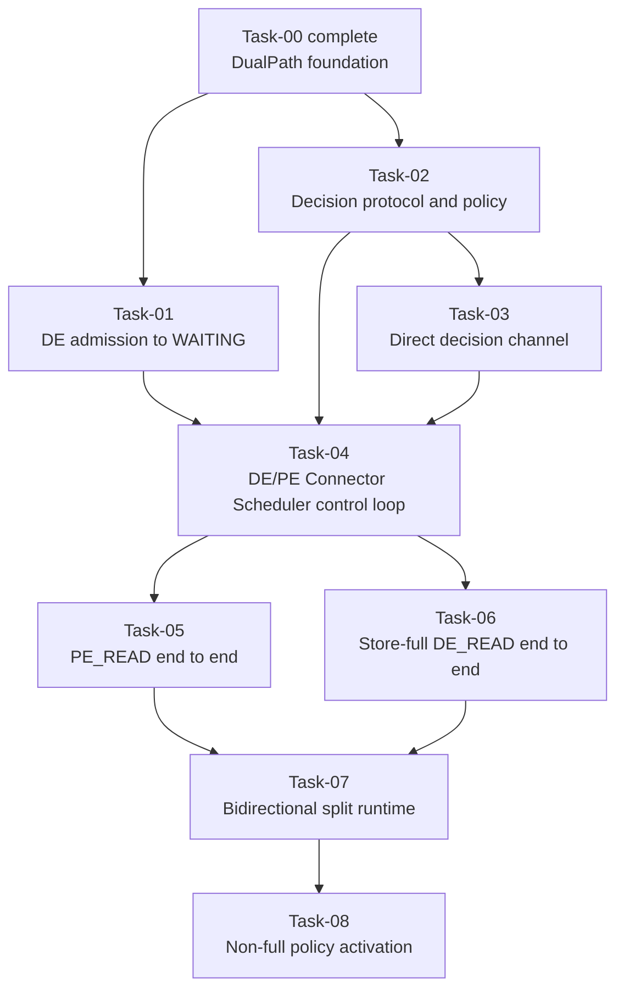

# DualPath Stage 1 Task Catalog

## 1. Purpose

This catalog defines the remaining DualPath Stage 1 delivery units after the
completed Task-00 foundation. It replaces the historical PR-01 through PR-07
implementation order with a lifecycle-first Task graph.

The target architecture remains:

- HBM-complete Decode requests stay local and do not enter DualPath decision.
- Every other Decode request first allocates its final Decode HBM slots and
  enters `WAITING_FOR_REMOTE_KVS`.
- The Prefill `DualPathConnectorScheduler` owns the unique `PE_READ` or
  `DE_READ` decision.
- A committed route is immutable and authorizes exactly one explicit data
  plan.
- Decode returns to `WAITING` only after the committed route's typed completion
  predicate is satisfied.

## 2. Shared terminology

For an initial request:

```text
P    = prompt token count
R    = max(P - 1, 0), Decode-ready KV prefix required before first DE forward
L_DE = contiguous Decode HBM prefix
K_DE = usable, aligned Decode KVPool prefix after clamp to the request target
L_PE = contiguous Prefill HBM prefix
E_DE = R - L_DE, when L_DE < R
```

Store classification is derived from `(L_DE, K_DE, R)` when needed. Stage 1
does not require a public `StoreCoverage` object.

Task-01 does not introduce a `StoreProbeHandle`. Before allocation, the Decode
Scheduler retains only a minimal detached lookup result. After allocation,
`update_state_after_alloc()` consumes that result and creates a complete
`DecodeKVSnapshot` with final block IDs. Neither object owns Store or P2P I/O.

## 3. Global invariants

The following requirements apply to every Task:

- `L_DE >= R` returns `(0, False)`, performs no Store lookup, creates no
  decision request, and does not enter decision.
- Store lookup never starts an HBM load, Store Worker operation, Forward, or
  Reverse.
- For `L_DE < R`, Decode Scheduler admission returns `E_DE`, not the number of
  tokens hit in Store.
- Receiving real block IDs does not authorize a connector to start I/O.
- The PE `DualPathConnectorScheduler` is the sole producer of
  `PathDecisionCommit`.
- Scheduler threads do not perform blocking network operations.
- Proxy dispatches the real Prefill request and forwards the DE control
  endpoint, but it does not choose or relay a committed path.
- A committed path never falls back to the other path. Failure may use the
  explicitly defined vLLM recompute/error behavior, but it cannot re-decide.
- Worker completion retains direction and source provenance until the owning
  request-level completion predicate consumes it.
- Cancellation is drain-first for submitted data movement: stop new work,
  retain referenced blocks, then clean up after completion, failure, or
  timeout.
- Ordinary Layerwise requests remain behavior-compatible throughout the
  series.

## 4. Task dependency graph



Task-01 and Task-02 may proceed independently after Task-00. Task-05 and
Task-06 may be developed independently after the control loop is complete.
Full requests activate only after Task-06. Non-full policy selection remains
fail-closed until Task-08 joins the tested `PE_READ` and split `DE_READ` paths.

## 5. Merge-state summary

| Task | Merge-state after acceptance | Production route activation |
|---|---|---|
| 00 | Selectable Layerwise-compatible DualPath subclass | Ordinary Layerwise only |
| 01 | Non-HBM-complete DE request allocates final slots and waits | None; request intentionally remains waiting |
| 02 | Decision schemas, identity, and replaceable policy are executable pure logic | None |
| 03 | Direct PE-to-DE decision delivery works with ACK, bounded retry, and observable exhaustion | None |
| 04 | Real DE and PE `DualPathConnectorScheduler` hooks exchange one commit; no data I/O is authorized | None; fail-closed |
| 05 | An injected committed `PE_READ` request completes through Forward | None; non-full policy remains fail-closed |
| 06 | A Store-full committed `DE_READ` request completes through Decode Store | Deterministic full-hit `DE_READ` |
| 07 | Injected non-full split plans execute on one bidirectional runtime | No non-full policy activation |
| 08 | Non-full `PE_READ`/`DE_READ` policy results execute with all barriers | Complete Stage 1 route set |

## 6. Task-00 — DualPath foundation

**Status:** Complete.

**Merge-state contract:**

`DualPathConnector`, `DualPathConnectorScheduler`, and
`DualPathConnectorWorker` exist as behavior-preserving Layerwise subclass
seams. Their foundation configuration and parent-parity evidence remain owned
by the historical PR-00 documents.

No remaining Task may weaken the Task-00 construction, configuration,
inheritance, or ordinary Layerwise parity gates without explicitly revising
that completed contract.

## 7. Task-01 — Decode admission to `WAITING_FOR_REMOTE_KVS`

**Depends on:** Task-00.

**Detailed spec:**
[`tasks/TASK-01-decode-admission.md`](tasks/TASK-01-decode-admission.md).

**Goal:**

Implement the live Decode Scheduler path from initial HBM lookup through final
slot allocation and `WAITING_FOR_REMOTE_KVS`, while collecting a side-effect-
free KVPool lookup result for later decisions.

**Merge-state contract:**

For `L_DE < R`, `DualPathConnectorScheduler.get_num_new_matched_tokens()`
returns `(R - L_DE, True)`. vLLM allocates the final Decode blocks,
`update_state_after_alloc()` binds those blocks to a Scheduler-owned pending
request record, and vLLM places the request in
`WAITING_FOR_REMOTE_KVS`.

No Proxy request, decision, Store Worker load, Forward, Reverse, or
`finished_recving` publication occurs. The request intentionally remains
waiting until a later Task provides a committed data path.

**In scope:**

- A minimal KVPool lookup adapter that calls the existing non-layerwise
  `KVPoolScheduler.get_num_new_matched_tokens()` implementation, immediately
  detaches its `LoadSpec`, and leaves no entry in the adapter-owned
  `KVPoolScheduler.load_specs`.
- A Decode-side KVPool adapter returning a detached `LoadSpec` or an explicit
  miss/unavailable result.
- A minimal pre-allocation lookup cache and an immutable post-allocation
  `DecodeKVSnapshot`. `L_DE` and usable `K_DE` are derived from existing fields
  instead of stored twice; final block IDs are never optional in an admission.
- Pass-through acceptance of the existing lookup-only KVPool settings,
  including deployment-provided `consumer_is_to_load=True`; Task-01 does not
  override or silently default that KVPool policy.
- HBM-complete bypass, duplicate scheduling, allocation-failure retry, final
  block binding, request finish, cancellation, and shutdown cleanup.
- Full, partial, miss, unavailable, alignment, clamp, duplicate lookup, and
  no-side-effect tests.

**Out of scope:**

- Public `StoreCoverage` or `StoreProbeHandle` types.
- `commit_after_alloc()`, Store Worker metadata, or Store load.
- Candidate submission, Proxy interaction, PE request, or path decision.
- Forward, Reverse, Worker completion, or request promotion from waiting.

**Acceptance endpoint:**

A Scheduler-focused integration test must exercise the actual vLLM call order
and prove that a non-HBM-complete request has final allocated blocks and status
`WAITING_FOR_REMOTE_KVS`, while Worker connector metadata contains no active
Store or P2P request.

## 8. Task-02 — Decision protocol and PE-owned policy

**Depends on:** Task-00.

**Goal:**

Define the complete, transport-independent language for one PE-owned route
decision.

**Merge-state contract:**

Request identity, commit, error, the fixed full-hit rule, and a replaceable
round-robin policy are executable and fully tested as pure logic. They have no
Scheduler, network, Store, or P2P side effects.

**In scope:**

- `DualPathRequestKey(decode_engine_instance_id, decode_request_id)`.
- `Path.PE_READ` and `Path.DE_READ`.
- Minimal `PathDecisionRequest`, commit, and typed error schemas with strict
  validation; no public `StoreCoverage` or candidate type.
- Fixed full-hit `Path.DE_READ` selection outside policy.
- A lightweight `PathPolicy.choose(request)` protocol.
- PE-owned `RoundRobinPathPolicy`: choose a random first non-full path, then
  alternate for subsequent unique non-full requests.
- Identical and conflicting duplicate semantics without policy-state replay.
- Serialization round trips and invalid/untrusted input rejection.

**Out of scope:**

- Proxy endpoints, Coordinator clients, Scheduler hooks, and Worker plans.
- Production activation of any path.

**Acceptance endpoint:**

Pure unit tests prove strict schemas, the full-hit invariant, seeded-random
round-robin behavior, duplicate semantics, conflict rejection, and policy
substitutability.

The detailed contract is
[`tasks/TASK-02-decision-protocol.md`](tasks/TASK-02-decision-protocol.md).

## 9. Task-03 — Direct PE-to-DE decision channel

**Depends on:** Task-02.

**Goal:**

Establish a dedicated direct ZMQ control channel from the PE
`PathDecisionCoordinator` to the DE `PathDecisionCoordinator` without routing
the Commit back through Proxy.

**Merge-state contract:**

Each DE Scheduler instance exposes one control endpoint derived from
`dual_path_control_port + data_parallel_rank` and one boot-specific Decode
Engine instance ID. A nested `kv_transfer_params["dual_path"]` schema carries
the Task-02 request and DE endpoint through the existing Proxy path. The PE
Coordinator sends one immutable `PathDecision` directly to that endpoint with
temporary REQ sockets. The DE Coordinator enqueues it exactly once, then
returns `b"ACK"`. Delivery exhaustion is observable without a second decision
attempt.

**In scope:**

- `dual_path_control_port` in connector extra configuration, with one endpoint
  per DE Scheduler/DP rank and no TP Worker port reuse.
- A boot UUID appended to logical Engine ID and DP rank for restart-safe
  `decode_engine_instance_id`.
- Strict nested bootstrap metadata containing `PathDecisionRequest` and the DE
  endpoint; Proxy forwards it unchanged and retains no decision Future.
- A DE ZMQ `ROUTER` receiver and PE asynchronous temporary-REQ sender owned by
  their local `PathDecisionCoordinator` instances.
- ACK semantics meaning only "validated and enqueued", not Scheduler
  consumption or data readiness.
- Three attempts with a fresh REQ socket, one-second send and receive bounds,
  exact `b"ACK"`, and 0.1-second spacing; no NACK or persistent endpoint pool.
- Minimal pending/accepted registries: identical duplicates ACK without a
  second inbox event; conflicting, stale, unknown, and malformed input receive
  no ACK.
- Cancellation, delivery exhaustion, Coordinator shutdown, and terminal
  cleanup.
- Direct-channel integration tests with constrained sender/receiver endpoints.

**Out of scope:**

- Path selection inside the transport.
- Proxy `/v1/path-decision`, decision Futures, or response-carried Commit.
- Real per-request Scheduler hooks, DE Decision-wait timeout, and data-plane
  I/O.

**Acceptance endpoint:**

A direct-channel integration test proves request-driven endpoint use,
Commit/error delivery, literal-ACK retry idempotency, stale/conflict silence,
observable exhaustion, restart-safe identity, and clean endpoint shutdown
without real per-request Scheduler hooks or data-plane I/O.

The detailed contract is
[`tasks/TASK-03-direct-decision-channel.md`](tasks/TASK-03-direct-decision-channel.md).

## 10. Task-04 — DE/PE Connector Scheduler decision control loop

**Depends on:** Task-01, Task-02, and Task-03.

**Goal:**

Connect real DE and PE `DualPathConnectorScheduler` lifecycle hooks to the
direct decision channel without authorizing a data path.

**Merge-state contract:**

After Decode allocation, the DE `DualPathConnectorScheduler` registers the
request with its Coordinator, freezes one `PathDecisionRequest`, and submits
the Task-03 nested `dual_path` metadata through the existing Proxy path. The PE
`DualPathConnectorScheduler` applies the fixed full-hit rule or invokes its
policy once and commits one path. The DE Coordinator writes the direct result
to a thread-safe inbox, and the DE Scheduler drains that inbox during
`build_connector_meta()` on a later schedule tick. The DE request retains its
final blocks and remains in `WAITING_FOR_REMOTE_KVS`.

**In scope:**

- Non-blocking PE and DE `PathDecisionCoordinator` ownership.
- Decision-request submission only after final DE block binding.
- PE full-hit selection and unique non-full policy invocation.
- PE `_path_decisions` ownership so identical duplicate requests replay the
  same Commit and conflicting facts fail without advancing policy state.
- Scheduler-thread decision inbox consumption on every connector metadata
  build tick, including zero-model-token ticks.
- Commit/error persistence, fail-closed timeout, cancellation, and duplicate
  scheduling.
- Fail-closed configuration and a no-Store/no-P2P closed-loop harness.

**Out of scope:**

- Scheduler-visible positive accounting for an active `DE_READ` route.
- Store load, Forward, Reverse, or `finished_recving` publication.
- Production route activation.

**Acceptance endpoint:**

A control-plane integration test uses real Connector Scheduler hooks and
proves one request reaches the fixed rule or PE policy and one immutable
Commit reaches DE Scheduler state while both Workers observe no data
operation.

## 11. Task-05 — `PE_READ` end-to-end

**Depends on:** Task-04.

**Goal:**

Complete the first DualPath data-plane route implementation by reusing PE
Store/compute behavior and transferring the required prefix to Decode through
explicit Forward plans.

**Merge-state contract:**

After a local PE `PE_READ` commit, outer PE Store may load available KV or PE
may compute missing KV. The PE Worker forwards the frozen `[L_DE, R)` plan to
the final DE blocks. Typed Forward completion publishes DE
`finished_recving`; vLLM caches the prepared prefix and promotes the DE request
back to `WAITING`.

**In scope:**

- Explicit, immutable Forward block-pair plans frozen by Scheduler metadata.
- PE Store winner, PE Store miss, and ordinary PE compute behavior.
- Just-in-time parent extraction of send runtime startup, send metadata
  preparation, and per-layer send enqueue helpers.
- Forward start gates, raw completion/failure reconciliation, cancellation,
  timeout, and terminal cleanup.
- CPU integration and NPU `PE_READ` acceptance.

**Out of scope:**

- Decode Store commit and active `DE_READ`.
- Receive/bidirectional parent helper extraction and Reverse.

**Acceptance endpoint:**

An injected `PE_READ` commit completes PE Store-hit and PE-compute cases
without Decode Store I/O. Production non-full selection remains fail-closed
because the approved policy may choose split `DE_READ`, which is not complete
until Task-08.

## 12. Task-06 — Store-full `DE_READ` end-to-end

**Depends on:** Task-04.

**Goal:**

Complete deterministic Store-full `DE_READ` using the Task-01 detached lookup
and final DE blocks.

**Merge-state contract:**

For `K_DE == R`, a committed `DE_READ` converts the detached `LoadSpec` and
frozen blocks into one Decode KVPool Worker load for `[L_DE, R)`. Typed Store
DONE publishes DE `finished_recving`. The PE request performs no Store load,
model computation, Reverse, or Forward and terminates through an explicitly
validated no-work lifecycle.

**In scope:**

- `commit_after_alloc(load_spec, final_block_ids)` metadata construction.
- Decode Store Worker composition, typed DONE/FAILED, invalid-block
  provenance, and request promotion/failure handling.
- Prevention and cleanup of PE Store state on the fixed full-hit route.
- A proven PE no-work terminal mechanism for full `DE_READ`.
- Production activation of the fixed full-hit rule only after the full
  `DE_READ` NPU path passes.

**Out of scope:**

- Partial Store execution, Reverse, or split completion barriers.
- Post-commit fallback to `PE_READ`.

**Acceptance endpoint:**

Full requests deterministically complete through one Decode Store load and
zero PE Store/model/P2P operations. Full requests do not call or advance the
configured `PathPolicy`.

The detailed Task-06 spec must choose and validate a PE-local no-work terminal
mechanism. Proxy does not observe the direct Commit and therefore cannot own
post-commit PE cancellation. Acceptance must prove that the chosen mechanism
prevents ModelRunner execution and releases PE request resources.

## 13. Task-07 — Bidirectional runtime and injected non-full split plans

**Depends on:** Task-05 and Task-06.

**Goal:**

Extend one inherited Layerwise Worker runtime to own Forward send/receive and
Reverse send/receive capabilities, while keeping production non-full policy
selection disabled.

**Merge-state contract:**

Injected non-full split plans can execute an optional Store interval, Reverse,
PE compute gates, and Forward with explicit direction/source completion
provenance. No production non-full request can yet execute a policy result.

**In scope:**

- Just-in-time parent extraction of receive runtime startup and receive
  metadata binding.
- One-time KV buffer registration with send and receive capabilities.
- Immutable Reverse block-pair plans and registered layer ordering.
- Mapping-first metadata binding and preservation of early raw DONE/FAILED.
- Store DONE, Reverse DONE, compute, and Forward gates.
- Cross-direction tombstones, timeout, cancellation, block retention, and
  drain-first cleanup.
- Injected success, failure, race, duplicate, and cancellation tests.

**Out of scope:**

- Non-full policy integration or production activation.

**Acceptance endpoint:**

An injected split-plan harness proves the bidirectional runtime, including an
empty Store interval, and all ordering/completion invariants without changing
the production selector.

## 14. Task-08 — Non-full policy activation

**Depends on:** Task-07.

**Goal:**

Connect every non-full policy result to the previously tested `PE_READ` and
bidirectional split runtimes, then complete Stage 1 route activation.

**Merge-state contract:**

For a non-full committed `DE_READ`, Decode loads `[L_DE, K_DE)` when non-empty,
Reverse sends `[L_PE, K_DE)` when non-empty, PE computes
`[max(L_PE, K_DE), R)`, and Forward sends `[K_DE, R)`. Decode publishes
`finished_recving` only after every non-empty required phase completes. PE does
not compute before Reverse DONE when Reverse is required. Miss or unavailable
Store input uses the same plan with an empty Store interval.

**In scope:**

- Non-full `PathPolicy` integration for partial, miss, and unavailable Store
  inputs.
- Exact logical ranges and frozen physical mappings for Store, Reverse, and
  Forward.
- Empty-Store and empty-Reverse handling.
- MultiConnector winner/sibling lifecycle isolation.
- Failure, invalid-block, timeout, cancellation, observability, and no-
  redecision behavior.
- Complete CPU, NPU, HBM, topology, and supported-configuration acceptance.

**Out of scope:**

- Adaptive routing, Value Function, LinkMonitor, relay, or post-commit route
  changes.

**Acceptance endpoint:**

The NPU matrix covers deterministic full `DE_READ` plus partial/miss
`PE_READ` and split `DE_READ`, verifies exact ranges and completion predicates,
and establishes the complete Stage 1 activation boundary.

## 15. Parent helper extraction ownership

The historical standalone parent-refactor task is intentionally removed.

| Parent extension seam | Owning Task | Reason |
|---|---|---|
| Send runtime startup | Task-05 | First concrete consumer is Forward |
| Send metadata preparation | Task-05 | Defined by the Forward plan contract |
| Per-layer send enqueue | Task-05 | Must preserve current save callback behavior |
| Receive runtime startup | Task-07 | First new consumer is Reverse receive/bidirectional runtime |
| Receive metadata binding | Task-07 | Requires mapping-first partial lifecycle semantics |

An implementation may place a behavior-preserving extraction in a separate
mechanical commit or review PR, but its acceptance remains part of the owning
Task and it must not introduce unused protected APIs.

## 16. Old-to-new mapping

| Historical unit | Current disposition |
|---|---|
| PR-00 foundation | Preserved as completed Task-00 |
| PR-01 Store coverage/probe handle | Replaced by Task-01 admission and Scheduler pending record |
| PR-02 parent Worker helper extraction | Split into Task-05 send and Task-07 receive ownership |
| PR-03 unified control plane | Split into Task-02 protocol, Task-03 direct channel, and Task-04 Scheduler loop |
| PR-04 Store-full `DE_READ` | Reworked as Task-06 after `PE_READ` is complete |
| PR-05 Forward | Reworked and moved earlier as Task-05 |
| PR-06 bidirectional runtime | Reworked as Task-07 |
| PR-07 partial activation | Reworked as Task-08 non-full policy activation |

## 17. Detailed-spec order

Detailed specs are written and approved in dependency order:

1. Task-01 Decode admission to `WAITING_FOR_REMOTE_KVS`.
2. Task-02 decision protocol and policy.
3. Task-03 direct PE-to-DE decision channel.
4. Task-04 Connector Scheduler decision control loop.
5. Task-05 `PE_READ` end-to-end.
6. Task-06 Store-full `DE_READ` end-to-end.
7. Task-07 bidirectional split runtime.
8. Task-08 non-full policy activation.

Writing a detailed spec authorizes design elaboration and review only. Code
implementation begins only after that Task's detailed spec is approved.
