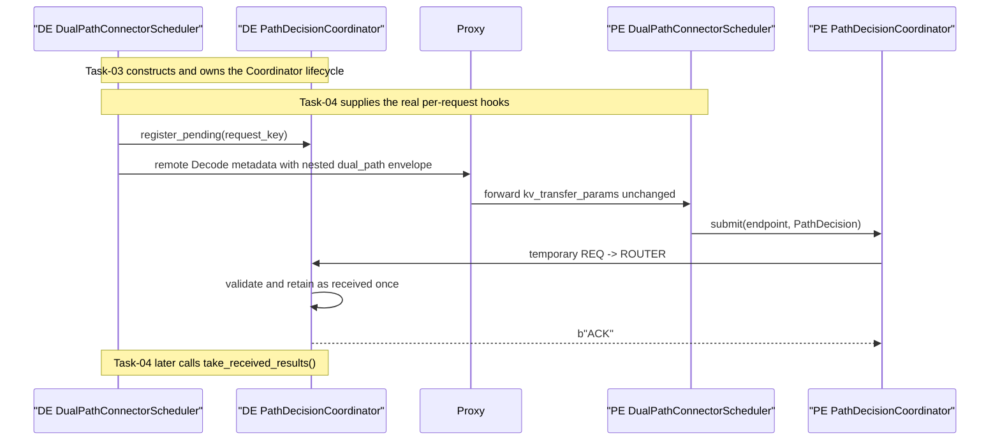

# Task-03 Detailed Spec — Direct PE-to-DE Decision Channel

> **Superseded lifecycle clauses (2026-08-16):** This file is a historical
> Stage-1 task record. Its Decision-deadline convergence clauses are superseded
> by the
> [ABORT and watchdog-removal decision](../../../docs/superpowers/specs/2026-08-16-dual-path-abort-notification-and-watchdog-removal.md).
> The channel now carries Decision and request-terminal ABORT outcomes; no
> elapsed-time fallback remains.

## 1. Status and authority

This document defines the implementation contract for Task-03 in the
[`DualPath Stage 1 Task Catalog`](../TASKS.md). It depends on the Task-02
decision types and replaces the historical Proxy decision-Future return path.

The latest source baseline reviewed for this revision is:

- `vllm-ascend@6761bb9c3f179e2c56f636c47051a9c31a98383d`
- sibling `vllm@0fc695fc6d1d82e9a5ac6835ac8e4e1c83703665`

The Task-04 design review replaces the earlier Commit/Error union with one
concrete `PathDecisionResult` and replaces inbox/drain terminology with an
explicit received-result queue. This document is authoritative for the
required reconciliation.

Task-03 owns a small transport closure. It does not select a path, consume a
decision in a real Scheduler hook, or authorize Store or P2P I/O.

Post-Task-06, this channel applies only to Store-non-full requests. A Decode
Store-full request never creates bootstrap metadata or contacts either
Coordinator; no transport shape or retry rule changes.

## 2. Outcome

Task-03 provides a direct result path:

```text
PE PathDecisionCoordinator
    -> PathDecision over temporary ZMQ REQ
    -> DE PathDecisionCoordinator ROUTER
    -> validate, suppress duplicate, retain as received once
    -> literal b"ACK"
```

The existing request-dispatch direction remains:

```text
DE -> Proxy -> PE
```

That existing path carries a validated Store-non-full Task-02
`PathDecisionRequest` and the DE control endpoint inside a nested
`kv_transfer_params["dual_path"]` envelope.
Proxy forwards that envelope unchanged and never carries the result back to
DE.

After Task-03 merges, the channel and received-result queue are independently
executable and tested, but no production request is registered, no real PE
decision is submitted, and no DE Scheduler consumes received results. Task-04
owns those hooks.

## 3. Boundary sequence



The `register_pending()`, envelope injection/extraction, policy invocation,
`submit()`, and received-result consumption arrows are shown for the final
control flow. Their real Scheduler call sites are Task-04 scope. Task-03
exposes and tests the transport surfaces with constrained callers.

## 4. Protocol types

Task-03 reuses these Task-02 domain types without modification:

```text
DualPathRequestKey
PathDecisionRequest
PathDecisionResult
```

It adds only transport types.

Task-02 validation requires
`decode_store_tokens < target_tokens`. A forged Store-full request is rejected
before the sender can create a `PathDecision`.

### 4.1 Protocol version

```python
DUAL_PATH_PROTOCOL_VERSION = 1
PATH_DECISION_SEND_WORKERS = 32
```

Both values are code constants, not deployment configuration. The worker
count matches the existing Layerwise Scheduler network executor. Unsupported
protocol versions are rejected without an ACK.

### 4.2 Decode endpoint

```python
@dataclass(frozen=True)
class DecodeControlEndpoint:
    host: str
    port: int
```

Validation requires a non-empty host and `1 <= port <= 65535`. The schema uses
separate host and port fields; it does not accept an opaque `tcp://` URI.

### 4.3 Bootstrap metadata

```python
@dataclass(frozen=True)
class DualPathDecisionMetadata:
    protocol_version: int
    decision_request: PathDecisionRequest
    decode_control_endpoint: DecodeControlEndpoint
```

Its JSON representation is nested under the existing Mooncake metadata:

```python
kv_transfer_params = {
    "do_remote_decode": True,
    "remote_block_ids": ...,
    "remote_host": ...,
    "remote_port": ...,
    "dual_path": {
        "protocol_version": 1,
        "decision_request": {
            "request_key": {
                "decode_engine_instance_id": "...",
                "decode_request_id": "...",
            },
            "target_tokens": ...,
            "decode_local_tokens": ...,
            "decode_store_tokens": ...,
        },
        "decode_control_endpoint": {
            "host": "...",
            "port": ...,
        },
    },
}
```

`decision_request.target_tokens` is the Decode-ready boundary
`R = max(P - 1, 0)`. The envelope does not serialize the parent Layerwise
transfer target `T`; Task-01 retains that value in DE-local snapshot state and
Task-05 derives it from the effective PE request when building Forward state.

Task-03 owns strict serialization, deserialization, and a transparent
pass-through contract. Task-04 owns creation from a real `DecodeKVSnapshot`
and extraction from a real PE request.

### 4.4 Direct result message

```python
@dataclass(frozen=True)
class PathDecision:
    protocol_version: int
    result: PathDecisionResult
```

The sender serializes one immutable `PathDecision` with `msgspec.msgpack`
before its first attempt. Every retry sends the same encoded bytes. There is
no `candidate_id`, `decision_attempt_id`, delivery ID, or payload fingerprint.

## 5. Decode Engine instance identity

The existing `KVTransferConfig.engine_id` is a logical transfer-engine ID, not
a restart incarnation. vLLM generates it only when configuration omits it;
otherwise the supplied value is retained. In either case, an already
constructed `VllmConfig` may be reused when an EngineCore/Scheduler process is
rebuilt. Task-03 must therefore not use it alone as
`DualPathRequestKey.decode_engine_instance_id`.

The DE Coordinator generates one non-configurable boot UUID when it is
constructed:

```python
boot_id = uuid.uuid4().hex
decode_engine_instance_id = (
    f"{engine_id}:{data_parallel_rank}:{boot_id}"
)
```

Properties:

- stable for one DE Coordinator/Scheduler incarnation;
- different after Coordinator reconstruction;
- distinct across DP ranks even when the logical Engine ID is shared;
- not user-configurable or persisted;
- injectable in unit tests for deterministic assertions.

The Coordinator exposes the complete instance ID to Task-04. The DE receiver
accepts only pending keys with exactly that instance ID.

## 6. Control endpoint configuration

Task-03 adds `dual_path_control_port` to `DualPathConfig` and the Connector's
own `kv_connector_extra_config` allowlist.

For `role="decode"`:

```text
control_host = get_ip()
control_port = dual_path_control_port + data_parallel_rank
```

Requirements:

- `dual_path_control_port` is required and must be an integer, not `bool`;
- the derived port must remain within `1..65535`;
- one endpoint belongs to one DE Scheduler/DP rank;
- TP rank is not part of the control-port calculation;
- the endpoint must not reuse the Worker `kv_port`/handshake range.

For `role="prefill"`, `dual_path_control_port` is not required or consumed. PE
learns the destination exclusively from the real request's nested
`dual_path.decode_control_endpoint` metadata.

## 7. Coordinator ownership and surface

Every `DualPathConnectorScheduler` owns one role-specific
`PathDecisionCoordinator` for its full lifetime:

- Decode role: receiver thread, ROUTER socket, pending/accepted registries,
  and received-result queue.
- Prefill role: bounded asynchronous send executor and its outstanding
  Futures.

Task-03 may use private sender/receiver helpers internally, but
`PathDecisionCoordinator` remains the single public lifecycle owner.

The transport surface exposed for Task-04 is conceptually:

```python
# Decode role
coordinator.decode_engine_instance_id
coordinator.decode_control_endpoint
coordinator.register_pending(request_key)
coordinator.unregister(request_key)
coordinator.take_received_results() -> list[PathDecisionResult]

# Prefill role
coordinator.submit(
    endpoint: DecodeControlEndpoint,
    decision: PathDecision,
) -> Future[None]

# Both roles
coordinator.close()
```

Wrong-role method calls fail immediately. `register_pending()`, `unregister()`,
and `take_received_results()` are local, thread-safe operations and perform no
network wait. `take_received_results()` atomically returns and removes every
Result available at the start of that call.

Task-03 wires Coordinator construction and idempotent close into the real
DualPath Scheduler facade, but does not call any per-request method from a
Scheduler lifecycle hook.

## 8. DE receiver and idempotency

The DE Coordinator owns:

```python
_pending_keys: set[DualPathRequestKey]
_accepted_results: dict[DualPathRequestKey, PathDecisionResult]
_received_results: queue.SimpleQueue[PathDecisionResult]
```

REQ inserts an empty delimiter between the ROUTER identity and application
payload. The DE receiver therefore expects:

```text
[routing_identity, b"", encoded PathDecision]
```

`routing_identity` is ZMQ routing state only. It is never treated as a
DualPath identity and is used only to return the ACK to the same peer:

```text
[routing_identity, b"", b"ACK"]
```

The PE REQ application still sends one payload with `send()` and receives one
payload with `recv()`; the identity and empty delimiter are visible only to
the ROUTER. This matches the current Mooncake Layerwise REQ/ROUTER framing.

Receiver behavior is:

```text
well-formed + pending key + first result
    -> retain immutable result
    -> add to received results exactly once
    -> ACK

same key + structurally identical retained result
    -> do not add it again
    -> ACK

same key + different retained result
    -> log conflict
    -> no ACK

unknown, unregistered, wrong-incarnation key
    -> log stale/unknown
    -> no ACK

unsupported version or malformed payload
    -> log protocol error
    -> no ACK
```

There is no NACK message. No-ACK cases become sender timeout/retry and
eventual delivery failure. Task-03 transports only a valid
`PathDecisionResult`; PE-local validation or policy failures produce no wire
message and converge through the Task-04 DE deadline.

`unregister()` is idempotent and removes the key from both registries. No
Task-03 cancelled/expired/tombstone state machine is introduced. Task-04 owns
the request-level Decision deadline and invokes terminal cleanup.

## 9. PE sender and bounded retry

`submit()` never performs socket I/O on the PE Scheduler thread. A bounded
Coordinator-owned executor runs one delivery operation per submitted result.
Each operation uses the destination received from that request; PE performs no
startup discovery and maintains no static DE endpoint list.

One delivery operation performs at most three attempts:

```text
for attempt in 1..3:
    create a new temporary REQ socket
    set the send timeout to 1 second
    connect to this request's DE endpoint
    send the frozen PathDecision bytes once
    poll for at most 1 second
    require reply == b"ACK"
    close the socket
    on failure, wait 0.1 second before the next attempt
```

A fresh socket per attempt avoids reusing a REQ socket after a broken
send/receive state. The total number of `PathDecision` sends is three; helper
reuse must not accidentally nest another three-attempt loop.

On ACK, the returned Future completes with `None`. After the third failed
attempt, it raises a typed transport exception. Exhaustion does not re-run the
policy, create a new logical attempt, submit another Prefill request, or choose
a different path.

Task-03 does not add backoff, jitter, persistent connection pooling, health
checks, retransmission logs, or network-partition recovery.

## 10. Received-result queue and Scheduler boundary

The receiver writes `_received_results` and returns ACK from its background
thread. It never invokes a Scheduler method.

Task-04 later calls `take_received_results()` from
`DualPathConnectorScheduler.build_connector_meta()`. vLLM calls that hook at
the end of each schedule pass, including zero-model-token passes while a
request remains in `WAITING_FOR_REMOTE_KVS`.

An ACK therefore means only:

```text
the PathDecision was decoded, accepted for a registered key,
retained, and made available once through take_received_results()
```

It does not mean:

- DE Scheduler consumed the Result;
- a path was activated;
- Store, Reverse, or Forward started;
- KV is ready;
- `finished_recving` was published;
- the request left `WAITING_FOR_REMOTE_KVS`.

## 11. Failure, cancellation, and shutdown

Task-03 failure ownership is deliberately narrow:

- PE send exhaustion completes its Future exceptionally.
- DE malformed/stale/conflicting input is logged and not ACKed.
- `unregister()` makes later input unknown and unacknowledged.
- Task-04 owns the total DE Decision-wait deadline and fail-closed request
  behavior, because sender failure cannot be delivered over the failed channel.

`close()` is idempotent and must:

- reject new registration or submission;
- signal the DE receiver loop to stop without waiting on an unbounded `recv`;
- close ROUTER/REQ sockets with bounded linger;
- join the DE receiver thread;
- stop the PE executor and reconcile outstanding Futures;
- clear pending, accepted, and received-result state;
- leave no background thread or open control endpoint.

There is no Store or DMA drain requirement because Task-03 submits no data
operation.

## 12. Required tests

Focused CPU tests must cover:

1. Decode-only `dual_path_control_port` validation and DP-rank derivation.
2. Distinct boot IDs across Coordinator construction and stable IDs within one
   instance.
3. Deterministic injected boot IDs and explicit DP-rank separation.
4. Strict `DecodeControlEndpoint`, bootstrap metadata, and `PathDecision`
   serialization round trips.
5. Nested Store-non-full `kv_transfer_params["dual_path"]` shape and
   transparent fake Proxy pass-through; Store-full request construction is
   rejected before send.
6. No PE socket construction before `submit()` receives a real endpoint.
7. One successful Result delivery, one received Result, and exact `b"ACK"`.
8. Lost first ACK followed by identical retry, second ACK, and one received
   Result.
9. Conflicting duplicate, unknown key, wrong incarnation, unsupported
   version, and malformed payload produce no ACK and no extra received Result.
10. Exactly three attempts, one fresh REQ socket per attempt, one-second
    bounds, and 0.1-second retry spacing using fake time/pollers where needed.
11. Delivery exhaustion completes the Future exceptionally without a second
    policy or request attempt.
12. Multiple concurrent results remain isolated.
13. Idempotent register, unregister, request cleanup, and close.
14. Receiver and executor shutdown leave no live thread, socket, Future, or
    retained request state.

No Task-03 test may instantiate a real vLLM Scheduler, run a model, contact a
real Proxy, start Store/P2P I/O, or publish `finished_recving`.

## 13. Expected code surface

The implementation should remain focused under the DualPath package, for
example:

```text
vllm_ascend/distributed/kv_transfer/kv_p2p/dual_path/
    config.py
    connector.py
    path_decision.py
    path_decision_channel.py

tests/ut/distributed/kv_transfer/dual_path/
    test_path_decision_channel.py
```

Task-02 domain types remain in its chosen protocol module. Task-03 must not
copy Worker transfer code or reuse the Worker handshake endpoint.

## 14. Out of scope

- Real `DecodeKVSnapshot` to `PathDecisionRequest` construction.
- Real remote-decode metadata injection or PE request extraction.
- Full-hit rule or `PathPolicy.choose()` invocation.
- Real per-request Coordinator registration, submission, or received-result
  consumption hooks.
- DE Decision-wait timeout and Core-facing fail-closed request handling.
- Proxy `/v1/path-decision`, decision Futures, or result relay.
- NACK, delivery UUID, fingerprint, persistent socket pool, backoff, jitter,
  health checks, or automatic reconnection policy.
- Store load, Reverse, Forward, Worker plan, `finished_recving`, or route
  activation.

## 15. Acceptance endpoint

Task-03 is accepted when constrained CPU integration tests prove:

- a request-provided endpoint is contacted only after submission;
- one immutable Task-02 result reaches the correct DE Coordinator;
- the DE retains it and exposes it exactly once before returning `b"ACK"`;
- ACK loss causes bounded identical retry without duplicate Result delivery;
- malformed, stale, unknown, and conflicting input cannot enter the received
  results;
- retry exhaustion is observable to the PE caller;
- restart identity, endpoint isolation, cancellation, and shutdown are clean;
- Proxy, real Scheduler request hooks, Worker, Store, and P2P remain untouched.

After merge, Task-04 may wire real DE/PE Scheduler lifecycle hooks to these
surfaces. Until then, no production route is active.
