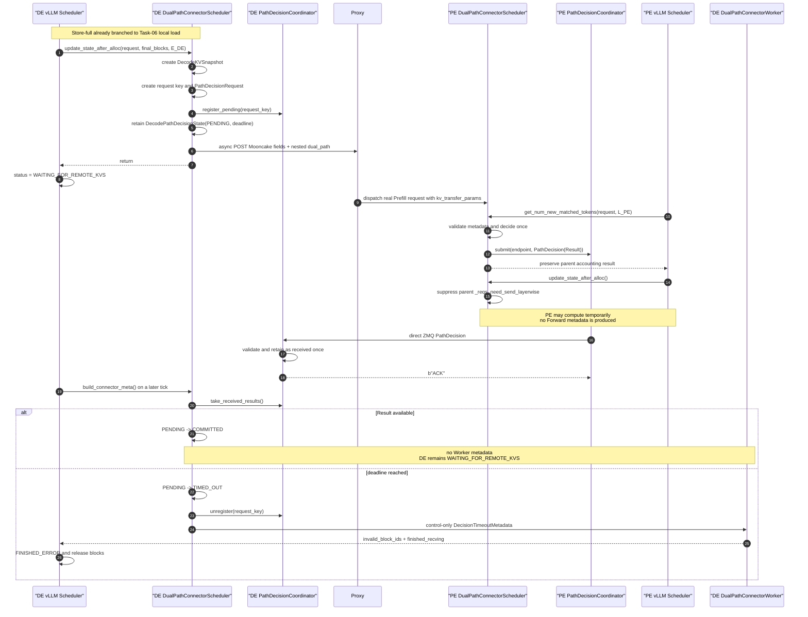

# Task-04 Detailed Spec — DE/PE Connector Scheduler Decision Control Loop

## 1. Status and authority

This document defines the implementation contract for Task-04 in the
[`DualPath Stage 1 Task Catalog`](../TASKS.md). It connects Task-01 Decode
admission, Task-02 PE-owned decision logic, and the Task-03 direct result
channel to real `DualPathConnectorScheduler` lifecycle hooks.

The latest source baseline reviewed for this design is:

- `vllm-ascend@6761bb9c3f179e2c56f636c47051a9c31a98383d`
- sibling `vllm@0fc695fc6d1d82e9a5ac6835ac8e4e1c83703665`

Task-04 is a control-plane closure, not a production route activation. It
authorizes no Store load, Forward, or Reverse operation. The approved
Task-04-only transitional behavior is listed explicitly in Section 12.

Task-06 narrows this loop to Decode Store-non-full admissions. Store-full
branches locally before request-key construction and therefore creates no
Task-04 state, Proxy request, PE request, Result, or Decision timeout. The
remaining Task-04 behavior is unchanged for Store-non-full requests.

## 2. Outcome and merge-state contract

For every Store-non-full DualPath Decode request, Task-04 must provide this
real control loop:

```text
DE DecodeKVSnapshot
    -> register one pending request key
    -> submit existing remote-decode metadata plus nested dual_path metadata
    -> vLLM places the DE request in WAITING_FOR_REMOTE_KVS

PE real request
    -> validate nested dual_path metadata
    -> invoke PathPolicy once
    -> send one PathDecisionResult directly to DE
    -> continue ordinary PE compute without submitting KV transfer work

DE later schedule tick
    -> take_received_results()
    -> retain one immutable committed Result
    -> remain in WAITING_FOR_REMOTE_KVS without Worker data metadata
```

If no valid Result becomes available before the DE deadline, Task-04 reports a
control-only KV load failure through the existing Worker/Core output path and
the request terminates as `FINISHED_ERROR`.

After Task-04 merges:

- `PENDING -> COMMITTED` proves the real Scheduler control loop;
- `PENDING -> TIMED_OUT` proves bounded fail-closed behavior;
- a committed request deliberately has no active data plan and therefore does
  not complete until a later route Task is present;
- ordinary `MooncakeLayerwiseConnector` requests preserve parent behavior.

## 3. End-to-end sequence



The direct channel may deliver a Result before Core changes the request status
to `WAITING_FOR_REMOTE_KVS`. This is safe because the receiver only retains the
Result. The Scheduler consumes it from `build_connector_meta()`, after the
initial allocation callback and status transition have completed.

## 4. Approved protocol reconciliation

Task-04 requires the authoritative Task-02/03 protocol to use one concrete
result type:

```python
@dataclass(frozen=True)
class PathDecisionResult:
    request_key: DualPathRequestKey
    path: Path


@dataclass(frozen=True)
class PathDecision:
    protocol_version: int
    result: PathDecisionResult
```

`PathDecisionCommit`, `PathDecisionError`, and the earlier
`PathDecisionResult = Commit | Error` alias are removed.

PE-local validation, conflicting facts for the same request key, or an invalid
custom policy return produces a local exception and log entry. PE sends no
Result. DE does not model a separate remote error state; absence of a valid
Result converges through the Decision deadline.

Task-03 terminology is also reconciled:

```python
_received_results: queue.SimpleQueue[PathDecisionResult]

coordinator.take_received_results() -> list[PathDecisionResult]
```

The public contract does not use `inbox`, `drain inbox`, or
`take_decisions()`. `take_received_results()` atomically returns and removes
all Results available at the start of the call.

## 5. Role selection and parent parity

Task-04 behavior is selected only for these request shapes:

```text
DE control admission:
    dual_path_cfg.role == "decode"
    request entered Task-01 with do_remote_prefill is True
    a DecodeKVSnapshot exists after final allocation
    snapshot.store_tokens < max(request.num_tokens - 1, 0)

PE decision request:
    dual_path_cfg.role == "prefill"
    kv_transfer_params.do_remote_decode is True
    kv_transfer_params contains a dual_path key
```

The presence of `dual_path` is sufficient to suppress parent PE transfer
queueing even if its nested payload is malformed. Invalid DualPath metadata
must fail closed through no Result; it must never fall through into the
ordinary Layerwise Forward path.

Requests outside these shapes delegate to the parent implementation unchanged.
Focused regression tests must prove parity for ordinary remote-prefill,
remote-decode, virtual, and no-transfer requests.

## 6. Decode allocation to Proxy notification

### 6.1 Scheduler-owned state

Task-04 adds one state map alongside the Task-01 snapshot map:

```python
class DecodeDecisionStatus(str, Enum):
    PENDING = "PENDING"
    COMMITTED = "COMMITTED"
    TIMED_OUT = "TIMED_OUT"


@dataclass
class DecodePathDecisionState:
    request_key: DualPathRequestKey
    decision_request: PathDecisionRequest
    deadline: float
    status: DecodeDecisionStatus
    result: PathDecisionResult | None = None
    proxy_future: Future[None] | None = None
    timeout_reported: bool = False


_decode_decision_states: dict[str, DecodePathDecisionState]
# key: Decode-local request_id
```

The state does not duplicate Store coverage or final blocks. Those remain in
the corresponding `DecodeKVSnapshot`.

### 6.2 Construction order

After Task-01 creates a new `DecodeKVSnapshot`, DE must first prove:

```text
snapshot.store_tokens < max(request.num_tokens - 1, 0)
```

Task-06 consumes Store-full before this point. For the remaining
Store-non-full snapshot, DE must:

1. Obtain `decode_engine_instance_id` and `decode_control_endpoint` from its
   Task-03 Coordinator.
2. Construct
   `DualPathRequestKey(decode_engine_instance_id, request.request_id)`.
3. Construct `PathDecisionRequest` from the snapshot:

   ```text
   target_tokens       = max(request.num_tokens - 1, 0)
   decode_local_tokens = snapshot.local_tokens
   decode_store_tokens = snapshot.store_tokens
   ```

   `target_tokens` is the decision-only Decode-ready boundary `R`. The
   snapshot's `transfer_tokens=T` remains DE-local data-plane state and is not
   added to `PathDecisionRequest` or the Task-03 wire envelope.

4. Construct strict `DualPathDecisionMetadata` and the complete outgoing
   Mooncake remote-decode message.
5. Call `coordinator.register_pending(request_key)`.
6. Retain `DecodePathDecisionState` with
   `deadline = time.monotonic() + decision_timeout_seconds`.
7. Unless `do_virtual` is true, submit the Proxy HTTP operation through the
   inherited executor; virtual mode retains `proxy_future=None`.
8. Set the original request's `do_remote_prefill` to `False` so it cannot
   re-enter initial admission.
9. Return without writing `_reqs_need_recv`.

Registration must precede HTTP submission. An executor submission that raises
synchronously is logged, stored as `proxy_future=None`, and still converges
through the same deadline; it does not unregister or create a second logical
attempt.

An identical duplicate allocation callback reuses the existing snapshot and
decision state. It does not register, notify Proxy, or advance a deadline a
second time. A conflicting duplicate remains a lifecycle error and preserves
the first state.

### 6.3 DualPath-owned message construction

Task-04 does not call the parent `update_state_after_alloc()` for this request.
Calling it would mutate `do_remote_prefill`, populate `_reqs_need_recv`, and
authorize the inherited receive path before a Result exists.

Task-04 instead owns a small message builder under the DualPath package. It
preserves the current Mooncake field meanings and adds exactly one nested
envelope:

```python
{
    "token_ids": [],
    "request_id": get_external_request_id(request.request_id),
    "do_remote_prefill": False,
    "do_remote_decode": True,
    "remote_block_ids": trimmed_final_block_ids,
    "remote_block_size": self.block_size,
    "remote_engine_id": self.engine_id,
    "remote_host": self.side_channel_host,
    "remote_port": self.side_channel_port,
    "remote_tp_size": self.vllm_config.parallel_config.tensor_parallel_size,
    "remote_pcp_size": (
        self.vllm_config.parallel_config.prefill_context_parallel_size
    ),
    "remote_dcp_size": (
        self.vllm_config.parallel_config.decode_context_parallel_size
    ),
    "remote_cached_tokens": snapshot.local_tokens,
    "dual_path": decision_metadata.to_dict(),
}
```

`trimmed_final_block_ids` uses the existing inherited hybrid-prefill trimming
helper and the same prompt-length semantics as the parent. Task-04 must not
silently change block-table shape or remote Mooncake metadata semantics.

The outgoing request is submitted with the inherited:

```text
self.executor
self._access_metaserver()
self.metaserver_client
```

The existing three transport attempts are preserved. Task-04 does not check
the HTTP body for a Decision and does not add a Proxy response rendezvous.
HTTP Future failure is logged but is not an early terminal signal because the
request may have reached Proxy before the client observed the failure.

If the inherited `do_virtual` mode suppresses Proxy access, the state remains
pending and follows the same deadline; Task-04 does not synthesize a Result.

### 6.4 Proxy pass-through contract

The Proxy implementation is outside this repository. Its Task-04 contract is
to forward the complete `kv_transfer_params` object, including the nested
`dual_path` mapping, without renaming, flattening, or dropping unknown fields.

If a deployed Proxy reconstructs an allowlisted object instead of forwarding
it, that Proxy requires a compatibility change in its own repository. Task-04
must include a constrained pass-through integration fixture, but it does not
add a result endpoint or route the Result through Proxy.

## 7. Prefill decision integration

### 7.1 Decision hook

PE integrates the decision into
`DualPathConnectorScheduler.get_num_new_matched_tokens()`:

1. Invoke the parent method exactly once and retain its accounting result. This
   preserves existing remote-decode prompt truncation and returns the parent's
   normal `(0, False)` result.
2. If no `dual_path` key exists, return the parent result unchanged.
3. Strictly deserialize `DualPathDecisionMetadata`.
4. Pass its `decision_request` to the PE-owned `PathDecisionDecider`.
5. For the first valid key, wrap the concrete Result in `PathDecision` and call
   `PathDecisionCoordinator.submit()` with the request-provided DE endpoint.
6. Return the retained parent accounting result without waiting on network I/O.

No PE-local HBM token count is added to `PathDecisionRequest` or supplied to
`PathPolicy`. The approved Task-02 policy depends only on stable DE facts.

### 7.2 Duplicate and local-failure behavior

PE retains one request/result pair and at most one delivery Future per
`DualPathRequestKey`:

```python
_pe_request_keys: dict[str, DualPathRequestKey]
_pe_delivery_futures: dict[DualPathRequestKey, Future[None]]
_pe_invalid_request_ids: set[str]
```

The `PathDecisionDecider` owns the retained decision record described in
Task-02, including a `result=None` record for a policy attempt that failed
locally. `_pe_invalid_request_ids` covers malformed nested metadata from which
no valid request key can be recovered.

```text
first valid key
    -> decide once
    -> retain Result
    -> submit once

same key + identical facts during the active lifecycle
    -> return retained Result
    -> do not invoke policy
    -> do not submit another delivery Future

same key + different facts before the Decision is delivered
    (Scheduler admission retry, e.g. an allocation-failure retry or a
    preemption resume re-probing a changed prefix cache)
    -> discard the undelivered retained state for the request/key
    -> decide once more from the new facts

same key + different facts after the Decision was delivered, invalid
metadata, or a locally failed fresh decision
    -> log local failure
    -> send no Result
    -> mark the active local request/key as processed (invalid)
    -> do not invoke policy again on Scheduler replay
```

Task-03 owns the three attempts inside the single delivery Future. Task-04
does not treat a duplicate Prefill request as another delivery attempt.
Delivery exhaustion is logged locally; DE converges through its deadline.
Policy state is not rolled back after its first invocation; the retained local
failure prevents a second invocation for that active key.

### 7.3 Suppress inherited Forward activation

For every Prefill request carrying a `dual_path` key,
`update_state_after_alloc()` must return without delegating the
remote-decode branch to the parent. In particular it must not populate:

```text
_reqs_need_send_layerwise
```

This suppression applies even when the nested metadata is malformed. Ordinary
remote-decode requests without `dual_path` still delegate to the parent.

`build_connector_meta()` continues to call the parent implementation. Because
the DualPath request never entered `_reqs_need_send_layerwise`, no Forward
metadata is emitted for it. The PE request may continue through allocation and
ModelRunner computation; Task-04 discards the resulting KV with respect to
DualPath and starts no connector data operation.

## 8. Decode Result consumption

`DualPathConnectorScheduler.build_connector_meta()` is the only real DE
Scheduler hook that consumes received Results. On every call, including a
zero-model-token schedule pass, it must:

1. Call the parent `build_connector_meta()` to preserve ordinary request
   behavior.
2. Call `coordinator.take_received_results()`.
3. Apply available Results on the Scheduler thread.
4. Read `time.monotonic()` once.
5. Evaluate deadlines for states that remain `PENDING`.
6. Attach any newly created control-only timeout records to the returned
   metadata.

Received Results are processed before the clock comparison. Therefore a
Result available to `take_received_results()` at the beginning of the call
wins over timeout in that call, even if the sampled clock has reached the
deadline.

For a valid Result matching a `PENDING` state:

```text
state.result = result
state.status = COMMITTED
```

The Result is immutable and first-wins. Task-03 already suppresses identical
wire duplicates and refuses conflicting duplicates. Task-04 still validates
the request key against the retained state before applying it.

`COMMITTED` stops deadline evaluation but does not:

- call `coordinator.unregister()` immediately;
- create Store, Forward, or Reverse metadata;
- populate `_reqs_need_recv`;
- publish `finished_recving`;
- move the request out of `WAITING_FOR_REMOTE_KVS`.

The Coordinator registration remains until request-terminal cleanup so an
identical retry after a lost ACK can still receive ACK.

## 9. Decision deadline and fail-closed termination

### 9.1 Environment variable

Task-04 adds one centralized environment variable in `vllm_ascend/envs.py`:

```text
VLLM_ASCEND_DUALPATH_DECISION_TIMEOUT
```

Contract:

- integer seconds;
- default `60`;
- valid range: strictly greater than zero;
- boolean values, non-integers, zero, and negative values fail during
  DualPath Scheduler construction;
- not sensitive;
- read once by the DE Scheduler and not hot-reloaded;
- unused by the PE Scheduler.

No raw `os.getenv()` for this name may appear outside `vllm_ascend/envs.py`.
The deadline uses `time.monotonic()`, never wall-clock time.

The deadline begins when DE registers the pending request immediately before
the asynchronous Proxy submission. It covers:

```text
DE -> Proxy transport
+ Proxy dispatch/queueing
+ PE Scheduler decision
+ PE -> DE direct delivery
```

No nested per-stage deadline, second Decision request, or re-decision is
introduced.

### 9.2 Decode initialization guards

The approved fail-closed mechanism reuses upstream vLLM's current
`invalid_block_ids` handling. That path currently supports exactly one KV
cache group. Therefore, while Task-04 is present, Decode-role construction
must fail fast unless:

```text
len(kv_cache_config.kv_cache_groups) == 1
kv_transfer_config.kv_load_failure_policy == "fail"
```

The single-group restriction is an explicit Task-04 boundary limitation, not
a claim that Task-01 lookup or future data plans are inherently single-group.
Any later Task that claims multi-group route support must also extend or
replace this timeout failure path before removing the guard.

No sibling vLLM modification is in Task-04 scope.

### 9.3 Timeout block selection

On timeout, DE must report only the destination blocks allocated for external
KV. It must never invalidate the pre-existing HBM prefix.

For the single supported group:

```python
block_size = self.block_size[0]
assert snapshot.local_tokens % block_size == 0
first_external_block = snapshot.local_tokens // block_size
external_block_ids = snapshot.final_block_ids[0][first_external_block:]
```

`external_block_ids` must be non-empty for a Task-04 state because Task-01
creates it only when `external_tokens > 0`. Failure to derive a non-empty,
aligned suffix is an internal invariant violation and must not fall back to
marking the whole block table invalid.

### 9.4 Control-only metadata

Task-04 extends the parent metadata without populating its data request map:

```python
@dataclass(frozen=True)
class DecisionTimeoutMetadata:
    request_id: str
    external_block_ids: tuple[int, ...]


class DualPathConnectorMetadata(MooncakeLayerwiseConnectorMetadata):
    decision_timeouts: list[DecisionTimeoutMetadata]
```

When a `PENDING` state reaches its deadline, DE Scheduler must atomically:

1. set `status = TIMED_OUT`;
2. call `coordinator.unregister(request_key)`;
3. append one `DecisionTimeoutMetadata` record;
4. set `timeout_reported = True`;
5. never emit that timeout record again.

A later Result is stale and cannot replace `TIMED_OUT`.

### 9.5 Worker-to-Core failure relay

`DualPathConnectorWorker` consumes `decision_timeouts` separately from the
parent request map:

```text
for each timeout:
    add request_id to control_failed_recving
    add external_block_ids to inherited invalid-block state
```

It then delegates ordinary metadata to the parent. A metadata object that
contains only Decision timeouts has no parent request and starts no Store,
handshake, send, receive, or DMA operation.

On the same Worker output, it must publish:

```text
finished_recving = {timed-out local request IDs}
invalid_block_ids = {their external destination block IDs}
```

Both signals are required together:

- invalid blocks make upstream vLLM select the waiting async-load request and,
  under failure policy `fail`, terminate it as `FINISHED_ERROR`;
- `finished_recving` lets Core release blocks whose freeing was delayed while
  the request was in `WAITING_FOR_REMOTE_KVS`.

Publishing only `finished_recving` would incorrectly cache uninitialized KV.
Publishing only invalid blocks could leave delayed blocks awaiting a terminal
receive notification. Tests must prove the pair appears in one
`KVConnectorOutput`.

Zero-token EngineCore steps still execute connector metadata and collect
Worker connector output. Task-04 relies on that existing lifecycle; it does
not add a busy loop or Scheduler-to-Core callback.

## 10. Cleanup and shutdown

### 10.1 Decode cleanup

`request_finished()` and `request_finished_all_groups()` must, idempotently:

1. remove the Task-01 lookup/snapshot state;
2. pop `_decode_decision_states[request_id]`;
3. call `coordinator.unregister(request_key)` when a state existed;
4. release the retained Proxy Future reference;
5. delegate to the parent and preserve its return value.

For `COMMITTED`, cleanup is the first normal unregister point. For
`TIMED_OUT`, unregister is repeated safely after the earlier timeout removal.
Request-terminal cleanup before Result, after Result, and after timeout follows
the same local hook. It does not notify or stop work on another engine.

### 10.2 Prefill cleanup

PE maps its local request ID to the Decode request key. When a PE request
finishes, it removes that local ownership. The retained Decider record and
delivery entry may be removed only when:

- no active PE-local request maps to that key; and
- the delivery Future is terminal.

If the request finishes while delivery is in flight, cleanup is deferred and
performed from a later Scheduler-owned sweep; a Future callback must not
mutate Scheduler maps directly.

At that point the Scheduler calls `decider.discard(request_key)` and removes
the terminal delivery Future. Invalid-metadata request markers are removed
with their PE-local request. All releases are idempotent and do not rewind the
round-robin policy.

Task-04 adds no long-lived tombstone. The direct sender's bounded retry is the
only delivery retry, and duplicate suppression is guaranteed during the
active PE request/delivery lifecycle.

### 10.3 Shutdown

Shutdown order is:

1. stop accepting new Task-04 admissions and PE decisions;
2. stop creating new Proxy and direct-channel Futures;
3. invoke Coordinator close and reconcile its delivery Futures;
4. clear Decode and Prefill request maps;
5. clear control-only Worker failure sets;
6. close Task-01 KVPool adapters;
7. invoke parent/base shutdown behavior.

Shutdown is idempotent and leaves no Task-04 request state, endpoint, thread,
or Future reference. Task-04 owns no active DMA to drain.

## 11. Side-effect and thread invariants

- Scheduler hooks never wait for HTTP, ZMQ, ACK, Store, DMA, or Worker work.
- The DE Coordinator receiver thread only validates, retains, and ACKs Results.
- Only the DE Scheduler thread changes `DecodePathDecisionState`.
- Only the PE Scheduler thread invokes policy and mutates retained policy
  state.
- Future callbacks may log completion but do not mutate Scheduler maps.
- DE never populates `_reqs_need_recv` in Task-04.
- PE never populates `_reqs_need_send_layerwise` for a request containing
  `dual_path`.
- A Result authorizes no data operation in Task-04.
- Timeout metadata carries no Store key, remote address, block pair, or
  transfer direction.
- No successful `finished_recving` is published for a committed Result.
- HBM-complete Decode requests create no snapshot, key, HTTP notification,
  Result, deadline, or Worker failure record.
- Store-full Decode requests create a snapshot and local Store commit, but no
  Task-04 key, HTTP notification, Result, deadline, or timeout record.

## 12. Boundary-only transitional behavior

The following behaviors exist specifically because Task-04 ends before data
route activation. They must not be mistaken for the final architecture:

| Task-04 behavior | Why it is temporary | Owning later Task |
|---|---|---|
| PE continues normal computation after producing a Result, but DualPath discards its KV | Task-04 does not add a data consumer | Task-05 uses PE work for `PE_READ`; Task-08 adds split `DE_READ` lifecycle |
| Every PE DualPath request skips `_reqs_need_send_layerwise` | No committed route has an executable Forward plan yet | Task-05/07/08 replace it with explicit path-specific plans |
| DE never writes `_reqs_need_recv` | Task-04 receives a Result, not KV | Task-05/07/08 add explicit Forward receive plans |
| `COMMITTED` remains in `WAITING_FOR_REMOTE_KVS` | No Store/Forward/Reverse completion predicate exists | Task-05 through Task-08 publish readiness only after their real barriers |
| Non-full `DE_READ` creates no Store/Reverse/compute/Forward ranges | Bidirectional plan/runtime is not Task-04 scope | Task-07/08 |
| A committed Result emits no Worker metadata | Worker authorization begins only with an executable data plan | Task-05 through Task-08 |
| Decode rejects multiple KV cache groups | Upstream request termination through invalid block IDs is currently single-group | A later Task may remove this only with a multi-group failure path |

Consequently, Task-04 alone is not a production-complete connector state: a
valid committed request deliberately does not finish. This is an explicit
merge-state boundary, not an accidental hang or a missing timeout. The
Decision deadline applies only while the state is `PENDING`; it does not turn
an accepted but intentionally inactive route into an error.

The following contracts are permanent rather than transitional:

- pending registration before Proxy submission;
- received-result consumption before deadline evaluation;
- one immutable Result per request key;
- direct PE-to-DE delivery without Proxy result relay;
- fail-closed timeout and terminal cleanup;
- Scheduler-thread confinement and non-blocking network ownership.

## 13. Required tests

Focused CPU tests must cover:

1. `VLLM_ASCEND_DUALPATH_DECISION_TIMEOUT` default, valid override, invalid
   non-integer/boolean/zero/negative values, and read-on-construction behavior.
2. Decode role rejects multiple KV cache groups and any KV load failure policy
   other than `fail`; Prefill role does not apply those Decode-only guards.
3. HBM-complete Decode bypass has no Task-04 side effect.
4. Store-full branches before key construction with zero policy, Coordinator,
   Proxy, PE, or timeout side effect; Store-non-full snapshot-to-key/request/
   endpoint construction uses exact Task-01 facts.
5. `register_pending()` occurs before executor submission.
6. The outgoing message preserves every required Mooncake field, uses
   `snapshot.local_tokens` for `remote_cached_tokens`, applies inherited block
   trimming, and nests exact `dual_path` metadata.
7. A constrained Proxy fixture preserves the nested mapping byte-for-byte at
   the JSON value level.
8. Decode initial submission never writes `_reqs_need_recv`; identical
   duplicate allocation does not register, notify, or reset the deadline.
9. HTTP success, synchronous executor failure, asynchronous Future failure,
   and `do_virtual` all remain non-blocking and converge through Result or
   deadline without a second request attempt.
10. PE parent accounting/truncation executes exactly once for valid, malformed,
    and ordinary metadata.
11. Store-full creates no Result and does not advance policy; seeded
    Store-non-full requests invoke policy once and produce alternating
    Results.
12. Repeated PE scheduling for identical facts neither advances policy nor
    submits a second delivery Future.
13. Conflicting facts, invalid nested metadata, version mismatch, policy
    exception, and invalid custom policy result log locally, send no Result,
    never invoke policy twice for one active key, and never enter the parent
    Forward queue.
14. PE `update_state_after_alloc()` suppresses `_reqs_need_send_layerwise` for
    every request containing `dual_path`, while ordinary Layerwise requests
    retain exact parent behavior.
15. A direct Result becomes `COMMITTED` from a real
    `build_connector_meta()` call, produces no Worker request, and leaves DE in
    `WAITING_FOR_REMOTE_KVS`.
16. `take_received_results()` happens before the sampled deadline and a Result
    available in that call wins the boundary race.
17. Timeout derives only the aligned external block suffix, unregisters once,
    and emits exactly one `DecisionTimeoutMetadata` record.
18. Late Result after timeout is stale and cannot change `TIMED_OUT`.
19. A zero-token connector execution turns one timeout record into the same
    `KVConnectorOutput` containing both `invalid_block_ids` and
    `finished_recving`, without Store/P2P calls.
20. A Scheduler/Core integration test proves the output terminates the request
    as `FINISHED_ERROR` and releases delayed blocks.
21. Request-terminal hooks before Result, after a committed Result, after
    timeout, and while PE delivery is in flight clean every locally owned map
    and Coordinator registration without defining cross-engine abort.
22. Delivery exhaustion logs locally and DE times out without re-decision or a
    second Proxy request.
23. Concurrent requests remain isolated across Result, timeout,
    request-terminal cleanup, HTTP Future, and delivery Future state.
24. Shutdown is idempotent and leaves no live Task-04 thread, endpoint, Future,
    or retained request state.

No test may claim Store, Forward, Reverse, or successful KV readiness. Store
and P2P adapters must be spies that assert zero calls for Task-04 requests.

## 14. Expected code surface

The implementation should remain focused:

```text
vllm_ascend/envs.py

vllm_ascend/distributed/kv_transfer/kv_p2p/dual_path/
    connector.py
    path_decision.py
    path_decision_channel.py
    metadata.py                         # optional focused metadata module

tests/ut/distributed/kv_transfer/dual_path/
    test_path_decision.py               # protocol reconciliation
    test_path_decision_channel.py       # received-result naming/result type
    test_scheduler_decision_control.py  # Task-04 control loop
```

Task-04 must not modify the parent
`mooncake_layerwise_connector.py` merely to extract message-construction
helpers. The approved approach duplicates the small stable field mapping in a
DualPath-owned helper and reuses the inherited executor and HTTP method.

Task-04 requires no sibling vLLM source change. Any deployed Proxy change is
owned by that external Proxy repository and limited to transparent nested
metadata pass-through.

## 15. Out of scope

- A wire-level `PathDecisionError` or separate error channel.
- Proxy result relay, `/v1/path-decision`, or response-carried Result.
- A second Decision attempt, new Prefill request, or post-Result fallback.
- Store `commit_after_alloc()` or any Store Worker request.
- Forward/Reverse block-pair plans, transfer metadata, or data completion.
- PE no-work termination after Result or prevention of PE ModelRunner compute.
- Successful `finished_recving` for a committed Result.
- Multiple KV cache groups.
- Modification of upstream vLLM's invalid-block handling.
- Production route activation or an end-to-end successful generation.
- Metrics-driven policy, policy registry, or runtime policy reload.

## 16. Acceptance endpoint

Task-04 is accepted when a Scheduler/Core-focused CPU integration suite proves
all of the following:

- a real Store-non-full Decode allocation creates one request, registration,
  Proxy notification, and deadline without a receive/data queue, while
  Store-full creates none of them;
- a real PE Scheduler hook produces and sends one immutable Result without a
  Forward/data queue;
- DE consumes the Result through `take_received_results()` and retains
  `COMMITTED` while remaining in `WAITING_FOR_REMOTE_KVS`;
- absent Result reaches the configured deadline and terminates as
  `FINISHED_ERROR` through control-only Worker output;
- ordinary Layerwise behavior remains unchanged;
- every Task-04 transitional behavior and non-activation boundary is asserted
  explicitly rather than presented as the final data-plane design.

After merge, Task-05 may activate the first real `PE_READ` data route. Until a
later route Task owns the selected Result, Task-04 alone intentionally has no
successful production completion path.
