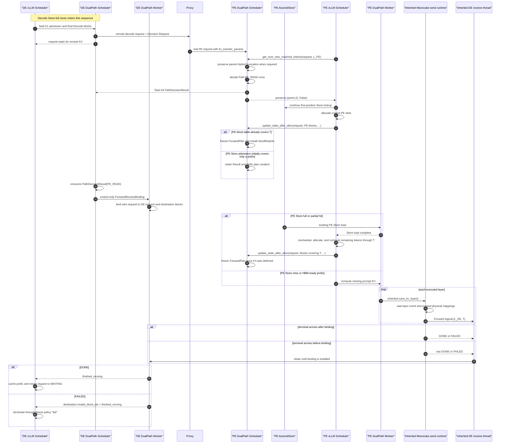

# Task-05 Detailed Spec — `PE_READ` Forward Data Path

> **Superseded lifecycle clauses (2026-08-16):** This file is a historical
> Stage-1 task record. References below to the Task-04 Decision deadline or any
> Forward watchdog choice are superseded by the
> [ABORT and watchdog-removal decision](../../../docs/superpowers/specs/2026-08-16-dual-path-abort-notification-and-watchdog-removal.md).
> Current termination is outcome-driven and has no DualPath timer fallback.

## 1. Status and authority

This document defines the implementation contract for Task-05 in the
[`DualPath Stage 1 Task Catalog`](../TASKS.md). It extends the completed
Task-04 Scheduler decision control loop with the first successful DualPath
data path: a PE-owned `Path.PE_READ` result, PE Store/compute preparation, and
layerwise Forward into the final Decode blocks allocated by Task-01.

The source baseline reviewed for this design is:

- `vllm-ascend@72fd97f555100819e0f27d7e70d53deba4441cf5`
- sibling `vllm@0fc695fc6d1d82e9a5ac6835ac8e4e1c83703665`

Task-05 is a controlled data-path closure, not production policy activation.
Tests supply a `PathPolicy` that selects `Path.PE_READ`. A received
`Path.DE_READ` retains Task-04 behavior and starts no data operation; Task-05
does not add a temporary fail-closed branch for that unimplemented route.

Task-06 narrows every Task-05 PE request to Decode Store-non-full admission.
A Decode Store-full request completes locally and therefore cannot be forced
through `PE_READ`, create a PE request, or install a Forward plan. PE Store
full/partial/miss cases below continue to describe PE-local preparation for a
valid remote-required request.

## 2. Outcome and merge-state contract

For a valid Decode Store-non-full request whose PE-owned result is
`Path.PE_READ`, Task-05 must provide this observable lifecycle:

```text
DE Task-01 admission
    -> final Decode blocks allocated
    -> request waits in WAITING_FOR_REMOTE_KVS

PE Task-04 decision
    -> one local PathDecisionResult(Path.PE_READ)
    -> one immutable request-level ForwardPlan after PE allocation covers T
    -> outer AscendStore may load PE KV, or PE computes missing KV
    -> inherited layerwise runtime sends logical [L_DE, T)

DE Task-04 result consumption
    -> one ForwardReceiveBinding sent to the DE Worker
    -> inherited receive thread accepts metadata/DONE/FAILED
    -> early raw terminal events are retained until the binding exists
    -> DONE publishes finished_recving
    -> FAILED publishes destination invalid_block_ids + finished_recving

vLLM Core
    -> caches successfully prepared Decode blocks after DONE
    -> WAITING_FOR_REMOTE_KVS -> WAITING
    -> recomputes the final prompt token on the next schedule
```

After Task-05 merges:

- injected or test-forced `PE_READ` completes end to end;
- Decode Store is never activated by this route;
- `DE_READ` still has no Task-05 data-plane behavior;
- ordinary Layerwise requests preserve parent behavior;
- non-full production policy activation remains deferred.

## 3. Supported configuration and explicit stage boundary

### 3.1 Required PE connector order

The PE `AscendMultiConnector` configuration must order connectors as:

```python
[
    DualPathConnector,
    AscendStoreConnector,
]
```

`MultiConnector.get_num_new_matched_tokens()` uses first-positive selection.
The DualPath child must therefore observe the request first, apply the
Task-04 decision hook, and preserve its parent `(0, False)` accounting result.
AscendStore can then probe and win when it has PE-side KV.

If AscendStore appears first and returns a positive match, MultiConnector does
not call the later DualPath child and no decision exists. Task-05 does not
change first-positive selection to compensate for an invalid ordering.

`AscendMultiConnector.update_state_after_alloc()` already forwards real blocks
to every `MooncakeLayerwiseConnector` child, including the DualPath subclass,
even when AscendStore won first-positive selection. Task-05 relies on that
existing behavior and does not modify `AscendMultiConnector`.

### 3.2 Ready and transfer boundaries

Task-05 preserves the parent Mooncake Layerwise target semantics:

```text
P = original prompt token count
R = max(P - 1, 0), the Decode-ready and decision target
T = P for ordinary Attention
    R for Attention-Mamba hybrid
```

`PathDecisionRequest.target_tokens` remains `R` and strict validation requires
`decode_store_tokens < R`. It is intentionally the only target serialized by
the remote decision protocol. `T` is not added to the wire request:

- DE retains `T` as `DecodeKVSnapshot.transfer_tokens`;
- ordinary PE requests remain length `P`;
- the inherited parent hook truncates an Attention-Mamba hybrid PE request
  exactly once to length `R` before Task-05 creates the plan;
- `ForwardPlan.token_end` and `ForwardReceiveBinding.token_end` use `T`.

Task-05 must not introduce universal PE truncation. Ordinary Attention keeps
the parent's complete-prompt send behavior; Hybrid reuses the parent's
existing request truncation and remote-block trimming behavior.

### 3.3 KVPool and cache-group scope

Task-05 inherits the Decode construction guards from Task-04:

```text
len(kv_cache_config.kv_cache_groups) == 1
kv_transfer_config.kv_load_failure_policy == "fail"
```

The Decode KVPool probe remains non-layerwise with the deployment-provided
`consumer_is_to_load=True` setting. `PE_READ` never converts the Task-01
detached `LoadSpec` into Decode Store Worker metadata.

The plan schemas retain a nested block-table shape so they do not preclude a
future multi-group design, but Task-05 acceptance covers the single supported
group only.

### 3.4 No production activation

Task-05 tests inject a lightweight policy implementation whose `choose()`
always returns `Path.PE_READ` for Store-non-full Decode input. That fixture is
test-only; Task-05 does not add an `AlwaysPEReadPolicy` production class or
change the default `RoundRobinPathPolicy`.

The production selector remains unactivated because `RoundRobinPathPolicy`
may return `Path.DE_READ`, whose non-full data path is not complete in this
Task.

## 4. End-to-end sequence



There is no new Worker-binding-ready handshake. The existing Task-03 ACK means
that the DE Coordinator accepted the Result; it does not mean the DE Worker
has installed `ForwardReceiveBinding`. Task-05 correctness therefore depends
on retaining early raw DONE/FAILED events rather than adding another network
round trip.

PE Scheduler hooks remain non-blocking. They do not wait for Decision delivery,
Store completion, a Worker binding, a layer event, or P2P completion.

## 5. Chosen reuse design

Three designs were considered:

1. Use only the parent's implicit `SendReqInfo`/`ReqMeta` state. This minimizes
   types but leaves no immutable DualPath statement of the authorized logical
   range and destination.
2. Freeze one thin explicit `ForwardPlan`, adapt it into the existing parent
   send state, and reuse the full parent Worker runtime. This is the approved
   design.
3. Build a new direction-generic Forward/Reverse runtime in Task-05. This
   duplicates mature Mooncake behavior and prematurely expands Task-07 scope.

The approved design introduces no protected helper in
`MooncakeLayerwiseConnectorScheduler` and does not extract parent Worker
startup, metadata, or per-layer methods. The DualPath subclass performs the
small plan-to-`SendReqInfo` installation itself.

## 6. Immutable data contracts

### 6.1 `ForwardPlan`

`ForwardPlan` is a PE Scheduler-owned, request-level logical plan:

```python
@dataclass(frozen=True)
class ForwardPlan:
    request_key: DualPathRequestKey
    token_start: int
    token_end: int
    source_block_ids: tuple[tuple[int, ...], ...]
    destination_block_ids: tuple[tuple[int, ...], ...]
```

Field meanings:

| Field | Meaning |
|---|---|
| `request_key` | Task-02 identity of the committed request |
| `token_start` | `L_DE`, the already-ready Decode prefix |
| `token_end` | `T`, the parent-compatible Layerwise transfer target |
| `source_block_ids` | Complete PE block table, deeply frozen |
| `destination_block_ids` | Complete final DE block table forwarded by Proxy, deeply frozen |

The plan is created once on the first PE allocation callback whose current
source block table covers `T`. An earlier Store-driven allocation that covers
only a prefix retains the PE Result and defers plan creation without error. It
is not one object per layer and contains no `layer_id`, NPU address,
TP/PCP/DCP rank mapping, Mooncake session, or TransferEngine task.

The block tables are complete request tables rather than pre-sliced suffixes.
`token_start` and `token_end` define the logical interval. The inherited
Worker uses its current token-frontier and topology helpers to select and
expand the physical block/address mappings.

Example:

```text
block_size = 16
L_DE = 32
P = 51
R = 50
T = 51  # ordinary Attention

source_block_ids      = ((10, 11, 12, 13),)
destination_block_ids = ((20, 21, 22, 23),)

logical interval      = [32, 51)
physical full blocks  = 12 -> 22, 13 -> 23
```

The final physical block may include positions beyond `T`; only `[L_DE, T)`
is logically valid. This preserves the existing Layerwise block-granularity
behavior, and vLLM recomputes the final prompt token before Decode generation.

Task-05 must validate before retaining a plan:

- the locally retained Result is `Path.PE_READ`;
- the Result key equals `request_key` from the nested Decision Request;
- `0 <= token_start < token_end`;
- `token_start` is aligned to the supported Decode block size;
- source and destination group counts match the configured shape;
- each table covers `token_end` under its declared local/remote block size;
- the destination table equals the immutable DE table received in
  `kv_transfer_params`;
- the required inherited remote endpoint/topology fields are present.

An identical duplicate allocation/bind is idempotent. A different range or
block table for the same active PE request is a lifecycle error and must not
replace the first plan.

### 6.2 `ForwardReceiveBinding`

`ForwardReceiveBinding` is a DE lifecycle binding, not a transfer plan:

```python
@dataclass(frozen=True)
class ForwardReceiveBinding:
    request_key: DualPathRequestKey
    wire_request_id: str
    decode_request_id: str
    destination_block_ids: tuple[tuple[int, ...], ...]
    token_start: int
    token_end: int
```

It associates the existing Mooncake DONE/FAILED identifier with the local DE
request and the blocks whose validity depends on Forward.

`destination_block_ids` is the exact parent-compatible table that Task-04
advertised as `remote_block_ids`, including inherited Hybrid trimming. It is
derived again from `DecodeKVSnapshot.final_block_ids` with the same pure helper
when the binding is emitted; Task-05 does not add another wire field or retain
a second mutable copy in `PathDecisionRequest`.

`wire_request_id` is derived with the existing
`get_external_request_id(decode_request_id)` convention. Task-05 does not add
a request-ID protocol or compare DE and PE EngineCore-local IDs; it relies on
the same Proxy/external-ID contract as ordinary Layerwise transfer.

The binding:

- starts no Store load, handshake, P2P transfer, or ModelRunner work;
- contains no PE source blocks;
- is installed once on the DE Worker;
- remains until one DONE/FAILED terminal event is consumed;
- supplies the complete destination table and logical range from which the
  Worker derives the Forward-owned suffix for failure reporting.

For the single supported group, failure provenance is:

```python
first_forward_block = token_start // decode_block_size
last_forward_block = math.ceil(token_end / decode_block_size)
failed_destination_blocks = destination_block_ids[0][
    first_forward_block:last_forward_block
]
```

`token_start` is block-aligned, so this suffix cannot include a block owned
only by the pre-existing Decode HBM prefix. Task-05 must never invalidate
`destination_block_ids[0][:first_forward_block]`.

An identical duplicate binding is idempotent. A conflicting binding for the
same active request key or wire ID is rejected without replacing the first
mapping.

### 6.3 Connector metadata

Task-05 extends the Task-04 metadata object:

```python
class DualPathConnectorMetadata(MooncakeLayerwiseConnectorMetadata):
    decision_timeouts: list[DecisionTimeoutMetadata]
    forward_receive_bindings: list[ForwardReceiveBinding]
```

A binding-only metadata object is control-only. Its inherited `requests` map
is empty and it does not invoke the parent's receive-request load path.

## 7. PE Scheduler integration

### 7.1 Retain the local result

Task-04 already computes the PE-owned Result in
`get_num_new_matched_tokens()`. Task-05 retains that concrete Result by
PE-local request ID so the later allocation callback can authorize a plan:

```python
_prefill_path_results: dict[str, PathDecisionResult]
_prefill_forward_plans: dict[str, ForwardPlan]
```

Only a successfully validated Result is retained. The existing Decider remains
the authority for duplicate replay and policy state. Task-05 does not compute
a second result in `update_state_after_alloc()`.

The Decision delivery Future and the plan are separate lifecycle records:

- the Future proves direct Result delivery attempts;
- the plan freezes local data movement authorized by the PE-owned Result.

Task-05 adds no blocking wait on that Future. This is an explicit controlled
merge-state limitation: the plan can be ready before the DE Worker binding,
which is why early terminal retention is mandatory and production activation
remains deferred.

### 7.2 Create and install the plan after allocation

For a PE request with a retained `Path.PE_READ` Result,
`update_state_after_alloc()` must:

1. Derive the start from the Decision Request and the end from the effective
   PE request after the inherited Hybrid truncation hook:

   ```text
   token_start = decision_request.decode_local_tokens
   token_end   = request.num_prompt_tokens
   ```

   For ordinary Attention, `token_end == decision_request.target_tokens + 1`.
   For Attention-Mamba hybrid,
   `token_end == decision_request.target_tokens`. Any other relationship is a
   lifecycle/protocol mismatch and must not create a plan.

2. Read the current PE block table from `blocks.get_block_ids()` and the final
   DE block table from `kv_transfer_params`.
3. Validate the destination table and protocol facts immediately. If the
   current source table does not yet cover `token_end`, retain the Result,
   create no plan or `SendReqInfo`, and return. This is expected when PE Store
   first admits only the Decode-ready prefix and a later schedule allocates
   the final ordinary-Attention token.
4. Once both tables cover `token_end`, deep-freeze them and retain one
   `ForwardPlan`.
5. Install the plan into the inherited Scheduler send state.
6. Return without calling the parent's whole
   `update_state_after_alloc()` remote-decode branch.

The installation is intentionally small:

```python
self._reqs_need_send_layerwise[request.request_id] = SendReqInfo(
    local_block_ids=[list(group) for group in plan.source_block_ids],
    local_transferred_tokens=plan.token_start,
    local_computed_tokens=0,
    request=request,
)
```

The inherited metadata builder continues to read the existing endpoint,
remote block size, topology, and remote block table fields from
`request.kv_transfer_params`. Task-05 validates that those mutable runtime
fields agree with the frozen plan at installation; it does not define a second
wire envelope.

For a DualPath PE request without a retained `Path.PE_READ` Result, Task-05
keeps Task-04 suppression behavior and creates no plan or send state. In
particular, a Store-non-full `Path.DE_READ` is not converted into an error or
another route. Decode Store-full never creates this PE request.

### 7.3 Store hit and compute readiness

Creating or installing a plan does not mean that a layer is ready to send.
Task-05 introduces no Store-to-DualPath callback and no `StoreReady` or
`LayerReady` message.

The existing runtime provides two gates:

1. The inherited Scheduler `build_connector_meta()` updates
   `local_computed_tokens` and `local_transed_tokens`, defining the block
   frontier that is ready in the current model step.
2. The inherited Worker `save_kv_layer()` waits on that layer's existing NPU
   reshape/cache event before reading and sending KV.

The PE Store cases converge through those gates:

```text
PE HBM complete
    -> request executes the normal final-token/model lifecycle
    -> layer event authorizes Forward

PE Store hit
    -> existing AscendStore loads PE HBM
    -> vLLM reschedules the request
    -> model execution/layer event authorizes Forward

PE Store partial or miss
    -> PE computes the missing suffix
    -> computed-token frontier and layer event authorize Forward
```

DualPath never treats Store lookup completion alone as proof that all layers
or all planned blocks are safe to send.

## 8. Inherited Worker send runtime

Task-05 reuses the following parent behavior without a new abstraction:

- KV-cache memory registration;
- `KVCacheSendingLayerThread` startup;
- GET_META handshake and remote metadata caching;
- local/remote block-size alignment;
- TP/PCP/DCP and head mapping;
- kernel block scaling;
- quantization, resharding, and NPU event handling;
- `save_kv_layer()` per-layer enqueue;
- `batch_transfer_sync_write()` data movement;
- final-layer `DONE_SENDING_MSG`/`FAILED_SENDING_MSG` signaling;
- existing three-attempt DONE/FAILED ACK handling.

`ForwardPlan` is not serialized directly to the PE Worker. The thin Scheduler
adapter installs parent `SendReqInfo`; the parent metadata builder emits
`ReqMeta`; the parent Worker expands it into physical transfer tasks. Focused
tests must prove that the resulting parent metadata represents the frozen plan
exactly.

Task-05 must not edit `MooncakeLayerwiseConnector` merely to rename these
objects or expose unused protected helpers. If an implementation discovers an
unavoidable parent defect while executing this exact Forward route, the fix
must be behavior-preserving for ordinary Layerwise requests and supported by a
focused parent regression test; helper extraction is not pre-authorized.

## 9. DE Result-to-binding integration

During DE `build_connector_meta()`, Task-05 handles a newly consumed valid
`Path.PE_READ` Result on the same Scheduler-thread transition that changes the
Task-04 state from `PENDING` to `COMMITTED`:

1. Read the corresponding immutable `DecodeKVSnapshot`.
2. Re-derive the exact destination table advertised by Task-04 from the
   snapshot's final blocks using the same inherited Hybrid-trimming helper.
3. Construct one `ForwardReceiveBinding` from the request key, Decode-local
   request ID, advertised destination table, `L_DE`, and
   `snapshot.transfer_tokens` (`T`).
4. Append it to `metadata.forward_receive_bindings`.
5. Mark the binding as emitted as part of the same one-shot transition.

The binding is not added to `_reqs_need_recv`. That parent queue means “start
a remote KV load.” Forward is a PE-initiated push; DE only installs ownership
for completion and failure.

An identical duplicate Result cannot emit a second binding. Task-03/04 already
deduplicates Results, and the Task-04 `COMMITTED` state is not re-entered.

A Store-non-full `Path.DE_READ` remains committed without Worker data
metadata. Task-05 neither loads Decode Store nor publishes
`finished_recving` for it. Task-06 handles Decode Store-full before any Result
exists.

## 10. DE Worker binding and early terminal reconciliation

### 10.1 Binding installation

`DualPathConnectorWorker.start_load_kv()` must install all
`forward_receive_bindings` before delegating ordinary inherited metadata.
Installation records at least:

```text
wire_request_id -> decode_request_id
decode_request_id -> ForwardReceiveBinding
```

It may reuse the inherited `request_map` for the first mapping. It must retain
a distinct binding map for destination-block provenance because a
`ForwardReceiveBinding` is not a parent `ReqMeta` load request.

Binding installation must not call TransferEngine, request GET_META, add a
receive task, or populate `_recving_metadata` with a fake load request.

### 10.2 Preserve early raw events

The current parent `get_finished()` clears raw receive-thread sets before
filtering them through `request_map`. An event whose mapping is not installed
is therefore dropped. Task-05 must close that race inside the DualPath Worker
without changing ordinary parent behavior.

The DualPath Worker retains unresolved raw events:

```python
_pending_forward_done: set[str]
_pending_forward_failed: set[str]
_consumed_forward_terminals: dict[str, str]
# wire_request_id -> decode_request_id
```

On every `get_finished()` call it must:

1. take the current raw DONE/FAILED sets from the inherited receive thread;
2. union them with previously unresolved events;
3. discard a retry whose wire ID already has a consumed terminal record;
4. resolve every remaining ID for which a mapping now exists;
5. retain only still-unresolved IDs;
6. preserve the parent's ordinary virtual-request, load-failure, invalid-block,
   logging, and cleanup behavior for non-DualPath requests.

DONE and FAILED sets are deduplicated. If the same wire ID appears in both
before its first terminal is consumed, FAILED wins and the destination is
never reported as successfully prepared. After the first terminal is
consumed, a bounded terminal record suppresses later retries so
`finished_recving` is never published twice.

The existing `get_finished(finished_req_ids)` input must reach the DualPath
Worker. When Core later includes the corresponding Decode-local ID in
`finished_req_ids`, the Worker removes its consumed-terminal record and any
raw duplicate for the derived wire ID. This is terminal deduplication, not a
cross-engine abort or cancellation tombstone.

No new event-retention timeout is introduced. A genuinely unresolved event
with no binding remains until a matching binding arrives, the corresponding
local request is reported finished, or Worker shutdown clears it. This is a
controlled Task-05 limitation consistent with the approved lightweight
reliability model.

## 11. Completion and failure

### 11.1 Successful Forward

The inherited sender emits DONE only after:

- the relevant prompt chunk is complete;
- the final model layer has been processed;
- the synchronous Mooncake batch write returned success; and
- the sender has produced all side-channel completion signals required by the
  existing `trans_count` contract.

After the DE Worker resolves DONE through `ForwardReceiveBinding`, it returns:

```text
finished_recving = {decode_request_id}
invalid_block_ids = {}
```

Upstream vLLM then caches the prepared prefix, changes a full-prompt hit to
recompute its last prompt token where required, and promotes the request from
`WAITING_FOR_REMOTE_KVS` to `WAITING`.

The Worker removes the consumed raw event and binding ownership exactly once.

### 11.2 Explicit transfer failure

When the inherited sender produces FAILED, the DE Worker returns in the same
connector output:

```text
finished_recving = {decode_request_id}
invalid_block_ids = destination blocks intersecting logical [L_DE, T)
```

Task-05 must not invalidate an unrelated request or infer failure blocks from
PE source IDs. It must not invalidate destination blocks belonging only to
the pre-existing `[0, L_DE)` HBM prefix. Under Task-04's required
`kv_load_failure_policy="fail"`, Core terminates the affected request rather
than silently using partially written KV.

The Worker removes the consumed raw event and binding ownership exactly once.

### 11.3 No Forward watchdog

Task-04's Decision deadline applies only while the state is `PENDING`. A valid
`Path.PE_READ` Result changes it to `COMMITTED` and stops Decision deadline
evaluation.

Task-05 adds no end-to-end Forward deadline. It inherits TransferEngine errors
and the parent's three attempts for DONE/FAILED delivery. If the final
DONE/FAILED signal is exhausted or permanently lost, DE may remain in
`WAITING_FOR_REMOTE_KVS`. This is an acknowledged inherited limitation, not a
Task-05 recovery path.

## 12. Lifecycle cleanup and shutdown

Task-05 does not design user abort or cross-engine cancellation. It introduces
no `CANCEL` message, remote queue revocation, cancel tombstone, or drain-first
protocol. Existing Proxy/engine behavior remains outside the Connector
contract.

Task-owned ordinary lifecycle cleanup is still required:

### 12.1 PE Scheduler

On request-terminal hooks:

- remove the PE-local Result reference;
- remove the Scheduler-owned `ForwardPlan`;
- remove unconsumed inherited send-queue state when it still belongs to that
  request;
- preserve Task-04 Decider/Future cleanup rules;
- preserve the parent's return value.

Normal parent send metadata may already have consumed
`_reqs_need_send_layerwise`; cleanup must be idempotent.

### 12.2 DE Scheduler

The Scheduler-owned binding is emitted once and not retained as a second copy
after metadata construction. Task-01 snapshot and Task-04 decision-state
cleanup continue to use their existing request-terminal hooks.

### 12.3 DE Worker

After DONE/FAILED, remove the active wire mapping and binding provenance, but
retain the bounded consumed-terminal record until the local request appears in
the existing `finished_req_ids` input. Shutdown clears installed bindings,
consumed terminals, and unresolved early-event sets after stopping new
Task-05 work, then delegates parent shutdown behavior.

This section describes local record ownership only. It does not promise that
finishing a request on one engine stops work on the other engine.

## 13. Parent parity and side-effect invariants

Task-05 must preserve all of the following:

- A request without nested `dual_path` delegates to the parent exactly as in
  Task-00.
- A Task-05 PE request does not call Decode KVPool commit or Decode Store
  Worker load APIs.
- Merely receiving real PE or DE block IDs does not start TransferEngine I/O.
- Only a retained `Path.PE_READ` Result authorizes a `ForwardPlan`.
- One request owns at most one active Forward plan and one DE receive binding.
- Scheduler hooks perform no blocking Store, ZMQ, NPU, or TransferEngine work.
- Store readiness alone does not bypass token-frontier or layer-event gates.
- DONE never invalidates blocks; FAILED never reports successful KV.
- A committed path does not fall back or re-decide.
- No new request-ID wire format is introduced.
- No parent helper extraction or `AscendMultiConnector` behavior change is
  required.

## 14. Focused CPU test contract

Tests should live under
`tests/ut/distributed/kv_transfer/dual_path/` unless an existing parent-parity
fixture is the closer home.

### 14.1 Schema and immutability

1. `ForwardPlan` deep-freezes both block tables.
2. `ForwardReceiveBinding` deep-freezes destination blocks.
3. Mutating the original list inputs cannot change either retained object.
4. Constructed plans with invalid ranges, misaligned starts, missing groups,
   insufficient block coverage, or conflicting duplicates are rejected. The
   PE Scheduler does not construct a plan while its current source table is
   still short of `T`; it defers as specified in Section 7.2.
5. The plan contains no layer, rank, address, endpoint, or TransferEngine
   object.

### 14.2 PE Scheduler and MultiConnector

6. A forced `PE_READ` Result is retained once and produces one plan after real
   PE allocation covers `T`.
7. The plan contains complete PE and DE block tables and logical
   `[L_DE, T)`, not pre-sliced tables. Ordinary Attention proves `T=P`;
   Attention-Mamba hybrid proves one inherited truncation and `T=R`, including
   replay without double truncation.
8. Installation creates the expected inherited `SendReqInfo` with
   `local_transferred_tokens=L_DE`.
9. Identical duplicate allocation is idempotent; a conflicting allocation
   preserves the first plan and fails.
10. `[DualPathConnector, AscendStoreConnector]` lets DualPath decide before a
    positive Store result and still gives the DualPath child real PE blocks.
11. PE HBM-complete, PE Store-full, PE Store-partial, and PE Store-miss
    fixtures converge through the same inherited metadata/send seam.
    A Store-driven allocation that initially covers only `R` defers plan
    creation until a later allocation covers `T`; it does not fail or decide
    again.
12. Store lookup or plan installation alone does not invoke Worker P2P.
13. A Store-non-full `Path.DE_READ` Result produces no Forward plan, no send
    queue, and no Task-05 error path; Decode Store-full produces no PE request
    at all.

### 14.3 Parent metadata and Worker send reuse

14. Parent `build_connector_meta()` advances the same token frontier as the
    ordinary Layerwise implementation.
15. `remote_cache_tokens=L_DE` skips the Decode-ready prefix exactly once.
16. A non-block-aligned `T` selects the containing final physical block
    without changing logical validity.
17. Per-layer enqueue, event gating, topology mapping, and DONE/FAILED callback
    behavior match focused parent regression fixtures.
18. Task-05 does not create a second send thread, TransferEngine, or memory
    registration.

### 14.4 DE binding and terminal race

19. A newly committed `PE_READ` emits exactly one
    `ForwardReceiveBinding` in control-only metadata, using the exact
    parent-compatible destination table previously advertised to PE.
20. Binding installation starts no parent receive/load request.
21. DONE after binding maps to the Decode-local request and publishes only
    `finished_recving`.
22. FAILED after binding publishes all and only destination blocks intersecting
    `[L_DE, T)` together with `finished_recving`; the pre-existing HBM prefix
    remains valid.
23. DONE before binding is retained and reconciled after installation.
24. FAILED before binding is retained and reconciled after installation.
25. Conflicting DONE+FAILED resolves as FAILED.
26. Unknown raw IDs are retained without being attributed to another request.
27. Duplicate terminal events before or after first consumption are
    idempotent; the Worker publishes at most one terminal for a binding and
    releases its dedupe record when `finished_req_ids` contains the local
    request.

### 14.5 Lifecycle and parity

28. Normal request-terminal hooks and shutdown remove Task-05-owned Scheduler
    and Worker records idempotently.
29. Ordinary remote-prefill, remote-decode, virtual, and no-transfer requests
    retain Task-00 parent behavior.
30. Decode KVPool/Store commit APIs are never called in any `PE_READ` test.
31. No Task-05 code waits synchronously for Decision ACK, Store, layer event,
    or Forward completion.

## 15. Integration and NPU acceptance

### 15.1 CPU lifecycle integration

A Scheduler/Worker integration harness must exercise real Connector hooks:

```text
DE get_num_new_matched_tokens
-> DE update_state_after_alloc
-> Proxy metadata fixture
-> PE get_num_new_matched_tokens with forced PE_READ policy
-> PE update_state_after_alloc
-> DE build_connector_meta emits binding
-> PE parent metadata and mocked layer send
-> DE Worker get_finished
-> KVConnectorOutput.finished_recving
```

It must prove that the Decode request has final allocated blocks, remains in
`WAITING_FOR_REMOTE_KVS` before DONE, and returns to schedulable `WAITING`
after DONE. The failure variant must terminate through invalid destination
blocks plus `finished_recving`.

### 15.2 NPU acceptance matrix

On a supported Ascend environment, run one request for each PE preparation
case:

| PE state | Required preparation | Required Forward |
|---|---|---|
| HBM covers `R` | no Store load and no missing-prefix compute | `[L_DE, T)` |
| Store covers `R` | existing PE Store load | `[L_DE, T)` |
| Store partially covers `R` | Store load plus PE compute | `[L_DE, T)` |
| Store miss | PE compute | `[L_DE, T)` |

For every case acceptance must verify:

- exact source and destination request/block ownership;
- ordinary Attention forwards through `P`, while Attention-Mamba hybrid
  forwards through `P - 1` using the inherited truncation path;
- no Decode Store load;
- one layerwise Forward lifecycle;
- no duplicate prefix send before `L_DE`;
- terminal DONE reaches the correct DE request;
- Decode returns to `WAITING` and successfully continues generation;
- ordinary Layerwise regression remains healthy.

The test configuration uses the approved connector order and a test-only
PE-read policy. Passing this matrix proves the route implementation, not
production policy activation.

## 16. Expected implementation touchpoints

Task-05 is expected to remain concentrated in:

```text
vllm_ascend/distributed/kv_transfer/kv_p2p/dual_path/metadata.py
vllm_ascend/distributed/kv_transfer/kv_p2p/dual_path/connector.py
tests/ut/distributed/kv_transfer/dual_path/
```

Parent Layerwise files and `AscendMultiConnector` are not expected touchpoints.
Any need to modify them is a design deviation requiring review against the
reuse boundary in Section 8.

## 17. Explicitly out of scope

Task-05 does not implement or promise:

- Decode Store commit or any `DE_READ` data plane;
- `DE_READ` fail-closed behavior;
- Reverse transfer;
- production non-full policy activation;
- a Forward-binding-ready ACK;
- a Forward watchdog, end-to-end retry, or recovery after terminal-signal
  exhaustion;
- user abort or cross-engine cancellation;
- a new request-ID protocol;
- parent send/receive helper extraction;
- multi-KV-cache-group Decode support;
- adaptive routing, metrics providers, or re-decision.

## 18. Acceptance checklist

Task-05 is accepted only when all of the following are true:

1. A request-level immutable `ForwardPlan` freezes complete PE/DE block tables
   and logical `[L_DE, T)`.
2. The plan is installed through a thin DualPath adapter into inherited
   `SendReqInfo`, with no parent Scheduler helper extraction.
3. PE HBM, Store-full, Store-partial, and Store-miss cases share the existing
   token-frontier and per-layer event gates.
4. The inherited Worker expands and sends the correct physical block suffix;
   ordinary Attention uses `T=P`, and Attention-Mamba hybrid uses `T=P-1`
   without universal or repeated PE request truncation.
5. DE consumes `Path.PE_READ` into one control-only
   `ForwardReceiveBinding`, not `_reqs_need_recv`.
6. Early DONE/FAILED events are preserved and reconciled after binding.
7. DONE publishes successful `finished_recving`; FAILED publishes only the
   `[L_DE, T)` destination-block suffix and `finished_recving` together.
8. Decode Store, Reverse, new timeout, abort, new wire identity, and parent
   helper extraction remain absent.
9. CPU tests and the required NPU matrix pass.
10. Ordinary Layerwise behavior remains compatible.
11. The merge state remains test-forced/injected `PE_READ`; production
    non-full selection is still disabled.
