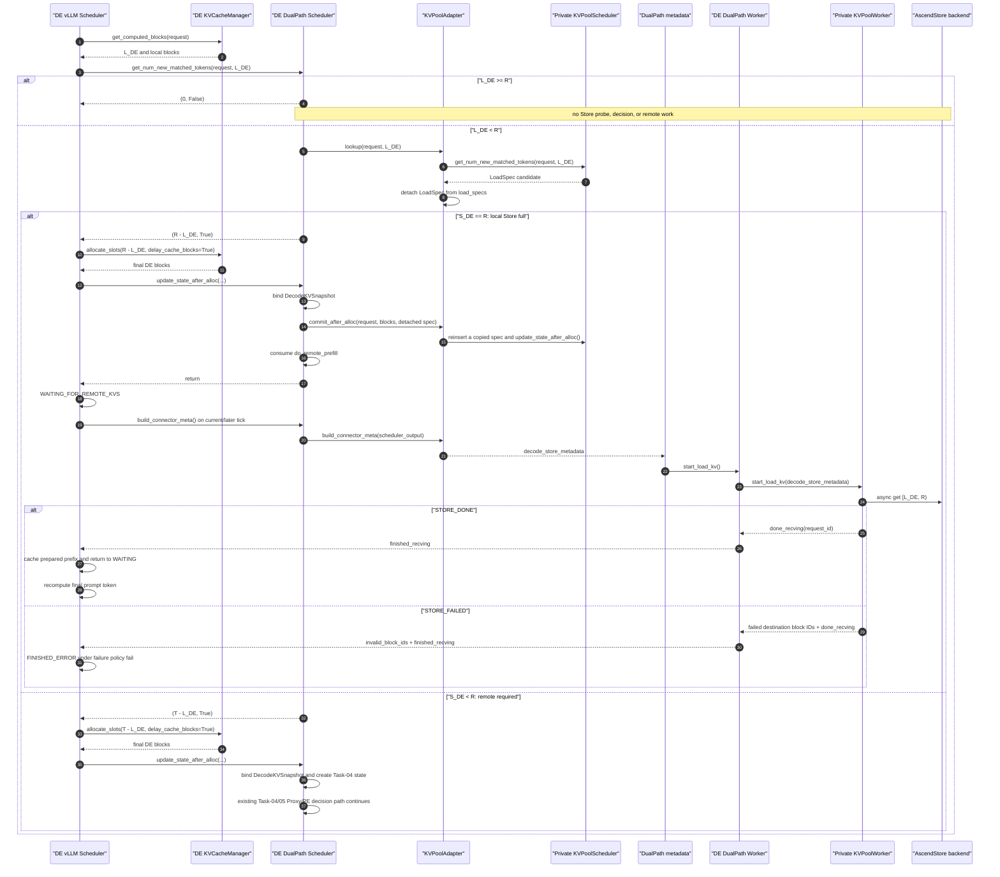

# Task-06 Detailed Spec — DE-Local Store-Full Completion

## 1. Status, authority, and implementation starting point

This document is the complete implementation contract for Task-06 in the
[`DualPath Stage 1 Task Catalog`](../TASKS.md). It is intentionally
self-contained: an implementation Agent may read this file without reading
the Task-01 through Task-05 detailed specs.

Task-01 through Task-05 are treated as the implemented starting point. This
Task changes no public vLLM protocol, but it does require a small set of
backward deltas to those already implemented DualPath contracts. Section 12 is
normative and lists every required Task-01 through Task-05 reconciliation.

Where this document conflicts with an earlier Task spec, this document wins
for the composed post-Task-06 system.

The architectural correction owned by this Task is:

> A Decode Store-full request is a DE-local admission and completion path. It
> does not create a path decision, contact Proxy, create a PE request, consume
> round-robin state, or require a PE no-work terminal mechanism.

Only Store non-full requests continue through the Task-04 Proxy/PE decision
flow.

## 2. Outcome and merge-state contract

For a non-HBM-complete Decode request whose detached KVPool lookup covers the
complete Decode-ready prefix, Task-06 must execute exactly one local load:

```text
probe Store full
-> allocate final DE blocks through the Decode-ready boundary
-> bind immutable DecodeKVSnapshot
-> KVPoolAdapter.commit_after_alloc()
-> DE KVPoolWorker async load
-> STORE_DONE or STORE_FAILED
-> finished_recving, with invalid_block_ids on failure
```

The same request must execute none of the following:

```text
PathDecisionRequest
PathDecisionCoordinator.register_pending()
Decision deadline
Proxy HTTP notification
PE request
PathPolicy.choose()
PathDecisionResult
Forward
Reverse
Mooncake Layerwise receive request
```

After acceptance:

- Store-full Decode requests complete locally and may be enabled in
  production;
- HBM-complete behavior remains unchanged;
- Store non-full requests retain the Task-04/05 remote decision behavior;
- a committed local Store route never falls back to PE;
- ordinary `MooncakeLayerwiseConnector` behavior remains unchanged.

## 3. Token and route terminology

For the initial Decode request:

```text
P    = original prompt token count
R    = max(P - 1, 0), Decode-ready prefix required before Decode resumes
T    = parent Mooncake Layerwise transfer target
       P for ordinary Attention
       R for Attention-Mamba hybrid
L_DE = contiguous Decode HBM prefix supplied by vLLM
S_DE = usable Decode Store prefix in the detached LoadSpec, clamped to R
```

The three admission classes are mutually exclusive:

```text
HBM complete:       L_DE >= R
DE Store full:      L_DE < R and S_DE == R
DE Store non-full:  L_DE < R and S_DE < R
```

Miss and lookup-unavailable both use `S_DE = L_DE` for routing purposes.
Task-06 does not add a public Store coverage enum.

### 3.1 Route-dependent Core accounting

The external-token return is deliberately route-dependent:

| Admission | Core return | Meaning |
|---|---:|---|
| HBM complete | `(0, False)` | No external KV is needed |
| DE Store full | `(R - L_DE, True)` | Store will prepare exactly the Decode-ready suffix |
| DE Store non-full | `(T - L_DE, True)` | The remote Layerwise path still needs destination coverage through `T` |

For ordinary Attention, `T = P = R + 1`. Therefore a Store-full request must
not return `T - L_DE`: the local Store load only prepares `[L_DE, R)`, and the
last prompt token is intentionally recomputed by Decode.

Example:

```text
P = 129, R = 128, T = 129, L_DE = 64

Store full:      external_tokens = 128 - 64 = 64
Store non-full:  external_tokens = 129 - 64 = 65
```

This distinction also means `local_tokens` can no longer be derived as
`transfer_tokens - external_tokens`. The immutable snapshot must retain
`local_tokens` explicitly.

### 3.2 Full classification

The only Store-full predicate is:

```python
load_spec is not None
and load_spec.vllm_cached_tokens == local_tokens
and load_spec.kvpool_cached_tokens == ready_tokens
```

where `ready_tokens = R`. `LoadSpec.can_load` is not part of classification.
The detached lookup spec remains a side-effect-free fact until the explicit
post-allocation commit.

## 4. End-to-end sequence



The local Store path may progress through a zero-model-token connector step.
That is the existing vLLM connector lifecycle, not a new polling loop.

## 5. Scheduler-owned data contracts

### 5.1 Pre-allocation lookup record

No handle or pre-allocation admission object is introduced. The existing
Scheduler-thread-confined map changes to retain the original HBM fact:

```python
_lookup_results: dict[str, tuple[int, int, LoadSpec | None]]
```

The tuple is exactly:

```text
(local_tokens, external_tokens, detached_store_load_spec)
```

`local_tokens` is now required because `external_tokens` has different
boundaries for Store-full and Store-non-full routes.

The record owns no active Store task. Allocation failure leaves it available
for an identical retry. Terminal cleanup simply discards it.

### 5.2 Revised `DecodeKVSnapshot`

The post-Task-06 snapshot contract is:

```python
@dataclass(frozen=True)
class DecodeKVSnapshot:
    transfer_tokens: int
    local_tokens: int
    external_tokens: int
    store_load_spec: LoadSpec | None
    final_block_ids: tuple[tuple[int, ...], ...]

    @property
    def store_tokens(self) -> int:
        if self.store_load_spec is None:
            return self.local_tokens
        return self.store_load_spec.kvpool_cached_tokens
```

Field meanings:

- `transfer_tokens` is `T`, retained for remote Forward planning even when a
  local Store-full admission allocates only through `R`;
- `local_tokens` is the original `L_DE` and is stored explicitly;
- `external_tokens` is the exact value returned to Core for this admission;
- `store_load_spec` is the original detached, non-authorized lookup fact;
- `final_block_ids` is the deeply frozen table returned by real allocation.

`ready_tokens` is not duplicated in the snapshot. During admission it is
derived from `request.num_tokens`; a remote-required request immediately
freezes it into `PathDecisionRequest.target_tokens`. A local Store-full
snapshot is already validated against that boundary before commit.

The original detached `LoadSpec` in the snapshot must remain unchanged.
Task-06 commits a copy because the existing KVPool Scheduler mutates
`LoadSpec.can_load`.

### 5.3 No new decision state for local Store-full

A local Store-full snapshot must not have a corresponding entry in:

```text
_decode_decision_states
PathDecisionCoordinator pending registry
PE decision records
```

The private KVPool Scheduler and Worker own the active Store lifecycle after
commit. The snapshot remains the immutable Scheduler audit record and is
removed by normal request-terminal cleanup.

## 6. Decode Scheduler behavior

### 6.1 `get_num_new_matched_tokens()`

For a selected Decode request carrying `do_remote_prefill=True`:

```python
ready_tokens = max(request.num_tokens - 1, 0)                 # R
transfer_tokens = inherited_hybrid_transfer_target(request)  # T
local_tokens = num_computed_tokens                            # L_DE

if local_tokens >= ready_tokens:
    clear_stale_unbound_lookup(request.request_id)
    return 0, False

load_spec = kvpool_adapter.lookup(request, local_tokens)
store_full = (
    load_spec is not None
    and load_spec.kvpool_cached_tokens == ready_tokens
)
external_tokens = (
    ready_tokens - local_tokens
    if store_full
    else transfer_tokens - local_tokens
)
cache_lookup_result(
    request.request_id,
    local_tokens,
    external_tokens,
    load_spec,
)
return external_tokens, True
```

Requirements:

1. Validate `0 <= L_DE < R <= T` before lookup.
2. HBM-complete bypass performs no Store lookup and no Task-06 side effect.
3. Full classification occurs only after the existing adapter alignment and
   clamp logic.
4. An identical retry reuses the detached spec and the same route-dependent
   accounting.
5. A retry with changed `L_DE`, `R`, or `T` discards the unbound record and
   probes again.
6. Store miss, lookup error, and partial coverage all use the remote-required
   `T - L_DE` accounting.

### 6.2 `update_state_after_alloc()`

The callback must perform these operations in order:

1. Freeze the final block table.
2. Pop and validate `(L_DE, external_tokens, detached_spec)`.
3. Recompute `R` and `T` from the request.
4. Reclassify Store-full from the detached spec.
5. Validate the route-specific external-token formula.
6. Bind one immutable `DecodeKVSnapshot`.
7. Branch on the already frozen classification.

For Store-full:

```text
assert external_tokens == R - L_DE
KVPoolAdapter.commit_after_alloc(request, blocks, detached_spec)
request.kv_transfer_params["do_remote_prefill"] = False
return
```

For Store non-full:

```text
assert external_tokens == T - L_DE
continue the existing Task-04 registration, deadline, message, and Proxy flow
```

The Store-full branch must return before creating a request key, decision
metadata, deadline, Proxy Future, parent `_reqs_need_recv`, or P2P metadata.

The snapshot is bound before commit so duplicate `update_state_after_alloc()`
calls can be checked against a stable record. An identical duplicate is a
no-op and must not commit twice. A conflicting duplicate raises while
preserving the first snapshot and active route.

### 6.3 No late remote fallback

Once the Store-full branch consumes `do_remote_prefill`, all later outcomes
are local:

- load success completes the request;
- Store eviction, missing keys, or backend failure fails closed;
- no later code restores `do_remote_prefill`;
- no later code contacts Proxy or asks policy to choose another path.

The lookup is not a reservation. Failure between lookup and load is therefore
an expected failure-mode test, not a reason to re-decide.

## 7. `KVPoolAdapter` commit and metadata contract

Task-06 extends the existing Scheduler adapter with:

```python
class KVPoolAdapter:
    def commit_after_alloc(
        self,
        request: Request,
        blocks: KVCacheBlocks,
        load_spec: LoadSpec,
    ) -> None: ...

    def build_connector_meta(
        self,
        scheduler_output: SchedulerOutput,
    ) -> AscendConnectorMetadata: ...
```

### 7.1 `commit_after_alloc()` inputs and effects

Preconditions:

- the adapter is Decode-owned and `use_layerwise=False`;
- `load_spec` is the detached snapshot fact for this request;
- `load_spec.vllm_cached_tokens == L_DE`;
- `load_spec.kvpool_cached_tokens == R`;
- `R - L_DE > 0`;
- `blocks` is the final table allocated using the same external-token count;
- the request has not already been committed.

The method must:

1. Create `committed_spec = dataclasses.replace(load_spec)`.
2. Insert only that copy into the private
   `KVPoolScheduler.load_specs[request_id]`.
3. Call the private Scheduler's existing
   `update_state_after_alloc(request, blocks, R - L_DE)`.
4. Let the existing implementation set `committed_spec.can_load=True`, retain
   final block IDs, and add the async loading ID.
5. Leave the original detached snapshot spec unchanged.

Return value is `None`. The method is an authorization boundary, not a second
coverage lookup and not a handle commit.

If a validation/programming error occurs before ownership transfer, it raises
without changing private Scheduler state. If the delegated update raises, the
adapter must roll back only the entries it created for this request before
re-raising. Runtime Store failures after successful commit are reported by the
Worker path in Section 10.

### 7.2 `build_connector_meta()`

This method delegates to the private
`KVPoolScheduler.build_connector_meta(scheduler_output)`. It must reuse the
existing non-layerwise `_process_async_load_request()` path; Task-06 must not
copy Store key, block-hash, GVA, alignment, or `ReqMeta` construction logic.

The delegated builder consumes the copied active `LoadSpec` and produces the
existing `AscendConnectorMetadata`. Probe-only and remote-required requests
must never appear in that metadata.

## 8. Connector metadata composition

Task-06 extends the existing metadata type rather than placing Store requests
in the parent Layerwise `requests` map:

```python
class DualPathConnectorMetadata(MooncakeLayerwiseConnectorMetadata):
    decision_timeouts: list[DecisionTimeoutMetadata]
    forward_receive_bindings: list[ForwardReceiveBinding]  # Task-05, if present
    decode_store_metadata: AscendConnectorMetadata | None
```

`decode_store_metadata` is:

- present only on the Decode role when the private KVPool Scheduler has
  active or terminal Store lifecycle information for the step;
- `None` for PE, HBM-complete, Store non-full, ordinary Layerwise, and
  decision-only requests;
- never serialized into Proxy metadata;
- consumed only by the local DE Worker.

The attachment predicate is exact:

```python
attach_store_metadata = bool(
    store_metadata.requests
    or store_metadata.unfinished_request_ids
    or store_metadata.preempted_req_ids
    or store_metadata.loading_req_ids
    or store_metadata.delayed_free_req_ids
)
```

Otherwise set `decode_store_metadata=None`.

The parent `requests` map remains empty for a local Store-full request. This
proves that Store load is not disguised as a Mooncake P2P receive.

`build_connector_meta()` composition order is:

1. build parent metadata for ordinary Layerwise requests;
2. consume Task-03 Results and Task-04 deadlines for remote-required requests;
3. emit Task-05 bindings when applicable;
4. build private KVPool metadata;
5. attach it as `decode_store_metadata` only when non-empty lifecycle state is
   meaningful to the Worker.

No step blocks on Store or network I/O.

## 9. Decode Worker adapter and lifecycle

Task-06 extends the existing lookup-only `KVPoolWorkerAdapter` to the minimal
non-layerwise load surface:

```python
class KVPoolWorkerAdapter:
    def register_kv_caches(
        self,
        kv_caches: dict[str, torch.Tensor],
    ) -> None: ...

    def start_load_kv(
        self,
        metadata: AscendConnectorMetadata,
    ) -> None: ...

    def get_finished(
        self,
        finished_req_ids: set[str],
        metadata: AscendConnectorMetadata,
    ) -> tuple[set[str], set[str]]: ...

    def get_block_ids_with_load_errors(self) -> set[int]: ...

    def close(self) -> None: ...
```

Every method delegates to the owned existing `KVPoolWorker`. The adapter adds
no key-generation, transfer, or completion algorithm.

### 9.1 KV cache registration

`DualPathConnectorWorker.register_kv_caches()` must:

1. call the parent Layerwise registration unchanged;
2. on Decode only, pass the same KV cache dictionary exactly once to the
   private KVPool Worker adapter.

The second registration initializes the existing Store backend, registers the
buffers with that backend, and starts its existing async KV load thread. This
is the intentional Task-06 expansion of Task-01's lookup-only Worker. It does
not submit per-request load work before committed Store metadata arrives.

PE does not construct or register this Decode Store worker.

### 9.2 Worker metadata consumption

For each connector step, `DualPathConnectorWorker.start_load_kv()` must:

1. preserve existing Task-04 timeout and Task-05 binding installation order;
2. if `decode_store_metadata` is present, call the adapter exactly once;
3. delegate parent Layerwise metadata exactly once.

A local Store-full step has Store metadata but no parent request, Forward
binding, or receive task.

### 9.3 Facade and completion polling

The DualPath facade must pass `finished_req_ids` and the current nested Store
metadata to the Worker adapter, matching the existing AscendStore facade
contract.

The composed internal surface is:

```python
class DualPathConnectorWorker:
    def get_finished(
        self,
        finished_req_ids: set[str],
        metadata: DualPathConnectorMetadata,
    ) -> tuple[set[str], set[str]]: ...


class DualPathConnector:
    def get_finished(
        self,
        finished_req_ids: set[str],
    ) -> tuple[set[str], set[str]]:
        return self.connector_worker.get_finished(
            finished_req_ids,
            self._connector_metadata,
        )
```

The Worker calls `super().get_finished()` with its existing parent signature,
then calls the Store adapter only when
`metadata.decode_store_metadata is not None`.

`DualPathConnectorWorker.get_finished()` unions three independent sources:

```text
parent Layerwise done_sending/done_recving
Task-04 control-only timeout completion
Task-06 KVPool Worker done_sending/done_recving
```

For the consumer-only local load, only Store `done_recving` is relevant. The
request ID must remain the Decode-local vLLM request ID; no new wire ID is
introduced.

`DualPathConnector.get_block_ids_with_load_errors()` must return the union of
parent/Task-05 errors and private KVPool Worker errors, draining each source
exactly once.

## 10. Completion and failure semantics

### 10.1 Success

Success requires the private KVPool Worker to report the request in
`done_recving` with no Store-owned invalid destination block.

The same `KVConnectorOutput` then exposes the request in
`finished_recving`. vLLM may mark the prepared prefix cacheable, release the
async receive wait, and schedule the final prompt token locally.

For ordinary Attention, Task-06 prepares exactly `R=P-1`, not `P`. For Hybrid,
`T=R`, so the same logical boundary applies without a special branch.

### 10.2 Failure

Backend miss after probe, partial key loss, transport error, or explicit Store
failure must produce:

```text
invalid_block_ids = failed destination blocks owned by [L_DE, R)
finished_recving  = {decode_request_id}
```

Under the inherited Decode guards:

```text
len(kv_cache_config.kv_cache_groups) == 1
kv_load_failure_policy == "fail"
```

vLLM terminates the request as `FINISHED_ERROR` and releases delayed blocks.
The pre-existing HBM prefix must never be invalidated. An unknown or unrelated
Store error block must not be attributed to this request.

Failure is terminal for the committed local route. There is no Proxy access,
PE fallback, second lookup, or re-decision.

### 10.3 Probe/load race

The focused failure suite must include a Store-full lookup followed by missing
data at Worker load time. This proves that lookup is a candidate fact rather
than a reservation and that the request fails closed instead of hanging in
`WAITING_FOR_REMOTE_KVS`.

## 11. Configuration contract

Task-06 reuses existing KVPool settings. No new environment variable is
introduced.

Decode local Store completion requires:

```yaml
consumer_is_to_load: true
load_async: true
```

and the private Scheduler/Worker adapters always use:

```text
use_layerwise = False
```

`load_async` becomes an admitted DualPath KVPool pass-through setting. A
Decode role configured with `consumer_is_to_load=True` must fail fast when
`load_async=False`; synchronous Store I/O must not run in the Scheduler or
model execution thread. With `consumer_is_to_load=False`, lookup yields no
local Store route and existing Store-non-full behavior remains available.

The existing backend, lookup port, partial-chunk, role, and Store deployment
settings remain authoritative. Task-06 does not hardcode or duplicate them.

## 12. Normative backward delta for implemented Task-01 through Task-05

This section is part of Task-06 implementation, not historical commentary.
An implementation is incomplete until every listed delta and regression test
is applied atomically with the new local Store path.

### 12.1 Task-01 delta — admission, snapshot, and adapters

Affected surfaces:

```text
DualPathConnectorScheduler.get_num_new_matched_tokens()
DualPathConnectorScheduler.update_state_after_alloc()
DecodeKVSnapshot
_lookup_results
KVPoolAdapter
KVPoolWorkerAdapter
DualPath configuration allowlist
Task-01 admission tests
```

Required changes:

1. Replace universal `external_tokens = T - L_DE` with the route-dependent
   table in Section 3.1.
2. Retain `L_DE` explicitly in `_lookup_results`.
3. Replace derived `snapshot.local_tokens` with the explicit immutable field
   in Section 5.2.
4. Keep `transfer_tokens=T` even when local Store-full allocation uses `R`.
5. Add Scheduler adapter commit/metadata methods from Section 7.
6. Extend the Worker adapter from lookup-only to the load surface in Section
   9, while preserving the existing lookup endpoint ownership.
7. Admit and validate existing `load_async`; require it for local execution.
8. Change full-hit admission tests to expect `R-L_DE`; keep partial/miss tests
   at `T-L_DE`.

No `StoreProbeHandle`, public `StoreCoverage`, or pre-allocation load object is
added.

### 12.2 Task-02 delta — policy receives non-full requests only

Affected surfaces:

```text
PathDecisionRequest validation
PathDecisionDecider.decide()
RoundRobinPathPolicy tests
```

Required changes:

1. Strengthen request validation to:

   ```text
   0 <= decode_local_tokens <= decode_store_tokens < target_tokens
   ```

2. Remove the fixed Store-full `Path.DE_READ` branch from
   `PathDecisionDecider`.
3. Invoke `PathPolicy.choose()` for every valid request that reaches the
   decider; all such requests are Store non-full by construction.
4. Remove full-hit decider and full-hit policy-state tests.
5. Keep duplicate replay, local failure, seeded first choice, alternation, and
   policy substitutability unchanged for non-full requests.

`Path.PE_READ` and `Path.DE_READ` remain the two remote-required route
results. Removing full from the decider does not remove `Path.DE_READ`; it
removes only the old local-full use of that protocol result.

### 12.3 Task-03 delta — narrow transport applicability

No wire format, endpoint, ACK, retry, or identity change is required.

Required changes:

1. Document and test that only a validated Store-non-full
   `PathDecisionRequest` can be placed in `DualPathDecisionMetadata`.
2. Reject a forged Store-full request through the strengthened Task-02
   validation before any PE send.
3. Keep direct delivery behavior unchanged for valid non-full requests.

### 12.4 Task-04 delta — branch before all decision side effects

Affected surfaces:

```text
Decode update_state_after_alloc() control-loop construction
PE decision hook assumptions
Decision timeout ownership
Proxy fixtures
Task-04 control-loop tests
```

Required changes:

1. Execute the local Store-full branch before request-key construction.
2. For Store-full, create no Coordinator registration, deadline, Proxy Future,
   remote-decode message, `dual_path` envelope, or PE request.
3. Create Task-04 state only for Store non-full snapshots.
4. Remove the PE fixed-full rule and its full Result fixture.
5. Ensure the decision timeout covers only Store-non-full requests.
6. Prove Store-full neither calls nor advances the configured policy.
7. Preserve all existing Result, timeout, duplicate, and fail-closed behavior
   for non-full requests.

The existing Task-04 timeout control-only metadata remains valid and separate
from Store runtime failures.

### 12.5 Task-05 delta — PE_READ is remote-required only

Task-05 Forward mechanics do not change.

Required changes:

1. Treat every Task-05 PE request as Store non-full on Decode.
2. Remove any test or statement that a Decode Store-full request can be
   test-forced through `PE_READ`.
3. Keep PE-local HBM/Store-full/Store-partial/Store-miss preparation cases;
   those describe the PE Store state after a valid remote-required request,
   not the Decode Store classification.
4. Keep `ForwardPlan [L_DE,T)`, `ForwardReceiveBinding`, parent send reuse,
   DONE/FAILED, and early-terminal reconciliation unchanged.
5. Prove local Decode Store-full creates no Forward plan or binding because no
   PE request exists.

### 12.6 Atomic implementation order

Apply the backward delta and new route in this order within one Task-06
delivery:

1. revise snapshot and lookup accounting;
2. narrow Task-02 request validation and decider;
3. branch Task-04 control creation on Store non-full;
4. add Scheduler Store commit and nested metadata;
5. activate the Decode Worker adapter;
6. merge Store completion/errors with Connector output;
7. update Task-01 through Task-05 regression tests;
8. add Task-06 CPU and NPU acceptance.

No intermediate merge state may route Store-full to neither Decision nor
Store load.

## 13. Duplicate, cleanup, and shutdown contract

- Identical pre-allocation retries reuse one detached lookup result.
- Identical allocation binding commits Store at most once.
- A conflicting duplicate preserves the first snapshot and route, then
  raises.
- `request_finished()` and `request_finished_all_groups()` remove local
  lookup/snapshot state idempotently and preserve parent return values.
- Existing Scheduler-output finished/preempted IDs are passed through the
  private KVPool metadata builder so its request trackers are cleaned by the
  existing implementation.
- Worker `finished_req_ids` are passed to the private KVPool Worker completion
  seam so terminal thread records are discarded.
- Stage 1 still defines no user abort or cross-engine cancellation protocol.
- Shutdown stops new admissions, closes Coordinator/network owners, closes the
  lookup endpoint, releases adapter-owned records, and follows the existing
  KVPool Worker process-lifecycle behavior.

Task-06 must not add an `abort()` API merely to clean a local snapshot.

## 14. Focused CPU test contract

### 14.1 Accounting and snapshot tests

1. HBM-complete returns `(0, False)` with no lookup.
2. Ordinary Attention full returns `R-L_DE`; partial/miss returns `T-L_DE`.
3. Hybrid full and non-full both use boundary `T=R` but still classify the
   route correctly.
4. Alignment/clamp producing `S_DE<R` cannot enter the local route.
5. Snapshot retains explicit `local_tokens`, `transfer_tokens`, route-specific
   `external_tokens`, frozen blocks, and an unchanged detached spec.
6. Allocation retry and duplicate binding remain idempotent.

### 14.2 Adapter ownership tests

7. Probe leaves the private Scheduler `load_specs` empty.
8. Commit inserts a copy, not the detached snapshot object.
9. Existing `update_state_after_alloc()` sets only the copied spec
   `can_load=True`.
10. Commit uses exact delta `R-L_DE` and final blocks.
11. Duplicate commit is prevented by Scheduler ownership.
12. Delegated commit failure rolls back adapter-created private state.
13. Existing async metadata construction produces one Store `ReqMeta` with
    exact blocks, hashes, alignment, and logical ready boundary.

### 14.3 Control-plane exclusion tests

14. Store-full creates no request key, Decision state, deadline, Proxy Future,
    `dual_path` envelope, PE fixture request, or Coordinator registration.
15. Store-full does not invoke or advance `RoundRobinPathPolicy`.
16. Store-non-full retains one Task-04 request and unchanged direct Result
    behavior.
17. A forged full `PathDecisionRequest` is rejected before policy or send.

### 14.4 Worker and terminal tests

18. Decode registers KV caches with parent and private Store Worker exactly
    once; PE registers no private Decode Store Worker.
19. Store metadata starts one async non-layerwise load and no P2P operation.
20. STORE_DONE produces `finished_recving` exactly once.
21. STORE_FAILED produces Store-owned destination `invalid_block_ids` and
    `finished_recving` in the same output.
22. The pre-existing HBM block prefix remains valid.
23. Full probe followed by Worker miss fails closed without Proxy fallback.
24. Parent Layerwise, Task-04 timeout, Task-05 Forward, and Task-06 Store
    completions remain isolated when present concurrently.
25. Terminal hooks and shutdown leave no snapshot, private load spec, Worker
    completion, lookup endpoint, or request-owned adapter record.

### 14.5 Scheduler/Core integration

A focused integration harness must execute:

```text
DE HBM lookup
-> Store-full probe
-> Core allocation with R-L_DE
-> DecodeKVSnapshot bind
-> local Store commit
-> zero-token connector metadata execution
-> Worker completion
-> KVConnectorOutput
```

The success case must prove
`WAITING_FOR_REMOTE_KVS -> WAITING` and final-token recomputation. The failure
case must prove `FINISHED_ERROR` and delayed-block release. Both cases must
assert zero Proxy, PE, Decision, Forward, and Reverse activity.

## 15. NPU acceptance

Production activation requires a supported Ascend environment and these
cases:

| Case | Required result |
|---|---|
| Ordinary Attention, aligned Store full | Load `[L_DE,R)`, then recompute token `P-1`; no transfer of token `P-1` |
| Hybrid Store full | Load `[L_DE,R)` with inherited hybrid block semantics |
| Non-block-aligned `R=P-1` | Existing KVPool last-token/block adjustment loads the containing physical block without changing logical readiness |
| Store data disappears after probe | Store failure reaches invalid blocks plus finished receive; no hang or fallback |
| Concurrent ordinary Layerwise request | Parent P2P path remains behavior-compatible |

Capture evidence that no Proxy request, PE model execution, Forward, Reverse,
or path-policy call occurs for the local Store-full request.

## 16. Expected implementation touchpoints

The expected surface is limited to:

```text
vllm_ascend/distributed/kv_transfer/kv_p2p/dual_path/
    connector.py
    kvpool_adapter.py
    metadata.py
    path_decision.py
    config.py

tests/ut/distributed/kv_transfer/dual_path/
    Task-01 through Task-05 regression files
    focused Task-06 Store-full tests
```

Shared AscendStore code should remain unchanged unless a concrete missing
lifecycle seam is proven. Reuse existing `KVPoolScheduler` and `KVPoolWorker`
behavior through the adapters before extracting or copying logic.

No sibling vLLM or Proxy repository change is expected.

## 17. Explicitly out of scope

- Partial or miss `DE_READ` Store/Reverse/compute/Forward execution.
- Reverse transport or bidirectional Worker runtime.
- Adaptive policy, metrics provider, or policy registry.
- A second decision attempt or post-commit fallback.
- PE no-work termination for Decode Store-full; no PE request exists.
- User abort or cross-engine cancellation.
- Multi-group failure-policy expansion.
- New Store reservation, lease, handle, or coverage protocol.
- Parent Mooncake helper extraction without a concrete new consumer.

## 18. Acceptance checklist

Task-06 is accepted only when all of the following are true:

1. Store-full accounting uses `R-L_DE`; Store non-full keeps `T-L_DE`.
2. `DecodeKVSnapshot.local_tokens` is explicit and the detached spec remains
   immutable.
3. Local Store-full branches before every Decision/Proxy/PE side effect.
4. `KVPoolAdapter.commit_after_alloc()` reuses the private KVPool Scheduler
   with a copied spec and final blocks.
5. Nested Store metadata reuses the existing non-layerwise KVPool Worker.
6. STORE_DONE publishes successful `finished_recving`.
7. STORE_FAILED publishes invalid Store destination blocks and
   `finished_recving` together.
8. Probe/load races fail closed with no fallback.
9. Task-02 policy and Task-03/04 channel accept only Store-non-full requests.
10. Task-05 Forward behavior remains unchanged for remote `PE_READ`.
11. All Section 12 backward deltas and regression tests are present.
12. CPU tests, NPU acceptance, ordinary Layerwise parity, and cleanup checks
    pass before deterministic local Store-full activation.
