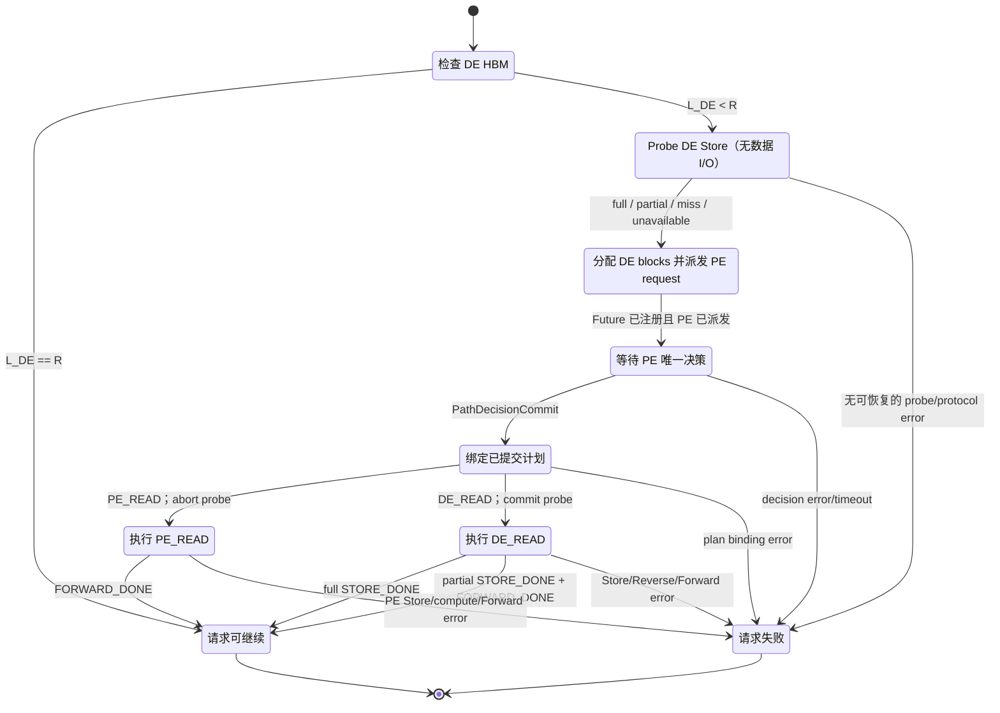
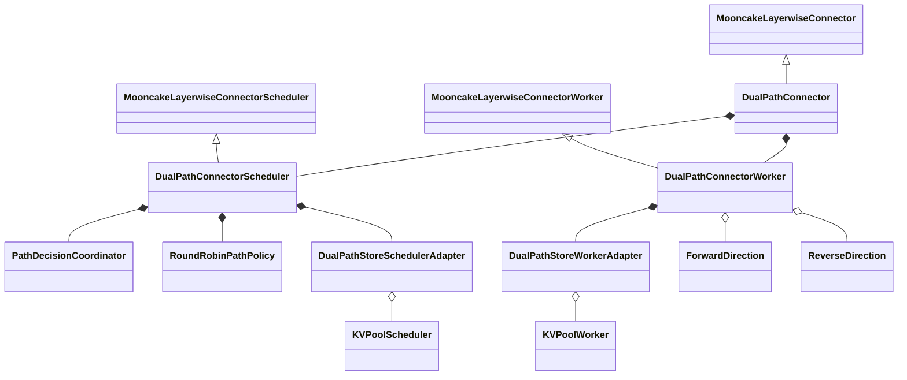
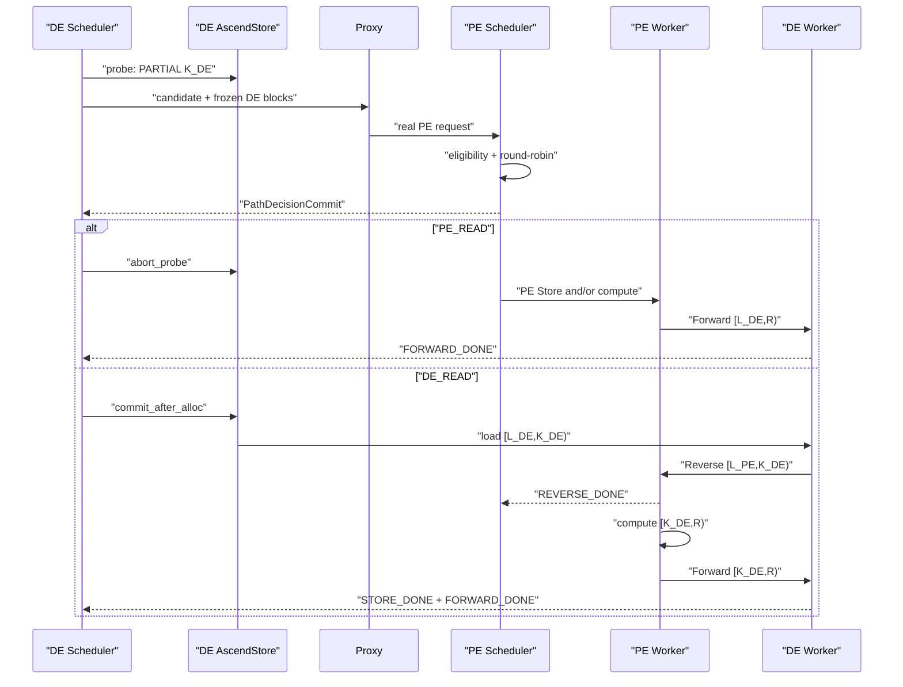

# DualPathConnector Stage 1 方案 A″ 详细开发设计

> **生命周期条款已于 2026-08-16 废止：** 本文保留为 Stage-1 历史设计记录。
> 下文所有 Decision deadline、timeout reason、timeout 环境变量和 watchdog
> 设计均由
> [ABORT 与 watchdog 移除决策](../../docs/superpowers/specs/2026-08-16-dual-path-abort-notification-and-watchdog-removal.md)
> 取代。当前运行时只接受显式 Decision、request-terminal ABORT 或带直接失败
> 证据的本地/Worker 失败，不再使用计时器兜底。

<!-- End of the 2026-08-16 supersession notice. -->

> 状态：PR-00 Foundation 已实现并达到 `LOCAL_READY`；PR-01 至 PR-07 尚待实现
> 方案：外层 `AscendMultiConnector` first-positive 编排，Prefill Scheduler 唯一提交路径
> 适用范围：当前 `dev/dualpath` 分支中的 vLLM Ascend 仓库
> 核心目标：以 Decode Store coverage 为候选事实，在 `PE_READ` 与 `DE_READ`
> 之间轮询，并分别复用/扩展 Mooncake Layerwise 数据面
> 互斥关系：不得与方案 B 的内部编排拓扑混合实现
> PR 与任务索引：`README.md`、`TRACKING.md`、`TASKS.md`

## 1. 文档目标

本文定义 DualPathConnector Stage 1 的最终架构合同。实现人员应能依据本文：

1. 区分 HBM readiness、AscendStore coverage、路径决策和数据完成四类事实；
2. 保证所有 `L_DE < R` 请求都创建真实 PE request，并由 PE Scheduler 在
   `PE_READ`/`DE_READ` 中提交唯一结果；
3. 在 Store Full 的 `DE_READ` 上只执行 DE Store load，在 Partial
   `DE_READ` 上执行 Store、Reverse、PE tail compute 和 Forward；
4. 在 `PE_READ` 上终止 Decode probe，继续 PE AscendStore/compute 与
   Forward；
5. 正确处理 token accounting、请求 ID、正式 KV blocks、异步完成、失败
   和资源回收；
6. 按 PR-00 至 PR-07 的独立 merge-state contract 渐进交付。

本文中的最终行为并不表示全部已经实现。当前实现状态必须以
`TRACKING.md` 的 revision-pinned 证据为准；本文件只定义 Stage 1 完成时的
架构语义。

## 2. 最终行为与非目标

### 2.1 最终执行结果

Stage 1 支持一个继承基线和两个显式路径：

1. **HBM complete baseline**：`L_DE == R`。Decode HBM 已拥有完整
   decode-ready prefix，沿用现有 vLLM Ascend/Mooncake Layerwise fast
   path；不执行 Store probe，也不进入 DualPath decision。
2. **`PE_READ`**：PE Scheduler 提交由 Prefill 准备缺失 KV。Decode
   abort 未提交的 Store probe；PE 外层 `AscendStoreConnector` 可以命中，
   否则 PE 正常计算；随后 Forward 将 `[L_DE, R)` 写回 DE。
3. **`DE_READ`**：PE Scheduler 提交由 Decode Store candidate 参与准备
   KV：
   - Store Full：DE bulk load `[L_DE, R)`，无 Reverse、PE compute 或
     Forward；
   - Store Partial：DE load `[L_DE, K_DE)`，Reverse 将 PE 缺失的已就绪
     prefix 写给 PE，PE 计算 `[K_DE, R)`，再 Forward 回 DE。

必须满足：

- Store coverage 只描述候选能力，不是最终路径；
- PE Scheduler 是所有非 HBM-complete 请求的唯一 path committer；
- eligibility 在 policy 前计算；
- 两条路径均可用时严格 round-robin；只有一条可用时直接选择且不推进
  counter；
- decision commit 和正式 block allocation 完成前，不启动 Store/P2P I/O；
- commit 后不隐式切路；
- 每个方向只发布请求级最终 DONE/FAILED；
- 必要操作失败后请求进入 `FINISHED_ERROR`。

### 2.2 Stage 1 非目标

Stage 1 不实现：

- Value Function、LinkMonitor 或负载反馈驱动的 active decision；
- shadow-mode 决策框架；
- weighted round-robin、adaptive routing 或 post-commit fallback；
- token striping、Store 逐层读取、Reverse/compute 跨层重叠；
- Relay staging 或额外中转 HBM；
- 独立 Scheduler ZMQ 控制通道或 Worker ZMQ 路径决策；
- 应用层 decision retry 或同一 request key 的第二次 transfer attempt；
- PP/DP 跨 stage/replica、TP mismatch、PCP/DCP、multi-group 或 hybrid
  KV layout。

## 3. 硬约束与代码边界

### 3.1 主要修改范围

```text
vllm_ascend/distributed/kv_transfer/kv_p2p/dual_path/
examples/disaggregated_prefill_v1/load_balance_proxy_layerwise_server_example.py
tests/ut/distributed/kv_transfer/dual_path/
tests/ut/distributed/kv_transfer/dual_path/test_dual_path_proxy.py
tests/e2e/.../dual_path/
.specs/dual-path-stage1/
```

唯一允许修改的既有数据面实现是：

```text
vllm_ascend/distributed/kv_transfer/kv_p2p/mooncake_layerwise_connector.py
```

该例外只用于 PR-02 的 protected helper 提取。普通
`MooncakeLayerwiseConnector` 的线程数、metadata、请求 mapping、传输区间、
回调顺序和 completion 语义必须保持不变。若需要修改
`AscendMultiConnector`、`AscendStoreConnector` 或父 facade 的公开 contract，
必须先返回设计评审。

### 3.2 继承与 runtime 所有权

公共类保持：

```python
class DualPathConnector(MooncakeLayerwiseConnector): ...
class DualPathConnectorScheduler(MooncakeLayerwiseConnectorScheduler): ...
class DualPathConnectorWorker(MooncakeLayerwiseConnectorWorker): ...
```

`DualPathConnectorWorker` 是唯一 Mooncake Layerwise Worker：

- 只执行一次父 Worker 初始化；
- 只注册一次正式 KV buffers；
- 最终只拥有一个 send thread 和一个 recv thread；
- Forward/Reverse 是同一 runtime 的两个逻辑方向；
- 不构造第二个完整 Worker/Connector，不临时改写 `kv_transfer_config`。

PR-02 从父 Worker 提取 protected startup、metadata binding、send
preparation 和 per-layer enqueue helper。PR-06 由子类 override capability 与
plan dispatch，在同一 runtime 中启用双向能力。

### 3.3 Store 组合与 KV 内存

DualPath 不在内部构造完整 `AscendStoreConnector`。Decode 侧按职责组合：

- `KVPoolScheduler`：lookup 和 load metadata；
- `KVPoolWorker`：Store 到正式 HBM blocks 的 bulk load；
- `LookupKeyServer`：仅在既有 KVPool 调用约束需要时创建。

PE Store load 仍由外层独立 `AscendStoreConnector` sibling 负责。

Store、Reverse 和 Forward 均直接访问模型最终使用的正式 KV blocks。禁止
Store/Reverse staging blocks 以及到正式 blocks 的二次复制。

### 3.4 请求事实容器

实现不增加通用生命周期框架。Scheduler-owned 事实由有类型的容器表达：

```python
pending_probes: dict[DualPathRequestKey, StoreProbeHandle]
pending_candidates: dict[DualPathRequestKey, PathDecisionRequest]
committed_decisions: dict[DualPathRequestKey, PathDecisionCommit]
terminal_requests: dict[DualPathRequestKey, TerminalRecord]
```

约束：

- 每个非 HBM-complete candidate 最终产生一个 commit 或显式 error；
- commit 后不得改成另一条路径；
- probe handle 必须且只能进入 committed 或 aborted 终态；
- terminal 后禁止启动新操作；
- transport drain 只负责资源安全，不改变请求终态。

`abort_probe(handle)` 的语义是丢弃 candidate 及 lookup 产生的临时 Store
状态。probe 阶段没有 Store load 或 P2P I/O，因此它不是取消已启动 I/O。

## 4. 现有组件事实与设计影响

### 4.1 AscendMultiConnector

Scheduler 侧保持配置顺序的 first-positive：

1. 依次查询 child 的 `get_num_new_matched_tokens()`；
2. 第一个返回正数的 child 成为 accounting winner；
3. 后续 child 仍可能被查询，但不能覆盖 winner；
4. `update_state_after_alloc()` 会把真实 blocks 传给 winner，也会传给所有
   `MooncakeLayerwiseConnector` 子类；
5. 得到真实 blocks 不等于赢得 accounting，也不授权数据面副作用。

因此 PE child 顺序必须为：

```text
DualPathConnector -> AscendStoreConnector
```

committed `DE_READ` 由 DualPath 返回正数并成为 winner；committed
`PE_READ` 返回 `(0, False)`，允许外层 Store 或普通 PE compute 继续。

### 4.2 MooncakeLayerwiseConnector

现有 Layerwise 数据面提供：

- Worker 初始化时一次性注册 KV buffers；
- 长期运行的 recv thread；
- sender 首次访问 peer 时通过 `GET_META_MSG` 获取并缓存远端地址/TE
  session；
- 每层 `batch_transfer_sync_write()` 直接写远端正式 blocks；
- 最后一层最后一个 chunk 后发送请求级 DONE/FAILED；
- receiver 维护请求级 done/failed，不提供逐层远端 ACK。

Stage 1 复用这些语义，不增加 request-level arm barrier 或逐层确认协议。

### 4.3 AscendStoreConnector

现有 AscendStore 将 Scheduler lookup 与 Worker bulk load 分离；
`load_async=True` 时 completion 由 `KVPoolWorker.get_finished()` 返回。
DualPath Decode adapter 只复用 lookup、metadata、bulk load 和 invalid-block
通道，不复用 Store save。

## 5. Token 与 coverage 模型

### 5.1 变量

设原始 prompt 长度为 `P`：

```text
R = max(P - 1, 0)
```

`R` 是 DE 第一次本地 forward 前必须具备的 decode-ready KV prefix。最后
一个 prompt token 仍由 DE 重算。

| 变量 | 含义 |
|---|---|
| `L_DE` | DE HBM 中连续可复用 token 数 |
| `L_PE` | PE HBM 中连续可复用 token 数 |
| `S_DE_raw` | DE Store probe 返回的绝对命中前缀 |
| `S_PE_raw` | PE 外层 Store lookup 返回的绝对命中前缀 |
| `G` | Store transfer granularity |
| `S_DE` | `min(floor(S_DE_raw / G) * G, R)` |
| `S_PE` | `min(floor(S_PE_raw / G) * G, R)` |
| `K_DE` | `min(max(L_DE, S_DE), R)` |
| `K_PE` | `min(max(L_PE, S_PE), R)` |
| `H_DE` | `max(K_DE - L_DE, 0)`，DE Store 新增加载量 |
| `H_PE` | `max(K_PE - L_PE, 0)`，PE Store 新增加载量 |
| `E_DE` | `max(R - L_DE, 0)`，DE 初始外部 KV 需求 |
| `A_DE` | `max(K_DE - L_PE, 0)`，`DE_READ` 在 PE 的 accounting |

Store coverage 分类：

```python
class StoreCoverageKind(str, Enum):
    MISS = "MISS"
    PARTIAL = "PARTIAL"
    FULL = "FULL"


class StoreProbeStatus(str, Enum):
    AVAILABLE = "AVAILABLE"
    UNAVAILABLE = "UNAVAILABLE"
```

- `L_DE == R`：HBM complete，跳过 probe；
- `K_DE == L_DE`：Store miss/unavailable；
- `L_DE < K_DE < R`：partial coverage；
- `L_DE < R and K_DE == R`：full coverage。

Full 仍只是 `DE_READ` 的 eligibility 输入，不能在 Decode 本地终结控制面。

### 5.2 StoreCoverage

```python
@dataclass(frozen=True)
class StoreCoverage:
    raw_hit_tokens: int
    aligned_hit_tokens: int
    local_tokens: int
    ready_prefix_tokens: int
    decode_ready_tokens: int
    store_load_tokens: int
    prefill_tail_tokens: int
    kind: StoreCoverageKind
    probe_status: StoreProbeStatus
    probe_error_code: str | None
```

`StoreCoverage` 只描述已验证、对齐和 clamp 后的能力，不表示 Store load 已
开始或完成。probe error 被规范化为
`kind=MISS, probe_status=UNAVAILABLE, store_load_tokens=0`，保留 typed
`probe_error_code` 供 eligibility、日志和测试使用，但不会使请求绕过 PE
decision。PE/DE coverage 和 local token 数不得互相复用。

### 5.3 示例

取 `P=17`、`R=16`、`G=4`、`L_DE=L_PE=4`、`S_DE_raw=11`、
`S_PE_raw=7`，则 `K_DE=8`、`H_DE=4`、`A_DE=4`。若 PE 提交
`DE_READ`：DE load `[4,8)`，Reverse `[4,8)`，PE compute/Forward
`[8,16)`。


所有逻辑区间均为左闭右开 `[a,b)`；物理传输保持 KV block 粒度。最后一个
block 的额外容量不增加 Scheduler accounting 或 `num_computed_tokens`。

### 5.4 Scheduler accounting

| Engine / committed path | DualPath 返回值 | 含义 |
|---|---:|---|
| DE / `L_DE == R` | `0` | 继承 HBM-ready baseline |
| DE / `L_DE < R`，decision 前 | `E_DE` | 分配最终 DE blocks 并进入 remote-KV 等待 |
| PE / `PE_READ` | `0` | DualPath 不赢；继续外层 Store/PE compute |
| PE / `DE_READ` | `A_DE` | DualPath 成为 first-positive winner |

`DE_READ` 只有在 `A_DE > 0` 时才 eligible。普通 Attention 的 PE model
request 保持完整 `P`；DualPath 不实现第二套 prompt 截断函数。

## 6. 请求身份

```python
@dataclass(frozen=True)
class DualPathRequestKey:
    de_engine_incarnation: str
    de_engine_local_request_id: str


@dataclass(frozen=True)
class DualPathTransferIds:
    request_key: DualPathRequestKey
    pe_engine_local_request_id: str
    forward_wire_external_id: str | None
    reverse_wire_external_id: str | None
```

约束：

- 所有 `L_DE < R` 请求都有真实 `pe_engine_local_request_id`；
- wire ID 仅在对应非空方向计划存在时派生；
- Forward/Reverse wire ID 不得相同；
- Proxy dispatch ID 和 Store request key 由各自子系统管理；
- `finished_*` 只能发布当前 Engine 的 local request ID；
- 同一 key 不支持第二次路径或传输尝试。

## 7. 路径模型与轮询策略

### 7.1 路径类型

```python
class PathKind(str, Enum):
    PE_READ = "PE_READ"
    DE_READ = "DE_READ"
```

coverage 与 path 是正交事实。不得再用“Decode 本地全命中”或“Decode
部分命中”作为最终路径枚举。

### 7.2 路径含义

| Path | Coverage | DE Store | Reverse | PE compute | Forward | DE 成功条件 |
|---|---|---|---|---|---|---|
| `PE_READ` | full/partial/miss | 无；probe abort | 无 | PE Store 未补齐时执行 | `[L_DE,R)` | `FORWARD_DONE` |
| `DE_READ` | full | `[L_DE,R)` | 无 | 无 | 无 | `STORE_DONE` |
| `DE_READ` | partial | `[L_DE,K_DE)` | `[L_PE,K_DE)` | `[K_DE,R)` | `[K_DE,R)` | `STORE_DONE && FORWARD_DONE` |

### 7.3 Eligibility

`PE_READ` eligible 条件：

- PE request 和 Forward baseline 可建立；
- topology/config/callback 校验通过；
- request 未 terminal。

`DE_READ` 共同条件：

- Decode probe handle 有效且 Store bulk load 可用；
- 正式 DE blocks 可以分配并冻结；
- `H_DE > 0` 且 `A_DE > 0`；
- 模型、dtype、block size、KV layout 和 TP rank mapping 一致。

分阶段激活：

- PR-04 仅允许 `StoreCoverageKind.FULL` 进入 `DE_READ` eligibility；
- PR-07 才允许满足 `L_DE < K_DE < R`、`L_PE < K_DE` 且双向 metadata
  可建立的 Partial candidate 进入 `DE_READ` eligibility；
- miss/unavailable 始终只有 `PE_READ` eligible。

### 7.4 Round-robin

```python
class RoundRobinPathPolicy:
    next_when_both: PathKind = PathKind.PE_READ

    def choose(self, eligible: frozenset[PathKind]) -> PathKind: ...
```

规则：

1. 先计算完整 eligible set；
2. set 为空：返回 typed decision error；
3. 只有一条：选择该路径，不修改 `next_when_both`；
4. 两条均可：选择 `next_when_both`，随后翻转到另一条；
5. counter 由 PE Scheduler policy instance 所有，Decode/Proxy 不维护副本；
6. duplicate request/commit 不得重复推进 counter。

固定初始值为 `PE_READ`，因此第一个 both-eligible 请求选 `PE_READ`，第二个
选 `DE_READ`，之后继续交替。

## 8. 路径决策协议

### 8.1 核心类型

```python
@dataclass(frozen=True)
class PathDecisionRequest:
    request_key: DualPathRequestKey
    de_store_coverage: StoreCoverage


@dataclass(frozen=True)
class PathDecisionCommit:
    request_key: DualPathRequestKey
    path: PathKind


@dataclass(frozen=True)
class PathDecisionError:
    request_key: DualPathRequestKey
    error_code: str
    message: str
```

不变量：

- full、partial、miss coverage 均可序列化为 request；
- Proxy 只路由、认证和执行 commit-once，不自行选路；
- identical commit 幂等，conflicting second commit 是协议错误；
- PE Scheduler 是唯一 `PathDecisionCommit` producer；
- decision request/commit 不携带可由不可信客户端指定的 callback 目标。

### 8.2 统一调用顺序

```text
HBM_CHECK -> PROBE -> ALLOCATE_AND_DISPATCH_CANDIDATE
          -> PE_DECISION_COMMIT -> DATA_START
```

1. DE 计算 `E_DE`；`E_DE == 0` 时使用继承 baseline；
2. `E_DE > 0` 时 DE Store adapter 只执行 metadata probe；
3. DE 按 `E_DE` 分配并冻结最终 blocks；
4. DE 通过 `dual_path_v1` envelope 把 coverage 与既有 Mooncake metadata
   发送给 Proxy；
5. Proxy 先注册 decision Future，再后台 dispatch 真实 PE model request；
6. PE Scheduler 计算 PE local tokens、eligible set，并执行 round-robin；
7. PE `PathDecisionCoordinator` 向 Proxy 提交唯一 commit；
8. Proxy resolve Future，把 commit 作为 `/v1/metaserver` response 返回 DE；
9. DE executor 只写 decision inbox；Scheduler thread drain 后保存 commit；
10. 两侧绑定冻结 plan，满足 local data-start gate 后执行 committed path。

任何 Store load、Reverse、DualPath Forward 或外层 Store side effect 都不得在
commit 前启动。Store Full 也必须执行步骤 3 至 9。

### 8.3 状态图



### 8.4 Proxy control-plane delta

沿用 Decode-first `/v1/metaserver` 调度，但增加提前 decision 回传：

```mermaid
sequenceDiagram
    participant DES as "DE Scheduler"
    participant DEC as "DE Coordinator"
    participant Proxy
    participant PE as "PE API / Scheduler"
    participant PEC as "PE Coordinator"

    DES->>DEC: "DE blocks + coverage candidate"
    DEC->>Proxy: "POST /v1/metaserver + PathDecisionRequest"
    Proxy->>Proxy: "register decision Future first"
    Proxy->>PE: "background Prefill model request"
    PE->>PE: "eligibility + round-robin"
    PE->>PEC: "unique PathDecisionCommit"
    PEC->>Proxy: "POST /v1/path-decision"
    Proxy-->>DEC: "/v1/metaserver response: commit"
    DEC-->>DES: "enqueue; Scheduler thread drains"
    PE-->>Proxy: "final HTTP response; release Prefill load"
```

兼容性要求：

- 没有 `control_protocol="dual_path_v1"`：完整执行现有 Layerwise 分支；
- 有该标记：Future 必须先注册、PE request 后 dispatch；
- Proxy 覆盖 callback URL，PE 只接受部署认证的 Proxy envelope；
- decision 返回不释放 Prefill 负载，最终 PE HTTP response 才释放；
- 普通和 DualPath 请求可并发，Future/record 不得串 key；
- PE request 对 Store-full `DE_READ` 仍存在，但在 commit 后以零 model
  compute、零 transfer 的方式结束。

Proxy 维护：

```python
decision_futures: dict[DualPathRequestKey, asyncio.Future[PathDecisionCommit]]
prefill_tasks: dict[DualPathRequestKey, asyncio.Task[None]]
decision_records: SizedDict[
    DualPathRequestKey,
    PathDecisionCommit | PathDecisionError,
]
```

### 8.5 Coordinator 与 data-start gate

HTTP I/O 由 `PathDecisionCoordinator` 的异步任务/executor 所有，不得阻塞
Scheduler 热路径。DE executor 只写线程安全 `decision_inbox`，只有
Scheduler thread 能修改 `committed_decisions` 和 `terminal_requests`。

```python
def can_start_data(
    committed: PathDecisionCommit | None,
    local_plan_ready: bool,
    blocks_allocated: bool,
    terminal: bool,
) -> bool:
    return (
        committed is not None
        and local_plan_ready
        and blocks_allocated
        and not terminal
    )
```

`PE_READ` 通过 gate 后执行 `abort_probe(handle)`；`DE_READ` 通过 gate 后执行
`commit_after_alloc(handle, ...)`。不得再定义绕开 commit 的 local-Store gate。

## 9. 类与职责

### 9.1 主要组合关系



### 9.2 Scheduler

Scheduler 负责：

- HBM readiness 与统一 `E_DE` accounting；
- Decode Store probe、coverage 和 handle ownership；
- PE eligibility、round-robin 和 first-positive accounting；
- candidate/commit/terminal containers；
- decision inbox drain；
- blocks、direction plan、inbound binding 冻结；
- probe commit/abort 与 request-finish cleanup。

Scheduler 不负责轮询 Worker thread、执行阻塞 HTTP 或维护第二套 TP barrier。

### 9.3 Worker

Worker 负责：

- 一次父 Worker 初始化和 KV cache registration；
- 绑定 step-local plans；
- 在 outbound gate 前安装本批全部 inbound mappings；
- 启动 committed Decode Store load；
- Store DONE 后逐层 Reverse；
- PE `save_kv_layer()` callback 中逐层 Forward；
- 收集 raw DONE/FAILED、映射 local request ID、发布 completion；
- invalid blocks、timeout、tombstone、drain 和 delayed-free。

### 9.4 Store adapter

```python
@dataclass(frozen=True)
class StoreProbeHandle:
    handle_id: str
    request_key: DualPathRequestKey
    coverage: StoreCoverage


class DualPathStoreSchedulerAdapter:
    def probe(self, request: Request, local_tokens: int) -> StoreProbeHandle: ...
    def abort_probe(self, handle: StoreProbeHandle) -> None: ...
    def commit_after_alloc(
        self,
        handle: StoreProbeHandle,
        request: Request,
        blocks: KVCacheBlocks,
        store_load_tokens: int,
    ) -> AscendConnectorMetadata: ...
```

`probe()` 不做 HBM I/O；`commit_after_alloc()` 只能在 `DE_READ` commit 与
正式 blocks 均已存在时调用；`abort_probe()` 只能用于未 commit handle。
每个 handle 的相同终态重复通知幂等，冲突终态 fail-fast。

现有 KVPool Scheduler lookup 会准备后续 load 所需的临时状态。PR-01 必须
把该状态原子地隔离到 handle，或提取最小 pure-lookup seam；不得把共享
`load_specs` 中的残留项当作“无副作用 probe”。同样，Worker 侧不能把 generic
finished request ID 直接解释为 `STORE_DONE`：PR-04 必须让 DONE/FAILED 与
invalid block IDs 具有同一 request provenance，必要时对现有 KVPool 做最小
completion seam 修正。

派生 Store config 固定：

```text
use_layerwise = false
load_async = true
consumer_is_to_load = true
consumer_is_to_put = false
```

## 10. 请求计划与 metadata

### 10.1 方向计划

```python
class TransferDirection(str, Enum):
    FORWARD = "FORWARD"
    REVERSE = "REVERSE"


@dataclass(frozen=True)
class BlockPair:
    local_block_id: int
    remote_block_id: int


@dataclass(frozen=True)
class LayerwiseDirectionPlan:
    direction: TransferDirection
    wire_external_id: str
    local_request_id: str
    token_start: int
    token_end: int
    block_pairs: tuple[tuple[BlockPair, ...], ...]
    remote_block_size: tuple[int, ...]
    remote_engine_id: str
    remote_host: str
    remote_port: int
    remote_tp_size: int
```

Scheduler 按 common physical block boundary 构造并冻结 `block_pairs`。Worker
不得重新 zip 两个 block 数组、按 token 数收窄或重排。

```python
@dataclass(frozen=True)
class InboundRequestBinding:
    direction: TransferDirection
    wire_external_id: str
    request_key: DualPathRequestKey
    engine_local_request_id: str
```

PE 安装 Reverse binding，DE 安装 Forward binding；没有对应方向的计划时不
伪造 wire ID 或 no-op plan。

### 10.2 Worker plan

```python
@dataclass(frozen=True)
class DualPathWorkerPlan:
    ids: DualPathTransferIds
    decision: PathDecisionCommit
    store_coverage: StoreCoverage
    store_metadata: AscendConnectorMetadata | None
    reverse: LayerwiseDirectionPlan | None
    forward: LayerwiseDirectionPlan | None
    inbound_bindings: tuple[InboundRequestBinding, ...]
```

合法组合：

| Engine / path | Store metadata | Reverse | Forward |
|---|---|---|---|
| DE / `PE_READ` | 无；probe aborted | 无 | receive |
| PE / `PE_READ` | 外层 sibling 自有 | 无 | send |
| DE / full `DE_READ` | 有 | 无 | 无 |
| PE / full `DE_READ` | 无 | 无 | 无 |
| DE / partial `DE_READ` | 有 | send | receive |
| PE / partial `DE_READ` | 无 | receive | send |

probe handle 只在 Scheduler 侧存在，不序列化到 Worker。

### 10.3 Worker batch ordering

一次 batch 必须分阶段：

```text
1. bind connector metadata
2. scan all plans and install every inbound mapping
3. reconcile pending raw completions
4. register receive state
5. evaluate outbound gates
6. execute zero-token connector step or model step
7. publish Engine-local completion
```

mapping-first 不构成跨 Engine ready barrier；跨批早到由 pending raw
completion 保证。

## 11. 数据依赖与物理范围

### 11.1 `PE_READ`

```text
PE_READ commit
  -> DE abort_probe(handle)
  -> PE DualPath returns (0, False)
  -> outer PE AscendStore may load; otherwise PE computes
  -> per-layer Forward [L_DE, R)
  -> request-level FORWARD_DONE
  -> DE recomputes final prompt token
```

即使 DE Store coverage 是 Full，`PE_READ` 也不读取 DE Store；coverage 仅是
已经被拒绝的 candidate 能力。

### 11.2 Store-full `DE_READ`

```text
DE_READ commit + final DE blocks
  -> commit_after_alloc(handle)
  -> bulk Store load [L_DE, R)
  -> STORE_DONE
  -> DE recomputes final prompt token
```

该计划不构造 Reverse/Forward metadata。PE request 是控制生命周期 carrier，
commit 后零 model token、零数据传输地结束。

### 11.3 Store-partial `DE_READ`

```text
DE_READ commit
  -> bulk Store load [L_DE, K_DE)
  -> STORE_DONE
  -> Reverse [L_PE, K_DE)
  -> request-level REVERSE_DONE
  -> PE compute [K_DE, R)
  -> per-layer Forward [K_DE, R)
  -> request-level FORWARD_DONE
```

PE 必须等待完整 Reverse request completion 后执行 model。Reverse/Forward
保持逐层写，但远端只发布 request-level terminal。Forward sender 维护单调
transferred frontier，不能重复发送已完成 block。

### 11.4 物理写入表

| Path | DE Store writes | Reverse reads/writes | Forward writes DE |
|---|---|---|---|
| `PE_READ` | 无 | 无 | `[L_DE,R)` |
| full `DE_READ` | `[L_DE,R)` | 无 | 无 |
| partial `DE_READ` | `[L_DE,K_DE)` | `[L_PE,K_DE)` | `[K_DE,R)` |

所有区间必须映射成明确、非重叠的 frozen block pairs。空方向不构造 plan。

## 12. 完成、raw terminal 与 block 生命周期

### 12.1 成功谓词

```python
@dataclass
class RequestCompletionFacts:
    store_done: bool = False
    reverse_done: bool = False
    forward_done: bool = False
    failed: bool = False
    error_code: str | None = None


def de_receive_succeeded(
    decision: PathDecisionCommit,
    coverage: StoreCoverage,
    facts: RequestCompletionFacts,
) -> bool:
    if decision.path is PathKind.PE_READ:
        return facts.forward_done and not facts.failed
    if coverage.kind is StoreCoverageKind.FULL:
        return facts.store_done and not facts.failed
    if coverage.kind is StoreCoverageKind.PARTIAL:
        return facts.store_done and facts.forward_done and not facts.failed
    raise AssertionError((decision, coverage))
```

PE partial `DE_READ` 的 remote-KV 成功条件是 `reverse_done`。full
`DE_READ` 的 PE request 不发布伪造的 receive completion。

### 12.2 `finished_recving`

| Engine / path | 发布条件 |
|---|---|
| DE / `PE_READ` | Forward DONE |
| DE / full `DE_READ` | Store DONE |
| PE / partial `DE_READ` | Reverse DONE |
| DE / partial `DE_READ` | Store DONE 且 Forward DONE |

failed block IDs 不晚于 failed receive terminal。`finished_sending` 只用于父
Mooncake delayed-free：sender 完成最后一次 source-block 读取后，框架才可
释放被延迟持有的 blocks。

### 12.3 raw completion 早到

recv thread 可能在 local mapping 安装前收到 wire terminal。Worker 保留：

```python
@dataclass(frozen=True)
class PendingRawCompletion:
    direction: TransferDirection
    kind: Literal["DONE", "FAILED"]
    first_seen_monotonic: float


@dataclass(frozen=True)
class TerminalWireRecord:
    direction: TransferDirection
    kind: Literal["DONE", "FAILED"]
    engine_local_request_id: str
    published_at_monotonic: float
```

每次 `get_finished()`：

1. 合并 recv thread 新 terminal；
2. mapping 已存在时发布一次 Engine-local completion；
3. mapping 未存在时继续保留；
4. identical duplicate 幂等；DONE/FAILED 冲突报协议错误；
5. 发布后 active mapping 转为 terminal tombstone；
6. tombstone 保留到 cleanup 且超过 sender retry window；
7. orphan 超过 `path_execution_timeout + transport_retry_slack` 后回收并告警。

### 12.4 block 生命周期

- decision 前可分配/冻结 blocks，但不得启动 Store/P2P；
- Store load 完成前不得读取 Store target；
- Reverse DONE 前 PE 不执行 tail model；
- Forward DONE 前 DE 不解除 remote-KV 等待；
- terminal/cancel 后禁止新 task；
- 已提交 transport 使用的 source/destination blocks 保持有效，直到成功、
  失败或 timeout 后确认 quiesced；
- 失败计划涉及的目标 blocks 整体 invalid；
- transport drain 中迟到 terminal 只更新 tombstone，不恢复请求。

## 13. 关键时序

### 13.1 Store Full：由 PE 决定 `PE_READ` 或 `DE_READ`

```mermaid
sequenceDiagram
    participant DES as "DE Scheduler"
    participant Store as "DE AscendStore"
    participant Proxy
    participant PES as "PE Scheduler"
    participant PEStore as "PE AscendStore"
    participant PEW as "PE Worker"
    participant DEW as "DE Worker"

    DES->>Store: "probe only"
    Store-->>DES: "FULL coverage + handle"
    DES->>DES: "allocate/freeze DE blocks"
    DES->>Proxy: "candidate FULL + DE metadata"
    Proxy->>PES: "real PE request"
    PES->>PES: "eligible={PE_READ, DE_READ}; round-robin"
    PES-->>DES: "PathDecisionCommit"
    alt "PE_READ"
        DES->>Store: "abort_probe(handle)"
        PES->>PEStore: "outer Store lookup/load or miss"
        opt "PE Store cannot cover"
            PES->>PEW: "PE compute"
        end
        loop "each layer"
            PEW->>DEW: "Forward [L_DE,R)"
        end
        DEW-->>DES: "FORWARD_DONE"
    else "DE_READ"
        DES->>Store: "commit_after_alloc(handle)"
        Store->>DEW: "bulk load [L_DE,R)"
        DEW-->>DES: "STORE_DONE"
        PES->>PES: "complete PE request without model/transfer"
    end
```

### 13.2 Store Partial：最终 Stage 1



## 14. 配置、激活与拓扑

### 14.1 最终 PE/DE 拓扑

PE：

```text
AscendMultiConnector
├── DualPathConnector
└── AscendStoreConnector
```

DE：

```text
DualPathConnector
```

配置中的业务 role 只使用 `prefill`/`decode`，不使用 `pe`/`de` literal。
协议说明和公式仍可使用 PE/DE 缩写。

### 14.2 激活门槛

- PR-01/PR-02/PR-03 合入后 production active config 必须 fail-closed；
- PR-04 首次允许 production opt-in，只激活 full coverage 的 round-robin；
- PR-05/PR-06 不扩大 selector reachability；
- PR-07 通过完整 NPU matrix 后才激活 partial `DE_READ`；
- 任一中间 PR 不得通过 hidden flag 暴露未闭合数据消费者。

最终 active config 不包含 Value Function、LinkMonitor、shadow decision、
Worker decision ZMQ、relay 或 multi-path slicing 字段。

### 14.3 fail-fast topology

- `pipeline_parallel_size == 1`；
- `data_parallel_size == 1`；
- PE/DE `tensor_parallel_size` 相同且 rank 一一对应；
- 单 KV cache group、普通 Attention layout；
- PCP/DCP 关闭；
- PE/DE 模型、dtype、block size 和 KV layout 相同；
- Proxy 支持 `dual_path_v1`、`/v1/path-decision` 和 commit response。

## 15. 失败、取消与幂等

### 15.1 错误分类

```python
class DualPathErrorCode(str, Enum):
    CONFIGURATION_ERROR = "CONFIGURATION_ERROR"
    DECISION_PROTOCOL_ERROR = "DECISION_PROTOCOL_ERROR"
    DECISION_TIMEOUT = "DECISION_TIMEOUT"
    PE_REQUEST_ERROR = "PE_REQUEST_ERROR"
    PATH_EXECUTION_TIMEOUT = "PATH_EXECUTION_TIMEOUT"
    STORE_LOOKUP_ERROR = "STORE_LOOKUP_ERROR"
    STORE_LOAD_ERROR = "STORE_LOAD_ERROR"
    REVERSE_TRANSFER_ERROR = "REVERSE_TRANSFER_ERROR"
    FORWARD_TRANSFER_ERROR = "FORWARD_TRANSFER_ERROR"
    TOPOLOGY_MISMATCH = "TOPOLOGY_MISMATCH"
```

规则：

- probe miss/unavailable 形成 coverage fact；若 `PE_READ` 可用则正常选路；
- malformed coverage、无 eligible path、Proxy dispatch/decision timeout 失败；
- commit 前 PE request 失败，Proxy resolve typed decision error；
- commit 后 Store/Reverse/Forward/PE model 失败，不切路；
- full `DE_READ` Store failure 不恢复为 `PE_READ`；
- `PE_READ` 的 PE Store failure遵循现有 failure policy，不回到 DE Store；
- duplicate identical completion/commit 幂等；identity/direction/path 冲突报错。

### 15.2 失败终止顺序

1. 将 key 写入 `terminal_requests`；
2. 禁止新 Store/P2P/model task；
3. abort 未 commit probe；
4. 收集并发布 invalid target blocks；
5. 已提交数据面等待 terminal 或 deadline 并确认 transport quiesced；
6. 发布 Engine-local failed receive terminal；
7. framework 结束请求并释放 blocks；
8. active mapping 转 tombstone；超过 retry window 后删除。

### 15.3 cancel/shutdown

- pending probe/candidate：abort probe，取消 Future/后台 task；
- committed 未启动：禁止 plan start，保留终态事实；
- 已启动：停止提交新任务，保留 transport 使用的 blocks 直到 drain；
- shutdown：停止新 candidate，abort pending handles，drain sender，关闭
  Store adapter，最后关闭唯一父 Mooncake runtime。

必须保证 candidate、commit、handle terminal、Store load、Reverse plan、
Forward chunk frontier 和 request terminal 都满足 exactly-once 或 identical
duplicate idempotency。

## 16. 代码布局

```text
vllm_ascend/distributed/kv_transfer/kv_p2p/
├── mooncake_layerwise_connector.py       # PR-02 仅 helper 提取
└── dual_path/
    ├── __init__.py
    ├── connector.py
    ├── config.py
    ├── control_plane.py
    ├── metadata.py
    ├── path_decision.py
    ├── store_adapter.py
    └── layerwise_transfer.py
```

| 文件 | 职责 |
|---|---|
| `connector.py` | facade、Scheduler/Worker hooks 与 metadata dispatch |
| `config.py` | active config、activation gate 和 topology fail-fast |
| `control_plane.py` | Coordinator async RPC、DE inbox、Proxy schema |
| `metadata.py` | identity、coverage、decision、plan、completion facts |
| `path_decision.py` | eligibility、round-robin、commit-once、accounting |
| `store_adapter.py` | Decode KVPool probe/commit/abort/load |
| `layerwise_transfer.py` | Forward/Reverse conversion、gate、raw terminal、tombstone |

## 17. PR 交付顺序

| PR | Merge 后新增能力 | 明确不能做的事 |
|---|---|---|
| PR-00 Foundation | connector/config/schema 骨架，`LOCAL_READY` | 无 Store/decision/data behavior |
| PR-01 Coverage | side-effect-free probe 与 handle cleanup | 不 commit Store，不选路 |
| PR-02 Parent Refactor | helper extraction + parity | 不启用双向 runtime |
| PR-03 Control Plane | real PE request、round-robin commit 闭环 | active config fail-closed，无 I/O |
| PR-04 Full Activation | full `PE_READ`/`DE_READ` vertical slice | partial 只能 `PE_READ` |
| PR-05 Forward | explicit frozen Forward plan/completion | 不激活 partial |
| PR-06 Bidirectional | shared runtime、Reverse、lifecycle；injected plans only | production partial unreachable |
| PR-07 Partial Activation | partial round-robin 与完整 Stage 1 | 不扩展 Stage 2 拓扑 |

任务分解的唯一来源是 `TASKS.md`；各 PR 的 merge boundary 以 `prs/PR-*.md`
为准。不得把后续 PR 的行为提前塞入前置 PR。

## 18. 测试与验收

### 18.1 Coverage 与 decision

- `L_DE == R` 跳过 probe/Proxy；
- full/partial/miss 对齐与 clamp；probe 零 HBM/P2P side effect；
- full coverage 仍创建 PE request 并到达 PE Scheduler；
- 两条 eligible 时严格交替；单条 eligible 不推进 counter；
- duplicate request/commit 不重复推进 counter；
- callback security、Future-before-dispatch、timeout、PE-before-commit failure；
- ordinary Layerwise 与 DualPath 并发不串 Future。

### 18.2 数据面与 completion

- full `PE_READ`：Decode Store 零 load，PE Store/compute + Forward；
- full `DE_READ`：仅 DE Store load，Reverse/compute/Forward 均为零；
- partial `PE_READ`：abort probe，Forward `[L_DE,R)`；
- partial `DE_READ`：Store、Reverse、compute、Forward 精确区间；
- commit 前 Store/P2P 调用数为零；
- mapping-first、raw terminal 早到、duplicate/conflict、orphan expiry；
- Store/Reverse/Forward/model failure、invalid blocks、timeout、no fallback；
- cancel/shutdown 在 quiesced 前不复用 blocks；
- 普通 Layerwise helper-extraction parity。

### 18.3 NPU E2E matrix

1. full coverage -> `PE_READ`；
2. full coverage -> `DE_READ`；
3. partial coverage -> `PE_READ`；
4. partial coverage -> `DE_READ`；
5. PE Store hit/miss 和正常 PE compute；
6. Store/Reverse/Forward/TP-rank failure；
7. raw completion 早到与 previous-batch poll；
8. duplicate terminal、orphan timeout、cancel/shutdown drain。

每个成功场景验证 output tokens、path、accounting、物理区间、terminal 和无
block 泄漏；每个失败场景验证 provenance、invalid blocks、no fallback 和
resource drain。

### 18.4 可观测性

日志至少包含：

```text
de_engine_incarnation
de_engine_local_request_id
pe_engine_local_request_id
path
eligible_paths
store_coverage_kind
raw_hit_tokens
aligned_hit_tokens
store_load_tokens
reverse_tokens
forward_tokens
store_done
reverse_done
forward_done
error_code
```

指标至少包含：path 选择数、single/both-eligible 决策数、coverage 分类、
Store probe/load latency、decision/Reverse/Forward latency、Proxy timeout、
post-commit failure、pending raw/tombstone/orphan 和 conflicting terminal。

### 18.5 Stage 1 acceptance checklist

- [ ] PR-00 revision 和测试证据固定为 prerequisite；
- [ ] coverage 与 path 是不同类型；
- [ ] `PathKind` 只有 `PE_READ`/`DE_READ`；
- [ ] 所有 `L_DE < R` 请求创建真实 PE request；
- [ ] Store Full 不绕过 PE Scheduler；
- [ ] eligibility-before-policy 与 single-path-no-advance 已验证；
- [ ] commit 和 allocation 前无 Store/P2P I/O；
- [ ] `PE_READ` abort probe 并允许外层 PE Store/compute；
- [ ] full `DE_READ` 只有 Store load；
- [ ] partial `DE_READ` 区间和完成谓词正确；
- [ ] 普通 Layerwise/AscendStore/MultiConnector 行为无回归；
- [ ] 一个 Worker runtime、一次 buffer registration、每侧一 send/recv；
- [ ] raw completion、tombstone、orphan 和 delayed-free 语义完整；
- [ ] failure 不切路且进入 `FINISHED_ERROR`；
- [ ] unsupported topology fail-fast；
- [ ] PR-04 与 PR-07 activation gate 分别通过所需 NPU 证据。
