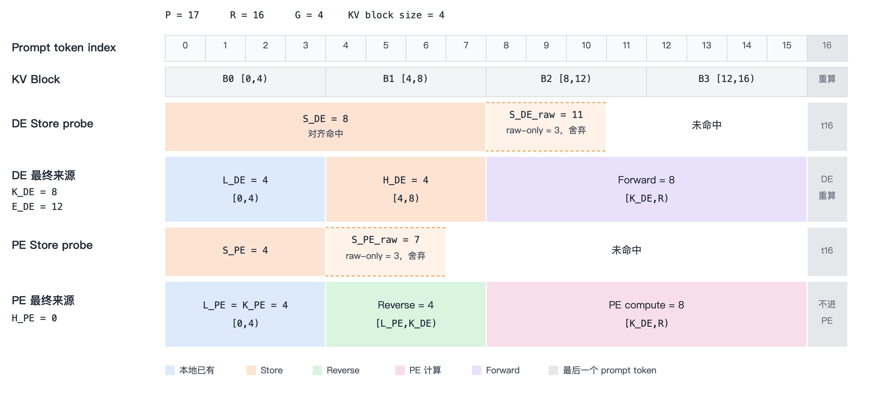
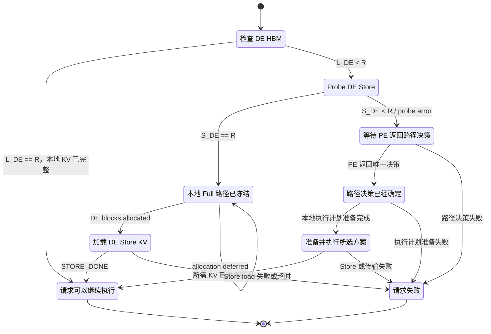
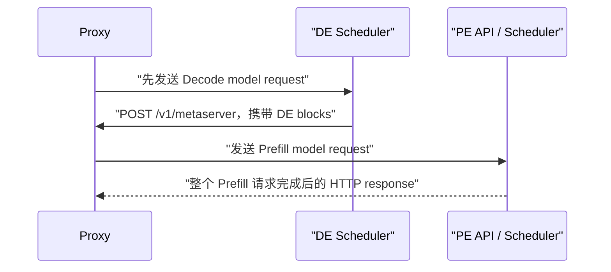
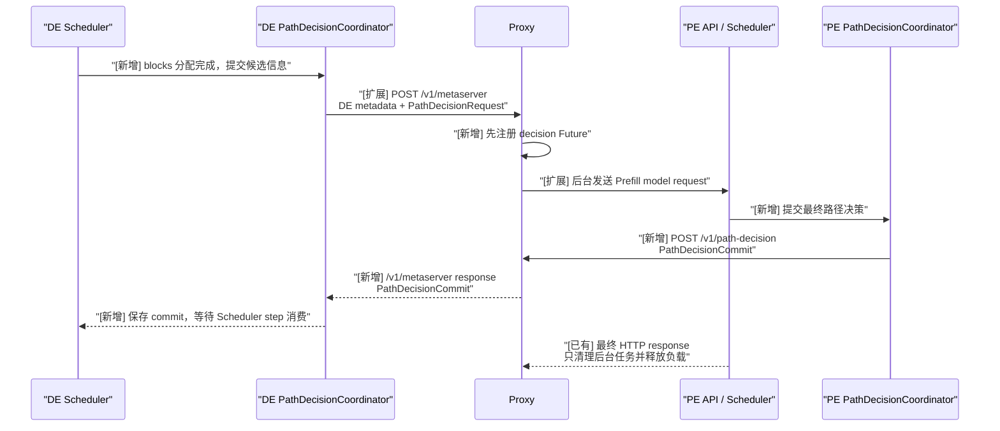
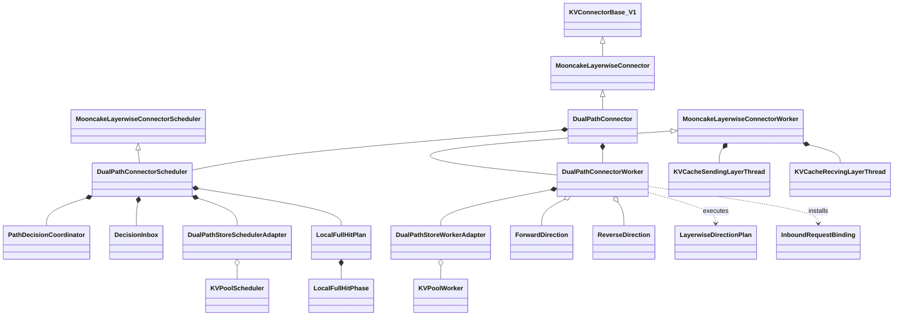
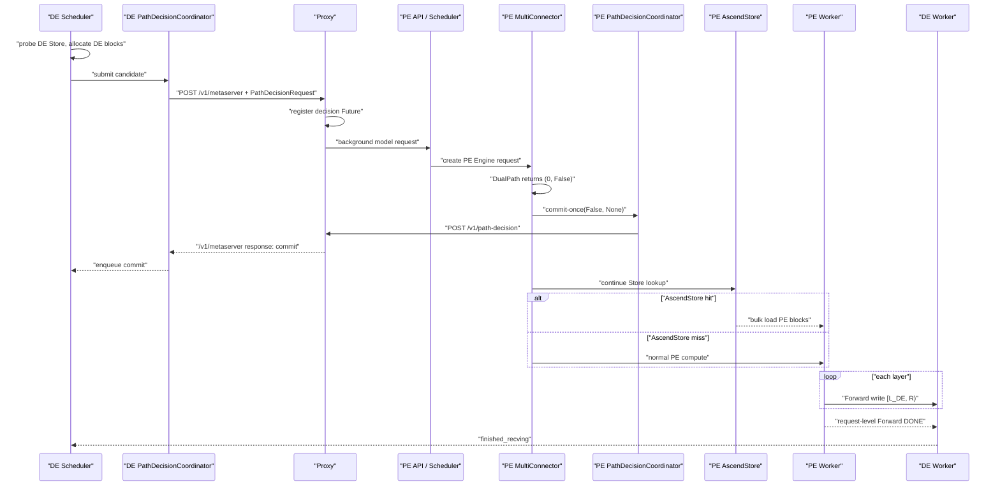
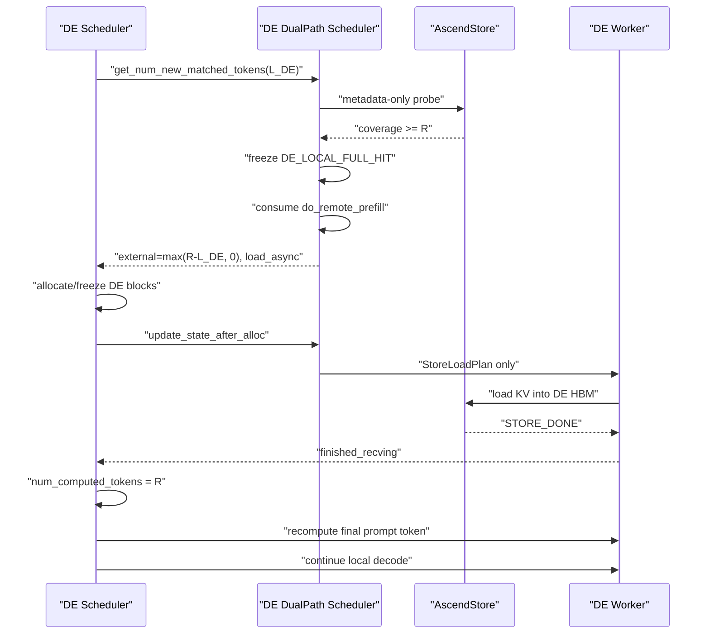
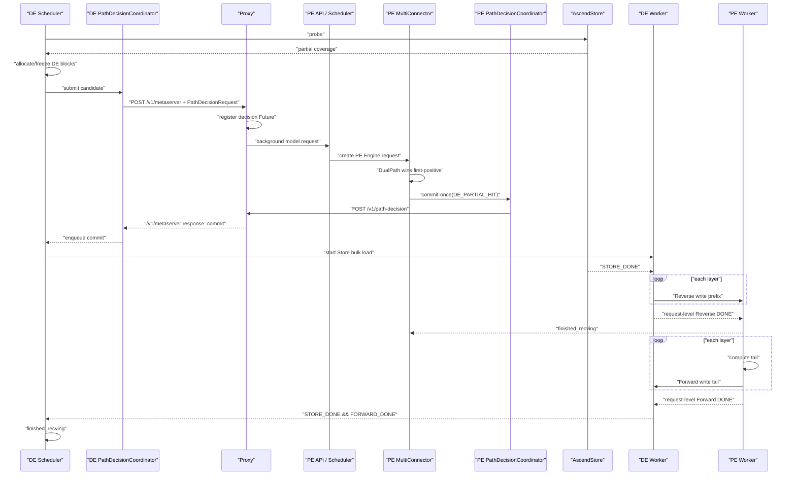

# DualPathConnector Stage 1 方案 A″ 详细开发设计

> 状态：独立设计评审稿，尚未进入实现
> 方案：外层 `AscendMultiConnector` first-positive 编排
> 适用范围：当前 `dev/dualpath` 分支中的 vLLM Ascend 仓库
> 核心目标：打通外层 AscendStore 路径、`DE_LOCAL_FULL_HIT` 与
> `DE_PARTIAL_HIT`
> 互斥关系：不得与方案 B 的内部编排拓扑混合实现
> 总览索引：`2026-07-23-dual-path-connector-stage1-detailed-design.md`

## 1. 文档目标

本文定义 DualPathConnector Stage 1 方案 A″ 的可实施开发设计。实现人员
应能依据本文：

1. 确定 Connector、Scheduler、Worker、Store adapter 和 Proxy 控制面的
   边界；
2. 实现 DE 本地 Full admission 与 PE 唯一提交的跨 Engine DualPath 决策；
3. 复用一套 Mooncake Layerwise runtime 完成 Forward 和 Reverse；
4. 正确处理 token accounting、请求 ID、正式 KV blocks 和异步完成；
5. 编写覆盖 DE 本地 Full、外层 AscendStore、跨 Engine DualPath 及失败
   路径的测试。

本文中的内容分为：

- **已确认决策**：评审已达成一致，实现不得自行改变；
- **现有代码事实**：来自当前分支和当前 vLLM Connector 契约；
- **Stage 1 限制**：为控制首阶段风险主动收窄的能力。

本文是工作设计，不表示对应数据面已经实现或验证。

## 2. 目标与非目标

### 2.1 Stage 1 目标

Stage 1 支持三种最终执行结果：

1. **DualPath 未采用**：PE 外层 `AscendStoreConnector` 可被选中；若它也
   未命中，则 PE 正常计算。PE 随后通过 Forward 把 DE 缺失的完整
   decode-ready KV 写回 DE。
2. **`DE_LOCAL_FULL_HIT`**：DE 本地 HBM 与 AscendStore coverage 足以
   准备完整 decode-ready prefix。DE 在 Connector admission 阶段冻结本地
   路径，直接把 Store KV 加载到正式 HBM blocks，再重算最后一个 prompt
   token；不访问 Proxy decision rendezvous，不创建 PE request。
3. **`DE_PARTIAL_HIT`**：DE 从 AscendStore 加载命中前缀，通过 Reverse
   写入 PE；PE 计算尾部，再通过 Forward 写回 DE。

同时必须满足：

- 路径策略静态、确定；
- PE 是所有跨 PE/DE DualPath decision 的唯一提交方；
- DE local Full Store load 只能在本地路径冻结并完成 block allocation 后
  启动；
- Reverse、Forward 和 partial Store load 只能在 PE commit 后启动；
- Mooncake 数据传输保持逐层；
- 每个方向只发布请求级最终 DONE/FAILED；
- 已提交路径的必要操作失败后，请求进入 `FINISHED_ERROR`；
- 失败后不隐式切路。

### 2.2 Stage 1 非目标

Stage 1 不实现：

- Value Function 驱动的 active 自动选路；
- LinkMonitor 驱动的运行时切路；
- post-commit fallback 或局部恢复；
- token striping；
- Store 逐层读取；
- Reverse 与 PE compute 的跨层重叠；
- Relay staging 或额外中转 HBM；
- 独立的 Scheduler ZMQ 控制通道；
- Worker ZMQ 承担路径决策；
- 应用层 decision 重试协议；
- 请求级多次 transfer attempt；
- 跨 PP stage 或 DP replica 的 DualPath；
- 修改现有 `AscendMultiConnector`、`AscendStoreConnector`、
  `MooncakeLayerwiseConnector` 或上游 vLLM。

Value Function 与 LinkMonitor 可以继续作为 shadow 观测，但不得改变
Stage 1 active decision。

## 3. 已确认的硬约束

### 3.1 代码修改边界

实现范围限定在：

```text
vllm_ascend/distributed/kv_transfer/kv_p2p/dual_path/
examples/disaggregated_prefill_v1/load_balance_proxy_layerwise_server_example.py
tests/ut/distributed/kv_transfer/dual_path/
tests/ut/distributed/kv_transfer/dual_path/test_dual_path_proxy.py
tests/e2e/.../dual_path/
docs/
```

允许复用公开接口和现有类，不修改既有 Connector 源码。Proxy 只允许增加
由 `control_protocol="dual_path_v1"` 显式启用的控制面分支；未携带该标记
的普通 MooncakeLayerwise 请求必须保持现有 `/v1/metaserver` 行为不变。

### 3.2 继承与 runtime 所有权

公共类保持：

```python
class DualPathConnector(MooncakeLayerwiseConnector):
    ...


class DualPathConnectorScheduler(MooncakeLayerwiseConnectorScheduler):
    ...


class DualPathConnectorWorker(MooncakeLayerwiseConnectorWorker):
    ...
```

`DualPathConnectorWorker` 本身就是唯一的 Mooncake Layerwise Worker：

- 只执行一次父 Worker 初始化；
- 只注册一次正式 KV buffers；
- 只启动一个 send thread；
- 只启动一个 recv thread；
- Forward 和 Reverse 是对这组线程的两个逻辑方向；
- 不嵌套第二个完整 Mooncake Worker 或 Connector。

为解除父 Worker 内部“静态 producer/consumer 只能选择一个方向”的实现
限制，Stage 1 会修改
`MooncakeLayerwiseConnectorWorker` 源码，但修改严格限于无行为变化的
protected helper 提取：

```python
def _needs_send_thread(self) -> bool: ...
def _needs_receive_thread(self) -> bool: ...
def _ensure_send_thread_started(self) -> None: ...
def _ensure_receive_thread_started(self) -> None: ...
def _bind_receive_metadata(
    self, metadata: MooncakeLayerwiseConnectorMetadata
) -> None: ...
def _prepare_send_metadata(
    self, metadata: MooncakeLayerwiseConnectorMetadata
) -> None: ...
def _enqueue_send_layer(
    self,
    layer_name: str,
    kv_layer: list[torch.Tensor],
    attn_metadata: AttentionMetadata | None,
    metadata: MooncakeLayerwiseConnectorMetadata,
) -> None: ...
```

原 `MooncakeLayerwiseConnector` facade、metadata contract 和
producer/consumer 可见行为保持不变。父 Worker 仍按原静态 role 启动一个
方向；`DualPathConnectorWorker` 只 override capability 和 plan dispatch，
从而在同一个 runtime 中启用 send/receive 两种能力。不得通过复制整段父
Worker、临时改写 `kv_transfer_config` 或构造第二个 Worker 实现双向。

### 3.3 Store 组合边界

DualPath 内部不创建完整 `AscendStoreConnector`。DE 侧只按职责组合：

- `KVPoolScheduler`：Store lookup 和 load metadata；
- `KVPoolWorker`：Store 到正式 HBM KV blocks 的 bulk load；
- `LookupKeyServer`：仅在现有 KVPool 调用约束要求时创建。

PE Store load 仍由外层独立 `AscendStoreConnector` sibling 负责。

### 3.4 KV 内存边界

Store、Reverse 和 Forward 均直接访问模型最终使用的正式 KV blocks。

禁止：

- Store 专属 staging blocks；
- Reverse staging blocks；
- 从中转区到正式 blocks 的二次复制。

安全性由严格的操作顺序、互不重叠的 token 区间和框架请求生命周期保证，
不增加一套独立 block owner 状态机。

### 3.5 生命周期表达

实现不定义通用生命周期枚举或状态转移表。请求事实由有类型的容器表达：

```python
pending_candidates: dict[DualPathRequestKey, PathDecisionRequest]
committed_decisions: dict[DualPathRequestKey, PathDecisionCommit]
local_full_plans: dict[DualPathRequestKey, LocalFullHitPlan]
terminal_requests: dict[DualPathRequestKey, TerminalRecord]
```

约束：

- candidate 被接受或拒绝时都产生唯一 commit；
- commit 后不得改成另一种结果；
- `DE_LOCAL_FULL_HIT` 不创建 candidate/commit，本地路径一经冻结不得转成
  远端路径；
- terminal 后禁止启动新操作；
- transport drain 只负责资源安全，不改变请求终态。

## 4. 现有组件事实与设计影响

### 4.1 AscendMultiConnector

Scheduler 侧仍是配置顺序的 first-positive：

1. 依次调用 child 的 `get_num_new_matched_tokens()`；
2. 第一个返回正数的 child 成为 Scheduler accounting winner；
3. 后续 child 仍可能被查询，但不能覆盖 winner；
4. `AscendMultiConnector.update_state_after_alloc()` 会把真实 blocks 传给
   winner，也会传给所有 `MooncakeLayerwiseConnector` 子类；
5. 真实 blocks 传递不代表该 child 赢得 accounting，也不授权数据面副作用。

因此 PE 上 DualPath 必须排在 `AscendStoreConnector` 前面，并以 commit
作为 PE Store/Reverse/Forward 副作用的 gate。DE 本地 Full 不依赖 sibling
组合：Store probe/load 由 `DualPathConnectorScheduler` 内部 adapter
拥有，避免 Layerwise real-block dispatch 误启动远端 Prefill。

### 4.2 MooncakeLayerwiseConnector

现有 Mooncake Layerwise 数据面是单边写：

- KV buffers 在 Worker 初始化阶段注册一次；
- recv thread 初始化后长期监听；
- sender 首次访问目标 peer 时通过 `GET_META_MSG` 获取远端地址和 TE
  session，随后缓存；
- 每层由 sender 调用 `batch_transfer_sync_write()` 写入远端正式 blocks；
- sender 在最后一层且最后一个 chunk 完成后发送请求级 DONE/FAILED；
- receiver 只维护请求级 done/failed 集合，不提供逐层远端完成事件。

Stage 1 必须复用这一语义，不额外增加请求级 arm barrier 或逐层 ACK。

复用需要一次父 Worker 内部重构：线程构造、receive binding、send
preparation 和 per-layer send enqueue 从当前静态 role 分支提取成
protected helper。该重构会修改
`mooncake_layerwise_connector.py`，但不得改变普通 Layerwise 的线程数、
请求 mapping、传输区间、回调顺序或 completion 语义；这些行为必须由回归
测试锁定。

### 4.3 AscendStoreConnector

现有 AscendStore：

- Scheduler lookup 与 Worker load 分离；
- load 是 request-level bulk load；
- `load_async=True` 时，完成通过
  `KVPoolWorker.get_finished(finished_req_ids, metadata)` 返回；
- `loading_req_ids` 决定哪些 Store receive completion 可以被公开；
- 内部 Store save 的 delayed-free/WorkerMetadata 逻辑与 Stage 1 DE read
  无关。

DE Store adapter 只复用 lookup、metadata 和 bulk load，不复用内部 save。

### 4.4 最后一个 prompt token

设原始 prompt 长度为 `P`：

```text
R = max(P - 1, 0)
```

`R` 是 DE 第一次本地 forward 前必须具备的 decode-ready KV prefix。

- Store coverage 最大只计到 `R`；
- 普通 Attention 的 PE model request 保持完整 `P`，DualPath 不实现第二套
  prompt 截断函数；
- Attention+Mamba hybrid 是否裁剪继续完全沿用父
  `MooncakeLayerwiseConnector` 的既有处理；
- DualPath 的 Scheduler accounting 和逻辑 Forward 有效区间只计到 `R`；
- `DE_LOCAL_FULL_HIT` 在 DE 设置 `num_computed_tokens = R` 后重算最后一个
  prompt token。

现有普通 Attention MooncakeLayerwise 会传输覆盖完整 `P` 的 KV；vLLM 在
远端完整命中完成后，再把 `num_computed_tokens` 从 `P` 回退到 `P - 1`
以重新计算最后一个 token。Stage 1 保留相同的 DE 可见语义，但不要求
DualPath 额外传输不会被 DE 采用的最后一个 token KV。

传输仍以 KV block 为物理粒度。最后一个 block 可能包含 `R` 之外的容量，
但这些字节不增加 Store coverage、Scheduler accounting 或
`num_computed_tokens`。

## 5. 统一术语与 token accounting

### 5.1 角色

| 简写 | 含义 |
|---|---|
| PE | Prefill Engine |
| DE | Decode Engine |
| Store | AscendStore backend |
| Forward | PE 到 DE 的 Mooncake Layerwise 写入 |
| Reverse | DE 到 PE 的 Mooncake Layerwise 写入 |

### 5.2 Token 变量

| 变量 | 含义 |
|---|---|
| `P` | 原始 prompt token 数 |
| `R` | `max(P - 1, 0)` |
| `L_DE` | DE 已拥有的连续可复用 token 数 |
| `L_PE` | PE 已拥有的连续可复用 token 数 |
| `S_DE_raw` | DE Store probe 返回的绝对命中前缀 |
| `S_PE_raw` | PE 外层 Store lookup 返回的绝对命中前缀 |
| `G` | Store transfer granularity |
| `S_DE` | `min(floor(S_DE_raw / G) * G, R)` |
| `S_PE` | `min(floor(S_PE_raw / G) * G, R)` |
| `K_DE` | `min(max(L_DE, S_DE), R)` |
| `K_PE` | `min(max(L_PE, S_PE), R)` |
| `H_DE` | `max(K_DE - L_DE, 0)` |
| `H_PE` | `max(K_PE - L_PE, 0)` |
| `E_DE` | `max(R - L_DE, 0)` |

下面用一个 `DE_PARTIAL_HIT` 请求把上述变量映射到具体 Token 和 KV
Block。示例取 `P = 17`、`G = 4`、`L_DE = L_PE = 4`、
`S_DE_raw = 11`、`S_PE_raw = 7`，并为便于展示令 KV block size
也等于 4 token；这不要求一般实现中 `G` 必须等于 KV block size：



图中区间均为左闭右开 `[a, b)`。在这个例子中：

- `K_DE = 8` 是 DE 完成 Store load 后的连续可用前缀终点；
- `E_DE = 12` 对应 DE 初始缺失区间 `[L_DE, R) = [4, 16)`，
  由 `H_DE = 4` 个 Store token 和 8 个 Forward token 共同补齐；
- `K_PE = L_PE = 4`，所以 PE Store 没有新增可加载 token，
  `H_PE = 0`；PE 通过 Reverse 得到 `[4, 8)`，再计算 `[8, 16)`。

Scheduler accounting：

| Engine / 结果 | 返回值 | `load_async` | 含义 |
|---|---:|---:|---|
| DE / `DE_LOCAL_FULL_HIT` | `max(R - L_DE, 0)` | 正数时为真 | 只等待本地 Store load |
| DE / 任意远端结果 | `E_DE` | `E_DE > 0` | DE 等待最终 KV 到达 |
| PE / 外层 AscendStore winner | `H_PE` | `H_PE > 0` | Store 写入 PE 的新增前缀 |
| PE / `DE_PARTIAL_HIT` | `max(K_DE - L_PE, 0)` | 正数时为真 | Reverse 写入 PE 的新增前缀 |

边界：

- `E_DE == 0`：不创建 DualPath candidate；
- `L_DE < R` 且 `S_DE == R`：冻结 `DE_LOCAL_FULL_HIT`，不创建
  DualPath candidate；
- `L_DE < K_DE < R` 且 `L_PE < K_DE`：partial-hit candidate；
- `H_DE == 0`：拒绝 partial-hit candidate；
- DE Store 新增区间为 `[L_DE, K_DE)`；
- DE 的 Reverse 可读前缀为 `[0, K_DE)`；
- Reverse 实际传输和写入 PE 缺失区间 `[L_PE, K_DE)`；
- partial Forward 为 `[K_DE, R)`；
- DualPath 未采用时，Forward 必须覆盖 DE 完整缺失区间 `[L_DE, R)`，
  而不只是 PE 新计算的尾部。

### 5.3 StoreCoverage

```python
@dataclass(frozen=True)
class StoreCoverage:
    raw_hit_tokens: int
    aligned_hit_tokens: int
    local_tokens: int
    ready_prefix_tokens: int
    decode_ready_tokens: int
    store_load_tokens: int
    prefill_tail_tokens: int
    is_full_hit: bool
```

`StoreCoverage` 只描述已验证、对齐后的 coverage，不表示 Store load 已
完成。PE 与 DE 的 coverage 和 local token 数不得互相复用。

## 6. 请求 ID 与传输身份

### 6.1 控制面关联键

```python
@dataclass(frozen=True)
class DualPathRequestKey:
    de_engine_incarnation: str
    de_engine_local_request_id: str
```

该 key 不生成新的 route UUID。它复用 DE Engine-local request identity，
并加 DE incarnation 避免进程重启后的 ID 冲突。

### 6.2 数据面身份

```python
@dataclass(frozen=True)
class DualPathTransferIds:
    request_key: DualPathRequestKey
    pe_engine_local_request_id: str | None
    forward_wire_external_id: str
    reverse_wire_external_id: str
```

约束：

- `pe_engine_local_request_id` 在 DE local Full 时为 `None`；
- Forward/Reverse wire ID 由 `request_key + direction` 确定性派生；
- 两个方向的 wire ID 不得相同；
- Proxy dispatch ID 和 Store request key 继续由各自子系统管理，不进入
  DualPath 核心 identity；
- 同一请求被框架重复派发时复用原 key 和 wire IDs；
- 新请求不得复用仍可能产生迟到完成通知的 wire ID；
- `finished_*` 只能包含当前 Engine 的 local request ID。

Stage 1 不支持同一 key 下重新启动第二次传输尝试。

## 7. 本地执行与 DualPath 结果模型

```python
class DecodeLocalRoute(str, Enum):
    DE_LOCAL_FULL_HIT = "DE_LOCAL_FULL_HIT"


class DualPathKind(str, Enum):
    DE_PARTIAL_HIT = "DE_PARTIAL_HIT"
```

`DE_LOCAL_FULL_HIT` 是 DE admission outcome，不属于
`PathDecisionCommit`。外层 `AscendStoreConnector` winner 也不属于
`DualPathKind`。

### 7.1 结果含义

| 结果 | Store | Reverse | PE compute | Forward | DE 成功条件 |
|---|---|---|---|---|---|
| `DE_LOCAL_FULL_HIT` | DE | 无 | 无 | 无 | `STORE_DONE` |
| `DE_PARTIAL_HIT` | DE | 有 | 尾部 | 有 | `STORE_DONE && FORWARD_DONE` |

DualPath 未采用时：

```text
use_dual_path=False
dual_path_kind=None
```

此时外层 AscendStore 或 PE 正常计算负责准备 PE KV，DE 只等待
`FORWARD_DONE`。

### 7.2 静态策略

```python
class StaticPartialHitPolicy(str, Enum):
    PREFER_PE = "prefer_pe"
    PREFER_DE = "prefer_de"
```

DE admission 与 PE decision 的顺序：

1. DE coverage 满足 local Full：冻结 `DE_LOCAL_FULL_HIT`，不进入 PE
   decision；
2. partial coverage、策略为 `PREFER_DE` 且所有准入条件通过：PE 接受
   `DE_PARTIAL_HIT`；
3. 其他情况：拒绝 DualPath。

### 7.3 准入条件

共同条件：

- request key 有效；
- DE blocks 已分配并冻结；
- PE/DE 模型、dtype、block size 和 KV layout 一致；
- TP rank mapping 一致；
- 共享 Mooncake runtime 已完成本地 buffer 注册；
- 对应远端 receiver endpoint 可解析。

partial 额外要求：

- `L_DE < K_DE < R`；
- `L_PE < K_DE`；
- DE Store bulk load 可用；
- Reverse 和 Forward 均可建立目标 metadata。

任一条件失败时，PE 提交 DualPath 未采用，而不是启动部分数据面。

## 8. 路径决策协议

### 8.1 核心类型

```python
@dataclass(frozen=True)
class PathDecisionRequest:
    request_key: DualPathRequestKey
    de_store_coverage: StoreCoverage


@dataclass(frozen=True)
class PathDecisionCommit:
    request_key: DualPathRequestKey
    use_dual_path: bool
    dual_path_kind: DualPathKind | None


@dataclass(frozen=True)
class PathDecisionError:
    request_key: DualPathRequestKey
    error_code: str
    message: str
```

不变量：

- `use_dual_path=True` 时 kind 必须是 `DE_PARTIAL_HIT`；
- `use_dual_path=False` 时 kind 必须为 `None`；
- `PathDecisionRequest.de_store_coverage.is_full_hit` 必须为 `False`；
  local Full 不得序列化为 decision request；
- Proxy 只路由和校验 commit，不自行生成或改写 PE decision；
- 相同 key 的相同 commit 幂等；
- 相同 key 的不同二次 commit 是协议错误。

### 8.2 调用顺序

DE local Full 与跨 Engine decision 使用两条互斥的调用顺序：

```text
local Full:
PROBE -> LOCAL_ROUTE_FREEZE -> ALLOCATE -> STORE_LOAD

remote required:
PROBE -> ALLOCATE_AND_DISPATCH -> COMMIT -> DATA_START
```

具体步骤：

1. DE 计算 `E_DE`；
2. `E_DE == 0` 时返回 `(0, False)`；
3. DE Store adapter 执行无 HBM I/O 的 probe；
4. 若 `S_DE == R`，DE 冻结 `DE_LOCAL_FULL_HIT`、消费
   `do_remote_prefill`，返回本地 Store external tokens 并分配正式
   blocks；
5. DE `update_state_after_alloc()` 只提交 Store `LoadSpec`，不调用父
   Mooncake remote-prefill 分支；Store load 完成后 DE 重算最后一个 prompt
   token，本请求不再执行后续 decision 步骤；
6. 若 Store probe miss/partial，或 probe 在选路前失败，DE 进入
   remote-required；probe error 只表示本地 Store 暂不可用；
7. remote-required 请求按 `E_DE` 分配正式 blocks，并冻结本地 block
   manifest，但不启动 Store/P2P I/O；
8. DE 通过 Proxy model-request envelope 发送
   `PathDecisionRequest`，并等待 `/v1/metaserver` 的 HTTP response；
9. Proxy 在 dispatch 前注册 decision Future，再在后台发送 PE model
   request；
10. PE Scheduler 由 DualPath child 决定接受
   partial 或返回 `(0, False)`；
11. PE `PathDecisionCoordinator` 把唯一 `PathDecisionCommit` POST 到
    Proxy，Proxy resolve Future，并将 commit 作为 `/v1/metaserver`
    response 返回 DE `PathDecisionCoordinator`；
12. DualPath 未采用时，PE Multi 继续选择外层 AscendStore；
13. PE/DE 各自绑定本地 Worker plan；
14. 每侧仅在本地 commit、plan 和 request terminal 条件满足后启动被授权
    的操作。

`PathDecisionCoordinator` 只在 PE Scheduler 侧处理
`DE_PARTIAL_HIT` 和 DualPath 未采用，是跨 Engine decision 的唯一提交点。
HTTP I/O 必须通过 Coordinator 内部的异步任务或 executor 执行，不能阻塞
Scheduler 热路径。`DE_LOCAL_FULL_HIT` 不创建 Coordinator 状态，也不依赖
Proxy 的跨进程 commit-once。

### 8.3 路径决策状态机

下图只回答一个问题：请求当前走到哪一步。路径选中后具体执行哪些操作，
由图后的表格说明。



每种情况可以按下面的方式理解：

| 情况 | 直观含义 | PE 侧行为 | DE 可以继续的条件 |
|---|---|---|---|
| `L_DE == R` | DE HBM 中已有完整连续 KV | 不进入路径决策，也不执行 PE model | 本地 KV 已经就绪 |
| `DE_LOCAL_FULL_HIT` | DE Store 能补齐全部缺失 KV | 不创建 PE request，不进入路径决策 | Store 加载完成（`STORE_DONE`） |
| `DE_PARTIAL_HIT` | DE Store 先补齐一部分，PE 再计算剩余部分 | 接收 Reverse、计算剩余 token，并逐层 Forward | Store 加载和 Forward 传输都完成 |
| DualPath 未采用 | 改由 PE 侧准备 DE 缺失的 KV | 继续选择外层 AscendStore，或正常执行 PE model | Forward 传输完成（`FORWARD_DONE`） |

因此，`L_DE == R` 和 `DE_LOCAL_FULL_HIT` 都不会访问 Proxy decision
rendezvous。区别是前者的 KV 已在 HBM 中就绪，后者仍要等待 DE Store
load 完成。

跨 Engine 路径继续通过 `pending_candidates`、`committed_decisions` 和
`terminal_requests` 保存事实；本地 Full 使用专用
`local_full_plans`/`LocalFullHitPhase`，不增加通用生命周期框架。

### 8.4 Decode-first Proxy 调度

本节先说明 DE local Full 如何在现有 rendezvous 之前结束远端调度，再说明
remote-required 请求需要增加的控制面交互。两部分不能混为一谈。

**现有 Decode-first Proxy 调度**

现有 Proxy 使用 Decode-first rendezvous，流程如下：

1. Proxy 收到客户端请求后，先向 DE 发送带
   `do_remote_prefill=True` 和 `metaserver` URL 的 Decode model
   request；
2. DE Scheduler 完成本地 KV block 分配后，将 DE endpoint、block
   manifest 和 Mooncake 参数 POST 到 Proxy 的 `/v1/metaserver`；
3. Proxy 根据 request ID 找回原始 model request，选择一个 PE，将 DE
   的 `kv_transfer_params` 附到 Prefill model request 后发送给 PE；
4. Proxy 等待整个 Prefill model request 完成。PE 返回的最终 HTTP
   response 只用于成功检查和释放 Prefill 负载，不会作为路径决策返回
   DE。



这条现有链路只有“DE metadata 上报”和“Prefill 请求完成”两个
rendezvous，不包含 PE 向 DE 提前返回路径决策的能力。

**DE local Full：不进入 rendezvous**

`DualPathConnectorScheduler.get_num_new_matched_tokens()` 在调用父
Mooncake remote-prefill 逻辑前先执行 DE Store probe。若 coverage 满足
`R`：

1. 冻结 `DE_LOCAL_FULL_HIT`；
2. 消费 `do_remote_prefill`；
3. 在 allocation 后只下发 Store load metadata；
4. 不调用 `_access_metaserver()`，Proxy 不创建 decision Future 或 PE
   background task；
5. `STORE_DONE` 后 DE 重算最后一个 prompt token 并继续本地 decode。

初始 Decode HTTP request 和最终生成 response 仍可经由 Proxy；这里“不与
Proxy 交互”专指不进入 PD decision/metaserver 控制面。

**remote-required 的路径决策闭环（Control-plane Delta）**

DualPath 继续复用上述 Decode-first 调度顺序，但需要在 Prefill model
request 完成之前增加一次路径决策回传：

1. DE Scheduler 分配 blocks 后，将候选信息交给 DE
   `PathDecisionCoordinator`；
2. DE `PathDecisionCoordinator` 复用 `/v1/metaserver` 请求，在既有 DE
   metadata 之外携带 `PathDecisionRequest`；
3. Proxy 识别 `dual_path_v1` 请求，先注册 decision Future，再把 Prefill
   model request 作为受跟踪的后台任务发送给 PE；
4. PE Scheduler 完成选路后，把结果提交给 PE
   `PathDecisionCoordinator`；
5. PE `PathDecisionCoordinator` 将唯一的 `PathDecisionCommit` 回传给
   Proxy；
6. Proxy resolve decision Future，并把 commit 作为原
   `/v1/metaserver` 请求的 HTTP response 返回 DE
   `PathDecisionCoordinator`；
7. DE `PathDecisionCoordinator` 保存 commit，DE Scheduler 在后续
   Scheduler step 消费该结果并生成 Worker plan；
8. Prefill model request 的最终 HTTP response 仍只负责后台任务清理和
   Prefill 负载释放，不承担路径决策回传。



图中的 DE/PE `PathDecisionCoordinator` 是路径决策 RPC 的职责所有者。
Scheduler 负责分配、选路和消费 commit，但不直接与 Proxy 进行 decision
RPC。具体 HTTP I/O 由 Coordinator 内部异步执行，不能阻塞 Scheduler
热路径。

DualPath 必须通过统一 envelope 显式 opt-in：

```python
kv_transfer_params["control_protocol"] = "dual_path_v1"
```

兼容性要求：

- `DE_LOCAL_FULL_HIT`：不得调用 `/v1/metaserver`，不得创建 decision
  Future 或 PE model request；
- 没有 `dual_path_v1` 标记：完整执行现有 `/v1/metaserver` 分支，继续等待
  PE model request 最终 response，不创建 decision Future；
- 带有 `dual_path_v1` 标记：在 dispatch PE 前注册 decision Future，随后
  把 PE model request 作为受跟踪的后台任务启动；
- Proxy 在 PE envelope 中增加
  `path_decision_callback="<proxy>/v1/path-decision"`，PE
  `PathDecisionCoordinator` 不自行猜测 Proxy 地址；
- Proxy 必须覆盖而不是信任客户端或 DE 传入的 callback URL；PE 只接受
  经过部署认证的 Proxy envelope，避免把 callback 变成任意 HTTP 目标；
- remote-required 的 decision Future 必须先注册、后 dispatch；
- Prefill 负载统计只在后台 PE model request 真正结束后释放，不能在
  decision 返回时提前释放；
- 普通 Layerwise 和 DualPath 请求允许在同一 Proxy 并发执行，状态不得
  串线。

只有 remote-required 结果使用统一 PE model-request envelope：

- `DE_PARTIAL_HIT`：创建 PE Engine request，DualPath 成为 first-positive
  winner；
- DualPath 未采用：创建 PE Engine request，后续 AscendStore 可成为
  winner，也可能全部 miss 后正常计算。

`PathDecisionRequest` 只是 decision payload。DE endpoint、block manifest
和既有 Mooncake 参数继续作为统一 `kv_transfer_params` envelope 中的同级
字段传递，不扩充 `PathDecisionRequest`。

### 8.5 路径决策回传 RPC

控制面使用两个 Proxy endpoint：

| Endpoint | 调用方 | 作用 |
|---|---|---|
| `POST /v1/metaserver` | DE `PathDecisionCoordinator` | 发送 DE metadata 和 decision request；等待并接收 commit |
| `POST /v1/path-decision` | PE `PathDecisionCoordinator` | 把 PE 唯一 commit 交给 Proxy |

remote-required 的 DualPath `/v1/metaserver` 分支维护：

```python
decision_futures: dict[DualPathRequestKey, asyncio.Future[PathDecisionCommit]]
prefill_tasks: dict[DualPathRequestKey, asyncio.Task[None]]
decision_records: SizedDict[
    DualPathRequestKey,
    PathDecisionCommit | PathDecisionError,
]
```

`decision_futures` 是新增的路径决策 rendezvous，不能直接复用当前
`req_id_future`：后者只在 PE model request 最终 response 到达后尝试
resolve，时机不满足 Reverse-before-compute。

处理顺序：

1. 校验 `request_key`，注册 `decision_futures[request_key]`；
2. 启动并记录后台 PE model request；
3. 等待对应 decision Future；
4. `/v1/path-decision` 收到 commit 后执行 commit-once 校验并 resolve
   Future；
5. `/v1/metaserver` 把 `PathDecisionCommit` 序列化为 HTTP response；
6. Future timeout、Proxy dispatch 失败或 PE 在 commit 前失败时，返回明确
   的 decision error；
7. PE 后台任务完成后释放 Prefill 负载并清理 `prefill_tasks`；
8. request terminal 或 timeout 后清理 Future，并在有界
   `decision_records` 中保留结果用于迟到消息判定；
9. `/v1/path-decision` 对相同 commit 返回成功，对冲突 commit 返回协议
   错误，对已过期且没有 record 的 key 返回 expired。

Coordinator 不在 Scheduler 调用栈中执行阻塞 HTTP：

```python
class PathDecisionCoordinator:
    """Own commit-once and asynchronous decision RPC."""
```

DE `PathDecisionCoordinator` 通过父 Scheduler 的 executor thread 调用
`_access_metaserver()`。DualPath override 必须解析 HTTP response，并写入
线程安全 `decision_inbox`；executor callback 不得直接修改 Scheduler
容器。PE `PathDecisionCoordinator` 只通过 Scheduler executor POST
commit。
`DualPathConnectorScheduler.build_connector_meta()` 在每个 Scheduler step
开始构建 metadata 前 drain inbox、执行本地 commit-once；commit 对应请求
即使仍处于 remote-KV waiting，也可以在该 step 生成已授权 Worker plan。
然后才允许通过 data-start gate。

路径决策属于 PE/DE `PathDecisionCoordinator` 与 Proxy 控制面；Scheduler
只负责触发和消费：

- 不复用 Worker `side_channel_port`；
- 不增加 Scheduler ZMQ endpoint；
- 不等待 PE model request 最终 response 才返回 decision；
- 不实现 DualPath 自身的应用层 retry loop；
- Proxy dispatch 或 commit-return timeout 使请求失败。

### 8.6 本地记录

```python
class PathDecisionCoordinator:

    def register_candidate(
        self,
        request: PathDecisionRequest,
    ) -> None: ...

    def decide_on_pe(
        self,
        request: PathDecisionRequest,
        pe_local_tokens: int | None,
    ) -> PathDecisionCommit: ...

    def commit_once(
        self,
        decision: PathDecisionCommit,
    ) -> PathDecisionCommit: ...

    def get_committed(
        self,
        request_key: DualPathRequestKey,
    ) -> PathDecisionCommit | None: ...

    def mark_terminal(
        self,
        request_key: DualPathRequestKey,
        error_code: str | None,
    ) -> None: ...
```

DE `PathDecisionCoordinator` 额外维护：

```python
decision_inbox: SimpleQueue[
    PathDecisionCommit | PathDecisionError
]
```

只有 Scheduler thread 可以把 inbox 中的结果写入
`committed_decisions` 或 `terminal_requests`。PE/DE HTTP executor 都不得
直接修改 Scheduler-owned map。

data-start gate：

```python
def can_start_data(
    committed: PathDecisionCommit | None,
    local_plan_ready: bool,
    terminal: bool,
) -> bool:
    return committed is not None and local_plan_ready and not terminal
```

该 gate 只用于跨 Engine plan。本地 Full 使用：

```python
def can_start_local_store(
    local_plan: LocalFullHitPlan | None,
    blocks_allocated: bool,
    terminal: bool,
) -> bool:
    return (
        local_plan is not None
        and blocks_allocated
        and not terminal
    )
```

### 8.7 raw completion 早到

Mooncake receiver 可能在本地 request mapping 建立前收到 wire terminal。
这是允许 overlapping batches 时的真实时序：Scheduler 已冻结 commit 和
receiver manifest，但携带 binding plan 的 Worker batch 仍可能排在上一批
之后；上一批的 `get_finished()` 不得清空并丢弃新请求的 terminal。

commit 与 mapping 使用两阶段语义：

```text
Scheduler commit
  -> freeze InboundRequestBinding in Worker metadata
  -> Worker bind/start_load installs wire -> Engine-local request mapping
```

commit 不直接修改 Worker 进程，也不等待额外 receiver-ready RPC。Receive
thread 只记录 raw wire terminal，不负责解析 Engine-local request。

Worker 必须保留带到达时间的 completion 和已发布 tombstone：

```python
class RawTerminalKind(str, Enum):
    DONE = "DONE"
    FAILED = "FAILED"


@dataclass(frozen=True)
class PendingRawCompletion:
    direction: TransferDirection
    kind: RawTerminalKind
    first_seen_monotonic: float


@dataclass(frozen=True)
class TerminalWireRecord:
    direction: TransferDirection
    kind: RawTerminalKind
    engine_local_request_id: str
    published_at_monotonic: float


pending_raw_completions: dict[str, PendingRawCompletion]
terminal_wire_tombstones: dict[str, TerminalWireRecord]
```

每次 `get_finished()`：

1. 合并 recv thread 新返回的 raw DONE/FAILED；
2. tombstone 已存在且 terminal 相同时幂等忽略；
3. tombstone 与新 terminal 冲突时报告协议错误；
4. 对已建立 mapping 的 ID 发布一次 Engine-local completion；
5. 未建立 mapping 的 ID 继续保留；
6. 发布后把 active mapping 转为 terminal tombstone；
7. tombstone 保留到 request cleanup 且超过 sender retry window；
8. orphan raw 超过 `path_execution_timeout + transport_retry_slack` 后回收、
   告警并计数。

PE 安装 `reverse_wire_external_id -> PE Engine-local request ID`；DE 安装
`forward_wire_external_id -> DE Engine-local request ID`。不得因 mapping
尚未建立而丢弃 DONE/FAILED，也不得把 wire ID 直接公开给框架。

## 9. 类与职责设计

### 9.1 类图



`ForwardDirection` 和 `ReverseDirection` 是私有 helper：

- 不拥有 KV buffers；
- 不创建线程；
- 不关闭 runtime；
- 只负责把方向特定 plan 转换成父 Worker 的 `ReqMeta`/`SendTask`；
- 都访问同一个 `DualPathConnectorWorker` 的 send/recv thread。

父 Worker 提取公共 helper，DualPath 子类 override 调度策略：

```text
MooncakeLayerwiseConnectorWorker
  register_kv_caches()
    -> protected thread helpers
  start_load_kv()
    -> protected receive/send helpers

DualPathConnectorWorker
  capability: send + receive
  dispatch: ForwardDirection + ReverseDirection
```

### 9.2 角色映射

| Engine | send thread | recv thread |
|---|---|---|
| PE | Forward producer | Reverse consumer |
| DE | Reverse producer | Forward consumer |

每个 Engine 只接收一个逻辑方向，因此只需要一个 role-local receiver
endpoint。

### 9.3 DualPathConnector

```python
class DualPathConnector(MooncakeLayerwiseConnector):

    def __init__(
        self,
        vllm_config: VllmConfig,
        role: KVConnectorRole,
        kv_cache_config: KVCacheConfig | None = None,
    ) -> None: ...

    def get_num_new_matched_tokens(
        self,
        request: Request,
        num_computed_tokens: int,
    ) -> tuple[int | None, bool]: ...

    def update_state_after_alloc(
        self,
        request: Request,
        blocks: KVCacheBlocks,
        num_external_tokens: int,
    ) -> None: ...

    def build_connector_meta(
        self,
        scheduler_output: SchedulerOutput,
    ) -> KVConnectorMetadata: ...

    def register_kv_caches(
        self,
        kv_caches: dict[str, torch.Tensor],
    ) -> None: ...

    def start_load_kv(
        self,
        forward_context: ForwardContext,
        **kwargs: Any,
    ) -> None: ...

    def wait_for_layer_load(
        self,
        layer_name: str,
    ) -> None: ...

    def save_kv_layer(
        self,
        layer_name: str,
        kv_layer: list[torch.Tensor],
        attn_metadata: AttentionMetadata,
        **kwargs: Any,
    ) -> None: ...

    def get_finished(
        self,
        finished_req_ids: set[str],
    ) -> tuple[set[str] | None, set[str] | None]: ...

    def get_block_ids_with_load_errors(
        self,
    ) -> set[int]: ...

    def request_finished_all_groups(
        self,
        request: Request,
        block_ids: tuple[list[int], ...],
    ) -> tuple[bool, dict[str, Any] | None]: ...
```

与父 facade 不同，DualPath 的 `get_finished(finished_req_ids)` 必须把参数
传给 Worker，用于清理已结束但未启动的数据计划和 delayed-free。

### 9.4 Scheduler

Scheduler 负责：

- DE probe 和统一 `E_DE` accounting；
- DE local Full 路径冻结、`do_remote_prefill` 消费和
  `local_full_plans`；
- PE candidate decision 和 first-positive accounting；
- commit 容器；
- drain DE `decision_inbox`；
- 把 PE partial/rejected commit 交给 `PathDecisionCoordinator` 异步回传；
- DE block plan 冻结；
- PE/DE local Worker metadata 构建；
- probe handle commit/abort；
- request finish 时清理 Scheduler-side 记录。

Scheduler 不负责：

- 轮询 Worker thread；
- 维护 TP rank barrier；
- 读取 Worker 内存中的进行中操作。

### 9.5 Worker

Worker 负责：

- 调用父 Worker `register_kv_caches()` 一次；
- override capability/plan dispatch，同时复用父 Worker protected helpers；
- 绑定 step-local plan；
- 在任何 outbound gate 前安装本批全部 inbound bindings；
- 启动 DE Store load；
- Store 完成后逐层提交 Reverse send；
- 在 PE 模型 callback 中逐层提交 Forward send；
- 从唯一 recv thread 收集 request-level DONE/FAILED；
- 保存 mapping 尚未建立的带时间戳 raw completion；
- 维护 active mapping、terminal tombstone 和 orphan timeout；
- 生成精确 Engine-local `finished_recving`；
- 聚合失败 block IDs；
- 沿用现有 sender delayed-free 契约。

Worker 不实现通用事件分发器。

### 9.6 WorkerMetadata

公开 receive completion 和 invalid blocks 使用框架已有独立通道：

```text
worker.get_finished()
  -> KVOutputAggregator
  -> connector_output.finished_*

worker.get_block_ids_with_load_errors()
  -> KVOutputAggregator
  -> Scheduler invalidation
```

Stage 1 内部 Store save 关闭，因此 DualPath 不为 read completion 新增
`KVConnectorWorkerMetadata`。如果底层 KVPool 在具体模型组合下返回既有
Store metadata，facade 只做最小透传，不把它用于路径完成判定。

### 9.7 Store adapter

Scheduler adapter：

```python
@dataclass(frozen=True)
class StoreProbeHandle:
    handle_id: str
    request_key: DualPathRequestKey
    coverage: StoreCoverage


class DualPathStoreSchedulerAdapter:

    def probe(
        self,
        request: Request,
        local_tokens: int,
    ) -> StoreProbeHandle | None: ...

    def abort_probe(
        self,
        handle: StoreProbeHandle,
    ) -> None: ...

    def commit_after_alloc(
        self,
        handle: StoreProbeHandle,
        request: Request,
        blocks: KVCacheBlocks,
        store_load_tokens: int,
    ) -> AscendConnectorMetadata: ...
```

Worker adapter：

```python
class DualPathStoreWorkerAdapter:

    def register_kv_caches(
        self,
        kv_caches: dict[str, torch.Tensor],
    ) -> None: ...

    def start_load_kv(
        self,
        metadata: AscendConnectorMetadata,
    ) -> None: ...

    def get_finished(
        self,
        finished_req_ids: set[str],
        metadata: AscendConnectorMetadata,
    ) -> tuple[set[str], set[str]]: ...

    def get_block_ids_with_load_errors(
        self,
    ) -> set[int]: ...
```

派生 Store config 强制：

```text
use_layerwise = false
load_async = true
consumer_is_to_load = true
consumer_is_to_put = false
```

每个 probe handle 必须且只能 commit 或 abort 一次。

本地 Full 计划：

```python
class LocalFullHitPhase(str, Enum):
    LOCAL_SELECTED = "LOCAL_SELECTED"
    ALLOCATED = "ALLOCATED"
    LOADING = "LOADING"
    READY = "READY"


@dataclass
class LocalFullHitPlan:
    request_key: DualPathRequestKey
    required_prefix_tokens: int
    local_cached_tokens: int
    store_cached_tokens: int
    load_spec: LoadSpec
    phase: LocalFullHitPhase
```

`LOCAL_SELECTED` 是不可逆边界。Scheduler 当步无法分配 blocks 时可以保留
计划等待重试；一旦实际 Store load 失败，请求直接进入
`FINISHED_ERROR`。

### 9.8 DE local admission 与 Proxy

DE local Full：

- 在 `get_num_new_matched_tokens()` 内先于父 Mooncake remote-prefill
  分支完成 Store probe；
- coverage 满足 `R` 时冻结 `LocalFullHitPlan` 并消费
  `do_remote_prefill`；
- allocation 后只向 Store adapter 提交 load；
- 不创建 `PathDecisionRequest`、decision Future、PE background task 或
  `/v1/path-decision` callback。

remote-required：

- 现有 `/v1/metaserver` 普通分支保持不变；
- DualPath 分支拥有 decision Future 和 PE background task；
- `/v1/path-decision` 只接收 PE Scheduler 对 partial/rejected 的 commit；
- 按 `request_key` 执行跨进程 commit-once；
- decision 返回与 PE background task 的完成、清理分别管理。

Stage 1 不增加 `dual_path_control_middleware`。Proxy 与 Engine Scheduler
不共享可变 Python 对象，只通过 typed HTTP payload 和 Engine 已有 request
envelope 关联。

## 10. 请求计划与 metadata

### 10.1 方向计划

```python
class TransferDirection(str, Enum):
    FORWARD = "FORWARD"
    REVERSE = "REVERSE"


@dataclass(frozen=True)
class BlockPair:
    local_block_id: int
    remote_block_id: int


@dataclass(frozen=True)
class LayerwiseDirectionPlan:
    direction: TransferDirection
    wire_external_id: str
    local_request_id: str
    token_start: int
    token_end: int
    # Outer tuple follows KV cache group order. Inner tuple is the frozen
    # source/destination pairing for that group.
    block_pairs: tuple[tuple[BlockPair, ...], ...]
    remote_block_size: tuple[int, ...]
    remote_engine_id: str
    remote_host: str
    remote_port: int
    remote_tp_size: int
    remote_pcp_size: int
    remote_dcp_size: int
```

Scheduler 必须按 common physical block boundary 生成 `block_pairs`，并校验
整个 direction 至少有一对 block、每个参与传输的 KV cache group 内
source/destination 数量相等且 destination 不重复。Worker 不得把两个独立
block ID 数组重新 zip，也不得重新按 token 数收窄范围。

layer address、block byte length 和 tensor group 信息继续来自初始化时注册的
`layer_metadata`，不重复放入请求计划。

接收方向单独冻结 Engine-local binding：

```python
@dataclass(frozen=True)
class InboundRequestBinding:
    direction: TransferDirection
    wire_external_id: str
    request_key: DualPathRequestKey
    engine_local_request_id: str
```

PE 只安装 Reverse binding，DE 只安装 Forward binding。binding 是 Scheduler
metadata 中的声明；实际 Worker mapping 只能在 bind/start-load 生命周期
安装。

### 10.2 Worker plan

```python
@dataclass(frozen=True)
class DualPathWorkerPlan:
    ids: DualPathTransferIds
    decision: PathDecisionCommit
    store_coverage: StoreCoverage
    store_metadata: AscendConnectorMetadata | None
    reverse: LayerwiseDirectionPlan | None
    forward: LayerwiseDirectionPlan | None
    inbound_bindings: tuple[InboundRequestBinding, ...]
```

本地 Full 不伪造 `PathDecisionCommit`，直接使用：

```python
@dataclass(frozen=True)
class LocalFullHitWorkerPlan:
    request_key: DualPathRequestKey
    store_coverage: StoreCoverage
    store_metadata: AscendConnectorMetadata | None
```

合法组合：

| 结果 | Store metadata | Reverse | Forward |
|---|---|---|---|
| DualPath 未采用 / PE | 无 | 无 | send |
| DualPath 未采用 / DE | 无 | 无 | receive |
| `DE_LOCAL_FULL_HIT` / DE | 有 | 无 | 无 |
| `DE_PARTIAL_HIT` / DE | 有 | send | receive |
| `DE_PARTIAL_HIT` / PE | 无 | receive | send |

Scheduler-side probe handle 不序列化到 Worker。

### 10.3 metadata 构建

```python
@dataclass
class DualPathConnectorMetadata(MooncakeLayerwiseConnectorMetadata):
    plans: tuple[
        DualPathWorkerPlan | LocalFullHitWorkerPlan,
        ...
    ]
```

父 metadata schema 和普通 Forward 字段保持不变；扩展字段只承载
DualPath plan。Worker 只能消费冻结后的 blocks、binding 和 endpoint，不得
重新根据 token 数计算边界。

### 10.4 完成事实

```python
@dataclass
class RequestCompletionFacts:
    store_done: bool = False
    reverse_done: bool = False
    forward_done: bool = False
    failed: bool = False
    error_code: str | None = None
```

路径 commit 是控制面事实，不属于 transfer completion。

### 10.5 Worker batch 处理顺序

一次 `SchedulerOutput` 可以同时包含多个等待接收、正在计算或准备发送的
请求。Worker 必须分阶段处理，不能按请求列表把“登记接收”和“启动发送”
交错：

```text
1. bind_connector_metadata
2. scan every plan and install all inbound mappings
3. reconcile mappings with pending raw completions
4. register receive state
5. evaluate outbound gates
6. execute zero-token connector step or model step
7. get_finished publishes Engine-local completions
```

例如 DE 同批有 `R1..R4` 四个 partial plan，每个 plan 都包含
`Reverse send + Forward receive`。第一遍必须先安装：

```text
FWD_wire_1 -> DE_local_R1
FWD_wire_2 -> DE_local_R2
FWD_wire_3 -> DE_local_R3
FWD_wire_4 -> DE_local_R4
```

第二遍只调用显式 gate，不根据 commit 或列表顺序猜测 ready：

```python
def can_start_reverse(
    committed: bool,
    plan_bound: bool,
    store_done: bool,
    reverse_enqueued: bool,
    terminal: bool,
) -> bool:
    return (
        committed
        and plan_bound
        and store_done
        and not reverse_enqueued
        and not terminal
    )
```

Store 尚未完成的 plan 留在本地状态；Store adapter 后续返回 `STORE_DONE`
时再次调用同一 gate。PE Forward 不由这一遍直接启动，而由 Reverse request
DONE 解除 Scheduler 等待后，在模型每层 `save_kv_layer()` callback 中提交。
registration-first 不构成跨 Engine ready barrier；跨批早到仍由
`pending_raw_completions` 保证。

## 11. 数据依赖

### 11.1 `DE_LOCAL_FULL_HIT`

```text
metadata-only Store probe
  -> freeze LocalFullHitPlan
  -> consume do_remote_prefill
  -> allocate final DE blocks
  -> commit Store LoadSpec
  -> Worker bulk-loads Store KV into DE HBM
  -> STORE_DONE
  -> DE finished_recving
  -> recompute final prompt token
  -> continue local decode
```

关键点：

- Store probe 失败发生在路径冻结前，按 local miss 进入 remote-required；
- `LOCAL_SELECTED` 后 allocation 可以延迟重试，但不得改走远端；
- Store load 是唯一数据面操作和 receive completion 来源；
- Store load 失败或超时后 invalid 目标 blocks，并直接
  `FINISHED_ERROR`；
- terminal 后迟到 `STORE_DONE` 幂等忽略。

### 11.2 `DE_PARTIAL_HIT`

```text
STORE_DONE
  -> enqueue Reverse SendTask for every layer
  -> receiver request-level REVERSE_DONE
  -> PE finished_recving
  -> PE model execution
  -> save_kv_layer() enqueues Forward SendTask per layer
  -> receiver request-level FORWARD_DONE
```

关键点：

- Store 是 bulk load；
- Reverse/Forward 是逐层写；
- partial admission 已要求 `L_PE < K_DE < R`，因此 Reverse 和 Forward
  都有非空真实 block pairs；不创建 `NoOpDirectionPlan`；
- 远端只发布请求级 final completion；
- PE 必须等完整 Reverse request completion 后才进入模型；
- PE 每执行完一层，就可按父 callback 顺序发送该层 Forward；
- Forward 每个模型 chunk 只发送新完成且对齐的 blocks，并维护单调递增的
  transferred frontier；
- 最后一层最后一个 chunk 完成后，sender 发送唯一请求级 DONE；
- 任意 layer/block task 失败后停止尚未提交的任务并发送唯一请求级
  FAILED；同一方向的 DONE/FAILED 互斥。

### 11.3 不增加逐层远端完成事件

Reverse 不与 PE compute 重叠，PE 只关心整个 Reverse 是否完成。

Forward 的逐层依赖由 PE 本地 callback 和 sender queue 顺序保证：

```text
PE layer compute complete
  -> save_kv_layer(layer)
  -> batch_transfer_sync_write(layer)
```

DE 在所有层完成前不会收到请求级 Forward terminal。

### 11.4 TP rank

每个 TP Worker 维护本 rank completion。公开 barrier 由框架
`KVOutputAggregator` 完成：

- 任一 rank 失败则请求失败；
- 所有 rank 返回同一 Engine-local ID 后才形成公开 terminal；
- Connector Scheduler 不维护第二套 rank 集合。

## 12. KV block 生命周期

### 12.1 分配

- DE local Full 在本地路径冻结后按 `max(R - L_DE, 0)` 分配最终
  blocks；
- remote-required 请求在 decision 前按 `E_DE` 分配最终 blocks；
- PE 按 first-positive accounting 分配最终 blocks；
- plan 冻结后不得替换 block IDs；
- Store/P2P 直接写这些 blocks。

### 12.2 写入范围

`DE_LOCAL_FULL_HIT`：

```text
DE Store writes [L_DE, R)
```

`DE_PARTIAL_HIT`：

```text
DE Store writes [L_DE, K_DE)
DE Forward receiver writes [K_DE, R)
```

Reverse：

```text
DE reads [L_PE, K_DE)
PE receiver writes [L_PE, K_DE)
```

DualPath 未采用：

```text
PE Forward source covers [L_DE, R)
DE Forward receiver writes [L_DE, R)
```

### 12.3 生命周期规则

- Store load 完成前不得读取 DE Store target；
- Reverse request completion 前 PE 不执行模型或公开 prefix cache；
- Forward request completion 前 DE 不解除 remote-KV 等待；
- framework request 生命周期内 blocks 不被复用；
- sender 若在请求结束后仍需读取 source blocks，沿用
  `request_finished_all_groups()` delayed-free；
- 失败时请求计划涉及的 blocks 整体 invalid。
- cancel/terminal 立即禁止提交新 task，但不得强制释放已提交传输使用的
  blocks；
- sender source blocks 和 receiver destination blocks 必须保持有效，直到
  transport 成功、失败或超时并确认 quiesced；
- transport drain 期间到达的 terminal 只更新 tombstone，不得恢复请求。

不增加细粒度 block owner registry。

## 13. 完成与释放语义

### 13.1 成功谓词

```python
def de_receive_succeeded(
    decision: PathDecisionCommit,
    facts: RequestCompletionFacts,
) -> bool:
    if not decision.use_dual_path:
        return facts.forward_done
    if decision.dual_path_kind is DualPathKind.DE_PARTIAL_HIT:
        return facts.store_done and facts.forward_done
    raise AssertionError(decision)


def de_local_full_succeeded(
    plan: LocalFullHitPlan,
    facts: RequestCompletionFacts,
) -> bool:
    return (
        plan.phase is LocalFullHitPhase.READY
        and facts.store_done
        and not facts.failed
    )
```

PE partial 的 remote-KV 成功条件为 `facts.reverse_done`。

### 13.2 `finished_recving`

| Engine / 结果 | 发布条件 |
|---|---|
| PE / `DE_PARTIAL_HIT` | Reverse request DONE |
| DE / DualPath 未采用 | Forward request DONE |
| DE / `DE_LOCAL_FULL_HIT` | Store load DONE |
| DE / `DE_PARTIAL_HIT` | Store DONE 且 Forward request DONE |

失败请求也必须最终发布本地 receive terminal，使框架结束等待：

- failed block IDs 不晚于 failed receive terminal；
- failure 后不启动新操作；
- sender/receiver 明确终止或返回请求级 FAILED 后才释放相关 blocks。

### 13.3 `finished_sending`

`finished_sending` 只用于：

1. Scheduler request-finish hook 曾返回 delayed-free；
2. sender 已完成最后一次 source-block 读取；
3. framework 可以释放延迟持有的 blocks。

DualPath 复用父 Mooncake sender delayed-free tracking。

### 13.4 Store completion

DE Store adapter 从 `KVPoolWorker.get_finished()` 获得 completion：

- local Full：满足 DE receive success；
- partial hit：只设置 `store_done`；
- Store failure：聚合 failed block IDs 并进入 failed terminal。

### 13.5 raw wire completion 映射

```text
wire external ID
  -> DualPathRequestKey
  -> Engine-local request ID
```

只有 Engine-local ID 可以进入框架 `finished_*`。

## 14. 三种执行结果时序

### 14.1 DualPath 未采用



### 14.2 `DE_LOCAL_FULL_HIT`



### 14.3 `DE_PARTIAL_HIT`



## 15. 方案 A″ 外层 first-positive 编排

### 15.1 拓扑

PE：

```text
AscendMultiConnector
├── DualPathConnector
└── AscendStoreConnector
```

DE：

```text
DualPathConnector
```

配置顺序是行为契约：

```text
DualPathConnector -> AscendStoreConnector
```

### 15.2 选择与 accounting

PE 将 decision 和 accounting 分成两个函数：

```python
def decide_on_pe(
    request: PathDecisionRequest,
    pe_local_tokens: int | None,
    policy: StaticPartialHitPolicy,
    capabilities: LocalCapabilities,
) -> PathDecisionCommit:
    ...


def matched_tokens_from_commit(
    request: PathDecisionRequest,
    decision: PathDecisionCommit,
    pe_local_tokens: int,
) -> tuple[int, bool]:
    if not decision.use_dual_path:
        return 0, False
    if decision.dual_path_kind is DualPathKind.DE_PARTIAL_HIT:
        count = max(
            request.de_store_coverage.decode_ready_tokens - pe_local_tokens,
            0,
        )
        return count, count > 0
    raise AssertionError(decision)
```

### 15.3 child 行为

- DualPath partial 返回正数时成为 first-positive winner；
- DualPath rejected 返回 `(0, False)`；
- 后续 AscendStore 可成为 winner；
- 非 winner AscendStore 不得生成 Worker GET；
- Layerwise child 即使不是 winner 仍获得真实 blocks；
- 真实 blocks 不绕过 commit gate。

### 15.4 sibling 生命周期

DualPath 未采用时：

- PE Store load completion 由 AscendStore child 发布；
- PE Forward completion 由 DualPath 在 DE 侧发布；
- PE Store 失败时模型不执行，Forward 不启动；
- finished request IDs 用于清理未启动的 DualPath plans；
- 已启动 sender 的 source blocks 按父 delayed-free 语义释放。

不增加跨 sibling 私有 outcome 对象。

## 16. 配置设计

### 16.1 Active 配置

PE 示例：

```yaml
kv_transfer_config:
  kv_connector: MultiConnector
  kv_role: kv_producer
  kv_load_failure_policy: fail
  kv_connector_extra_config:
    connectors:
      - kv_connector: DualPathConnector
        kv_role: kv_both
        kv_port: 20000
        kv_connector_extra_config:
          role: pe
          orchestration_mode: outer_first_positive
          partial_hit_policy: prefer_de
          enable_value_function_shadow: false
          enable_link_monitor_shadow: false
      - kv_connector: AscendStoreConnector
        kv_role: kv_producer
```

DE 示例：

```yaml
kv_transfer_config:
  kv_connector: DualPathConnector
  kv_role: kv_both
  kv_port: 20000
  kv_load_failure_policy: fail
  kv_connector_extra_config:
    role: de
    orchestration_mode: outer_first_positive
    partial_hit_policy: prefer_de
    store:
      use_layerwise: false
      load_async: true
      consumer_is_to_load: true
      consumer_is_to_put: false
```

每个 Engine 只有一个 role-local receiver endpoint。remote endpoint 由请求
metadata 指定。

### 16.2 foundation 配置迁移

当前 `config.py` 中与下列能力相关的字段必须删除或明确降为 shadow：

- Worker ZMQ decision control；
- relay data plane；
- active Value Function；
- active adaptive strategy；
- multi-path slicing planner。

Proxy HTTP commit return 是 remote-required 的部署集成能力，不放入
Worker transport 配置。Stage 1 不配置 DualPath middleware。

### 16.3 校验

- `role` 是 `pe` 或 `de`；
- 两侧 `kv_role=kv_both`；
- `kv_load_failure_policy=fail`；
- policy 是已知静态值；
- PE Multi child 顺序正确；
- DE Store config 关闭 put/save；
- topology 满足第 17 章；
- Proxy 支持 `dual_path_v1`、`/v1/path-decision` 和 commit response；
- DE local Full 不调用 `/v1/metaserver`，Proxy 不创建 PE request。

## 17. Stage 1 拓扑限制

Stage 1 fail-fast：

- `pipeline_parallel_size == 1`；
- `data_parallel_size == 1`；
- PE/DE `tensor_parallel_size` 相同；
- PE/DE TP rank 一一对应；
- 单一 KV cache group；
- 普通 Attention KV layout；
- PCP/DCP 关闭；
- PE/DE 模型、dtype、block size 和 KV layout 相同。

原因：

- Store adapter 尚未验证 hybrid/multi-group metadata；
- direction plan 尚未编码 PP/DP identity；
- Stage 1 先验证共享 Worker 双向数据通路和 request-level completion。

这些限制不代表父 Mooncake 本身不支持更复杂拓扑。

## 18. 初始化与 endpoint 获取

### 18.1 本地初始化

1. `DualPathConnector` 直接调用 `KVConnectorBase_V1.__init__()`；
2. 创建一个 DualPath Scheduler 或 Worker；
3. Worker 调用一次父 Worker 初始化；
4. 创建 DE Store adapters；
5. 校验 config/topology；
6. 验证 remote-required 的 Proxy `dual_path_v1` capability；
7. `register_kv_caches()` 调用父完整注册函数一次，并通过 override 的
   capability hooks 各启动一个 send/recv thread；
8. `kv_both` runtime 只拥有这唯一一组线程和已注册 buffers；
9. recv thread ready 后 Connector 可接收请求。

### 18.2 远端 endpoint

沿用现有 Mooncake：

- receiver 长期监听 `side_channel_port + tp_rank`；
- sender 首次向 peer/port 发送时调用 `GET_META_MSG`；
- 返回远端 TE RPC port 和 layer addresses；
- sender 按 peer/port 缓存 metadata；
- 后续请求复用缓存。

Forward：

```text
PE sender -> DE receiver
```

Reverse：

```text
DE sender -> PE receiver
```

两者使用不同 wire external ID。每个 Engine 只接收一个方向，因此不启动
两个 recv ports。

### 18.3 data-start ready

DE local Full：

- `LocalFullHitPlan` 已冻结；
- 正式 blocks 已分配；
- Store metadata 已绑定；
- request 未 terminal。

跨 Engine plan：

- commit 已保存；
- local plan 已绑定；
- recv mapping 已登记；
- request 未 terminal。

不等待额外请求级 ready RPC。

## 19. 失败处理

### 19.1 错误分类

```python
class DualPathErrorCode(str, Enum):
    CONFIGURATION_ERROR = "CONFIGURATION_ERROR"
    DECISION_PROTOCOL_ERROR = "DECISION_PROTOCOL_ERROR"
    DECISION_TIMEOUT = "DECISION_TIMEOUT"
    PE_REQUEST_ERROR = "PE_REQUEST_ERROR"
    PATH_EXECUTION_TIMEOUT = "PATH_EXECUTION_TIMEOUT"
    STORE_LOOKUP_ERROR = "STORE_LOOKUP_ERROR"
    STORE_LOAD_ERROR = "STORE_LOAD_ERROR"
    REVERSE_TRANSFER_ERROR = "REVERSE_TRANSFER_ERROR"
    FORWARD_TRANSFER_ERROR = "FORWARD_TRANSFER_ERROR"
    TOPOLOGY_MISMATCH = "TOPOLOGY_MISMATCH"
```

### 19.2 处理规则

- config/topology/Proxy capability 错误：初始化失败；
- DE probe miss/partial：进入 remote-required；
- DE probe timeout/error 且本地路径尚未冻结：视为本地 Store 暂不可用，
  进入 remote-required；
- `DE_LOCAL_FULL_HIT` 冻结后 Store load dispatch/get/validation/timeout
  失败：请求以 `STORE_LOAD_ERROR` 或 `PATH_EXECUTION_TIMEOUT` 结束，不访问
  Proxy、不恢复 `do_remote_prefill`；
- Proxy dispatch/commit timeout：请求失败；
- PE 后台 model request 在 commit 前失败：Proxy resolve decision error；
- commit 后没有在执行期限内收到路径要求的 Store/Reverse/Forward
  terminal：请求以 `PATH_EXECUTION_TIMEOUT` 失败；
- commit 后 Store/Reverse/Forward 失败：请求失败；
- 相同 completion 重复到达：幂等忽略；
- identity/direction 冲突：协议错误；
- 失败后不启动新操作，也不切路。

### 19.3 失败终止

1. 将 request key 记入 `terminal_requests`；
2. 禁止新 Store/P2P；
3. abort 未 commit probe；已提交 Store/P2P 只请求底层取消，不假设立即
   停止；
4. 收集计划涉及的 block IDs；
5. 发布 invalid block IDs；
6. 等待现有数据面返回请求级 terminal 或执行期限结束，并确认 transport
   quiesced；
7. 发布 Engine-local failed `finished_recving`；
8. framework 结束请求并释放 blocks；
9. 删除 local plan，把 active mapping 转为 terminal tombstone；
10. request cleanup 且超过 transport retry window 后删除 tombstone。

### 19.4 取消与 shutdown

取消：

- pending candidate：abort probe；
- `DE_LOCAL_FULL_HIT`：禁止新 Store 操作，invalid 目标 blocks；已提交
  Store task drain 后再删除 local plan；
- committed 未启动：删除 plan；
- 已启动：禁止新任务，保留 sender source/receiver destination blocks，
  等待 request-level terminal 或 timeout 后确认 transport quiesced；
- drain 期间的迟到 terminal 由 tombstone 幂等吸收，不再改变请求终态。

shutdown：

- 停止新 candidate；
- abort pending probes；
- drain 已入队 sender tasks；
- 关闭 Store adapter；
- 最后关闭父 Mooncake runtime。

## 20. 并发与幂等

必须保证：

- candidate registration 幂等；
- commit 只接受唯一 payload；
- local Full 路径冻结幂等且不可逆；
- Store load 每个 key 最多启动一次；
- Reverse request plan 最多启动一次；
- Forward 每层沿用父 `SendReqInfo` 的单调 token 记录；
- 同一 Worker batch 先安装全部 inbound mappings，再评估任何 outbound
  gate；
- request-level DONE/FAILED 每方向最多公开一次；
- raw completion 早到不丢失；
- terminal tombstone 吸收 sender retry 产生的重复 terminal；
- orphan raw completion 有时间上界；
- request finish 与 sender callback 并发时不提前释放 blocks；
- terminal 后不重启请求。

## 21. 代码布局

Stage 1 会修改现有父 Worker 文件：

```text
vllm_ascend/distributed/kv_transfer/kv_p2p/
└── mooncake_layerwise_connector.py
```

该文件只提取 protected thread、receive-binding、send-preparation 和
per-layer send-enqueue helper；不得改变普通 Layerwise contract 或可见
行为。

同时更新现有 DualPath 目录：

```text
vllm_ascend/distributed/kv_transfer/kv_p2p/dual_path/
├── __init__.py
├── connector.py
├── config.py
├── control_plane.py
├── metadata.py
├── path_decision.py
├── store_adapter.py
└── layerwise_transfer.py
```

| 文件 | 职责 |
|---|---|
| `connector.py` | facade、Scheduler/Worker 子类和 vLLM hooks |
| `config.py` | active/shadow config 和 fail-fast |
| `control_plane.py` | `PathDecisionCoordinator` 的异步 RPC、DE inbox 和 RPC schema |
| `metadata.py` | identity、coverage、commit、plan、completion facts |
| `path_decision.py` | PE decision、commit-once、accounting |
| `store_adapter.py` | DE KVPool probe/commit/abort/load |
| `layerwise_transfer.py` | 同一 Worker 的 Forward/Reverse dispatch、显式 gate、pending/tombstone |

若 `connector.py` 过大，再按实现职责拆 `scheduler.py` 和 `worker.py`。

## 22. 实施门槛

开发前必须验证：

1. 普通 Layerwise 请求在 Proxy 上保持现有 `/v1/metaserver` 行为；
2. `DE_LOCAL_FULL_HIT` 在 DE 冻结本地路径并消费
   `do_remote_prefill`，不调用 `/v1/metaserver`；
3. local Full allocation 后只生成 Store load metadata，不生成
   Reverse/Forward command；
4. `dual_path_v1` remote-required 请求可在 dispatch 前注册 Future，并通过
   `/v1/path-decision` resolve；
5. `/v1/metaserver` response 可被 DE executor 解析并安全送入 Scheduler
   inbox；
6. partial/rejected commit 可从 PE Scheduler 非阻塞回传；
7. KVPool 临时 lookup 状态可由 handle 安全 commit/abort；
8. 父 Worker helper 提取前后，普通 Layerwise producer/consumer 的线程、
   mapping、发送和 completion 行为完全一致；
9. `DualPathConnectorMetadata` 可在不改变父 schema 的前提下承载扩展 plan；
10. `kv_both` 父 Worker 只有一组 send/recv threads；
11. DE 可从已注册 caches 和冻结 block pairs 构造 Reverse `SendTask`；
12. PE `save_kv_layer()` 可选择正确 Forward region 并保持单调 frontier；
13. 同一 Worker batch 在任何 outbound gate 前完成全部 inbound mapping；
14. 两方向 raw terminal 可映射到 Engine-local ID，跨批早到、重复和 orphan
    均有确定处理；
15. first-positive 与 Layerwise real blocks 不产生双 accounting；
16. PE Store failure 不启动模型或 Forward；
17. local Full Store load 失败后不会迟到访问 Proxy；
18. commit 后 PE model/transfer 未产生 terminal 时，执行期限可以结束
    DE 等待。

任一失败都必须回到评审，不能用第二个 runtime 或新增 Worker 控制通道绕过。

## 23. 测试设计

### 23.1 决策与 accounting

- Store coverage 满足 `R` → DE 本地 `DE_LOCAL_FULL_HIT`，不创建
  `PathDecisionCommit`；
- `L_DE == R` → 不执行 Store probe、不访问 Proxy，直接重算最后一个
  prompt token；
- partial + prefer-de → `DE_PARTIAL_HIT`；
- partial + prefer-pe、miss、unknown → rejected；
- outer Store 不进入 `DualPathKind`；
- same commit duplicate 幂等；
- different second commit 失败；
- local Full 不进入 PE accounting；
- partial PE accounting 是 `K_DE - L_PE`；
- DE accounting 是 `R - L_DE`；
- 普通 Attention PE request 保持 `P`，DualPath 不执行自定义截断；
- DualPath 的逻辑 Store/Forward coverage 仍止于 `R`；
- coverage clamp、granularity、`P=0/1`。

### 23.2 Proxy 控制面

- `DE_LOCAL_FULL_HIT` 的 `/v1/metaserver` 调用数、PE model request 数和
  `/v1/path-decision` 调用数均为 0；
- 只有 remote-required 结果使用 PE model-request envelope；
- 无 `dual_path_v1` 标记时现有 Layerwise 行为不变；
- `dual_path_v1` 与普通 Layerwise 请求可并发；
- decision Future 先注册、PE request 后 dispatch；
- request/commit schema 精确；
- partial/rejected 进入 Scheduler；
- PE final response 不充当 decision；
- `/v1/path-decision` 和 `/v1/metaserver` response 返回相同 request key；
- DE executor 只写 inbox，Scheduler thread 才写本地 commit map；
- PE 后台请求结束后才释放 Proxy Prefill 负载；
- timeout 进入 `DECISION_TIMEOUT`；
- PE serve command 不包含 `dual_path_control_middleware`；
- 无 Worker decision 消息。

### 23.3 共享 runtime

- helper 提取前后普通 Layerwise producer 只启动 send thread，consumer
  只启动 recv thread；
- 普通 Layerwise 的 request mapping、地址规划、最后 chunk terminal 和
  failure 行为回归；
- 父 Worker 初始化一次；
- buffers 注册一次；
- 一个 send thread 和一个 recv thread；
- PE send=Forward、recv=Reverse；
- DE send=Reverse、recv=Forward；
- wire IDs 不同；
- endpoint 按角色选择；
- GET_META 首次获取并缓存；
- Scheduler 冻结的 block pairs 在 Worker 不被重新 zip、裁剪或排序；
- 四请求 mixed batch 先安装全部 inbound mappings，再启动 ready outbound；
- 不进入父 consumer-first dispatch。

### 23.4 completion

- raw DONE/FAILED 在 mapping 前保留；
- mapping 后发布正确 local ID；
- async/overlapping batches 下，上一批 `get_finished()` 不丢弃下一批 raw
  terminal；
- duplicate 不重复公开；
- DONE/FAILED 冲突产生协议错误；
- terminal tombstone 覆盖 ACK 丢失后的 sender retry；
- orphan raw 超时回收并产生指标；
- PE partial 等 Reverse DONE；
- DE rejected 等 Forward DONE；
- DE local Full 等 Store DONE；
- DE partial 等 Store + Forward；
- commit/plan ready 但 Store 未 DONE 时不启动 Reverse；
- Store DONE 后 Reverse gate 只触发一次；
- Forward chunk frontier 不重复发送已完成 blocks；
- commit 后缺少必要 terminal 时进入 `PATH_EXECUTION_TIMEOUT`；
- TP rank 失败；
- invalid blocks 不晚于 failed terminal；
- delayed-free 只用于 sender source blocks。

### 23.5 Store adapter

- probe 不启动 load；
- probe error 在本地路径冻结前进入 remote-required；
- local Full 冻结时消费 `do_remote_prefill`；
- allocation deferred 时保留 `LOCAL_SELECTED`；
- handle 只 commit/abort 一次；
- shutdown abort pending handles；
- committed metadata 含 `loading_req_ids`；
- async completion 转为 `STORE_DONE`；
- local Full Store failure 产生 invalid blocks 和 `FINISHED_ERROR`，不触发
  远端回退；
- terminal 后迟到 `STORE_DONE` 幂等忽略；
- internal save 关闭。

### 23.6 MultiConnector

- child 顺序；
- partial accepted 的 winner；
- rejected 后 outer Store winner；
- 全 miss 后 PE compute；
- Layerwise child 获得真实 blocks；
- blocks 不绕过 commit；
- 非 winner Store 不启动 GET；
- sibling local IDs 不混用。

### 23.7 NPU E2E

1. PE Store hit + PE tail + Forward；
2. PE Store miss + PE compute + Forward；
3. local full hit + 零 Proxy decision 调用 + DE 最后 token 重算；
4. partial hit + Store + Reverse + PE tail + Forward；
5. Store failure；
6. Reverse failure；
7. Forward failure；
8. TP rank failure；
9. raw completion 早到；
10. async previous-batch completion poll；
11. duplicate terminal 与 orphan timeout；
12. cancel/shutdown drain，确认 transport quiesced 前 blocks 不复用。

校验输出 token、accounting、传输区间、最终状态、invalid blocks、无 block
泄漏和无方向串线。

## 24. 可观测性

日志字段：

```text
de_engine_incarnation
de_engine_local_request_id
pe_engine_local_request_id
forward_wire_external_id
reverse_wire_external_id
use_dual_path
dual_path_kind
decode_local_route
outer_connector_winner
raw_hit_tokens
aligned_hit_tokens
store_load_tokens
reverse_tokens
forward_tokens
store_done
reverse_done
forward_done
error_code
```

指标：

- accepted/rejected 请求数；
- local-full/partial 成功率；
- outer Store winner 数；
- Store probe/load latency；
- Reverse/Forward request latency；
- decision latency；
- Proxy timeout；
- post-selection/post-commit failure；
- pending raw completion 数量/驻留时间；
- orphan raw completion 过期数量；
- active inbound mapping/tombstone 数量；
- duplicate/conflicting completion 数量。

逐层 sender latency 仅作为 telemetry。shadow 指标使用 `shadow_*` 前缀。

## 25. 验收标准

- [ ] shadow foundation 已替换为 active static decision；
- [ ] 保持 Mooncake Layerwise 继承；
- [ ] 未修改上游 vLLM 或 `MooncakeLayerwiseConnector` facade contract；
- [ ] 父 `MooncakeLayerwiseConnectorWorker` 只做无行为变化的 protected
  helper 提取，并通过普通 Layerwise 回归；
- [ ] PE/DE 拓扑正确；
- [ ] 一个 Worker 只有一套 Mooncake runtime；
- [ ] buffers 只注册一次；
- [ ] 每个 Engine 只有一个 send/recv thread；
- [ ] Forward/Reverse 共享 runtime；
- [ ] 方向 wire ID 不同；
- [ ] 数据逐层写，完成按请求发布；
- [ ] pending raw DONE/FAILED 不丢失；
- [ ] terminal tombstone、orphan timeout 和 conflicting terminal 语义完整；
- [ ] PE 唯一提交跨 Engine decision；
- [ ] Proxy 按 request key 执行跨进程 commit-once；
- [ ] request/commit schema 精确；
- [ ] `DualPathKind` 只有 `DE_PARTIAL_HIT`；
- [ ] `DE_LOCAL_FULL_HIT` 不创建 decision/candidate/PE model request；
- [ ] 普通 Attention PE request 不做 DualPath 自定义截断；
- [ ] 不存在 `dual_path_control_middleware`；
- [ ] `dual_path_v1` 是显式 opt-in，普通 Layerwise 行为不变；
- [ ] remote-required commit 经 `/v1/path-decision` 和
  `/v1/metaserver` response 返回；
- [ ] DE executor 通过 inbox 把 commit 交给 Scheduler thread；
- [ ] local Full 只在本地路径冻结和 allocation 后启动 Store load；
- [ ] remote-required 在 commit 前无 Store/P2P I/O；
- [ ] rejected 后 outer Store/PE compute 正常；
- [ ] external Forward 覆盖 `[L_DE, R)`；
- [ ] local Full 在 DE 重算最后一个 prompt token；
- [ ] local Full Store load 失败后不访问 Proxy，且进入
  `FINISHED_ERROR`；
- [ ] partial Store/Forward 区间不重叠；
- [ ] partial Reverse/Forward 均有非空显式 block pairs；
- [ ] PE 等 Reverse request DONE；
- [ ] DE partial 等 Store + Forward；
- [ ] failure 不切路并进入 `FINISHED_ERROR`；
- [ ] invalid blocks 顺序正确；
- [ ] sender delayed-free 复用框架语义；
- [ ] cancel/terminal 后 transport quiesced 前 blocks 不复用；
- [ ] 不支持 topology fail-fast；
- [ ] UT/NPU E2E 覆盖成功和失败。

## 26. 开发顺序

1. Store probe/handle commit-abort 与 local Full accounting spike；
2. local Full 消费 `do_remote_prefill`、零 metaserver/PE request spike；
3. DE Store adapter、allocation retry、load completion/failure；
4. Proxy `dual_path_v1` remote-required opt-in、Future 和普通 Layerwise 回归
   spike；
5. DE `/v1/metaserver` response、decision inbox 与 Scheduler drain spike；
6. active config migration；
7. partial decision、commit-once 和 accounting；
8. 父 Worker protected helper 提取和普通 Layerwise 回归；
9. explicit block-pair plan、inbound binding 和扩展 metadata；
10. 单 Worker shared runtime；
11. Forward/Reverse dispatch、Store gate 和 chunk frontier；
12. raw completion mapping、pending、tombstone 和 orphan timeout；
13. Scheduler/Multi integration；
14. failure、执行期限、cancel、delayed-free、shutdown；
15. UT；
16. NPU E2E；
17. 性能与显存审计。

不得先实现第二套 transport、逐层确认协议或通用状态框架来绕过尚未验证的
集成点。
