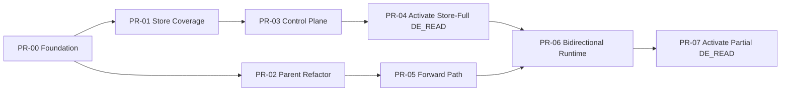

# DualPathConnector Stage 1 PR Tracking

> **Superseded on 2026-08-17:** The current lifecycle and identity contract is
> [DualPath ABORT Notification and Watchdog Removal](../../docs/superpowers/specs/2026-08-16-dual-path-abort-notification-and-watchdog-removal.md).
> Elapsed-time failure, ABORT tombstones, and two-field request keys below are
> historical only.

Last reviewed: 2026-08-04

Target series: PR-00 foundation plus PR-01 through PR-07

Overall state: PR-00 is `LOCAL_READY`; PR-01 through PR-07 are planned and not
implemented

## Progress

| ID | Deliverable | Status | Depends on | Branch / commit | PR | Required merge evidence | Spec |
|---|---|---|---|---|---|---|---|
| PR-00 | Connector foundation | `LOCAL_READY` (all 4 gates PASS) | — | `dev/dualpath` / `9a12de829` | Not opened | Foundation UT ✅, inherited-behavior parity ✅, lint ✅, ordinary Layerwise NPU smoke ✅, config scope review ✅ | [spec](prs/PR-00-foundation.md) |
| PR-01 | Decode Store coverage foundation | `PLANNED` | PR-00 | Not created | Not opened | Coverage/probe/abort UT; zero Store/P2P I/O | [spec](prs/PR-01-decode-store-coverage.md) |
| PR-02 | Parent Layerwise Worker helper extraction | `PLANNED` | PR-00 | Not created | Not opened | Ordinary Layerwise producer/consumer regression parity | [spec](prs/PR-02-parent-worker-refactor.md) |
| PR-03 | Unified path-decision control plane | `PLANNED` | PR-01 | Not created | Not opened | Proxy/PE/DE round trip, round-robin, timeout/idempotency, zero data I/O | [spec](prs/PR-03-decision-control-plane.md) |
| PR-04 | Activate Store-full `DE_READ` | `PLANNED` | PR-03 | Not created | Not opened | Alternating full-coverage PE/DE reads, Store failure, NPU E2E | [spec](prs/PR-04-activate-de-store-full.md) |
| PR-05 | Explicit Forward data path | `PLANNED` | PR-02 | Not created | Not opened | Forward UT plus PE-hit/miss-to-DE NPU E2E | [spec](prs/PR-05-forward-data-path.md) |
| PR-06 | Bidirectional runtime and lifecycle | `PLANNED` | PR-04, PR-05 | Not created | Not opened | Injected-plan bidirectional tests, failure/cancel/quiesce evidence | [spec](prs/PR-06-bidirectional-runtime.md) |
| PR-07 | Activate partial `DE_READ` and complete Stage 1 | `PLANNED` | PR-06 | Not created | Not opened | Full NPU E2E matrix, MultiConnector accounting, performance/memory audit | [spec](prs/PR-07-activate-partial-hit.md) |

`Not created` and `Not opened` are factual values, not placeholders: replace
them only after the branch or PR exists.

## Dependency graph



PR-01 and PR-02 may be developed and reviewed concurrently after PR-00. The
control/Store track is PR-01 -> PR-03 -> PR-04; the Layerwise data track is
PR-02 -> PR-05. PR-06 is the first join point. PR-04 is the first PR allowed to
activate Store-full `DE_READ`; PR-07 is the only PR allowed to activate partial
`DE_READ`.

## Global gates

The following gates apply to every PR in addition to its own spec:

- `bash format.sh ci` passes for every changed file type.
- Focused unit tests listed in the PR spec pass.
- Existing DualPath and ordinary Mooncake Layerwise regression tests pass for
  every touched integration point.
- Commits follow Conventional Commits and include `Signed-off-by`.
- The PR description records what behavior is available immediately after that
  PR is merged.
- A PR that activates behavior with Stage 1 topology limits enforces the
  corresponding fail-fast checks. PR-00 remains equivalent to the inherited
  Layerwise topology contract and does not narrow it early.
- A PR cannot advance to `IN_REVIEW` with unresolved scope changes; update its
  spec first.

## Updating progress

When progress changes, edit one row above and append one concise evidence entry
below. Do not copy full logs into this file.

Evidence entries use this form:

```text
YYYY-MM-DD | PR-XX | command or external check | PASS/FAIL | concise result or link
```

## Evidence log

2026-08-03 | SERIES | initial delivery decomposition approved | PASS | superseded on 2026-08-04 by the PR-00 plus PR-01-through-PR-07 series below

2026-08-03 | SERIES | structure and required-section audit | PASS | 7 PR specs and all local links present

2026-08-04 | SERIES | Store-full decision correction and delivery re-split approved | PASS | PR-00 frozen LOCAL_READY; PR-01 through PR-07 separate coverage, control, full activation, Forward, bidirectional runtime, and partial activation

2026-08-03 | PR-00 | detailed foundation boundary review | PASS | behavior-preserving alias; CPU parity and ordinary Layerwise NPU smoke required

2026-08-03 | PR-00 | spec cleanup vs DETAILED-SPEC §6–§10: frozen role-only DualPathConfig, {role,tls_config,prefill,decode} allow-list, facade state per §8.1,_req_path removed, alias docstrings | PASS | static conformance review of the cleanup diff against the detailed spec; no shadow/decision/PE-Read/DE-Read vocabulary remains outside config rejection messages

2026-08-03 | PR-00 | python3 -m py_compile on dual_path sources, foundation UT, and e2e smoke | PASS | all files compile; diff scope limited to the six spec-owned paths (no parent/Store/Proxy/MultiConnector change)

2026-08-03 | PR-00 | pytest -sv tests/ut/distributed/kv_transfer/dual_path/test_dual_path_connector.py | PASS | 49 passed, 15 subtests passed on openEuler 22.03 + Miniforge Python 3.10 + vllm v0.23.0; fixed 2 test-side bugs developed on macOS without vllm: (1) patch.object get_decode_context_model_parallel_world_size needed create=True because mooncake_layerwise_connector.py imports only `_rank` not `_world_size`; (2) LIFECYCLE_METHODS was tuple but .isdisjoint() called on it, changed to frozenset

2026-08-03 | PR-00 | pytest -sv tests/ut/kv_offload/test_mooncake_layerwise_connector.py | PASS | 41 passed, 0 failed on same env; parent regression confirmed untouched by PR-00 cleanup

2026-08-03 | PR-00 | bash format.sh ci | PASS (PR-00 scope) | ruff-check, ruff-format, codespell, typos, clang-format, markdownlint, actionlint, check-forbidden-imports, check-boolean-context-manager, check-long-functions all PASS; pre-existing shellcheck SC2328 on csrc/build.sh:524 is unrelated (verified via git stash on clean dev/dualpath); added TE to codespell ignore list (Transfer Engine abbreviation); fixed import re → import regex as re in test file; ruff auto-formatted 4 PR-00 files

2026-08-04 | PR-00 | NPU parity smoke (Qwen3-8B, K8s, TP=1, 2×910B) | PASS | Spec-amended smoke: GLM-4.7-W8A8C8/32-card → Qwen3-8B/2-card K8s pods. baseline MooncakeLayerwiseConnector vs candidate DualPathConnector, 6 fixed prompts (temperature=0, seed=1024, max_tokens=64). ALL 4 assertion classes passed: A) token equality 6/6 identical; B) positive markers (scheduler_init, worker_init) present on both runs; C) then-current negative marker strings for AscendStore/PathDecision/round-robin/full/partial path behavior absent in candidate; D) lifecycle counts match: registrations 144=144, admissions 6=6, transfer_completions 6=6, recv_threads 1=1, failure_markers 0=0. Raw artifacts at /home/llq/dualpath/parity-manifests/artifacts/{baseline,candidate}/
