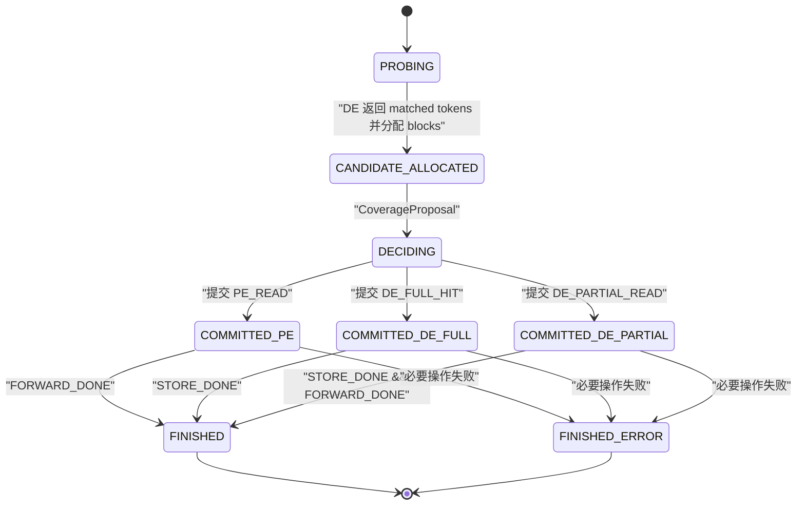
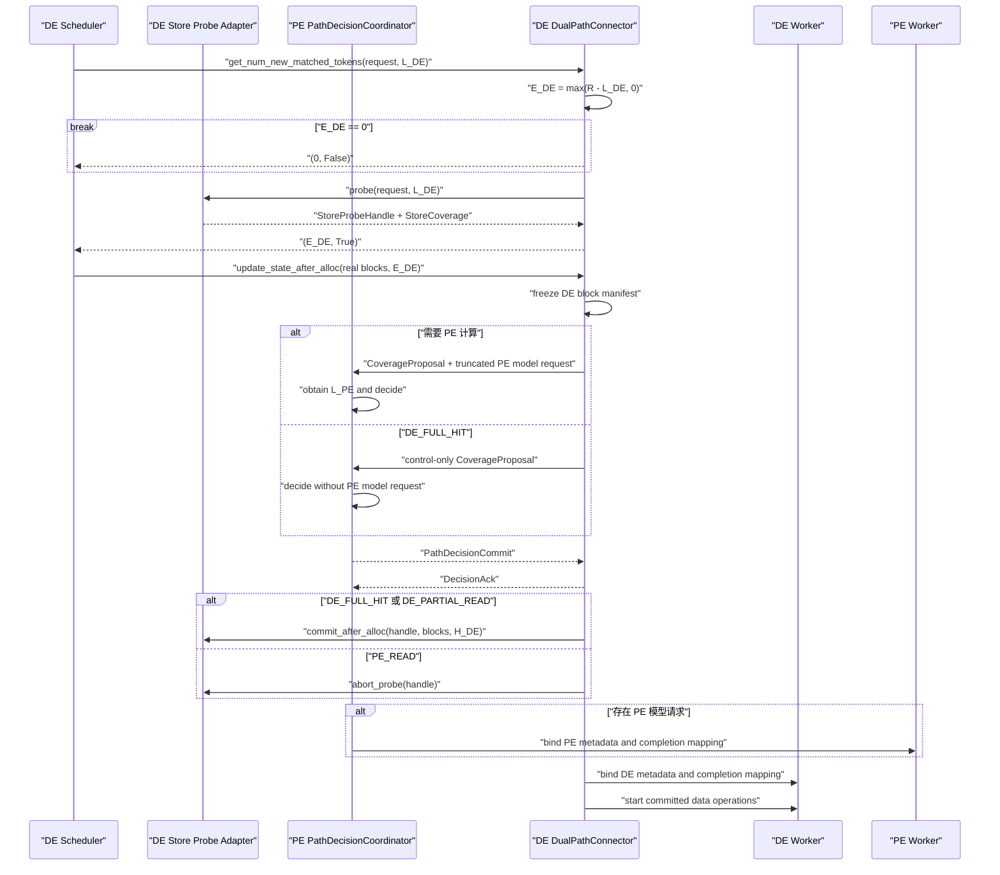
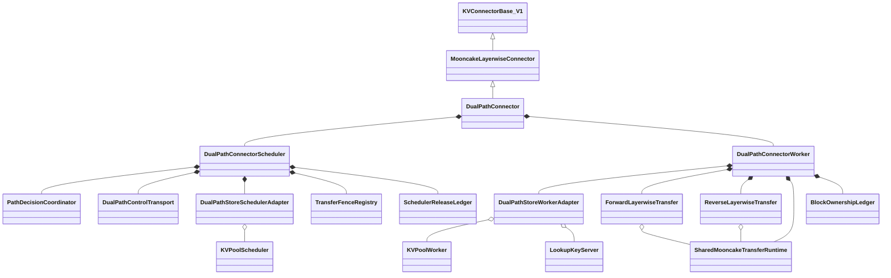
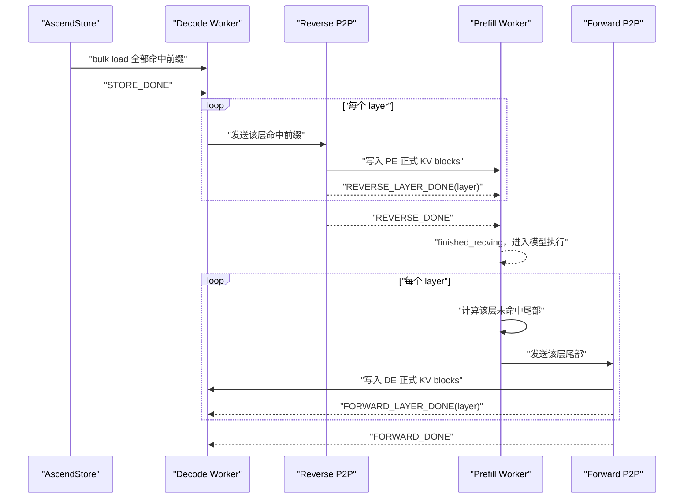
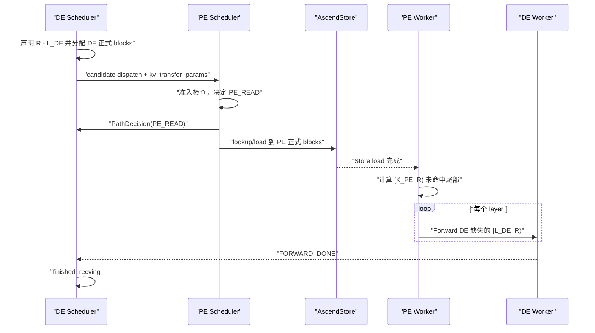
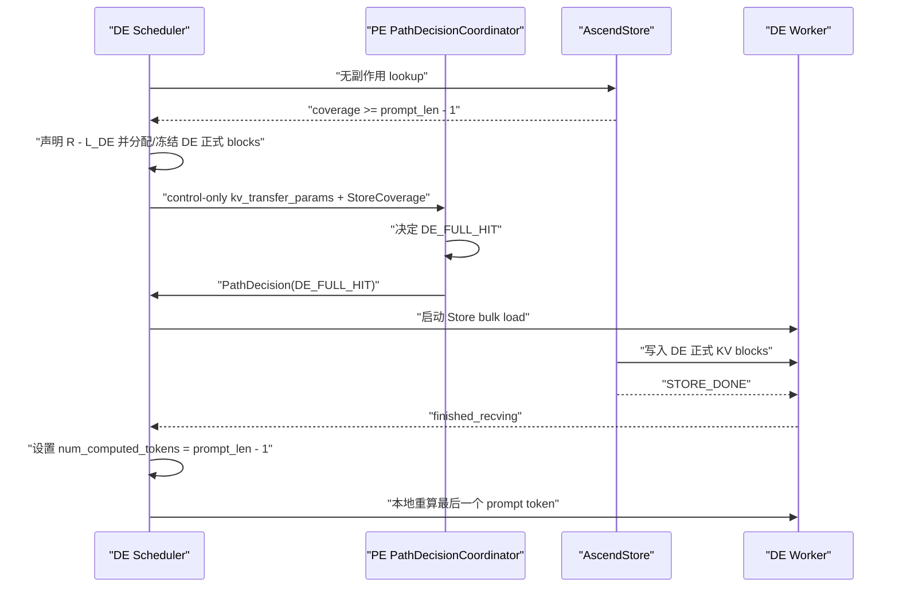
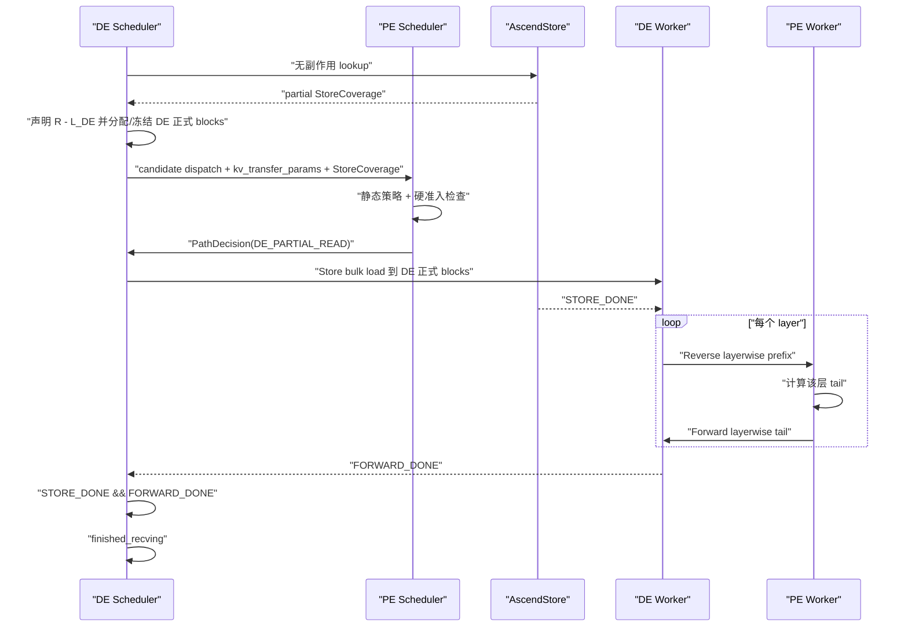
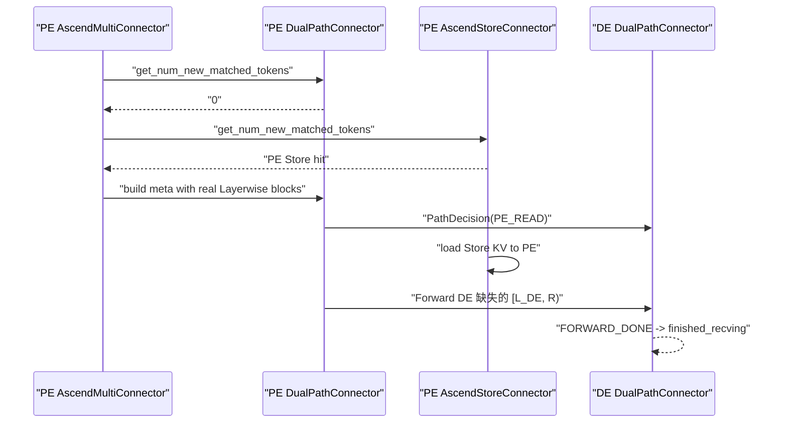
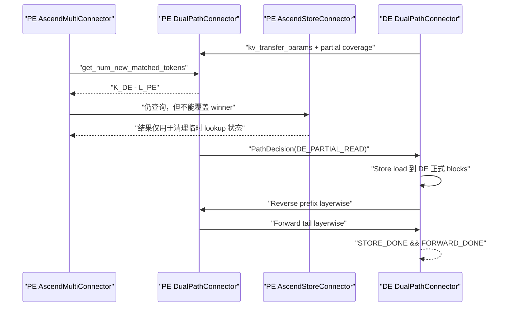

# DualPathConnector Stage 1 方案 A″ 详细开发设计

> 状态：独立设计评审稿，尚未进入实现
> 方案：外层 MultiConnector first-winner 编排
> 适用范围：当前 `dev/dualpath` 分支中的 vLLM Ascend 仓库
> 核心目标：独立打通 `PE_READ`、`DE_FULL_HIT` 与 `DE_PARTIAL_READ`
> 互斥关系：不得与方案 B 的内部编排拓扑混合实现
> 总览索引：`2026-07-23-dual-path-connector-stage1-detailed-design.md`

## 1. 文档目标

本文不是概念性架构草图，而是 Stage 1 的开发设计。实现人员应能够依据本文：

1. 确定新代码的类边界、继承关系与组合关系；
2. 实现路径决策、Store 加载、反向 P2P、正向 P2P 和完成事件；
3. 正确处理请求 ID、KV block 所有权、异步完成和失败；
4. 编写覆盖三条数据通路以及异常路径的单元测试和端到端测试；
5. 直接依据方案 A″ 完成实现，不再依赖另一份方案补充数据面协议。

本文中的约束分为三类：

- **已确认决策**：已经通过设计澄清确定，实现不得自行改变；
- **现有代码事实**：来自当前分支及其配套 vLLM 接口，设计必须兼容；
- **Stage 1 限制**：为了控制首阶段实现风险而主动收窄的能力边界。

## 2. 目标与非目标

### 2.1 Stage 1 目标

Stage 1 必须支持：

- `PE_READ`：KV 从 AscendStore 加载到 Prefill Engine，Prefill 计算未命中的尾部，
  再通过既有 Mooncake Layerwise 正向链路，把 Decode 缺失的完整
  decode-ready 区间传给 Decode Engine；
- `DE_FULL_HIT`：Decode Engine 从 AscendStore 获得足够的 prompt KV，
  本地重算最后一个 prompt token 并直接进入 Decode，不返回 Prefill；
- `DE_PARTIAL_READ`：Decode Engine 从 AscendStore 加载命中前缀到最终 KV block，
  再按层反向传给 Prefill；Prefill 计算未命中的尾部，并按层正向传回 Decode；
- 静态、确定性的路径选择；
- 请求级失败语义：已提交路径的任一必要传输失败，最终使请求进入
  `FINISHED_ERROR`；
- 本方案完整定义外层 first-winner 编排下的数据面、状态机和完成契约。

### 2.2 Stage 1 非目标

Stage 1 不实现：

- 运行时 Value Function 自动选路；
- LinkMonitor 驱动的动态切路；
- 路径提交后的 `DE_READ -> PE_READ` 故障回退；
- Store 的逐层读取；
- Reverse 与 PE compute 的跨层流水重叠；
- Relay Staging 或独立中转显存；
- 请求失败后的局部 KV 复用；
- 对上游 vLLM 或既有 vLLM Ascend Connector 的源码修改；
- 跨 Pipeline Parallel stage 的端口推导；
- 在一个请求内做 token striping 或同时让两条路径竞争产出同一段 KV。

Value Function 与 LinkMonitor 可在 shadow mode 中记录建议值和观测数据，
但不得影响 Stage 1 的实际决策。

## 3. 已确认的硬约束

### 3.1 代码修改边界

实现只能：

- 在 vLLM Ascend 当前仓库、当前分支内新增 DualPath 专属代码；
- 组合调用既有组件提供的完整功能；
- 继承并覆盖 `MooncakeLayerwiseConnector` 的可扩展接口；
- 新增测试和设计文档。

实现不能：

- 修改 `MooncakeLayerwiseConnector`；
- 修改 `AscendStoreConnector`；
- 修改 `AscendMultiConnector`；
- 修改 AscendStore 的既有 Scheduler、Worker 或 backend；
- 修改上游 vLLM；
- 通过 monkey patch 改变上述组件行为。

若当前已有的 DualPath foundation 需要被补全，修改范围必须保持在：

```text
vllm_ascend/distributed/kv_transfer/kv_p2p/dual_path/
tests/ut/distributed/kv_transfer/dual_path/
tests/e2e/.../dual_path/
docs/
```

### 3.2 类关系

`DualPathConnector` 继续继承 `MooncakeLayerwiseConnector`：

```python
class DualPathConnector(MooncakeLayerwiseConnector):
    ...
```

继承的目的不是修改父类，而是：

- 复用现有 Layerwise 正向 P2P 数据面；
- 保持 `AscendMultiConnector` 对 Layerwise Connector 的既有识别逻辑；
- 在 DualPath 自身的 Scheduler/Worker 中增加反向传输、路径决策和完成聚合；
- 覆盖父类不能满足 DualPath 终态语义的接口，例如失败请求的
  `get_finished()` 聚合。

### 3.3 AscendStore 组合边界

DualPath 内部不能再创建一个完整的 `AscendStoreConnector` 子 Connector。

允许按职责组合：

- `KVPoolScheduler`：Store lookup、调度侧元数据及 lookup server；
- `KVPoolWorker`：Store 与 HBM 之间的 bulk load；
- `LookupKeyServer`：仅在现有调用约束要求时使用。

这些对象必须被包在 DualPath 专属 adapter 后面，避免把 AscendStore
Connector 的路径选择、完成语义和生命周期整体嵌入 DualPath。

### 3.4 KV 内存边界

Store 命中的 KV 直接加载到 Decode 模型最终读取的正式 KV blocks。

禁止增加：

- Relay Staging；
- Store 专属中转 HBM；
- 从中转 HBM 到正式 KV blocks 的二次搬运。

同一块正式 KV block 在 Store 写入、反向读取、正向写回之间必须由
`BlockOwnershipLedger` 管理写入者和释放条件。

### 3.5 路径提交与失败

路径决策分为两个阶段：

1. `DECIDING`：可以根据准入条件把候选路径从 DE 改为 PE；
2. `COMMITTED`：PE 明确把 `PathDecision` 发给 DE 后，路径不可切换。

“路径提交后不再切换”不表示失败请求还会继续调度。它表示：

- 提交前的准入失败属于正常选路，可以选择 `PE_READ`；
- 提交后的传输失败属于请求失败；
- Scheduler 在收到终态和 invalid blocks 后把请求标记为
  `FINISHED_ERROR`；
- `FINISHED_ERROR` 请求不会再次进入调度，也不存在后续切路；
- 物理传输仍须完成 drain 或 quarantine，之后才能安全释放相关 blocks。

Stage 1 必须使用：

```yaml
kv_load_failure_policy: fail
```

若运行时配置不是 `fail`，DualPath 必须在初始化阶段 fail fast。

## 4. 现有组件逻辑与设计影响

### 4.1 AscendMultiConnector

当前 `AscendMultiConnector` 的 Scheduler 侧行为是配置顺序的
first-positive：

1. 依次调用各子 Connector 的 `get_num_new_matched_tokens()`；
2. 第一个返回正数的 Connector 成为 Scheduler accounting 的 winner；
3. 后续子 Connector仍会被查询，但不能覆盖已经选出的 winner；
4. Worker 调用本身仍可能广播到多个子 Connector。

Ascend 版本还对 `MooncakeLayerwiseConnector` 子类有特殊处理：

- 即使 Layerwise Connector 不是 token winner，也会获得真实 KV blocks；
- 该例外用于支持正向 Layerwise 传输；
- 它不等价于“该 Connector 赢得路径”；
- 所有具有副作用的动作仍必须受已提交 `PathDecision` 约束。

因此未成为 winner 的 AscendStore child 仍可能产生 Scheduler-side lookup/
LoadSpec 临时状态；A″ 只能保证它在 `update_state_after_alloc(..., 0)` 后不执行
Worker Store GET，不能宣称后续 child 完全没有被调用。

### 4.2 MooncakeLayerwiseConnector

Stage 1 复用其现有能力：

- Prefill 到 Decode 的逐层正向传输；
- Layerwise 发送/接收相关的基础元数据；
- 既有 P2P transport 和请求生命周期钩子。

DualPath 不能直接照搬父类的全部完成语义。父 Worker 对接收失败会生成
invalid blocks，但父 `get_finished()` 的公开完成集合只覆盖正常完成请求。
DualPath 必须保证：

- 正常请求和失败请求都会作为异步接收的“终态”被上报；
- invalid block IDs 不晚于对应失败请求的终态上报；
- 失败请求最终由上游 Scheduler 按 `fail` 策略标记为
  `FINISHED_ERROR`。

### 4.3 AscendStoreConnector

现有 AscendStore 是 request-level bulk load，而非随模型 forward callback
逐层推进的 Store load。

Stage 1 采用：

- Store lookup 后按 `cache_transfer_granularity` 归一化命中长度；
- bulk load 可以在 backend 内部拆成多个 DMA；
- 只有所有 Store DMA 都完成时才产生 `STORE_DONE`；
- `discard_partial_chunks=True` 的现有对齐语义；
- Store load 目标是模型正式 KV blocks。

不得把现有与模型层 callback 耦合的 Store layerwise 路径用于
`Store -> DE -> PE` 反向链路。

### 4.4 Scheduler 的最后一个 token 语义

当 Decode 得到完整 prompt KV 后，Scheduler 仍保留最后一个 prompt token
用于本地重算 logits：

```text
decode_ready_tokens = prompt_len - 1
```

因此：

- `DE_FULL_HIT` 不需要回 Prefill；
- Store 覆盖到 `prompt_len - 1` 即满足 full-hit 条件；
- Decode 负责本地重算最后一个 prompt token。

### 4.5 当前分支源码锚点

实现和评审以以下当前分支文件为准：

| 能力 | 源码 |
|---|---|
| DualPath foundation | `vllm_ascend/distributed/kv_transfer/kv_p2p/dual_path/connector.py` |
| DualPath 当前配置 | `vllm_ascend/distributed/kv_transfer/kv_p2p/dual_path/config.py` |
| Ascend Multi 特例 | `vllm_ascend/distributed/kv_transfer/ascend_multi_connector.py` |
| Layerwise Scheduler/Worker | `vllm_ascend/distributed/kv_transfer/kv_p2p/mooncake_layerwise_connector.py` |
| AscendStore facade | `vllm_ascend/distributed/kv_transfer/kv_pool/ascend_store/ascend_store_connector.py` |
| Store Scheduler | `vllm_ascend/distributed/kv_transfer/kv_pool/ascend_store/pool_scheduler.py` |
| Store Worker | `vllm_ascend/distributed/kv_transfer/kv_pool/ascend_store/pool_worker.py` |
| DualPath 现有 UT | `tests/ut/distributed/kv_transfer/dual_path/test_dual_path_connector.py` |

配套 vLLM 的 `KVConnectorBase_V1`、Scheduler 和 `KVOutputAggregator` 只作为
接口契约读取，不在本任务中修改。

## 5. 统一术语和 token accounting

### 5.1 角色

| 简写 | 含义 |
|---|---|
| PE | Prefill Engine |
| DE | Decode Engine |
| Store | AscendStore backend |
| Forward | PE 到 DE 的既有 Mooncake Layerwise P2P |
| Reverse | DE 到 PE 的新增 Mooncake Layerwise P2P |

### 5.2 Token 变量

PE 与 DE 的 `num_computed_tokens` 属于两个不同 Scheduler，不能共用一个
`L`。Stage 1 使用以下变量：

| 变量 | 含义 |
|---|---|
| `P` | 原始 prompt token 数 |
| `R = max(P - 1, 0)` | DE 首次本地 forward 前需要具备的 decode-ready 前缀 |
| `L_DE` | DE 当前已经拥有并可复用的本地 token 数 |
| `L_PE` | PE 当前已经拥有并可复用的本地 token 数 |
| `S_DE_raw` | DE Store probe 返回的原始绝对前缀长度 |
| `S_PE_raw` | PE Store lookup 返回的原始绝对前缀长度 |
| `G` | `cache_transfer_granularity` |
| `S_DE` | `min(floor(S_DE_raw / G) * G, R)` |
| `S_PE` | `min(floor(S_PE_raw / G) * G, R)` |
| `H_DE = max(S_DE - L_DE, 0)` | DE Store 需要新增加载的逻辑 token 数 |
| `K_DE = min(max(L_DE, S_DE), R)` | DE Store load 后的连续 ready prefix |
| `H_PE = max(S_PE - L_PE, 0)` | PE Store 需要新增加载的逻辑 token 数 |
| `K_PE = min(max(L_PE, S_PE), R)` | PE Store load 后的连续 ready prefix |
| `T_DE = R - K_DE` | DE partial 路径中 PE 必须计算并 Forward 的尾部 |
| `T_PE = R - K_PE` | PE Read 路径中 PE 必须计算的尾部 |
| `E_DE = max(R - L_DE, 0)` | DE 向 Scheduler 声明的 external token 总量 |
| `F_PE_READ = E_DE` | PE Read 路径中 PE 必须 Forward 给 DE 的逻辑 token 数 |

`get_num_new_matched_tokens()` 的返回值必须按 Engine 区分：

| Engine / 路径 | 返回 token 数 | `load_async` | 含义 |
|---|---:|---:|---|
| DE / `PE_READ` | `E_DE` | `E_DE > 0` | DE 等待 PE Store + PE compute + Forward |
| DE / `DE_FULL_HIT` | `E_DE` | `E_DE > 0` | DE 等待 Store load |
| DE / `DE_PARTIAL_READ` | `E_DE` | `E_DE > 0` | DE 等待 Store + Forward 的组合结果 |
| PE / `PE_READ` | `H_PE` | `H_PE > 0` | 只声明 PE Store 实际加载的前缀 |
| PE / `DE_PARTIAL_READ` | `max(K_DE - L_PE, 0)` | `K_DE > L_PE` | 只声明 Reverse 实际写入的前缀 |
| PE / `DE_FULL_HIT` | 不创建 PE 模型请求 | 不适用 | 仅控制面参与 decision |

这一区分是硬性契约：PE 若错误返回 `R - L_PE`，其 Scheduler 会认为整个
decode-ready prefix 都将被异步加载，从而跳过 `T_DE` 或 `T_PE` 的本地
Prefill 计算。

边界条件：

- `E_DE == 0`：DE 必须直接返回 `(0, False)`，不创建 pending candidate，
  也不进入异步 Store/P2P 流程；
- `H_DE == 0`：DE partial 没有新增 Store 收益，按 `PE_READ` 处理；
- `K_DE >= R`：`DE_FULL_HIT`；
- `L_DE < K_DE < R`：`DE_PARTIAL_READ`；
- Stage 1 的 DE partial 准入要求 `L_PE < K_DE`，确保 DualPath 在 PE Multi 中能够返回正数并成为 winner；
- Store 只负责新增区间，不能重复参与 Scheduler accounting；
- DE partial 的 Reverse prefix 是 `[0, K_DE)`，不是仅发送
  Store 新增的 `[L_DE, K_DE)`；
- PE 计算和 Forward 的 tail 是 `[K_DE, R)`；
- PE Read 的 PE Store prefix 是 `[L_PE, K_PE)`，PE 计算区间是
  `[K_PE, R)`，但 PE 必须向 DE Forward 的区间是 DE 的完整缺失区间
  `[L_DE, R)`；
- PE Read 的 Forward 因此同时包含 PE 本地已有、PE Store 加载和 PE
  新计算但 DE 尚未拥有的 KV；不得把 PE compute tail 误当成 DE
  Forward region。

### 5.3 StoreCoverage

Store 物理覆盖与 Scheduler 可见 matched tokens 必须分离：

```python
@dataclass(frozen=True)
class StoreCoverage:
    raw_hit_tokens: int
    aligned_hit_tokens: int
    local_tokens: int
    ready_prefix_tokens: int
    decode_ready_tokens: int
    store_load_tokens: int
    prefill_tail_tokens: int
    is_full_hit: bool
```

PE 与 DE 分别拥有自己的 `StoreCoverage`，不得把 `local_tokens` 从一个
Engine 复制到另一个 Engine。`StoreCoverage` 只描述已验证、已对齐的
coverage，不代表 Store load 已完成。

## 6. 请求 ID 与传输身份

DualPath 至少同时涉及两个 Engine 的本地请求、Store lookup 以及 P2P
wire。不得把这些 ID 混成一个 `request_id`，但也不为同一次执行重复生成
语义相同的 route ID 或 transfer epoch。

```python
@dataclass(frozen=True)
class DualPathRequestKey:
    de_engine_incarnation: str
    de_engine_local_request_id: str


@dataclass(frozen=True)
class TransferRequestIds:
    request_key: DualPathRequestKey
    pe_engine_local_request_id: str | None
    proxy_dispatch_id: str
    store_request_key: str
    forward_wire_external_id: str
    reverse_wire_external_id: str
```

约束：

- `DualPathRequestKey` 不是新生成的 ID；它复用 DE Engine-local request
  ID，并与 DE Engine incarnation 组成 PE/DE 共同的控制面关联键；
- `de_engine_local_request_id` 和 `pe_engine_local_request_id` 只能用于
  对应 Engine 的
  `finished_recving` / `finished_sending`；
- `pe_engine_local_request_id`：`DE_FULL_HIT` 时为 `None`，因为不创建 PE
  模型请求；
- `proxy_dispatch_id`：只用于 Mooncake metaserver/proxy 派发；
- `store_request_key`：Store lookup 的逻辑标识；实际 lookup 仍由 token
  长度、block hashes、group IDs 和 Store keys 构成；
- `forward_wire_external_id` 和 `reverse_wire_external_id` 从
  `DualPathRequestKey` 加 direction 确定性派生，只用于对应 P2P channel；
- 每次新的 DualPath 执行必须使用新的 `DualPathRequestKey`；同一次控制消息
  重试和 Scheduler 重调度必须复用原 key 和 wire IDs；
- active/retired wire ID 永不重新分配给另一请求。请求终止后保留 tombstone，
  直到 transport drain 或 terminal retention window 到期；
- wire 事件只有在 wire ID、direction、engine incarnation 和 channel
  identity 都匹配时才可接收；
- 任何对外完成集合只能包含当前 Engine 的精确 local request ID；
- `rank` 字段统一表示 TP rank；Stage 1 因 PP=DP=1，其数值与 global rank
  相同，但序列化字段仍命名为 `tp_rank`，不依赖这一数值巧合。

Stage 1 不存在同一 `DualPathRequestKey` 下重新开启第二个 transfer attempt
的恢复语义，因此不引入 `transfer_epoch`。未来若支持 post-commit recovery，
应新增显式、不可复用的 `transfer_attempt_id`，而不是复用 wire ID 后依赖
本地整数代次消歧。

## 7. 路径模型

```python
class PathKind(str, Enum):
    PE_READ = "PE_READ"
    DE_FULL_HIT = "DE_FULL_HIT"
    DE_PARTIAL_READ = "DE_PARTIAL_READ"
```

### 7.1 路径含义

| 路径 | Store load 位置 | Reverse | Prefill 计算 | Forward | DE 成功条件 |
|---|---|---:|---:|---:|---|
| `PE_READ` | PE | 否 | 尾部 | 是 | `FORWARD_DONE` |
| `DE_FULL_HIT` | DE | 否 | 无 PE Prefill；DE 重算最后一个 token | 否 | `STORE_DONE` |
| `DE_PARTIAL_READ` | DE | 是 | 尾部 | 是 | `STORE_DONE && FORWARD_DONE` |

`REVERSE_DONE` 不是 `DE_PARTIAL_READ` 的请求成功 barrier，原因是：

- Forward 的每一层只能在对应 Reverse layer 完成并被 PE 消费后开始；
- `FORWARD_DONE` 已经传递性证明所有必要 Reverse layer 都完成；
- 再把全局 `REVERSE_DONE` 加入成功谓词只会重复等待。

由于 Forward 不能早于对应 Store/Reverse 依赖启动，`FORWARD_DONE`
传递性上已经蕴含 Store 已完成。成功谓词仍保留
`STORE_DONE && FORWARD_DONE` 作为防御性状态机断言，而不是增加一个新的
串行等待阶段。

但 `REVERSE_DONE` 仍必须被跟踪，用于：

- 发现反向链路失败；
- 资源回收；
- quarantine 判断；
- 诊断不一致状态。

### 7.2 静态路径规则

Stage 1 的 active policy 仅支持静态模式：

```python
class StaticPartialReadPolicy(str, Enum):
    PREFER_PE = "prefer_pe"
    PREFER_DE = "prefer_de"
```

决策规则：

1. 已验证 Store coverage 满足 full hit：`DE_FULL_HIT`；
2. partial hit 且策略为 `prefer_de`，并满足 DE 准入条件：
   `DE_PARTIAL_READ`；
3. 其余情况：`PE_READ`。

### 7.3 DE 路径准入条件

`DE_FULL_HIT`：

- Store lookup 成功；
- coverage 已按 granularity 对齐；
- `K_DE >= R`；
- capability probe 已确认 DE Store bulk load 可用。

`DE_PARTIAL_READ`：

- `L_DE < K_DE < R`；
- `L_PE < K_DE`；
- PE/DE 模型、KV layout、block size、dtype 相容；
- TP world size 与 rank mapping 相容；
- Forward 和 Reverse handshake 均成功；
- Reverse channel 与 Forward channel 的 wire identity、端口空间独立；
- capability probe 已确认 Store、Forward、Reverse 可用。

以下情况必须在 `PathDecision` 提交前转为 `PE_READ`：

- lookup miss；
- coverage 未知或元数据缺失；
- `H_DE == 0`；
- topology、layout 或 handshake 不相容；
- PE 已有 prefix 超过 DE ready prefix，导致 DE partial 无法形成统一边界。

DE 请求级 block 分配发生在 commit 之前：DE 无论最终走哪条路径，最终都
需要 `R - L_DE` 个 external tokens，因此可以先按统一总量分配正式 blocks，
但不能启动任何 Store/P2P I/O。PE commit 时可把已冻结的 DE block manifest
作为硬准入条件。rank-local transfer plan 只在 commit 后绑定并冻结；绑定
失败使请求进入 `FINISHED_ERROR`。

## 8. 路径决策协议

### 8.1 核心类型

```python
class DecisionPhase(str, Enum):
    PROBING = "PROBING"
    CANDIDATE_ALLOCATED = "CANDIDATE_ALLOCATED"
    DECIDING = "DECIDING"
    COMMITTED = "COMMITTED"
    TERMINAL = "TERMINAL"


@dataclass(frozen=True)
class PathDecision:
    ids: TransferRequestIds
    path: PathKind
    de_coverage: StoreCoverage
    pe_coverage: StoreCoverage | None
    expected_tp_ranks: tuple[int, ...]
    decision_version: int
```

### 8.2 Probe、allocation、commit、data-start 四阶段协议

PE 是路径决策的唯一提交方。必须把“DE Scheduler 为最终 external tokens
分配 blocks”和“选定 Store/Reverse/Forward 路径”解耦，否则会形成：

```text
等待 PE decision
-> DE 才返回 matched tokens
-> DE 才分配 blocks
-> DE 才派发 PE 请求
-> PE 才能 decision
```

Stage 1 采用：

```text
PROBE -> ALLOCATE_AND_DISPATCH_CANDIDATE -> DECISION_COMMIT -> DATA_START
```

DE 在 decision 前声明的 matched-token 总量是 `E_DE`。当 `E_DE > 0`
时，这不是路径提交，只表示无论最终由 DE Store、PE Forward 还是二者组合，
这些 tokens 都将异步到达 DE。该统一总量允许复用 vLLM 的正常 block
allocation 顺序。
当 `E_DE == 0` 时不存在待异步到达的 token，必须返回 `(0, False)` 并终止
该请求的 DualPath candidate 流程。

DualPath 新增轻量控制消息，复用现有 side-channel 连接能力但使用独立
message type，不修改现有 Mooncake Connector。

`CoverageProposal` 序列化在既有 `kv_transfer_params["dual_path"]` envelope
中随请求控制参数发送；它不是另建一套业务参数。需要 PE 模型请求时，
candidate dispatch 和后续 commit 复用同一份 envelope 和 ID 映射。

```python
@dataclass(frozen=True)
class CoverageProposal:
    ids: TransferRequestIds
    de_coverage: StoreCoverage
    capability_digest: str
    de_block_manifest_digest: str
    requested_policy: StaticPartialReadPolicy


@dataclass(frozen=True)
class PathDecisionCommit:
    decision: PathDecision


@dataclass(frozen=True)
class DecisionAck:
    request_key: DualPathRequestKey
    decision_version: int


协议顺序：

1. DE 的 `get_num_new_matched_tokens()` 计算 `E_DE`；若 `E_DE == 0`，
   直接返回 `(0, False)`，不执行 Store probe；
2. DE 执行 Store probe，得到候选
   `StoreCoverage`；
3. DE 记录 pending candidate，并返回 `(E_DE, True)`；
4. Scheduler 分配 DE 正式 blocks，调用 `update_state_after_alloc()`；
5. DualPath 冻结 DE block manifest，但不启动 Store/P2P I/O；
6. 对 `PE_READ`/`DE_PARTIAL_READ`，DE 派发带 `CoverageProposal` 的 PE
   模型请求；PE 此时可得到真实 `L_PE`；
7. 对 `DE_FULL_HIT`，DE 只向 PE control coordinator 发送 proposal，
   不创建 PE 模型请求；
8. PE 根据静态策略、`L_PE`、Store coverage、capability 和 DE block
   manifest 形成 `PathDecisionCommit`；
9. PE 将 commit 发给 DE，DE 持久化后返回 `DecisionAck`；
10. PE/DE Worker 通过框架既有 metadata 流程绑定 request plan、block
    mapping、wire identity 和 completion mapping；
11. `PathDecisionCommit + DecisionAck + frozen block plan` 完成后，按已提交
    路径启动 Store load、Reverse 或 Forward。

Mooncake Layerwise 使用初始化时已注册的 KV buffers 和常驻 receive
thread，通过单边写直接写入远端正式 blocks；Stage 1 不增加请求级
`RankArmAck` barrier。若请求级 raw terminal 早于本地 completion mapping
到达，Worker 必须暂存并在 mapping 建立后重新归属，不得丢弃。

若 PE 在自己的 `get_num_new_matched_tokens()` 中尚未收到完整 proposal，
PE Connector 可以按基类契约返回 `(None, False)` 等待重试。DE 不需要等待
decision 才返回 matched tokens。

其中 Store probe 的“无副作用”仅指不启动 HBM 数据传输。现有
`KVPoolScheduler.get_num_new_matched_tokens()` 会创建 client/load-spec
状态，不能直接当作纯 probe；`DualPathStoreSchedulerAdapter` 必须提供独立
probe 接口，并把临时 lookup 状态与 commit 后的 load plan 分离。

禁止：

- DE 仅凭 lookup 结果提前启动 Store load；
- PE 通过“是否收到数据”猜测路径；
- 两侧各自重新计算路径；
- 在已提交 decision 上做隐式 fallback。

### 8.3 PE 模型请求的 decode-ready 截断

现有 Mooncake 父类只对 hybrid cache 特例截断最后一个 prompt token；
Stage 1 限制为普通 Attention，因此 DualPath 必须在创建 PE 模型请求时
显式把计算目标统一为 `R = P - 1`。

```python
def truncate_pe_request_to_decode_ready_prefix(
    request: Request,
    decode_ready_tokens: int,
) -> None:
    """在 PE Scheduler 接收请求时幂等执行，不修改上游实现。"""
```

该函数必须在 DualPath 自己的 request-dispatch/on-new-request 边界同步更新：

- `prompt_token_ids` 或 `prompt_embeds`；
- `_all_token_ids`；
- `num_prompt_tokens`；
- `max_tokens = 1`；
- `kv_transfer_params["_dual_path_decode_ready_truncated"] = True`。

重复调用必须幂等。`DE_FULL_HIT` 不创建 PE 模型请求，因此不调用该函数。

### 8.4 决策状态机



### 8.5 decision 前后函数时序



`update_state_after_alloc()` 可能被框架对同一请求调用两次；实现必须以
`request_key + decision_version` 幂等处理，且只在
`num_external_tokens > 0` 时冻结真实 block plan。Store/P2P I/O 仍必须
等待 `PathDecisionCommit + DecisionAck + frozen block plan`。

### 8.6 PathDecisionCoordinator 接口

```python
class PathDecisionCoordinator:

    def register_candidate(
        self,
        proposal: CoverageProposal,
    ) -> None:
        """幂等登记 DE candidate，不启动数据面。"""

    def decide_on_pe(
        self,
        proposal: CoverageProposal,
        pe_local_tokens: int,
        pe_store_coverage: StoreCoverage | None,
    ) -> PathDecision:
        """仅在 PE 调用，执行静态策略和硬准入检查。"""

    def commit(
        self,
        decision: PathDecision,
    ) -> PathDecisionCommit:
        """CAS: DECIDING -> COMMITTED；不同二次提交报协议错误。"""

    def acknowledge(
        self,
        ack: DecisionAck,
    ) -> None:
        """记录 DE 已持久化相同 version。"""

    def get_committed(
        self,
        request_key: DualPathRequestKey,
    ) -> PathDecision | None:
        """供 Scheduler/Worker hook 只读查询。"""

    def fail(
        self,
        request_key: DualPathRequestKey,
        error: DualPathErrorCode,
    ) -> None:
        """冻结失败；commit 后不得改写为另一条路径。"""
```

### 8.7 DualPath control transport

不能把新消息塞进既有 Mooncake receive loop，因为本任务禁止修改该组件。
DualPath 在自己的目录内实现独立 ZMQ control transport：

```python
@dataclass(frozen=True)
class DualPathControlConfig:
    pe_host: str
    pe_port: int
    request_timeout_ms: int
    max_retries: int
    protocol_version: int


class DualPathControlTransport:

    def __init__(
        self,
        config: DualPathControlConfig,
        engine_role: Literal["pe", "de"],
    ) -> None:
        """PE 创建 ROUTER socket 并 bind；DE 创建 DEALER socket 并 connect。"""

    def start(
        self,
        handler: Callable[["ControlEnvelope"], "ControlEnvelope | None"],
    ) -> None:
        """启动独立 receive/poll thread。"""

    def send_proposal(
        self,
        proposal: CoverageProposal,
    ) -> None: ...

    def send_commit(
        self,
        commit: PathDecisionCommit,
    ) -> None: ...

    def send_ack(
        self,
        ack: DecisionAck,
    ) -> None: ...

    def wait_for_commit(
        self,
        request_key: DualPathRequestKey,
        timeout_ms: int,
    ) -> PathDecisionCommit: ...

    def shutdown(self) -> None:
        """停止接收新消息，完成有界 drain，关闭 socket 和线程。"""
```

```python
@dataclass(frozen=True)
class ControlEnvelope:
    protocol_version: int
    message_type: Literal[
        "COVERAGE_PROPOSAL",
        "PATH_DECISION_COMMIT",
        "DECISION_ACK",
        "CONTROL_ERROR",
    ]
    message_id: str
    request_key: DualPathRequestKey
    payload_hash: str
    payload: bytes
```

约束：

- control endpoint 只存在于 PE/DE Scheduler 进程，不按 TP rank 起多份；
- `pe_host:pe_port` 由配置显式提供，不复用 Forward/Reverse 端口；
- PE 先 bind，DE 再 connect；
- 重试必须复用相同 `message_id`，接收端按
  `(message_id, payload_hash)` 幂等；
- 相同 `message_id` 但不同 payload hash 是协议错误；
- `request_timeout_ms` 到期后最多重试 `max_retries`；
- 重试耗尽且请求尚未 commit，进入 `DECISION_TIMEOUT` 失败，不自行切路；
- commit/ack 必须落到 `PathDecisionCoordinator` 后再回复；
- `DE_FULL_HIT` 完全通过该 control transport 完成 PE commit，不创建 PE
  模型请求；
- model-request 路径仍把相同 proposal 放在 `kv_transfer_params` 中，
  control envelope 用于 commit/ack 的可靠交付。

## 9. 公共类设计

### 9.1 类图



公共类命名只使用仓库现有风格：

- `DualPathConnector`
- `DualPathConnectorScheduler`
- `DualPathConnectorWorker`

不得用方案字母、PE 或 DE 作为公共类名后缀；方案差异只通过配置和私有策略对象实现。

### 9.2 方向化 Mooncake 复用

不能直接调用父 Worker 的 `kv_both` dispatch：当前父 `start_load_kv()`
对 consumer 使用优先分支，会跳过 PE 的 Forward producer。但当前父
`register_kv_caches()` 在 `kv_both` 下可以一次完成：

- 一次 `global_te.register_buffer()`；
- 一份 `layer_metadata`；
- 一个 `KVCacheSendingLayerThread`；
- 一个 `KVCacheRecvingLayerThread`。

因此 DualPath 使用一个共享 runtime，再暴露两个逻辑方向：

| 逻辑 transport | PE 角色 | DE 角色 |
|---|---|---|
| `ForwardLayerwiseTransfer` | producer | consumer |
| `ReverseLayerwiseTransfer` | consumer | producer |

实现约束：

- `DualPathConnectorWorker` 只创建一个
  `SharedMooncakeTransferRuntime`，内部复用一个以 `kv_both` 初始化的
  `MooncakeLayerwiseConnectorWorker` runtime；
- 只调用一次该 runtime 的 `register_kv_caches()`，由现有完整函数同时
  建立 send/recv thread 和 buffer metadata；
- PE 将共享 runtime 的 send thread 解释为 Forward、recv thread 解释为
  Reverse；DE 则将 send thread 解释为 Reverse、recv thread 解释为
  Forward；
- `ForwardLayerwiseTransfer` 与 `ReverseLayerwiseTransfer` 只是对共享
  send/recv thread 的方向化 adapter，不创建第二个 Worker；
- 两个方向使用不同 wire ID 和远端 receiver endpoint；Forward receiver
  是 DE engine/port，Reverse receiver 是 PE engine/port；
- PE/DE 正式 KV blocks 是两条 transport 的唯一数据区，不增加 staging；
- DualPath 必须完全覆盖父类 `update_state_after_alloc()`、
  `build_connector_meta()` 和 Worker `start_load_kv()/get_finished()`，
  直接向共享 runtime 的 send/recv thread 提交方向化任务，不能落回父类
  `kv_both` 的 consumer-first dispatch；
- 不修改父 Worker，也不嵌套第二个完整 Mooncake Connector/Worker。

### 9.3 DualPathConnector

```python
class DualPathConnector(MooncakeLayerwiseConnector):

    def __init__(
        self,
        vllm_config: VllmConfig,
        role: KVConnectorRole,
        kv_cache_config: KVCacheConfig | None = None,
    ) -> None:
        """创建 DualPath 专属 Scheduler 或 Worker。

        不调用 MooncakeLayerwiseConnector.__init__()，因为父构造器会固定
        创建父 Scheduler/Worker。与当前 foundation 一致，直接调用
        KVConnectorBase_V1.__init__()，再创建 DualPath 子类。
        """

    def start_load_kv(
        self,
        forward_context: ForwardContext,
        **kwargs: Any,
    ) -> None:
        """按已提交 PathDecision 启动本 Engine 的必要接收动作。"""

    def wait_for_layer_load(self, layer_name: str) -> None:
        """保持父类正向接收语义，并为 Reverse/Forward layer fence 提供钩子。"""

    def save_kv_layer(
        self,
        layer_name: str,
        kv_layer: list[torch.Tensor],
        attn_metadata: AttentionMetadata,
        **kwargs: Any,
    ) -> None:
        """在 PE 上发送已提交的 Forward region。

        PE_READ 发送 [L_DE, R)；DE_PARTIAL_READ 发送 [K_DE, R)。
        DE 侧维护对应 layer 的 ownership。
        """

    def get_finished(
        self,
        finished_req_ids: set[str],
    ) -> tuple[set[str] | None, set[str] | None]:
        """返回本地精确 request ID 的发送/接收终态。

        失败的异步接收请求也必须进入 finished_recving。
        """

    def get_block_ids_with_load_errors(self) -> set[int]:
        """返回本 rank 上不晚于失败终态发布的 invalid block IDs。"""

    def build_connector_worker_meta(
        self,
    ) -> "DualPathConnectorWorkerMetadata | None":
        """把 rank-local 内部状态接入框架 WorkerMetadata 聚合链路。"""

    def update_connector_output(
        self,
        connector_output: KVConnectorOutput,
    ) -> None:
        """Scheduler 侧消费框架已聚合的 Worker 输出。"""

    def request_finished_all_groups(
        self,
        request: Request,
        block_ids: tuple[list[int], ...],
    ) -> tuple[bool, dict[str, Any] | None]:
        """在异步 send/drain 仍持有 blocks 时请求 delayed free。"""

    def bind_connector_metadata(
        self,
        connector_metadata: KVConnectorMetadata,
    ) -> None:
        """校验并绑定 DualPathConnectorMetadata。"""

    def clear_connector_metadata(self) -> None:
        """清理 step-local metadata，不删除 request fence。"""

    def register_kv_caches(
        self,
        kv_caches: dict[str, torch.Tensor],
    ) -> None:
        """一次 TE buffer 注册，并把 KV caches 绑定给 Store adapter。"""

    def bind_gpu_block_pool(self, gpu_block_pool: BlockPool) -> None:
        """Scheduler 侧转交给 Store scheduler adapter。"""

    def wait_for_save(self) -> None:
        """等待本 step 必须完成的 Layerwise send，不承担 Store save。"""

    def get_kv_connector_kv_cache_events(
        self,
    ) -> KVConnectorKVEvents | None:
        """转交 Store events 并追加 DualPath transfer events。"""

    def shutdown(self) -> None:
        """先阻止新请求，再 drain/quarantine，最后关闭 Store/两个 P2P。"""
```

### 9.4 DualPathConnectorScheduler

```python
class DualPathConnectorScheduler(MooncakeLayerwiseConnectorScheduler):

    def get_num_new_matched_tokens(
        self,
        request: Request,
        num_computed_tokens: int,
    ) -> tuple[int | None, bool]:
        """返回当前编排模式下 Scheduler 可见的唯一 matched-token 结果。

        A″ 中用于参与外层 first-winner；
        B 中用于内部 Store/remote-prefill 的统一 accounting。
        """

    def build_connector_meta(
        self,
        scheduler_output: SchedulerOutput,
    ) -> KVConnectorMetadata:
        """产生含 PathDecision、coverage、ID 映射和 block slice 的元数据。"""

    def update_state_after_alloc(
        self,
        request: Request,
        blocks: KVCacheBlocks,
        num_external_tokens: int,
    ) -> None:
        """在 block 分配后冻结 Store/Reverse/Forward 的目标区间。"""

    def request_finished(
        self,
        request: Request,
        block_ids: list[int],
    ) -> tuple[bool, dict[str, Any] | None]:
        """在发送生命周期完成前保留必要 blocks。"""

    def request_finished_all_groups(
        self,
        request: Request,
        block_ids: tuple[list[int], ...],
    ) -> tuple[bool, dict[str, Any] | None]:
        """HMA 入口；不能沿用父类恒定返回 False 的实现。"""

    def update_connector_output(
        self,
        connector_output: KVConnectorOutput,
    ) -> None:
        """消费 KVOutputAggregator 已完成的全 rank barrier 输出。"""

    def bind_gpu_block_pool(self, gpu_block_pool: BlockPool) -> None:
        """把 block pool 绑定到 Store adapter 和 ownership ledger。"""

    def take_events(self) -> Iterable[KVCacheEvent]:
        """输出聚合后的 Store/DualPath cache events。"""
```

### 9.5 DualPathConnectorWorker

```python
class DualPathConnectorWorker(MooncakeLayerwiseConnectorWorker):

    def register_request(
        self,
        plan: "DualPathTransferPlan",
    ) -> None:
        """幂等注册请求、fence、block ownership 和所有子操作。"""

    def start_store_load(
        self,
        command: "StoreLoadCommand",
    ) -> None:
        """将 Store 命中前缀 bulk load 到正式 KV blocks。"""

    def start_reverse_layer(
        self,
        command: "ReverseLayerCommand",
    ) -> None:
        """把 DE 正式 blocks 中的命中前缀按层发送给 PE。"""

    def on_transfer_event(
        self,
        event: "DualPathTransferEvent",
    ) -> None:
        """校验 request key、wire identity 和 direction 后更新状态机。"""

    def get_finished(
        self,
        finished_req_ids: set[str] | None = None,
    ) -> tuple[set[str] | None, set[str] | None]:
        """发布本 rank 的本地终态；失败也视为接收终态。

        原始 DONE/FAILED 先进入 pending raw terminal inbox。若对应
        wire ID 的 local request mapping 尚未建立，必须保留事件并在
        后续 pass 重试归属，不得像父 Worker 一样过滤后丢弃。

        参数可选以兼容父 Worker 的无参数内部调用；Connector facade 必须把
        框架传入的 finished_req_ids 转交进来。对其中的 delayed-free ID，
        仅在本地 ownership=0 且无 unknown in-flight 后返回
        finished_sending。
        """

    def get_block_ids_with_load_errors(self) -> set[int]:
        """返回并清空本 rank 的 invalid block IDs。"""

    def build_connector_worker_meta(
        self,
    ) -> "DualPathConnectorWorkerMetadata | None":
        """返回可被框架跨 rank aggregate 的内部事件。"""
```

### 9.6 Scheduler/Worker metadata 闭环

```python
@dataclass
class DualPathConnectorMetadata(KVConnectorMetadata):
    plans: tuple["DualPathTransferPlan", ...]
    store_metadata: AscendConnectorMetadata | None


@dataclass
class RankTransferStatus:
    tp_rank: int
    request_key: DualPathRequestKey
    store_done: bool
    reverse_done: bool
    forward_done: bool
    failed: bool
    active_owner_count: int
    unknown_inflight: bool
    send_drain_done: bool
    error_code: str | None


@dataclass
class DualPathConnectorWorkerMetadata(KVConnectorWorkerMetadata):
    statuses: tuple[RankTransferStatus, ...]
    store_metadata: KVConnectorWorkerMetadata | None

    def aggregate(
        self,
        other: "KVConnectorWorkerMetadata",
    ) -> "DualPathConnectorWorkerMetadata":
        """合并 DualPath 状态并委托 Store metadata.aggregate()。

        statuses 按 (request_key, tp_rank) 合并，冲突即协议错误。
        """
```

闭环：

```text
DualPathConnectorScheduler.build_connector_meta()
  -> DualPathConnectorMetadata
  -> framework bind_connector_metadata()
  -> DualPathConnectorWorker 执行
  -> build_connector_worker_meta()
  -> KVConnectorWorkerMetadata.aggregate()
  -> KVConnectorOutput
  -> DualPathConnector.update_connector_output()
  -> DualPathConnectorScheduler.update_connector_output()
  -> DualPathStoreSchedulerAdapter.update_connector_output(store portion)
```

`finished_*` 和 invalid blocks 仍走框架现有的独立通道：

```text
每个 Worker connector.get_finished()
  -> KVOutputAggregator(world_size == TP size)
  -> Scheduler connector_output.finished_*

每个 Worker get_block_ids_with_load_errors()
  -> KVOutputAggregator
  -> Scheduler 先处理 invalid blocks
```

不得新增不会被框架调用的 `DualPathConnectorScheduler.get_finished()`。

### 9.7 Store adapter 可编码接口

Store 对象会直接读取传入 `VllmConfig.kv_transfer_config` 的扁平字段。
DualPath 的嵌套 `store:` 配置不能直接传给它们。adapter 必须先创建独立
配置视图：

```python
def build_store_vllm_config(
    parent: VllmConfig,
    store_config: Mapping[str, Any],
    engine_role: Literal["pe", "de"],
) -> VllmConfig:
    """浅拷贝 parent，并构造仅供 KVPool 使用的 KVTransferConfig。

    use_layerwise 固定为 False，load_async 固定为 True；不得修改 parent
    配置对象。
    PE Store view 使用 producer load 语义；
    DE Store view 使用 consumer 且 consumer_is_to_load=True。
    """
```

Scheduler adapter：

```python
@dataclass(frozen=True)
class StoreProbeHandle:
    handle_id: str
    store_request_key: str
    coverage: StoreCoverage


class DualPathStoreSchedulerAdapter:

    def __init__(
        self,
        parent_config: VllmConfig,
        kv_cache_config: KVCacheConfig,
        store_config: Mapping[str, Any],
        engine_role: Literal["pe", "de"],
    ) -> None:
        """创建派生 config 和 KVPoolScheduler。

        page_size_bytes 来自
        kv_cache_config.kv_cache_groups[0].kv_cache_spec.page_size_bytes。
        """

    def probe(
        self,
        request: Request,
        local_tokens: int,
    ) -> StoreProbeHandle | None:
        """只做 Scheduler-side lookup，不允许 Worker I/O。

        允许 KVPoolScheduler 创建 client/load-spec 临时状态，但必须与 handle
        绑定，之后显式 commit 或 abort。
        """

    def abort_probe(self, handle: StoreProbeHandle) -> None:
        """清除未选中路径的临时 lookup/load-spec 状态。"""

    def commit_after_alloc(
        self,
        handle: StoreProbeHandle,
        request: Request,
        blocks: KVCacheBlocks,
        store_load_tokens: int,
    ) -> None:
        """在 decision commit 和 block allocation 后冻结 LoadSpec。"""

    def build_store_metadata(
        self,
        scheduler_output: SchedulerOutput,
    ) -> AscendConnectorMetadata:
        """委托 KVPoolScheduler 构造 Worker 可直接消费的真实 metadata。"""

    def update_connector_output(
        self,
        connector_output: KVConnectorOutput,
    ) -> None: ...

    def bind_gpu_block_pool(self, block_pool: BlockPool) -> None: ...

    def request_finished_all_groups(
        self,
        request: Request,
        block_ids: tuple[list[int], ...],
    ) -> tuple[bool, dict[str, Any] | None]: ...

    def shutdown(self) -> None: ...
```

Worker adapter：

```python
class DualPathStoreWorkerAdapter:

    def __init__(
        self,
        parent_config: VllmConfig,
        kv_cache_config: KVCacheConfig,
        store_config: Mapping[str, Any],
        engine_role: Literal["pe", "de"],
    ) -> None:
        """创建 KVPoolWorker(use_layerwise=False)。

        非 layerwise 且 process rank == 0 时创建
        LookupKeyServer(KVPoolWorker, derived_config)。
        """

    def register_kv_caches(
        self,
        kv_caches: dict[str, torch.Tensor],
    ) -> None: ...

    def ensure_store_initialized(self) -> None: ...

    def start_load_kv(
        self,
        metadata: AscendConnectorMetadata,
    ) -> None: ...

    def get_finished(
        self,
        finished_req_ids: set[str],
        metadata: AscendConnectorMetadata,
    ) -> tuple[set[str], set[str]]: ...

    def get_block_ids_with_load_errors(self) -> set[int]: ...

    def build_connector_worker_meta(
        self,
    ) -> KVConnectorWorkerMetadata | None: ...

    def get_kv_events(self) -> list[KVCacheEvent]: ...

    def shutdown(self) -> None: ...
```

`DualPathConnectorMetadata` 必须携带
`store_metadata: AscendConnectorMetadata | None`。Worker adapter 只能消费
这个 metadata，不得从 `BlockRegion` 反向猜测 `ReqMeta/LoadSpec/block hashes`。

异步完成映射：

- 派生 Store config 强制 `load_async=True`；
- `commit_after_alloc()` 必须使请求出现在真实
  `AscendConnectorMetadata.loading_req_ids`；
- Worker adapter 调用
  `KVPoolWorker.get_finished(finished_req_ids, store_metadata)`；
- rank-local Store `done_recving` 先被 DualPath 消费为内部
  `STORE_DONE`；
- `DE_PARTIAL_READ` 不把该 Store done 直接透传为公共
  `finished_recving`，而是继续等待 Forward；
- `DE_FULL_HIT` 可在 Store done 且无 in-flight writer 后发布 DE terminal；
- `PE_READ` 由外层 `AscendStoreConnector` sibling 按现有 async Store
  语义发布 PE-local
  `finished_recving`，让 PE Scheduler 开始 tail 计算；
- Store failed blocks 统一进入 DualPath 的 request-level invalidation。

以上 adapter 用于方案 A″ 的 DE Store；PE Store 继续由外层既有 AscendStoreConnector sibling 承担。

probe handle 收敛规则：

| 最终路径 | DE probe | PE probe |
|---|---|---|
| `PE_READ` | `abort_probe()` | 由外层 `AscendStoreConnector` sibling 管理 |
| `DE_FULL_HIT` | `commit_after_alloc()` | 不创建 |
| `DE_PARTIAL_READ` | `commit_after_alloc()` | 若已临时 probe，`abort_probe()` |

每个 handle 必须且只能走一次 commit 或 abort；Connector shutdown 会 abort
所有仍处于 pending 的 handles。

## 10. 传输计划和事件接口

### 10.1 DualPathTransferPlan

```python
@dataclass(frozen=True)
class BlockRegion:
    engine: Literal["pe", "de"]
    kv_group_index: int
    layer_name: str | None
    block_ids: tuple[int, ...]
    token_start: int
    token_end: int


@dataclass(frozen=True)
class LayerwiseEndpoint:
    engine_id: str
    host: str
    port: int
    tp_rank: int
    tp_size: int
    pcp_size: int
    dcp_size: int
    block_size: tuple[int, ...]
    wire_external_id: str
    engine_incarnation: str


@dataclass(frozen=True)
class RankBlockMapping:
    tp_rank: int
    local_block_ids: tuple[tuple[int, ...], ...]
    remote_block_ids: tuple[tuple[int, ...], ...]
    local_endpoint: LayerwiseEndpoint
    remote_endpoint: LayerwiseEndpoint


@dataclass(frozen=True)
class DualPathTransferPlan:
    decision: PathDecision
    store_probe_handle: str | None
    store_target: BlockRegion | None
    reverse_source_regions: tuple[BlockRegion, ...]
    reverse_target_regions: tuple[BlockRegion, ...]
    forward_source_regions: tuple[BlockRegion, ...]
    forward_target_regions: tuple[BlockRegion, ...]
    reverse_rank_mappings: tuple[RankBlockMapping, ...]
    forward_rank_mappings: tuple[RankBlockMapping, ...]
    layer_names: tuple[str, ...]
```

所有 region 必须满足：

- token 区间左闭右开；
- 不越过 `R`；
- DE Store 只负责新增逻辑区间 `[L_DE, K_DE)`；
- DE 上原有 `[0, L_DE)` 与 Store 新增 `[L_DE, K_DE)` 共同形成
  Reverse source `[0, K_DE)`；
- Reverse 在 PE 上只写入缺失的 `[L_PE, K_DE)`，但 endpoint manifest
  携带完整 `[0, K_DE)` block 映射以构造 Mooncake `ReqMeta/SendTask`；
- DE partial 的 Forward 区间为 `[K_DE, R)`；
- PE Read 的 Forward 区间为 `[L_DE, R)`，不得使用 PE compute 区间
  `[K_PE, R)` 替代；
- 正向写回不会覆盖 Store 已加载前缀；
- block IDs 在计划冻结后不可重映射；
- `LayerwiseEndpoint` 的字段足以生成现有 Mooncake metadata：
  `remote_block_ids`、`remote_block_size`、`remote_engine_id`、
  `remote_host`、`remote_port`、`remote_tp_size`、`remote_pcp_size`、
  `remote_dcp_size`；
- `tp_rank` 明确表示 TP rank。

### 10.2 命令

```python
@dataclass(frozen=True)
class StoreLoadCommand:
    ids: TransferRequestIds
    target: BlockRegion
    coverage: StoreCoverage
    store_metadata: AscendConnectorMetadata


@dataclass(frozen=True)
class ReverseLayerCommand:
    ids: TransferRequestIds
    layer_name: str
    source: BlockRegion
    target: BlockRegion
    mapping: RankBlockMapping
    message_id: str
    payload_hash: str


@dataclass(frozen=True)
class ForwardLayerCommand:
    ids: TransferRequestIds
    layer_name: str
    source: BlockRegion
    target: BlockRegion
    mapping: RankBlockMapping
    message_id: str
    payload_hash: str
```

共享 runtime 与方向 adapter 的接口：

```python
class SharedMooncakeTransferRuntime:

    def __init__(
        self,
        runtime_worker: MooncakeLayerwiseConnectorWorker,
        engine_role: Literal["pe", "de"],
    ) -> None: ...

    def register_kv_caches(
        self,
        kv_caches: dict[str, torch.Tensor],
    ) -> None:
        """只调用一次父 Worker 完整注册函数，启动唯一 send/recv threads。"""

    @property
    def send_thread(self) -> KVCacheSendingLayerThread: ...

    @property
    def recv_thread(self) -> KVCacheRecvingLayerThread: ...

    def shutdown(self) -> None: ...


class DirectionalLayerwiseTransfer(Protocol):

    def bind_receive_plan(
        self,
        plan: DualPathTransferPlan,
    ) -> None:
        """登记 request-level completion mapping，不创建新的 receive buffer。"""

    def submit_layer_send(
        self,
        command: ReverseLayerCommand | ForwardLayerCommand,
    ) -> None: ...

    def poll_events(self) -> tuple["DualPathTransferEvent", ...]: ...

    def shutdown(self) -> None: ...
```

ReqMeta/SendTask builder 只能消费已经冻结的 `RankBlockMapping`，不得在 Worker
侧根据 token 数重新推导 remote blocks。

### 10.3 事件

```python
class TransferEventKind(str, Enum):
    PATH_COMMITTED = "PATH_COMMITTED"
    STORE_DONE = "STORE_DONE"
    REVERSE_LAYER_DONE = "REVERSE_LAYER_DONE"
    REVERSE_DONE = "REVERSE_DONE"
    FORWARD_LAYER_DONE = "FORWARD_LAYER_DONE"
    FORWARD_DONE = "FORWARD_DONE"
    FAILED = "FAILED"
    QUARANTINE_DRAINED = "QUARANTINE_DRAINED"


class TransferOperation(str, Enum):
    STORE = "STORE"
    REVERSE = "REVERSE"
    FORWARD = "FORWARD"


@dataclass(frozen=True)
class DualPathTransferEvent:
    kind: TransferEventKind
    ids: TransferRequestIds
    operation: TransferOperation
    direction: Literal["store_to_engine", "de_to_pe", "pe_to_de"]
    tp_rank: int
    source_engine_incarnation: str
    target_engine_incarnation: str
    channel_identity: str
    layer_name: str | None = None
    terminal: bool = False
    unknown_inflight: bool = False
    failed_block_ids: tuple[int, ...] = ()
    message_id: str | None = None
    payload_hash: str | None = None
    error_code: str | None = None
    error_message: str | None = None
```

迟到、重复或不匹配事件的处理：

- 完全相同的重复成功事件：幂等忽略；
- raw terminal 尚无本地 mapping：按
  `(wire_external_id, direction, tp_rank)` 暂存；
- mapping 建立后：重新校验 `DualPathRequestKey`、direction、engine
  incarnation、channel identity 和 plan digest，再归属到精确
  Engine-local request ID；
- 命中 retired wire ID tombstone：作为 stale event 丢弃并记录，不得重新
  归属到任何 active request；
- 长期无法匹配、身份冲突或超过 request terminal 保留期限：进入协议错误
  或 quarantine，不得静默丢弃；
- direction/wire ID 不匹配：进入协议错误；
- 成功后收到失败：协议错误并 quarantine；
- 失败后收到成功：只用于 drain，不改变请求终态；
- receiver terminal 是数据写入完成的权威证明；sender callback 只作为
  telemetry 或 delayed-free 依据；
- unknown in-flight 只能在“source process 已死亡、Transfer Engine session
  已失效、target fence 已确认”或收到明确 receiver terminal 后解除
  quarantine。

## 11. TransferFence 与逐层依赖

### 11.1 请求级 fence

```python
@dataclass(frozen=True)
class TransferFenceKey:
    request_key: DualPathRequestKey
    source_engine_incarnation: str
    target_engine_incarnation: str
    channel_identity: str


@dataclass
class RankTransferFence:
    key: TransferFenceKey
    decision: PathDecision
    tp_rank: int
    store_done: bool = False
    reverse_done: bool = False
    forward_done: bool = False
    failed: bool = False
    terminal_published: bool = False
```

Worker 只维护本 rank 的 `RankTransferFence`。跨 TP rank 的公开完成 barrier
由框架 `KVOutputAggregator` 完成，不在 Connector Scheduler 中另造一套
rank 集合。

### 11.2 Layer fence

对于 `DE_PARTIAL_READ`，每层必须满足：

```text
STORE_DONE
  -> REVERSE_LAYER_DONE(layer)
  -> REVERSE_DONE(all layers)
  -> PE finished_recving
  -> PE_COMPUTE_LAYER(layer)
  -> FORWARD_LAYER_START(layer)
  -> FORWARD_LAYER_DONE(layer)
```

Stage 1 必须等待完整 `REVERSE_DONE` 后才向 PE Scheduler 发布
`finished_recving`。原因是 Scheduler 在解除 `WAITING_FOR_REMOTE_KVS` 后会
把这些 blocks 加入 prefix cache；仅靠 `wait_for_layer_load(layer)` 只能保护
当前请求，不能阻止其他请求提前命中尚未完成的 blocks。

因此 Stage 1 的 Reverse 仍按层传输和确认，但不与 PE compute 做跨层流水
重叠：

1. PE rank-local runtime 已在 Connector 初始化阶段完成 buffer 注册并启动
   receive thread；
2. PE 的正式 target blocks 已分配并冻结，request completion mapping 通过
   Worker metadata 正常绑定；
3. DE 在 `STORE_DONE` 后逐层 Reverse；
4. PE 收齐所有层、所有 TP rank 的请求级 receiver terminal；
5. 若 terminal 早于 mapping 到达，先进入 pending raw terminal inbox；
6. Worker 完成归属后发布 PE-local `finished_recving`；
7. Scheduler 使 PE 请求进入模型执行，并安全加入 prefix cache；
8. `wait_for_layer_load(layer)` 仍保留为防御性检查，此时应立即通过；
9. PE compute 与 Forward 继续按层流水。

DE 的成功谓词仍不额外列 `REVERSE_DONE`，因为任何
`FORWARD_LAYER_DONE(layer)` 都依赖完整 Reverse barrier，最终
`FORWARD_DONE` 已传递性证明 Reverse 完成。



注意：Stage 1 的 Store load 是整段 bulk load，只有 Reverse 和 Forward 是逐层的。

## 12. BlockOwnershipLedger

`invalid`、`terminal` 与 `release` 是三个不同概念。由于一个 vLLM block
跨多个 layer，内部 ownership key 必须细到 layer 和 token region。

```python
@dataclass(frozen=True)
class OwnershipRegion:
    engine: Literal["pe", "de"]
    kv_group_index: int
    layer_name: str
    block_id: int
    token_start: int
    token_end: int


class BlockOwner(str, Enum):
    SCHEDULER = "SCHEDULER"
    STORE_WRITER = "STORE_WRITER"
    REVERSE_READER = "REVERSE_READER"
    REVERSE_WRITER = "REVERSE_WRITER"
    MODEL_COMPUTE = "MODEL_COMPUTE"
    FORWARD_READER = "FORWARD_READER"
    FORWARD_WRITER = "FORWARD_WRITER"
    QUARANTINE = "QUARANTINE"


class BlockOwnershipLedger:

    def acquire(
        self,
        key: TransferFenceKey,
        regions: tuple[OwnershipRegion, ...],
        owner: BlockOwner,
    ) -> None: ...

    def release(
        self,
        key: TransferFenceKey,
        regions: tuple[OwnershipRegion, ...],
        owner: BlockOwner,
    ) -> None: ...

    def invalidate_request(
        self,
        key: TransferFenceKey,
    ) -> tuple[int, ...]: ...

    def releasable_blocks(
        self,
        key: TransferFenceKey,
    ) -> tuple[int, ...]: ...
```

规则：

- `invalidate_request()` 只影响 cache 可见性，不直接释放显存；
- 只要仍存在 writer、reader 或未知完成状态，block 就不可释放；
- 无法证明完成的 transport 进入 `QUARANTINE`；
- drain 或 transport 明确销毁后才解除 quarantine；
- Stage 1 失败时按请求级失效所有相关 blocks；
- 不维护 Store 前缀与 Forward 尾部的独立 cache-validity；
- ledger 可以保留细粒度 owner，但对 Scheduler 只输出请求级 invalidation。

逐层 owner 时点：

| 操作 | acquire | release |
|---|---|---|
| Store bulk write | commit 后、I/O 提交前 | `STORE_DONE` 或明确失败 |
| Reverse layer read | `STORE_DONE` 后、发送前 | receiver terminal/明确失败 |
| Reverse layer write | PE target plan 冻结后、首次写入前 | `REVERSE_LAYER_DONE`/明确失败 |
| PE model compute | `REVERSE_LAYER_DONE` 后 | 该层 compute 完成 |
| Forward layer read | 该层 compute 后、发送前 | receiver terminal/明确失败 |
| Forward layer write | DE target plan 冻结后、首次写入前 | `FORWARD_LAYER_DONE`/明确失败 |

## 13. 完成语义

### 13.1 请求成功谓词

```python
def is_receive_success(
    path: PathKind,
    store_done: bool,
    forward_done: bool,
) -> bool:
    if path is PathKind.PE_READ:
        return forward_done
    if path is PathKind.DE_FULL_HIT:
        return store_done
    if path is PathKind.DE_PARTIAL_READ:
        return store_done and forward_done
    raise AssertionError(path)
```

### 13.2 原子终态

```python
@dataclass(frozen=True)
class AtomicRequestOutcome:
    local_request_id: str
    purpose: Literal[
        "PE_REVERSE_TERMINAL",
        "DE_RECEIVE_TERMINAL",
        "DELAYED_FREE_RELEASE",
    ]
    receive_terminal: bool
    send_terminal: bool
    invalid_block_ids: tuple[int, ...]
    failed: bool
    error_code: str | None
```

`PE_REVERSE_TERMINAL` 表示 PE 已收齐完整 Reverse prefix，可以安全解除
Scheduler 等待并加入 prefix cache。
`DE_RECEIVE_TERMINAL` 才表示 DE 的组合接收真正终止；
`DELAYED_FREE_RELEASE` 对应公共 `finished_sending`。

在一次 `get_finished()` pass 中：

1. 先收集 invalid block IDs；
2. 若仍有 reader、writer 或 unknown in-flight，只发布 invalid，不发布
   failed receive terminal；
3. transport 已明确停止/drain、quarantine 已解除后，才发布对应 local
   request ID 的 receive terminal；
4. invalid 可以更早发布，但不能晚于失败终态；
5. 同一 Engine 的同一 local request ID 只能发布一次 receive terminal；
6. `finished_recving` 表示本路径要求的异步接收已经终止，不表示一定
   成功；PE Reverse 只有在完整 `REVERSE_DONE` 后才满足该条件；
7. 失败结果依赖上游 `kv_load_failure_policy=fail` 进入
   `FINISHED_ERROR`。

若失败检测时已经能够证明所有 transport terminal，则 invalid 与 failed
`finished_recving` 可以同一个 pass 发布；否则必须延后
`finished_recving`。这是防止 Scheduler 在 `FINISHED_ERROR` 后立即释放并
复用仍可能被写入的 blocks 的关键约束。

### 13.3 多 rank 聚合

Stage 1 支持 TP ranks，公开终态必须满足：

- 每个 Worker rank 在 rank-local terminal 时，对精确 Engine-local ID
  发布一次；
- PP=DP=1 时，框架 `KVOutputAggregator` 的 `world_size` 等于 TP size，
  直接复用它做公共 `finished_*` barrier；
- 任一 rank 的 invalid blocks 使请求进入失败路径；
- 成功需要框架收齐所有 TP rank 的同一 Engine-local ID；
- 每个 rank 对该 ID 只发布一次；
- 不得把复合 `DualPathRequestKey`、wire ID 或 proxy dispatch ID 放入
  `finished_*`；DE 只返回 key 中精确的 DE local ID，PE 只返回自己的
  PE local ID。

`DualPathConnectorWorkerMetadata.aggregate()` 只聚合内部诊断和 fence
状态，不替代框架的 public completion barrier。

### 13.4 `finished_sending` 的限制

内部 `REVERSE_DONE` / `FORWARD_DONE` 不能直接映射成公共
`finished_sending`。

公共 `finished_sending` 只能用于：

1. 请求已经结束；
2. `request_finished()` 或 `request_finished_all_groups()` 曾返回
   `delay_free=True`；
3. Connector 已经完成最后的 drain；
4. 现在通知 Scheduler 可以释放延迟持有的 blocks。

因此：

- 普通方向传输完成只更新内部 event/fence；
- Engine 等待外部 KV 的终态使用 `finished_recving`；
- delayed-free latch 完成后才使用 `finished_sending`。

```python
@dataclass
class SchedulerReleaseState:
    local_request_id: str
    plan_has_async_sender_or_reader: bool
    rank_statuses: dict[int, RankTransferStatus]
    delayed_free_registered: bool = False


class SchedulerReleaseLedger:

    def register_plan(
        self,
        local_request_id: str,
        plan: DualPathTransferPlan,
    ) -> None: ...

    def update_from_worker_metadata(
        self,
        metadata: DualPathConnectorWorkerMetadata,
    ) -> None: ...

    def request_finished_all_groups(
        self,
        request: Request,
        block_ids: tuple[list[int], ...],
    ) -> tuple[bool, dict[str, Any] | None]:
        state = self._states.get(request.request_id)
        if state is None or not state.plan_has_async_sender_or_reader:
            return False, None

        # Conservative: once a plan could own async I/O, always ask the
        # framework to delay free. Worker ranks decide when it is safe.
        state.delayed_free_registered = True
        return True, None
```

Scheduler 不能直接读取 Worker 的 `BlockOwnershipLedger`。闭环必须是：

```text
Scheduler build plan
  -> SchedulerReleaseLedger.register_plan()
Worker executes and updates BlockOwnershipLedger
  -> RankTransferStatus(active_owner_count, unknown_inflight, send_drain_done)
  -> DualPathConnectorWorkerMetadata.aggregate()
  -> Scheduler.update_connector_output()
  -> SchedulerReleaseLedger.update_from_worker_metadata()
Scheduler request_finished_all_groups()
  -> conservative delay_free=True when plan may still own async I/O
framework passes finished_req_ids to every Worker
  -> each Worker waits for local ownership=0 and no unknown in-flight
  -> each Worker publishes exact local ID once in finished_sending
KVOutputAggregator receives all TP ranks
  -> Scheduler releases delayed blocks
```

这覆盖父类 `request_finished_all_groups()` 恒定返回 `False` 的行为，并且不
要求 Scheduler 跨进程读取 Worker 内存。

### 13.5 请求删除与资源释放

逻辑生命周期：

```text
RUNNING
  -> TRANSFER_TERMINAL_SUCCESS
  -> FINISHED

RUNNING
  -> TRANSFER_TERMINAL_FAILURE
  -> INVALID_BLOCKS_PUBLISHED
  -> FINISHED_ERROR
```

物理生命周期可能更长：

```text
invalid blocks published
  -> Scheduler marks FINISHED_ERROR
  -> outstanding transport drains
  -> quarantine cleared
  -> ownership count becomes zero
  -> failed finished_recving published
  -> blocks released
  -> connector state deleted
```

因此 `FINISHED_ERROR` 后请求不会再被调度，但 Connector 仍可能暂时保存
仅用于资源安全回收的内部状态。若请求进入普通结束流程时仍存在 sender/
reader owner，`request_finished_all_groups()` 必须返回 `delay_free=True`，
直到所有 owner 归零后才发布一次公共 `finished_sending`。

## 14. 三条统一数据通路

### 14.1 PE_READ



要求：

- PE Store load 复用既有 AscendStoreConnector sibling；
- DE 不执行 Store load；
- DE 提前分配的正式 blocks 是路径无关的最终目标 blocks；
- PE Store 和 PE compute 分别产生 `[L_PE, K_PE)` 与 `[K_PE, R)`，
  但 Forward 必须覆盖 DE 的完整缺失区间 `[L_DE, R)`；
- DE 的成功条件只有 `FORWARD_DONE`；
- Store load 失败、PE 计算失败或 Forward 失败都使请求失败。

### 14.2 DE_FULL_HIT



要求：

- PE 不参与模型计算；
- 不发生 Reverse 和 Forward；
- Store load 只能在 decision commit 后开始；
- `STORE_DONE` 是唯一成功 barrier。

### 14.3 DE_PARTIAL_READ



要求：

- Store load 整段完成后才开始 Reverse；
- Reverse 读取 DE 正式 blocks；
- PE 的 Reverse target 也是 PE 模型正式 blocks；
- PE 每层只能在 `REVERSE_LAYER_DONE(layer)` 后计算；
- Forward 每层只能在该层 Prefill 计算完成后启动；
- DE 的 Forward target 与 Store target 属于同一组正式 blocks，但 token
  区间不重叠。

## 15. 方案 A″：外层 first-winner 编排

### 15.1 拓扑

PE：

```text
AscendMultiConnector
├── DualPathConnector
└── AscendStoreConnector
```

DE：

```text
DualPathConnector
```

`DualPathConnector` 在 PE 侧仍承担：

- DE 路径在外层 first-winner 中的 matched-token 候选；
- 所有路径的 Mooncake Layerwise Forward；
- DE partial 的 Reverse receive；
- PathDecision 和 fence 状态管理。

PE 侧独立 `AscendStoreConnector` 只承担既有 `PE_READ` Store load。

### 15.2 first-winner 规则

配置顺序必须是：

```text
DualPathConnector -> AscendStoreConnector
```

但 DualPath 的返回值由已提交路径候选决定：

- `DE_FULL_HIT` / `DE_PARTIAL_READ` 候选满足硬准入：
  DualPath 返回唯一正数，赢得 accounting；
- 候选为 `PE_READ`：DualPath 返回 `0`，让后续
  `AscendStoreConnector` 参与 lookup 并成为 winner；
- lookup 阶段不得启动 Store load 或 P2P；
- winner 只决定 Scheduler accounting，不自动授权 Worker 副作用。

### 15.3 A″ matched-token accounting

```python
def get_num_new_matched_tokens_a(
    engine_role: Literal["pe", "de"],
    coverage: StoreCoverage,
    decision: PathDecision | None,
    pe_local_tokens: int,
) -> tuple[int | None, bool]:
    if engine_role == "de":
        count = coverage.decode_ready_tokens - coverage.local_tokens
        return count, count > 0
    if decision is None:
        return None, False
    if decision.path is PathKind.DE_PARTIAL_READ:
        count = max(
            decision.de_coverage.ready_prefix_tokens - pe_local_tokens,
            0,
        )
        return count, count > 0
    if decision.path is PathKind.PE_READ:
        # 让后续 AscendStoreConnector 返回 PE Store 的真实命中。
        return 0, False
    raise AssertionError("DE_FULL_HIT must not create a PE model request")
```

在 `DE_PARTIAL_READ` 中：

- DE Scheduler 由 direct DualPath 声明 `R - L_DE` 并等待最终组合结果；
- PE Multi 中 DualPath 只声明 Reverse 提供的 `K_DE - L_PE`；
- DE Store 新增区间为 `[L_DE, K_DE)`；
- PE compute + Forward 区间为 `[K_DE, R)`；
- 两个 Engine 的 Scheduler 各自只看到一次本 Engine 的增量。

### 15.4 A″ Worker 广播约束

由于 MultiConnector 可能广播 Worker hook：

- 每个 DualPath hook 必须先读取已提交 `PathDecision`；
- `PE_READ` 时，DualPath 只激活 Forward/必要接收，不执行 PE Store；
- DE 路径时，PE `AscendStoreConnector` 即使收到 hook，也不能获得该请求
  的 Store load plan；
- 真实 blocks 被传给 Layerwise 子类不构成路径授权；
- 每个副作用命令都必须携带 `request_key` 和 `decision_version`。

A″ 的 `PE_READ` 不建立跨 sibling 的私有原子完成器，而是遵循框架现有
顺序：

1. AscendStore child 是 PE async load owner；
2. Store 成功后 PE 请求才离开 `WAITING_FOR_REMOTE_KVS`；
3. Store 失败时，Multi 汇总 invalid blocks 和 AscendStore 的 receive
   terminal，Scheduler 按 `fail` 结束 PE 请求；
4. 模型 forward 未开始，因此 DualPath 不会启动 Forward；
5. framework 传给 `DualPathConnector.get_finished(finished_req_ids)` 的
   finished PE-local ID 用于取消未启动 plan、清理 fence；
6. Forward 一旦已经启动，其成败由 DualPath 自己管理。

因此 A″ 不承诺把两个 sibling 包装为一个 `AtomicRequestOutcome`；它依赖
现有 Scheduler failure gate 保证 Store 失败不会继续模型计算。

### 15.5 A″ PE_READ 时序



### 15.6 A″ DE partial 时序



### 15.7 A″ 优点

- PE Read 最大程度复用已有 `AscendStoreConnector`；
- 外层拓扑与现有 MultiConnector 使用方式接近；
- DualPath 内部 Store 组合主要集中在 DE；
- 对 PE Store 既有稳定逻辑侵入最小。

### 15.8 A″ 风险

- first-winner 只解决 matched-token accounting，不能独自完成双向数据面编排；
- Worker hook 广播和 Layerwise real-block 例外容易被误解为双 winner；
- 同一请求跨 Multi 子 Connector，终态和 block ownership 更难统一；
- PE Store 与 DualPath 的 decision version 必须严格一致；
- 配置顺序成为行为契约，运维误配风险较高；
- PE_READ 的 Store 与 Forward 生命周期分别由两个 child 持有，可观测性
  和清理验证成本高于 B。

## 16. 配置设计

### 16.1 公共配置约束

```yaml
kv_transfer_config:
  kv_connector: DualPathConnector
  kv_role: kv_both
  kv_load_failure_policy: fail
  kv_connector_extra_config:
    orchestration_mode: outer_first_winner
    partial_read_policy: prefer_de     # prefer_de 或 prefer_pe
    cache_transfer_granularity: 256
    forward:
      base_port: 20000                 # 部署显式提供，示例值
      wire_id_suffix: forward
    reverse:
      base_port: 21000                 # 必须与 forward 端口空间不重叠
      wire_id_suffix: reverse
    control:
      pe_host: 10.0.0.10               # 示例，部署替换
      pe_port: 22000
      request_timeout_ms: 1000
      max_retries: 3
      protocol_version: 1
    enable_value_function_shadow: false
    enable_link_monitor_shadow: false
```

上面的 `kv_both` 描述顶层 DualPath 同时具备收发能力。DualPath 只创建
一个共享 Mooncake runtime，但绕开父类 consumer-first dispatch，把其
send/recv thread 显式映射为：

```text
PE Forward: kv_producer
DE Forward: kv_consumer
PE Reverse: kv_consumer
DE Reverse: kv_producer
PE/DE Store: 独立派生 Store config
```

公共校验：

- `kv_load_failure_policy` 必须为 `fail`；
- `partial_read_policy` 必须是已知枚举；
- Store granularity 必须与 backend 相容；
- Forward/Reverse channel 不得共享同一 wire identity；
- `forward.base_port` 与 `reverse.base_port` 必须显式配置且端口空间不重叠；
- `control.pe_port` 必须与两个数据面端口空间不重叠；
- direction wire ID 由顶层 engine ID 加明确 suffix 派生；
- PE/DE 的 decision protocol version 必须一致。

### 16.2 A″ PE 示例

```yaml
kv_transfer_config:
  kv_connector: MultiConnector
  kv_role: kv_producer
  kv_load_failure_policy: fail
  kv_connector_extra_config:
    connectors:
      - kv_connector: DualPathConnector
        kv_role: kv_both
        kv_connector_extra_config:
          role: pe
          orchestration_mode: outer_first_winner
          partial_read_policy: prefer_de
          forward:
            base_port: 20000
            wire_id_suffix: forward
          reverse:
            base_port: 21000
            wire_id_suffix: reverse
          control:
            pe_host: 10.0.0.10
            pe_port: 22000
            request_timeout_ms: 1000
            max_retries: 3
            protocol_version: 1
      - kv_connector: AscendStoreConnector
        kv_role: kv_producer
```

说明：

- 配置注册名是 `MultiConnector`；Ascend 平台会解析到
  `AscendMultiConnector` 实现；
- 每个 child 都必须显式提供自己的 `kv_role`，不会继承外层值；
- 这里只表达拓扑和顺序；
- Store backend 必需参数沿用现有 AscendStore 配置；
- DualPath child 看不到 siblings，不能自行校验顺序；顺序属于部署契约，
  由独立 config validation UT/启动脚本检查；
- DE 侧直接配置：

```yaml
kv_transfer_config:
  kv_connector: DualPathConnector
  kv_role: kv_both
  kv_load_failure_policy: fail
  kv_connector_extra_config:
    role: de
    orchestration_mode: outer_first_winner
    partial_read_policy: prefer_de
    forward:
      base_port: 20000
      wire_id_suffix: forward
    reverse:
      base_port: 21000
      wire_id_suffix: reverse
    control:
      pe_host: 10.0.0.10
      pe_port: 22000
      request_timeout_ms: 1000
      max_retries: 3
      protocol_version: 1
    store:
      use_layerwise: false
      load_async: true
      discard_partial_chunks: true
      consumer_is_to_load: true
```

### 16.3 Stage 1 Store save

Stage 1 只设计 DualPath 内部的 Read/load，不启用内部 Store adapter save：

- 派生 Store config 必须关闭 consumer put/save；
- `save_kv_layer()` 只负责 Forward P2P；
- `wait_for_save()` 只等待 Forward/Reverse transport 的必要 send；
- 不把 PE/DE 新计算 KV 回写 Store；
- Store save 能力留到独立阶段设计。

A″ 中独立的既有 `AscendStoreConnector` 保持其现有配置和 save 行为；
DualPath 不改变、拦截或重新定义该 sibling 的既有逻辑。

## 17. Stage 1 拓扑限制

Stage 1 实现应 fail fast 限制为：

- `pipeline_parallel_size == 1`；
- `data_parallel_size == 1`；
- PE 与 DE 的 `tensor_parallel_size` 相同；
- Connector completion `world_size == tensor_parallel_size`；
- PE 与 DE 的 TP rank mapping 一一对应；
- 单一 KV cache group；
- 普通 Attention KV layout；
- PCP、DCP 等额外切分关闭；
- PE/DE 模型、block size、dtype、KV layout 完全一致。

这些校验必须发生在 DualPath Connector 初始化最前面，早于 Store backend、
Forward transport 和 Reverse transport 的线程或端口创建。

原因：

- 当前 Mooncake Layerwise 端口和 wire identity 未完整编码 PP dimension；
- DualPath 的逐层 fence 需要确定的 rank 对应关系；
- Stage 1 先验证数据通路，避免把拓扑推导和双向传输同时引入。

这些是实现限制，不是长期架构限制。未来放宽时必须先扩展：

- `TransferRequestIds` 的 topology identity；
- rank aggregation；
- port/channel 派生；
- block mapping 验证。

## 18. 初始化与握手

### 18.1 Capability

```python
@dataclass(frozen=True)
class DualPathCapability:
    protocol_version: int
    model_fingerprint: str
    kv_layout_fingerprint: str
    block_size: int
    dtype: str
    tensor_parallel_size: int
    pipeline_parallel_size: int
    data_parallel_size: int
    supports_reverse_layerwise: bool
    supports_store_bulk_load: bool
```

### 18.2 初始化顺序

1. 直接初始化 `KVConnectorBase_V1`，不调用父 Connector 构造器；
2. 为本 Engine 派生一个 `kv_both` Mooncake runtime config，其中本地
   receive port 按角色选择：PE 使用 Reverse receiver port，DE 使用
   Forward receiver port；
3. 创建一个 `SharedMooncakeTransferRuntime`；
4. 在该 runtime 上创建 Forward/Reverse 两个方向化 adapter；
5. 创建派生 Store config 和 Store adapters；
6. 创建并启动独立 DualPath control transport；
7. 交换 capability；
8. 校验 topology/layout；
9. 通过共享 runtime 注册一次正式 KV buffers，并同时启动一个 send thread
   和一个 recv thread；
10. 注册 rank-local channel；
11. 标记 connector ready。

Forward 与 Reverse 必须：

- 使用不同 direction；
- 使用不同 wire external ID；
- 使用不会冲突的 endpoint/port derivation；
- 分别完成 handshake；
- 在 Connector ready 前完成所有 rank 的 runtime 初始化、buffer 注册和
  receive thread readiness；请求级不再增加 `RankArmAck`。

## 19. 失败处理

### 19.1 失败分类

```python
class DualPathErrorCode(str, Enum):
    CONFIGURATION_ERROR = "CONFIGURATION_ERROR"
    DECISION_PROTOCOL_ERROR = "DECISION_PROTOCOL_ERROR"
    DECISION_TIMEOUT = "DECISION_TIMEOUT"
    STORE_LOOKUP_ERROR = "STORE_LOOKUP_ERROR"
    STORE_LOAD_ERROR = "STORE_LOAD_ERROR"
    REVERSE_TRANSFER_ERROR = "REVERSE_TRANSFER_ERROR"
    FORWARD_TRANSFER_ERROR = "FORWARD_TRANSFER_ERROR"
    TOPOLOGY_MISMATCH = "TOPOLOGY_MISMATCH"
    STALE_EVENT = "STALE_EVENT"
    BLOCK_OWNERSHIP_ERROR = "BLOCK_OWNERSHIP_ERROR"
```

处理规则：

- 配置和 capability 错误：初始化失败，不接收请求；
- lookup miss/unknown：提交前选择 `PE_READ`，不是请求失败；
- lookup RPC 本身失败：
  - 若仍在 `DECIDING` 且 PE 路径可正常执行，可选择 `PE_READ`；
  - 若已经提交，按请求失败处理；
- Store、Reverse、Forward 的运行期失败：请求失败；
- stale duplicate：丢弃并记录；
- ownership 或协议不一致：请求失败并 quarantine。

### 19.2 请求级失效

Stage 1 不尝试保留 Store 已成功写入的前缀。任一必要子操作失败：

1. 冻结请求状态为 failed；
2. 禁止新子操作启动；
3. 收集请求相关所有 KV block IDs；
4. 发布 invalid block IDs；
5. Scheduler 将请求标记为 `FINISHED_ERROR`；
6. 停止、drain 或 quarantine 所有 in-flight writer/reader；
7. 只有 ownership 归零且不存在 unknown in-flight 时，才发布本地
   `finished_recving`；
8. 框架收齐 rank terminal 后释放 blocks。

如果请求结束时仍有仅用于 sender drain 的 owner，
`request_finished_all_groups()` 返回 `delay_free=True`；drain 完成后才通过
公共 `finished_sending` 解除延迟释放。

细粒度 ownership 仍然有价值，因为它保证安全回收和诊断；它不代表
Stage 1 会对失败请求做局部恢复。

## 20. 并发与幂等

每个请求的状态更新必须串行化或使用等价原子机制。

必须保证：

- `PathDecision` 只能从 `DECIDING` 提交一次；
- 相同 version 的重复 decision 幂等；
- 不同 path 或 version 的二次提交是协议错误；
- `start_store_load()` 每个 `request_key` 至多执行一次；
- 每个 `(request_key, rank, layer, direction)` 的发送至多启动一次；
- 每个公开 terminal 事件至多发布一次；
- `request_finished()` 与 transport callback 并发时不会提前释放；
- Connector shutdown 会把所有未知请求转入 quarantine 或明确失败。

## 21. 代码布局

建议新增或补全：

```text
vllm_ascend/distributed/kv_transfer/kv_p2p/dual_path/
├── __init__.py
├── connector.py
├── config.py
├── metadata.py
├── path_decision.py
├── control_transport.py
├── scheduler.py
├── worker.py
├── store_adapter.py
├── layerwise_transfer.py
├── transfer_fence.py
└── block_ownership.py
```

职责：

| 文件 | 职责 |
|---|---|
| `connector.py` | 公共 Connector 和父类集成 |
| `config.py` | 配置解析、枚举和 fail-fast 校验 |
| `metadata.py` | request IDs、coverage、plan、command、event |
| `path_decision.py` | 静态策略与唯一提交协议 |
| `control_transport.py` | PE bind/DE connect 的 ZMQ decision control plane |
| `scheduler.py` | matched-token、metadata、rank 聚合、公开终态 |
| `worker.py` | 子操作执行、事件驱动状态机 |
| `store_adapter.py` | `KVPoolScheduler`/`KVPoolWorker` 功能组合 |
| `layerwise_transfer.py` | 角色化 Forward/Reverse Layerwise transport |
| `transfer_fence.py` | 请求级和逐层 fence |
| `block_ownership.py` | block owner、invalid、quarantine、release |

如果现有 `connector.py` 已注册 `DualPathConnector`，继续复用现有注册路径，
不要为本方案新增第二个公开 Connector 名称。

## 22. 方案 A″ 实施门槛

进入代码开发前必须验证：

- PE 使用 `MultiConnector -> [DualPathConnector, AscendStoreConnector]`，DE 直接使用 `DualPathConnector`；
- Multi first-winner 只产生一次 Scheduler accounting；
- DualPath winner 场景下，AscendStore 临时 lookup 状态不会触发 Worker Store GET；
- PE_READ 的 sibling 生命周期不会造成重复完成或提前释放；
- 配置顺序由独立 validator 明确校验；
- 不修改既有 Connector 或上游 vLLM；
- 三条通路 UT、失败 UT 与 NPU E2E 全部通过。

任一条件失败，方案 A″ 不得进入实现阶段。

## 23. 测试设计

### 23.1 单元测试

#### 路径决策

- full coverage 选择 `DE_FULL_HIT`；
- partial + `prefer_de` + gates pass 选择 `DE_PARTIAL_READ`；
- partial + `prefer_pe` 选择 `PE_READ`；
- miss/unknown/zero effective hit 选择 `PE_READ`；
- topology/handshake/rank 未 ready 时，提交前降为 `PE_READ`；
- decision 提交后拒绝切路。

#### Token accounting

- granularity 对齐；
- `P == 0`、`P == 1`；
- `S_raw > R` 时 clamp；
- DE partial 的 Store prefix 与 Forward tail 不重叠；
- PE Read 的 PE compute 区间是 `[K_PE, R)`，但 Forward 区间必须是
  `[L_DE, R)`；
- PE Read 在 `L_DE < K_PE` 时会 Forward PE Store 已加载但 DE 尚未拥有的
  prefix；
- Scheduler matched token 只累计一次；
- full hit 只复用到 `P - 1`。

#### ID 与传输身份

- PE/DE local ID 不混用；
- proxy dispatch ID 和 Store request key 不进入 finished；
- `DualPathRequestKey` 复用 DE request identity，不生成独立 route ID；
- Forward/Reverse wire ID 从 request key 确定性派生且永不复用；
- retired wire ID 的迟到事件命中 tombstone 后被丢弃；
- direction/wire ID mismatch 失败；
- 重复成功事件幂等。

#### Control transport

- PE ROUTER bind、DE DEALER connect；
- full-hit control-only proposal；
- model-request proposal 与 control commit 使用同一 `request_key`；
- timeout/retry 复用 message ID；
- 相同 message ID 不同 payload hash 失败；
- 重试耗尽进入 `DECISION_TIMEOUT`；
- duplicate commit/ack 幂等；

#### Shared Mooncake runtime

- `register_kv_caches()` 只调用一次；
- 一个 send thread 和一个 recv thread 均已启动；
- PE send=Forward、recv=Reverse；
- DE send=Reverse、recv=Forward；
- 自定义 dispatch 不进入父类 consumer-first 分支；
- Forward/Reverse wire ID 与 receiver port 不混用。

#### 完成谓词

- `PE_READ` 只等待 `FORWARD_DONE`；
- `DE_FULL_HIT` 只等待 `STORE_DONE`；
- `DE_PARTIAL_READ` 等待 `STORE_DONE && FORWARD_DONE`；
- `REVERSE_DONE` 不作为 DE success barrier；
- Forward layer 未完成前不能发布请求完成。

#### 失败

- Store load 失败；
- Reverse 某层失败；
- Forward 某层失败；
- 任一 TP rank 失败；
- invalid blocks 不晚于 terminal；
- 失败请求也进入 `finished_recving`；
- request outcome 最终触发 `FINISHED_ERROR`；
- failure 后不启动新操作；
- drain 前 blocks 不释放。
- `load_async=True` 时 Store loading ID 能产生内部 `STORE_DONE`；
- DE partial 的 Store done 不会提前变成公共 `finished_recving`。

#### Ownership

- Store writer 与 Reverse reader 顺序；
- Forward writer 不覆盖 Store prefix；
- invalid 不等价于 release；
- unknown transport 进入 quarantine；
- drain 后 ownership 清零并释放。
- SchedulerReleaseLedger 不直接读取 Worker ledger；
- 可能存在 async owner 的 plan 在 request finish 时保守返回
  `delay_free=True`；
- 所有 TP Worker 都发布 `finished_sending` 后才释放。

### 23.2 A″ 专属测试

- 独立 config validator 能拒绝 Connector 顺序错误；
- DualPath 返回 0 后 AscendStore 成为 PE_READ winner；
- DualPath 成为 winner 后，AscendStore 即使生成临时 LoadSpec 也不会产生
  Worker Store GET，并能清理临时状态；
- Layerwise real blocks 不会绕过 decision gate；
- Multi 广播 hook 不会重复启动操作；
- 每个 sibling 对 PE-local/DE-local ID 的完成语义不冲突；
- PE Store 失败时模型和 Forward 不启动，DualPath plan 被清理；
- DE 侧 Store adapter 的完整生命周期通过。

### 23.3 NPU 端到端测试

至少覆盖：

1. PE Store partial hit + Prefill tail + `[L_DE, R)` 完整 Forward；
2. DE Store full hit + Decode 最后 token 重算；
3. DE Store partial hit + Reverse + Prefill tail + Forward；
4. Store miss；
5. Store load 注入失败；
6. Reverse 中间层注入失败；
7. Forward 中间层注入失败；
8. TP 某 rank 失败；
9. 重复/迟到事件；
10. 请求取消与 shutdown drain。

每个 E2E 必须校验：

- 输出 token 正确性；
- matched-token accounting；
- Store/Reverse/Forward 实际字节区间；
- 请求最终状态；
- invalid blocks；
- 无 block 泄漏；
- 无 retired wire ID 的迟到事件污染后续请求。

## 24. 可观测性

建议请求级日志字段：

```text
de_engine_incarnation
de_engine_local_request_id
pe_engine_local_request_id
forward_wire_external_id
reverse_wire_external_id
path
decision_version
raw_hit_tokens
aligned_hit_tokens
store_load_tokens
prefill_tail_tokens
store_done_ranks
reverse_done_ranks
forward_done_ranks
failed_ranks
error_code
quarantine_blocks
```

指标：

- 各路径请求数和成功率；
- Store lookup/load 延迟；
- Reverse/Forward 每层延迟；
- decision latency；
- pre-commit PE fallback 次数；
- post-commit failure 次数；
- quarantine block 数量和驻留时间；
- stale/duplicate event 数量。

shadow Value Function 或 LinkMonitor 输出必须单独标记为 `shadow_*`，
不能与 active path 指标混淆。

## 25. 验收标准

Stage 1 完成必须同时满足：

- [ ] 方案 A″ 已通过第 22 节实施门槛；
- [ ] `DualPathConnector` 继承 `MooncakeLayerwiseConnector`；
- [ ] 未修改现有 Connector 和上游 vLLM；
- [ ] 未嵌套完整 `AscendStoreConnector`；
- [ ] Store load 直接写正式 KV blocks；
- [ ] Store 为 bulk load，Reverse/Forward 为 Layerwise；
- [ ] Forward/Reverse 使用相反角色的独立 transport，不以单个 `kv_both`
      父 dispatch 承担双向链路；
- [ ] 一个共享 Mooncake runtime 只注册一次 buffers，并启动唯一
      send/recv threads；
- [ ] `PE_READ` 通路通过；
- [ ] `PE_READ` 的 Forward 覆盖 `[L_DE, R)`，包括 PE Store 加载但 DE
      尚未拥有的 prefix；
- [ ] `DE_FULL_HIT` 通路通过；
- [ ] `DE_PARTIAL_READ` 通路通过；
- [ ] full hit 在 DE 重算最后一个 prompt token；
- [ ] 路径由 PE 显式提交；
- [ ] 独立 control transport 能完成 full-hit 的 control-only commit；
- [ ] DE 在 decision 前只声明统一 external token 总量，不启动 I/O；
- [ ] PE proposal 未就绪时可返回 `(None, False)`，DE 不形成等待环；
- [ ] Store load 不早于 decision commit；
- [ ] 提交后失败进入 `FINISHED_ERROR`；
- [ ] 失败请求不会被再次调度或切路；
- [ ] invalid blocks 与 terminal 顺序满足契约；
- [ ] failed `finished_recving` 不早于所有 writer/reader terminal；
- [ ] PE Reverse 只在完整 `REVERSE_DONE` 后发布 `finished_recving`；
- [ ] `request_finished_all_groups()` 正确接入 delayed-free；
- [ ] Request ID namespace 不混用；
- [ ] 多 TP rank 完成只对外发布一次；
- [ ] WorkerMetadata 与 `update_connector_output()` 闭环通过；
- [ ] block ownership、quarantine 和 release 无泄漏；
- [ ] `kv_load_failure_policy != fail` 时初始化失败；
- [ ] Stage 1 不支持的 PP/DP 拓扑能 fail fast；
- [ ] UT 和 NPU E2E 覆盖成功与失败通路。

## 26. 开发顺序

在本方案通过实施门槛后，推荐按以下顺序实现：

1. `metadata.py`：ID、coverage、decision、plan、event；
2. `config.py`：静态策略、方向化派生 config 和 fail-fast；
3. Probe/allocation/commit/data-start control protocol 与
   `PathDecisionCoordinator`；
4. `transfer_fence.py`、release latch 与 `block_ownership.py`；
5. `store_adapter.py` 的 probe/commit/abort 和 bulk load；
6. `layerwise_transfer.py` 的 Forward/Reverse 方向化 channel；
7. `DualPathConnectorWorker` 状态机和 WorkerMetadata；
8. `DualPathConnectorScheduler` 的 PE/DE accounting 与 connector output；
9. `DualPathConnector` 父类 facade 集成；
10. 三路径 UT；
11. 失败、request identity、rank、ownership、delayed-free UT；
12. NPU E2E；
13. 性能与显存审计。

在第 8 步之前，不应先写运行时路径胶水；否则容易在 ID、完成语义和
block ownership 未冻结时形成不可维护的隐式协议。
