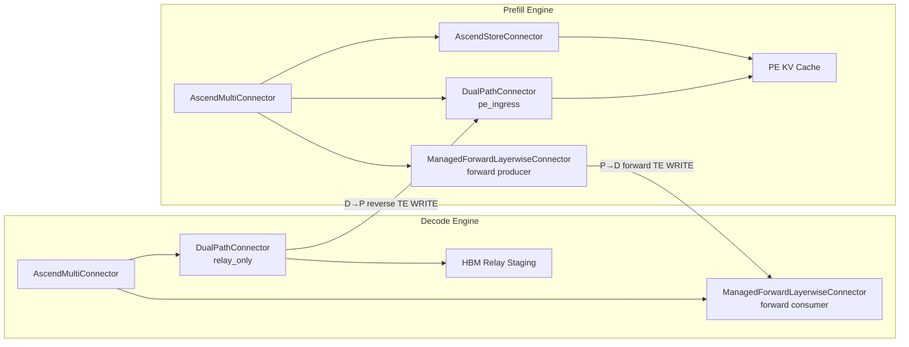
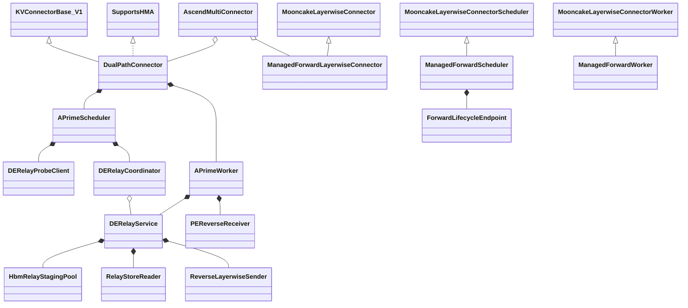
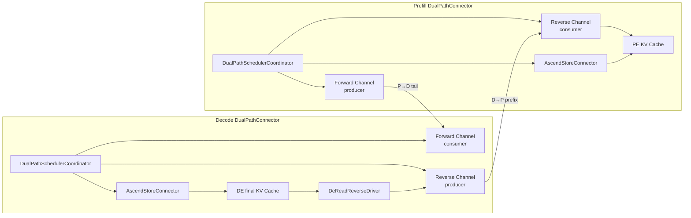
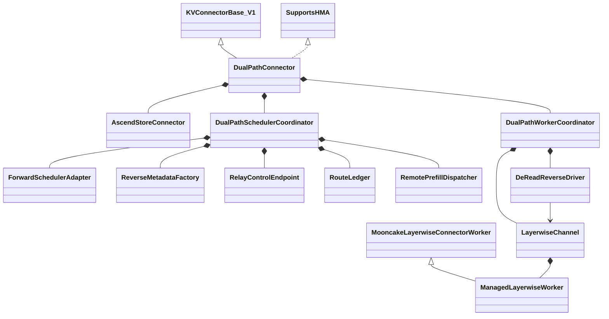
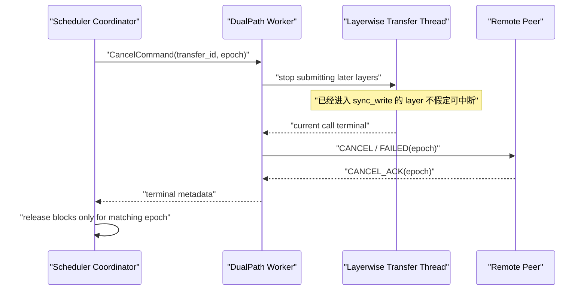

# DualPathConnector Stage 1 开发设计：A′ 外层编排与 B′ 内部组合

> **状态：WORKING SPEC / 工作规格，A′、B′ 已获暂时认可，最终选型尚未冻结。**
>
> 本文的目标不是提供概念框架，而是为两个候选方案分别给出可直接进入实现规划的组件边界、函数契约、类关系、时序、失败语义和验证标准。文中标注为“待验证”的内容必须通过单元测试或 NPU E2E 后才能升级为已实现能力。

| 项目 | 内容 |
|---|---|
| 文档日期 | 2026-07-23 |
| 目标仓库 | `vllm-ascend` |
| 目标分支 | `dev/dualpath` |
| 基线提交 | `78451d8f6 feat(kv_transfer): add DualPathConnector Stage 1 foundation` |
| 上游 vLLM | 只读取和复用既有契约，不允许修改 |
| 现有组件 | 允许组合和调用公开/完整功能，不允许修改源码 |
| Stage 1 重心 | 优先打通 DE-Read；PE-Read 复用现有 AscendStore + MooncakeLayerwise 通路 |
| P2P 数据面 | 尽量复用 `MooncakeLayerwiseConnector` 的 Worker、线程、metadata 和 Mooncake TE WRITE 逻辑 |

## 1. 文档定位

### 1.1 与初始方案的关系

本文以以下文档为设计输入，但不继承其中未经验证的实现假设：

- `/Users/leqi/Documents/Code/ub-reading/docs/output/design-doc-fuyaoArcConnector.md`
- `docs/superpowers/specs/2026-07-21-dual-path-connector-stage1-design.md`

本文只聚焦第一阶段 `DualPathConnector`。初始方案中的 MultiPath、cascade、拓扑发现、K 短路和多链路切片不进入本阶段开发范围。

本文修正以下初始假设：

1. `DualPathConnector` 不再默认继承 `MooncakeLayerwiseConnector`；
2. PE-Read 不是待打通路径，而是必须保持兼容的现有路径；
3. `AscendMultiConnector` 的 first-positive 不能直接比较语义不同的 DE Store 命中量与 remote-prefill 完整交付量；
4. 收到真实 blocks 不等价于成为 winner，因为 Ascend 对所有 `MooncakeLayerwiseConnector` 实例及其子类都有特殊放行；
5. DE-Read 的 Store Load 完成不等于 DE remote-prefill 完成；只有最终 P→D tail 完成，DE 才能离开等待状态。

### 1.2 事实状态标签

| 标签 | 含义 |
|---|---|
| `[已实现]` | 当前分支源码已经具备，且调用链已核对 |
| `[源码可达]` | 已有原语可以调用，但尚未形成本文定义的端到端路径 |
| `[A′]` | 候选 A′新增设计 |
| `[B′]` | 候选 B′新增设计 |
| `[待验证]` | 必须通过测试确认，不能作为当前能力宣传 |
| `[未决]` | A′/B′最终选型或产品策略尚未冻结 |

## 2. 已确认约束

### 2.1 修改边界

允许修改：

```text
vllm_ascend/distributed/kv_transfer/kv_p2p/dual_path/
tests/ut/distributed/kv_transfer/dual_path/
tests/e2e/nightly/kv_transfer/dual_path/
相关 vllm-ascend 配置示例和文档
Connector Factory 的新增注册项（只允许增加新类，不改变既有 Connector 行为）
```

禁止修改：

- `AscendMultiConnector`；
- `AscendStoreConnector` 及其 Scheduler、Worker、backend；
- `MooncakeLayerwiseConnector` 及其 Scheduler、Worker、发送/接收线程；
- Mooncake Store 和 Mooncake Transfer Engine；
- 上游 vLLM Scheduler、`MultiConnector`、`KVConnectorBase_V1`。

允许在 `dual_path/` 内：

- 组合完整 `AscendStoreConnector`；
- 构造独立的 `MooncakeLayerwiseConnectorWorker`；
- 复用 `ReqMeta`、`SendTask`、`LayerMetadata` 和发送/接收线程；
- 对现有 Worker 做不修改父类的薄适配或薄继承，以增加完成事件观察；
- 调用 Mooncake TE 的 `batch_transfer_sync_write()`。

### 2.2 Stage 1 功能边界

Stage 1 必须支持：

- 现有 PE-Read 行为保持正确；
- 新增 DE-Read：Store → DE → PE → Prefill tail → DE；
- 请求级选择 PE-Read 或 DE-Read；
- Store miss、提交前拒绝、明确失败、超时、取消和迟到消息处理；
- TP/PCP/DCP、block size、KV dtype/layout 的启动期校验；
- 对每一阶段的完成事件建立明确含义。

Stage 1 不支持：

- 同一请求跨多个 Connector 做 token-range cascade；
- 多条物理链路并行切片；
- 传输已经写入目标 blocks 后无损切换数据源；
- 在线 reshard、layout 转换或 dtype 转换；
- 修改 Store 对象格式；
- 使用一个 `kv_both` Mooncake Worker 同时承担正反两个方向；
- 未确认异步写入终止前复用目标 blocks。

首批模型范围固定为普通 Attention、单一 KV cache group、`pd_head_ratio == 1`。当前 Mooncake receiver 的 DONE/FAILED 只携带 request ID、没有 `group_idx`，因此 `len(kv_cache_config.kv_cache_groups) != 1` 必须启动失败。需要 Mooncake `need_truncate` 的 Attention+Mamba/Hybrid 请求同样 fail-fast；Stage 1 不允许在不同子 Connector 查询之间修改 prompt 长度。

## 3. 当前组件与真实调用边界

### 3.1 当前 DualPathConnector 只是 foundation

当前 `dual_path/connector.py`：

```text
DualPathConnector
    extends MooncakeLayerwiseConnector

DualPathConnectorScheduler
    extends MooncakeLayerwiseConnectorScheduler

DualPathConnectorWorker
    extends MooncakeLayerwiseConnectorWorker
```

`_req_path` 只是 Scheduler 内存中的 side table，未驱动 PE-Read/DE-Read 数据面。实际传输完全继承 MooncakeLayerwise 行为。因此当前实现不能完成本文定义的 DE-Read。

### 3.2 MultiConnector 是配置顺序 first-positive

`MultiConnector.get_num_new_matched_tokens()` 会查询所有子 Connector，但只记录第一个 `toks > 0` 的子 Connector：

```text
for connector in configured_order:
    tokens = connector.get_num_new_matched_tokens(...)
    if no_winner_yet and tokens > 0:
        winner = connector
```

它不是并发 race，也不会比较时延或命中长度。Worker 侧的以下函数会广播给所有子 Connector：

- `start_load_kv()`；
- `wait_for_layer_load()`；
- `save_kv_layer()`；
- `wait_for_save()`；
- `get_finished()`。

`get_finished()` 对接收完成做 union，而不是等待多个加载者全部完成。因此 Stage 1 不能让多个 sibling 同时写同一请求，再依赖外层 Multi 聚合。

### 3.3 AscendMultiConnector 的 Mooncake 特例

当前 `AscendMultiConnector.update_state_after_alloc()`：

```python
if i == chosen_connector or isinstance(c, MooncakeLayerwiseConnector):
    c.update_state_after_alloc(request, blocks, num_external_tokens)
else:
    c.update_state_after_alloc(request, empty_blocks, 0)
```

含义：

- winner 收到真实 blocks；
- 所有 `MooncakeLayerwiseConnector` 及其子类也收到真实 blocks；
- 其他 loser 收到 empty blocks 和 0。

因此：

- DualPath 若继承 Mooncake，就不能通过 blocks 判断自己是否胜出；
- DE 上的 raw Mooncake 即使是 loser，也可能根据 `do_remote_prefill` 创建接收状态并发起第二个 Prefill 请求；
- A′中的 DualPath 必须不是 Mooncake 子类；
- B′不能把 raw Mooncake 与 DualPath 作为 DE 外层 sibling。

### 3.4 MooncakeLayerwise 的 remote-prefill 合约

在 DE 的 `do_remote_prefill=True` 路径中：

```python
count = target_remote_prefix_tokens - num_computed_tokens
return count, count > 0
```

`update_state_after_alloc()` 保存 DE 最终目标 blocks，随后生成 PE 请求并设置：

```text
do_remote_decode = true
remote_block_ids = DE target blocks
remote_cached_tokens = DE request.num_computed_tokens
```

PE 模型 forward 逐层调用：

```text
save_kv_layer()
  → KVCacheSendingLayerThread
  → batch_transfer_sync_write()
  → DE target HBM
```

关键结论：Mooncake 在 DE Scheduler 返回的是“remote prefill 完成后 DE 将新增多少可用 Token”，不是某个 Store 的局部命中量。

### 3.5 AscendStore 的合约

`AscendStoreConnector.get_num_new_matched_tokens()` 返回 Store 在当前 `num_computed_tokens` 之后能够加载的增量，并建立 `LoadSpec`：

```text
need_to_allocate
  = kvpool_cached_tokens - vllm_cached_tokens
```

`update_state_after_alloc()` 会校验传入值严格等于上述增量。Worker 的非 layerwise 路径通过 Store backend `get(...)` 将对象加载到指定 KV Cache 地址。

因此在 B′中：

- DualPath 对外向 DE Scheduler 返回完整 remote-prefill 增量；
- 传给内部 AscendStore 的必须仍是 Store 局部增量；
- 两个数不得复用同一个字段。

### 3.6 一个 kv_both Worker 不能驱动双向 Layerwise

MooncakeLayerwise Worker 注册 KV Cache 时可以同时创建 producer 和 consumer 线程，但核心函数使用 consumer-first 分支：

```python
if is_kv_consumer:
    ...
elif is_kv_producer:
    ...
```

`start_load_kv()` 同样如此。因此 `kv_both` 只会进入 consumer 分支，不能同时构建 P→D 和 D→P metadata。

Stage 1 必须使用两个配置隔离的 Worker：

| 部署侧 | Forward Channel | Reverse Channel |
|---|---|---|
| Prefill | producer | consumer |
| Decode | consumer | producer |

### 3.7 Transfer Engine 内存注册约束

当前 `global_te.register_buffer()` 使用进程级布尔标志：第一次调用后，后续调用直接返回。

```text
first register_buffer(ptrs, sizes)
    → register_memory for every region
    → is_register_buffer = True

later register_buffer(...)
    → return
```

A′中的独立 HBM staging 必须在首次注册时与正常 KV Cache 一并注册。B′直接使用 DE 最终 KV blocks，不需要独立 staging，但 Forward/Reverse 两个 Worker 必须共享同一组已注册 KV Cache，而不能重复假设第二次注册有效。

### 3.8 实现锚点与复用边界

| 当前源码 | 关键 symbol | 本设计如何使用 |
|---|---|---|
| `vllm_ascend/distributed/kv_transfer/ascend_multi_connector.py` | `AscendMultiConnector.update_state_after_alloc()` | A′复用 first-winner 和 Mooncake special-case；不修改 |
| `vllm/distributed/kv_transfer/kv_connector/v1/multi_connector.py` | `MultiConnector.get_num_new_matched_tokens()`、Worker 广播、`get_finished()` | 只读取上游契约；不修改 |
| `vllm_ascend/distributed/kv_transfer/kv_p2p/mooncake_layerwise_connector.py` | Scheduler `get_num_new_matched_tokens()` / `update_state_after_alloc()`；Worker `register_kv_caches()` / `start_load_kv()` / `save_kv_layer()` / `get_finished()` | A′ Forward 薄包装；B′ Forward adapter 与双向 Worker 数据面；父文件零修改 |
| 同上 | `get_external_request_id()`、`send_done_send_signal()`、`batch_transfer_sync_write()` 调用链 | 固定 9 字符 ID contract、sender 非权威终态、实际 TE WRITE |
| `vllm_ascend/distributed/kv_transfer/kv_pool/ascend_store/ascend_store_connector.py` | 完整 Scheduler/Worker facade、`update_connector_output()`、`take_events()` | B′作为 child 完整组合；不复制其生命周期 |
| `vllm_ascend/distributed/kv_transfer/kv_pool/ascend_store/pool_scheduler.py` | `get_num_new_matched_tokens()`、`update_state_after_alloc()`、`LoadSpec`、命中归一化 | A′ Probe 对齐语义；B′直接委托 child |
| `vllm_ascend/distributed/kv_transfer/kv_pool/ascend_store/pool_worker.py` | Store `get()`、worker metadata、load errors | A′复用完整 key/layout 功能构建 staging 请求；B′不绕开 child |
| `vllm_ascend/distributed/kv_transfer/kv_pool/ascend_store/config_data.py` | `KeyMetadata`、group/cache-family schema | A′ Store manifest 的 wire/data schema |
| `vllm_ascend/distributed/kv_transfer/kv_p2p/dual_path/connector.py` | 当前 foundation | 允许在本仓库内重构/替换为本文选定方案 |

表中 `vllm/...` 指与当前 vLLM Ascend checkout 配套的只读上游 vLLM 源码；它不是本设计的修改目标。

## 4. 统一 Token 合约

本文统一使用以下变量，接口和日志中禁止使用无来源限定的 `cached_tokens`：

| 变量 | 含义 |
|---|---|
| `L` | DE 在进入 Connector 前已有的本地 computed prefix 长度 |
| `P` | PE 在进入 Connector 前已有的本地 computed prefix 长度 |
| `M` | remote prefill 完成后目标绝对前缀长度；Stage 1 普通 Attention 下等于 prompt 长度 |
| `H` | AscendStore 在 `L` 之后额外命中的增量 |
| `N` | `L + H`，DE Store Load 完成后 DE 持有的绝对前缀长度 |
| `E_D` | `M - L`，DE 顶层必须向 Scheduler 广告的 external token 数 |
| `E_P` | `max(N - P, 0)`，PE 在 DE-Read ingress 需要接收的 external token 数 |

Stage 1 约束：

```text
0 <= L <= N <= M
P = 0
H = N - L
E_D = M - L
E_P = N
```

Stage 1 强制关闭 PE APC，使 PE ingress 的 `P = 0`。DE-Read 只在 `H > 0` 时选择，因此 `N > 0`、`E_P=N>0`；`N=0` 必须选择 PE-Read。保留 `E_P=max(N-P, 0)` 这个通用定义只是为了说明后续 APC 扩展，Stage 1 不实现 `P>0` 的来源合并。

示例：prompt 1024，DE local 0，Store hit 768。

| 位置 | 值 |
|---|---:|
| `L` | 0 |
| `M` | 1024 |
| `H` | 768 |
| `N` | 768 |
| DE 顶层返回 `E_D` | 1024 |
| 内部 AscendStore 加载 | 768 |
| PE ingress 返回 `E_P` | 768 |
| PE 计算 tail | 256 |

如果 DE 顶层错误返回 768，DE Scheduler 在传输结束后仍会认为最后 256 个 Token 未计算，从而在 Decode 实例重复 Prefill。

## 5. 两个候选方案总览

| 维度 | A′：外层 first-winner | B′：DualPath 内部组合 |
|---|---|---|
| 路由位置 | PE `AscendMultiConnector` | DE `DualPathSchedulerCoordinator` |
| PE 顶层 Connector | Multi：DualPath ingress + AscendStore + ManagedForwardLayerwise | DualPathConnector |
| DE 顶层 Connector | Multi：DualPath relay-only + ManagedForwardLayerwise | DualPathConnector |
| Store 复用 | PE-Read 复用完整 AscendStore；DE relay 复用 Store backend/key/layout 功能 | PE/DE 都组合完整 AscendStoreConnector |
| P2P 复用 | ManagedForwardLayerwise 薄扩展生命周期，数据面复用 Mooncake；DualPath 组合反向原语 | DualPath 内部组合两个方向明确的 Mooncake Worker |
| DE 最终 blocks | relay 不可访问，使用独立 staging | Store 直接加载最终 DE blocks |
| 前缀是否重复 P2P | 通常是：D→P 后又 P→D | 否：P→D 从 `N` 开始 |
| 提交后失败切换 | 外层 Multi 不支持；只能 invalid blocks + recompute | 由内部状态机控制，但在途写未终止时仍不能立即复用 blocks |
| 既有组件改动 | 0 | 0 |
| 新增编排复杂度 | 中 | 高 |
| 数据面效率 | 较低 | 较高 |

两个方案互斥。实现计划必须选定其中一个，不能把 A′的外层路由与 B′的内部路由同时启用。

## 6. 方案 A′：PE 外层 first-winner + DE relay-only

### 6.1 设计动机

A′保留现有 `AscendMultiConnector` 作为真正的路径选择者。选择放在 PE，而不是 DE，原因是 PE 两个候选返回同一语义：

```text
“可以向 PE 当前请求的 KV Cache 加载多少 external prefix”
```

PE DualPath ingress 与 PE AscendStore 都写入 PE KV Cache，返回值的单位和目标语义兼容 first-positive。`AscendMultiConnector` 不比较命中长度，只选择配置顺序中的第一个正值。DE `ManagedForwardLayerwiseConnector` 保持 Mooncake 的完整 remote-prefill token 语义，并补齐失败、取消和 epoch 生命周期。

### 6.2 部署拓扑



### 6.3 Connector 配置顺序

PE：

```yaml
kv_transfer_config:
  kv_connector: MultiConnector
  kv_role: kv_producer
  kv_load_failure_policy: recompute
  kv_connector_extra_config:
    connectors:
      - kv_connector: DualPathConnector
        kv_role: kv_producer
        kv_connector_extra_config:
          role: pe
          orchestration: outer_first_winner
          mode: pe_ingress
          reverse_channel:
            port: 21001
            max_inflight_batches_per_rank: 1
          relay_control:
            listen_port: 22001
            request_timeout_ms: 30000

      - kv_connector: AscendStoreConnector
        kv_role: kv_producer
        kv_connector_extra_config:
          backend: mooncake
          use_layerwise: false

      - kv_connector: ManagedForwardLayerwiseConnector
        kv_role: kv_producer
        kv_port: 20001
        kv_connector_extra_config:
          forward_control:
            listen_port: 22003
            route_feedback_endpoint: tcp://127.0.0.1:22001
```

DE：

```yaml
kv_transfer_config:
  kv_connector: MultiConnector
  kv_role: kv_consumer
  kv_connector_extra_config:
    connectors:
      - kv_connector: DualPathConnector
        kv_role: kv_consumer
        kv_connector_extra_config:
          role: de
          orchestration: outer_first_winner
          mode: relay_only
          staging:
            backend: hbm
            capacity_blocks_per_group: 512
            max_inflight_requests: 1
          reverse_channel:
            port: 21002
            max_inflight_batches_per_rank: 1
          relay_control:
            listen_port: 22002
            request_timeout_ms: 30000

      - kv_connector: ManagedForwardLayerwiseConnector
        kv_role: kv_consumer
        kv_port: 20002
        kv_connector_extra_config:
          forward_control:
            listen_port: 22004
```

顺序是协议的一部分：

示例中的端口、capacity 和 timeout 是配置形态，不是冻结的生产默认值；实现必须要求显式配置或从经过评审的默认常量读取。

1. PE DualPath 必须在 AscendStore 之前，否则 Store 正命中会永久压制 DE-Read；
2. DE DualPath 必须在 Mooncake 之前完成 staging 联合注册；
3. DE DualPath Scheduler 永远返回 `(0, False)`，ManagedForwardLayerwise 返回 `E_D` 并成为 DE winner；
4. PE AscendStore 必须使用 `use_layerwise=false`，避免 loser Store 仍因内部 `LoadSpec` 发生 layerwise load。
5. Stage 1 PE/DE TP、PP 一致，双方 PCP/DCP 都为 1，普通 Attention 且 `pd_head_ratio=1`。

所有 `relay_control` / `forward_control` listen port 只由对应 Engine 的 Scheduler rank0 绑定。Worker rank 不监听这些端口；`kv_port + rank` 仍由既有 Mooncake channel 自己派生。PE Scheduler 只连接一个 DE relay coordinator，rank0 再通过 connector metadata fan-out 到 `expected_ranks` 个 Worker。

### 6.4 类关系



`DualPathConnector` 不继承 `MooncakeLayerwiseConnector`。反向 sender/receiver 是 DualPath 内部组合的数据面组件。`ManagedForwardLayerwiseConnector` 是 A′为满足现有 Ascend special-case 而设置的独立薄子类：它继续获得真实 PE blocks，但只扩展 request namespace、失败完成和 block 延迟释放，不改变 Mooncake P→D 数据搬运。

`ManagedForwardLayerwiseConnector` 不能调用父类 `__init__()` 后再替换对象；父类会硬编码创建原始 Scheduler/Worker。其构造方式冻结为与当前 DualPath foundation 相同：直接调用 `KVConnectorBase_V1.__init__()`，初始化父类要求的 metadata/engine 字段，然后按 role 显式构造 `ManagedForwardScheduler` 或 `ManagedForwardWorker`：

```python
class ManagedForwardLayerwiseConnector(MooncakeLayerwiseConnector):
    def __init__(self, config, role, kv_cache_config=None):
        KVConnectorBase_V1.__init__(self, config, role, kv_cache_config)
        assert config.kv_transfer_config is not None
        self._is_kv_producer = config.kv_transfer_config.is_kv_producer
        self.engine_id = config.kv_transfer_config.engine_id
        self._connector_metadata = MooncakeLayerwiseConnectorMetadata()
        if role is KVConnectorRole.SCHEDULER:
            self.connector_scheduler = ManagedForwardScheduler(
                config, kv_cache_config, str(self.engine_id)
            )
            self.connector_worker = None
        elif role is KVConnectorRole.WORKER:
            self.connector_scheduler = None
            self.connector_worker = ManagedForwardWorker(
                config, kv_cache_config, str(self.engine_id)
            )
        else:
            raise ValueError(f"unsupported role: {role}")
```

`DERelayCoordinator` 与 `ForwardLifecycleEndpoint` 都属于 Scheduler process/rank0 control plane；每个 rank 的 `DERelayService`/Managed Worker 只通过 metadata 接收命令并回传 WorkerMetadata，不各自监听同一个控制端口。

### 6.5 组件职责

| 组件 | PE | DE |
|---|---|---|
| `APrimeScheduler` | Probe DE；命中且策略选择 DE 时向 Multi 返回 `E_P` | 固定返回 0；不参与 DE 外层 winner |
| `DERelayProbeClient` | 查询 DE Store hit、资源和 schema | 不存在 |
| `APrimeWorker` | 接收 PE target blocks，启动 Reverse Receiver | 启动 relay service，不依赖 DE 最终 blocks |
| `DERelayService` | 不存在 | Store → staging → P |
| `HbmRelayStagingPool` | 不存在 | 独立、预分配、首次 TE 注册时纳入 |
| `ManagedForwardLayerwiseConnector` | P→D producer | P→D consumer，保持 `E_D` 语义并补齐 terminal 生命周期 |

### 6.6 A′关键接口

A′的 `DualPathConnector` 同样必须实现第 7.7 节列出的完整 `KVConnectorBase_V1 + SupportsHMA` 方法集合；本节只展开 A′特有的 Scheduler、relay 和 block ownership 契约。

```python
class APrimeScheduler:
    def get_num_new_matched_tokens(
        self,
        request: Request,
        num_computed_tokens: int,
    ) -> tuple[int | None, bool]:
        """PE: 返回 E_P 或 0；DE relay-only: 固定返回 (0, False)。"""

    def update_state_after_alloc(
        self,
        request: Request,
        blocks: KVCacheBlocks,
        num_external_tokens: int,
    ) -> None:
        """只有 PE 端收到真实 blocks 且 external>0 时提交 DE-Read。"""

    def build_connector_meta(
        self,
        scheduler_output: SchedulerOutput,
    ) -> APrimeConnectorMetadata:
        """向 PE Worker 下发已选择的 DEReadWorkerRequest。"""
```

A′ PE ingress 的资格门禁先于 Probe：只有 `kv_transfer_params.do_remote_decode is True`、`dual_path_stage1 is True` 且包含 `dual_path_wire_external_id`/fence 的远端 PE request 才进入 Probe；普通本地请求、健康探针、legacy Mooncake 请求和字段不全请求都返回 `(0, False)` 且不创建 Future/lease/side table。DE `relay_only` mode 无条件返回 `(0, False)`。DE ManagedForward 构造 metaserver payload 时负责加入 `dual_path_stage1=True`，现有 proxy 只透传，不需要修改。

```python
class DualPathConnector(KVConnectorBase_V1, SupportsHMA):
    def request_finished_all_groups(
        self,
        request: Request,
        block_ids: tuple[list[int], ...],
    ) -> tuple[bool, dict[str, Any] | None]:
        """PE reverse 未 terminal 时延迟释放 target blocks。"""

    def get_finished(
        self,
        finished_req_ids: set[str],
    ) -> tuple[set[str] | None, set[str] | None]:
        """PE reverse success/failure 都结束 PE async wait；失败同时登记 invalid blocks。"""

    def get_block_ids_with_load_errors(self) -> set[int]:
        """返回并清空 reverse/relay 写失败的 PE block IDs。"""

    def build_connector_worker_meta(
        self,
    ) -> APrimeWorkerMetadata | None:
        """回传单 group 下各 rank terminal、取消和 quarantine 事件。"""
```

所有 PE target rank 都 terminal 后才可返回 `finished_recving`。失败时 invalid block IDs 与 `finished_recving` 必须来自同一个 Worker step，避免上游只看到其中一半。

A′的 Forward wrapper 契约：

```python
class ManagedForwardLayerwiseConnector(
    MooncakeLayerwiseConnector,
    SupportsHMA,
):
    def update_state_after_alloc(
        self,
        request: Request,
        blocks: KVCacheBlocks,
        num_external_tokens: int,
    ) -> None:
        """拦截 parent 的即时 POST，改走 prepare/arm 两阶段。"""

    def request_finished_all_groups(
        self,
        request: Request,
        block_ids: tuple[list[int], ...],
    ) -> tuple[bool, dict[str, Any] | None]:
        """Forward terminal 未确认时延迟释放 DE/PE 相关 blocks。"""

    def get_finished(
        self,
        finished_req_ids: set[str],
    ) -> tuple[set[str] | None, set[str] | None]:
        """失败时原子返回 invalid blocks 对应的 finished_recving。"""

    def build_connector_meta(
        self,
        scheduler_output: SchedulerOutput,
    ) -> "ManagedForwardConnectorMetadata": ...

    def bind_connector_metadata(
        self,
        metadata: KVConnectorMetadata,
    ) -> None: ...

    def build_connector_worker_meta(
        self,
    ) -> "ManagedForwardWorkerMetadata | None": ...

    def update_connector_output(
        self,
        connector_output: KVConnectorOutput,
    ) -> None: ...
```

```python
@dataclass
class ManagedForwardConnectorMetadata(KVConnectorMetadata):
    mooncake_metadata: MooncakeLayerwiseConnectorMetadata
    commands: tuple[
        "ArmForwardReceiveCommand | ReleaseCommand | CancelCommand", ...
    ]


@dataclass
class ManagedForwardWorkerMetadata(KVConnectorWorkerMetadata):
    rank_id: int
    expected_ranks: int
    events: tuple["WorkerEvent", ...]

    def aggregate(
        self,
        other: KVConnectorWorkerMetadata,
    ) -> "ManagedForwardWorkerMetadata":
        """按 fence/event/rank 幂等聚合；冲突时 failure 优先。"""
```

`build_connector_meta()` 先调用 stateful parent Scheduler 生成 `mooncake_metadata`，再附加 rank-local arm/release/cancel commands。Worker 绑定时先把 `mooncake_metadata` 交给父类通道，再执行 commands；`build_connector_worker_meta()` 回传当前 rank 的 `FORWARD_ARMED`/terminal/release ACK。Scheduler 的 `update_connector_output()` 只读取聚合后的 `ManagedForwardWorkerMetadata`：全 rank `FORWARD_ARMED` 才 POST，receiver terminal 进入 control endpoint，release ACK 完成 source latch。不得把 wrapper metadata 原样传给父类 `bind_connector_metadata()`。

`update_state_after_alloc()` 必须完全覆写父类入口，不能先调用 `super()`：

```text
DE + do_remote_prefill
    → ManagedForwardScheduler.prepare_remote_prefill()
    → queue ArmForwardReceiveCommand
    → build_connector_meta() 下发
    → WorkerMetadata 聚合全 rank FORWARD_ARMED
    → update_connector_output() 调 on_forward_armed()
    → 此时才 POST metaserver

PE + do_remote_decode
    → ForwardSchedulerAdapter.arm_source()
    → 建立 synthetic-ID SendReqInfo，不触发 POST

其他请求
    → 不建立任何 ManagedForward state
```

```python
@dataclass(frozen=True)
class ForwardTransferKey:
    logical_request_id: str
    epoch: int
    transfer_id: str


SYNTHETIC_ENGINE_SUFFIX = "#dp000000"  # exactly 9 characters


@dataclass(frozen=True)
class ChannelRequestIds:
    logical_request_id: str
    wire_external_id: str
    local_worker_id: str

    @classmethod
    def for_transfer(
        cls,
        logical_request_id: str,
        epoch: int,
        transfer_id: str,
    ) -> "ChannelRequestIds":
        wire_id = (
            f"dualpath:{logical_request_id}:"
            f"{epoch}:{transfer_id}"
        )
        return cls(
            logical_request_id=logical_request_id,
            wire_external_id=wire_id,
            local_worker_id=wire_id + SYNTHETIC_ENGINE_SUFFIX,
        )


@dataclass(frozen=True)
class RemotePrefillDispatchIds:
    proxy_lookup_id: str
    channel: ChannelRequestIds
```

`ChannelRequestIds` 是 A′/B′共用 wire contract，不是 A′私有类型。这里必须区分三种 ID：

```text
logical_request_id   # 本 Engine/RouteLedger 的原请求
proxy_lookup_id      # 现有 proxy req_data_dict 已登记的原 external ID
wire_external_id     # epoch/transfer 唯一，只用于 Mooncake channel
local_worker_id      # wire_external_id + 固定 9 字符 suffix
```

向现有 metaserver POST 时，JSON `request_id` 必须保持 `proxy_lookup_id`，否则 proxy 无法命中已经保存的原请求；同时在 `kv_transfer_params` 中附带 `dual_path_wire_external_id`。PE 接单后的 `ForwardSchedulerAdapter` 维护 `engine_local_request_id → local_worker_id` 映射，把克隆 Request 和克隆 SchedulerOutput 的 request ID 改写为 synthetic `local_worker_id` 后再委托 Mooncake Scheduler。这样父类固定 strip-last-9 后发送的是 epoch 唯一的 `wire_external_id`，而 proxy、上游请求 ID 和既有组件都无需修改。Reverse Driver 没有 proxy lookup，直接使用相同的 `for_transfer()` synthetic channel ID。

DE Scheduler 构造 dispatch ID 时只在这里调用现有 `get_external_request_id(original_de_engine_local_id)` 得到 `proxy_lookup_id`，并断言原 ID 长度大于 9；epoch 绝不能写入这个 lookup ID。`wire_external_id` 由 `ChannelRequestIds.for_transfer()` 独立生成。对应 UT 必须用现有 proxy 的 `req_data_dict` lookup 行为证明：POST lookup 使用原 ID，PE channel DONE/FAILED 使用新 wire ID。

`ManagedForwardLayerwiseConnector` 的新增逻辑仅限：

1. Scheduler 创建每个 epoch 唯一的 `wire_external_id`，PE/DE 间的 Mooncake GET_META、DONE、FAILED 都使用该物理 ID；
2. 现有 Mooncake helper 会无条件移除 sender metadata request ID 的最后 9 个字符。Forward adapter 和 Reverse Driver 都必须使用上面的 9 字符 `SYNTHETIC_ENGINE_SUFFIX`；禁止把原 proxy/engine request ID 直接传入 channel helper；
3. 两个方向的父类表都严格保持 `request_map[wire_external_id] = local_worker_id` 和 `_recving_metadata[local_worker_id] = ReqMeta`；另设 wrapper 表 `local_worker_id → exact_engine_local_request_id + logical_request_id + epoch`，禁止把 logical ID 填入父类 `request_map`；
4. `ManagedLayerwiseWorker.poll_channel_events()` 直接在 receiver lock 下同时 drain raw done/failed sets，映射并清理上述两张父类表和 wrapper 表；它不得再调用父类 `get_finished()`，否则 failed ID 会被父类吞掉且清理时点不可控；
5. receiver 收到 FAILED 时，在同一个 Worker outcome 中产生 invalid block IDs，并向 vLLM `get_finished()` 返回该侧 Scheduler `self.requests` 中精确的 engine-local request ID；logical ID 只放入 RouteLedger/WorkerMetadata，不能作为 vLLM finished ID；
6. sender/receiver 未 terminal 时，`request_finished_all_groups()` 返回 delay-free；
7. DE receiver 是 Forward terminal 权威源；它把 wire ID 映射为 `ForwardTerminal`（结构见第 7.6 节）并经已有 relay control endpoint 回传 PE。PE ManagedForward 只有收到匹配 epoch/fence 的 terminal 后才产生 `finished_sending`，父类 sender callback 只作 telemetry；
8. 旧 epoch DONE/FAILED 只清理旧 transfer，不推进当前请求。

该 wrapper 允许复用父类 Scheduler/Worker 的 token 计算、block mapping、GET_META、`save_kv_layer()` 和 `batch_transfer_sync_write()`；对父类源码零修改。

A′不假定 Multi sibling 可以互相调用。Forward 生命周期完全由两个 `ManagedForwardLayerwiseConnector` 实例通过显式 control endpoint 闭环：

```python
@dataclass(frozen=True)
class ForwardSourceReady:
    fence: "TransferFence"
    wire_external_id: str
    pe_terminal_endpoint: str


@dataclass(frozen=True)
class RouteFailureFeedback:
    logical_request_id: str
    fence: "TransferFence"
    terminal: bool
    reason: str


class ForwardLifecycleEndpoint:
    def send_source_ready(
        self,
        de_endpoint: str,
        message: ForwardSourceReady,
    ) -> "ControlAck": ...

    def send_terminal(
        self,
        pe_endpoint: str,
        message: "ForwardTerminal",
    ) -> "ControlAck": ...

    def send_route_failure(
        self,
        loopback_endpoint: str,
        message: RouteFailureFeedback,
    ) -> "ControlAck": ...

    def receive(self, envelope: "ControlEnvelope") -> "ControlAck": ...


class ManagedForwardScheduler(MooncakeLayerwiseConnectorScheduler):
    def prepare_remote_prefill(
        self,
        request: Request,
        blocks: KVCacheBlocks,
        num_external_tokens: int,
    ) -> None:
        """建立 DE receiver/arm command；此时禁止 POST metaserver。"""

    def on_forward_armed(self, metadata: KVConnectorWorkerMetadata) -> None:
        """全部 rank armed 后才按 proxy_lookup_id POST 既有 metaserver。"""

    def on_forward_terminal(self, message: "ForwardTerminal") -> None:
        """更新 source-release latch；失败时发 loopback route feedback。"""


class ManagedForwardWorker(MooncakeLayerwiseConnectorWorker):
    def arm_forward_receive(
        self,
        command: "ArmForwardReceiveCommand",
    ) -> "WorkerEvent": ...

    def poll_channel_events(self) -> "ChannelPollResult":
        """使用共用的 wire/local/logical/fence 原子 drain 契约。"""
```

固定时序为：DE ManagedForward winner 先 `prepare_remote_prefill()`，Worker 绑定 `request_map` 并回传 `FORWARD_ARMED`，DE Scheduler 才 POST 既有 metaserver；PE ManagedForward 接单后发送 `ForwardSourceReady(pe_terminal_endpoint)` 到 DE Managed endpoint；DE receiver terminal 后把带 fence 的 `ForwardTerminal` 直接回给 PE Managed endpoint。PE Managed 自己清理 `SendReqInfo` 并在双 latch 满足后产生 `finished_sending`；失败时再把 `RouteFailureFeedback` 发到 `route_feedback_endpoint`，PE DualPath 只据此设置下一 epoch bypass。DualPath sibling 不接收 Forward terminal，也不直接清理 ManagedForward 状态。

`ManagedForwardScheduler` 必须保持 `engine_local_request_id → ChannelRequestIds` 映射，并使用第 7.8 节同构的 stateful Forward adapter 重写克隆 Request/SchedulerOutput 的 ID；不能把 `ManagedForwardLayerwiseConnector` 实现成只覆写一个 callback 的空壳。

```python
@dataclass(frozen=True)
class TransferKey:
    request_id: str
    request_epoch: int
    transfer_id: str
    source_engine_incarnation: str
    target_engine_incarnation: str


@dataclass(frozen=True)
class DEReadWorkerRequest:
    key: TransferKey
    reverse_channel_ids: ChannelRequestIds
    admission_lease_id: str
    lease_expires_at_ns: int
    relay_prefix_tokens: int       # N
    pe_external_tokens: int        # E_P
    load_request: RelayLoadRequest
    pe_target: PETargetManifest
    de_control_endpoint: str
    deadline_ns: int
    schema_fingerprint: str


@dataclass
class APrimeConnectorMetadata(KVConnectorMetadata):
    selected_de_reads: dict[str, DEReadWorkerRequest]
    cancelled_transfers: tuple[TransferKey, ...]


@dataclass(frozen=True)
class APrimeTransferOutcome:
    key: TransferKey
    phase: str
    rank: int
    group_idx: Literal[0]
    terminal: bool
    success: bool
    failed_block_ids: tuple[int, ...] = ()
    error: str | None = None


@dataclass
class APrimeWorkerMetadata(KVConnectorWorkerMetadata):
    rank_id: int
    expected_ranks: int
    outcomes: tuple[APrimeTransferOutcome, ...]

    def aggregate(
        self,
        other: KVConnectorWorkerMetadata,
    ) -> APrimeWorkerMetadata:
        """按 TransferKey/rank 聚合，冲突时 failure 优先。"""
```

```python
class DERelayProbeClient:
    def probe(
        self,
        request: ProbeRequest,
    ) -> Future[ProbeReply]:
        """只查询，不启动 Store Load 或 TE WRITE。"""


@dataclass(frozen=True)
class ProbeRequest:
    key: TransferKey
    model_name: str
    target_remote_tokens: int      # M
    de_local_tokens: int           # L
    pe_local_tokens: int           # P
    block_hashes_by_group: tuple[tuple[bytes, ...], ...]
    kv_cache_group_ids: tuple[int, ...]
    cache_transfer_granularity: int
    schema_fingerprint: str
    deadline_ns: int


@dataclass(frozen=True)
class ProbeReply:
    key: TransferKey
    hit_prefix_tokens: int         # N
    admission_lease_id: str | None
    expires_at_ns: int
    schema_fingerprint: str
    status: Literal["hit", "miss", "busy", "unsupported"]
```

`get_num_new_matched_tokens()` 对异步 Probe 的处理必须符合 Connector lookup 合约：

```text
首次查询且 Probe 未完成
    → 启动有界 Probe
    → 返回 (None, False)

后续查询且 Probe hit
    → 返回 (E_P, True)

后续查询且 miss/busy/unsupported/timeout
    → 清理 candidate
    → 返回 (0, False)，让后续 AscendStore 参与 first-positive
```

Probe 超时必须转换为确定的 0；不能无限返回 `None` 阻塞整个 MultiConnector。

DE Probe 的 raw Store hit 必须经过与 AscendStore 相同的归一化：cache transfer granularity、partial chunk 丢弃、full-hit 最后一个 Token 重算、group lookup 和 `num_external_hit_tokens < local_tokens`。建议共享只读 helper：

```python
def normalize_store_hit(
    request: ProbeRequest,
    raw_hit_tokens_by_group: tuple[int, ...],
) -> int:
    """返回所有必要 group 都可读的绝对 prefix N。"""
```

Probe lease 必须覆盖 Stage 1 `[0,N)` 所需的全部 Store objects，而不只覆盖相对 DE local 的 `[L,N)`。A′与 PE AscendStore 对同一请求必须得到一致的归一化 prefix 语义。

```python
@dataclass(frozen=True)
class StoreGroupManifest:
    group_id: int
    block_size: int
    cache_role: str
    cache_family: str
    num_layers: int
    layer_names: tuple[str, ...]
    tensor_components: tuple[str, ...]


@dataclass(frozen=True)
class RelayLoadRequest:
    key: TransferKey
    model_name: str
    token_length: int              # N
    block_hashes_by_group: tuple[tuple[bytes, ...], ...]
    key_metadata_by_group: tuple[KeyMetadata, ...]
    group_manifests: tuple[StoreGroupManifest, ...]
    load_mask_by_group: tuple[tuple[bool, ...], ...]
    cache_transfer_granularity: int
    schema_fingerprint: str


@dataclass(frozen=True)
class ResolvedRelayLoadPlan:
    request: RelayLoadRequest
    staging_block_ids_by_group: tuple[tuple[int, ...], ...]
    keys_by_group: tuple[tuple[str, ...], ...]
    addrs_by_group: tuple[tuple[int, ...], ...]
    sizes_by_group: tuple[tuple[int, ...], ...]


@dataclass(frozen=True)
class LayerTarget:
    layer_name: str
    group_id: int
    remote_block_ids: tuple[int, ...]
    remote_block_size: int
    tensor_components: tuple[str, ...]


@dataclass(frozen=True)
class PETargetRankManifest:
    rank: int
    host: str
    engine_id: str
    reverse_port: int
    te_rpc_port: int | None
    layers: tuple[LayerTarget, ...]


@dataclass(frozen=True)
class PETargetManifest:
    key: TransferKey
    cached_tokens: int             # N
    tp_size: int
    pcp_size: int
    dcp_size: int
    ranks: tuple[PETargetRankManifest, ...]
    schema_fingerprint: str


@dataclass(frozen=True)
class RelayPrepare:
    key: TransferKey
    channel_ids: ChannelRequestIds
    admission_lease_id: str
    lease_expires_at_ns: int
    load_request: RelayLoadRequest
    pe_target: PETargetManifest
    deadline_ns: int


@dataclass(frozen=True)
class RelayAccepted:
    key: TransferKey
    status: Literal["accepted", "lease_expired", "busy", "invalid"]
    accepted_rank_count: int
    error: str | None = None


@dataclass(frozen=True)
class RelayStatus:
    key: TransferKey
    phase: Literal["loading", "sending", "completed", "failed", "cancelled", "quarantined"]
    terminal: bool
    completed_ranks: tuple[int, ...]
    failed_ranks: tuple[int, ...]
    error: str | None = None


@dataclass(frozen=True)
class StagingAllocation:
    key: TransferKey
    block_ids_by_group: tuple[tuple[int, ...], ...]
    layer_metadata: Mapping[str, LayerMetadata]
    tensor_views: Mapping[str, tuple[torch.Tensor, ...]]


@dataclass(frozen=True)
class ReverseSendPlan:
    key: TransferKey
    channel_ids: ChannelRequestIds
    cached_tokens: int
    local_block_ids_by_group: tuple[tuple[int, ...], ...]
    pe_target: PETargetManifest


@dataclass(frozen=True)
class RelayLoadResult:
    key: TransferKey
    success: bool
    terminal: bool
    failed_keys: tuple[str, ...]
    failed_staging_blocks: tuple[int, ...]
    error: str | None = None


class DERelayService:
    def prepare(self, request: RelayPrepare) -> RelayAccepted: ...
    def cancel(self, key: TransferKey) -> None: ...
    def get_status(self, key: TransferKey) -> RelayStatus: ...


class DERelayCoordinator:
    def accept_prepare(self, request: RelayPrepare) -> RelayAccepted:
        """Scheduler rank0 校验 lease/schema，生成 per-rank Worker commands。"""

    def on_worker_outcomes(
        self,
        metadata: APrimeWorkerMetadata,
    ) -> RelayStatus:
        """聚合 expected_ranks；不由 Worker 直接回复 PE。"""


class RelayStoreReader:
    def resolve(
        self,
        request: RelayLoadRequest,
        allocation: StagingAllocation,
    ) -> ResolvedRelayLoadPlan: ...

    def load(
        self,
        plan: ResolvedRelayLoadPlan,
    ) -> RelayLoadResult:
        """复用 ChunkedTokenDatabase/KeyMetadata 和 Mooncake backend GET。"""


class ReverseLayerwiseSender:
    def submit(
        self,
        plan: ReverseSendPlan,
        staging: StagingAllocation,
    ) -> None:
        """复用 Mooncake layerwise metadata 和 TE WRITE 数据面。"""
```

A′选择以下固定实现路线，不保留模糊的“原始字节池”分支：

1. `HbmRelayStagingPool` 预分配 KV-cache-shaped tensors，每个 layer/group/component 都有与普通 KV Cache 相同的 block stride；
2. `StagingAllocation` 暴露真实 `LayerMetadata` 和 staging local block IDs；
3. PE wire request 不携带 DE staging block IDs；DE `DERelayService.prepare()` 先从 lease 对应的 staging pool 分配 `StagingAllocation`，再由 `RelayStoreReader.resolve(request, allocation)` 构造本地 `ResolvedRelayLoadPlan(keys/addrs/sizes)` 并调用现有 Mooncake backend `get()`；
4. `ReverseLayerwiseSender` 把 staging local block IDs 与 `PETargetManifest` 的 remote block IDs 转换成现有 `ReqMeta/SendTask`；
5. Reverse Worker 以 DE producer / PE consumer 两个独立方向配置运行；
6. staging tensors 同时注册到 Store backend 和 `global_te`，任何一个注册失败都使服务启动失败。

A′的 Reverse Worker 同样受实例级 `current_layer` 约束，Stage 1 每 rank 只允许一个活跃 reverse batch；staging admission 可以排队，但不能并发重置同一 Worker。

逻辑 Token 区间必须先转换为物理 manifest：

```text
logical [0, N)
    → per-group block-aligned local/remote block IDs
    → last-block valid token count
    → per-layer K/V tensor segments
    → Mooncake ReqMeta / SendTask
```

测试不得直接断言物理字节严格等于 `N` 个 Token；必须按 block/group 对齐后的 manifest 断言，并单独校验最后一块的有效 Token 边界。

### 6.7 A′ PE-Read 函数时序

```mermaid
sequenceDiagram
    participant PS as "PE Scheduler"
    participant PM as "PE AscendMulti"
    participant DP as "PE DualPath"
    participant AS as "PE AscendStore"
    participant ML as "PE MooncakeLayerwise"
    participant PW as "PE Worker"
    participant DW as "DE Mooncake Worker"

    PS->>PM: "get_num_new_matched_tokens(request, P)"
    PM->>DP: "get_num_new_matched_tokens"
    DP-->>PM: "0, False (policy chooses PE / miss / busy)"
    PM->>AS: "get_num_new_matched_tokens(request, P)"
    AS-->>PM: "store_hit-P, load_async"
    PM->>ML: "get_num_new_matched_tokens"
    ML-->>PM: "0, False (do_remote_decode)"
    PM-->>PS: "first-positive from AscendStore"

    PS->>PM: "update_state_after_alloc(real PE blocks, external)"
    PM->>DP: "empty blocks, 0"
    PM->>AS: "real blocks, external"
    PM->>ML: "real blocks, external (Ascend special-case)"

    PS->>PM: "build_connector_meta"
    PM->>PW: "bind metadata; start_load_kv"
    PW->>PW: "AscendStore loads PE prefix"
    PS->>PW: "model forward computes tail"
    loop "每层"
        PW->>ML: "save_kv_layer(layer_name, kv_layer, attn_metadata)"
        ML->>DW: "batch_transfer_sync_write(P→D)"
    end
    DW-->>PS: "DE finished_recving via original Mooncake lifecycle"
```

这条路径不新增数据面，只验证 DualPath loser 没有副作用。

### 6.8 A′ DE-Read 函数时序

```mermaid
sequenceDiagram
    participant DS as "DE Scheduler"
    participant DMC as "DE AscendMulti"
    participant DDR as "DE DualPath relay-only"
    participant DML as "DE ManagedForward Scheduler"
    participant Proxy
    participant PS as "PE Scheduler"
    participant PM as "PE AscendMulti"
    participant DP as "PE DualPath Scheduler"
    participant AS as "PE AscendStore"
    participant PW as "PE DualPath Worker"
    participant RS as "DE Relay Service"
    participant Store
    participant STG as "DE HBM Staging"
    participant PML as "PE ManagedForward Worker"
    participant DMW as "DE ManagedForward Worker"

    DS->>DMC: "get_num_new_matched_tokens(request, L)"
    DMC->>DDR: "get_num_new_matched_tokens"
    DDR-->>DMC: "0, False"
    DMC->>DML: "get_num_new_matched_tokens"
    DML-->>DMC: "E_D=M-L, async=True (winner)"
    DMC-->>DS: "E_D, async=True"
    DS->>DMC: "update_state_after_alloc(DE final blocks, E_D)"
    DMC->>DDR: "empty blocks, 0"
    DMC->>DML: "real DE final blocks, E_D"
    DML->>DMW: "arm Forward receiver(wire ID, fence, final blocks)"
    DMW-->>DML: "FORWARD_ARMED(all ranks)"
    DML->>Proxy: "POST proxy_lookup_id + channel wire ID; remote_cached_tokens=L"

    Proxy->>PS: "submit PE request"
    PS->>PM: "get_num_new_matched_tokens(request, P)"
    PM->>DP: "get_num_new_matched_tokens"
    DP->>RS: "probe(block hashes, schema, deadline)"
    RS->>Store: "lookup"
    Store-->>RS: "absolute hit prefix N"
    RS-->>DP: "ProbeReply(hit=N, lease)"
    DP-->>PM: "E_P=N, async=True"
    PM->>AS: "get_num_new_matched_tokens (仍查询但不是 winner)"
    PM-->>PS: "DualPath first-winner"

    PS->>PM: "update_state_after_alloc(PE real blocks, E_P)"
    PM->>DP: "real blocks, E_P"
    PM->>AS: "empty blocks, 0"
    PM->>PML: "real blocks, E_P"
    PML-->>DML: "ForwardSourceReady(PE Managed endpoint, fence)"
    PS->>PM: "build_connector_meta"
    PM->>PW: "start_load_kv(DEReadWorkerRequest)"
    PW->>RS: "PREPARE(PE target manifest, lease, epoch)"
    RS->>STG: "allocate full/streaming prefix staging"
    RS->>Store: "GET prefix into staging"
    Store-->>RS: "load complete"
    loop "每层或每个明确 segment"
        RS->>PW: "batch_transfer_sync_write(D staging→P final blocks)"
    end
    RS-->>PW: "DONE(transfer_id, epoch)"
    PW-->>PS: "finished_recving(PE request)"

    PS->>PS: "Prefill computes [N, M)"
    loop "每层"
        PS->>PML: "save_kv_layer"
        PML->>DMW: "P→D sends [L, M)"
    end
    DMW-->>DML: "receiver terminal(wire ID, fence)"
    DML-->>PML: "ForwardTerminal(fence)"
    DML-->>DS: "finished_recving(original DE request)"
    PML-->>PS: "finished_sending after source double latch"
```

A′的数据量：

```text
D→P reverse: [0, N)
P→D forward: [L, M)
重复区间（常见 P=0, L=0）: [L, N)，长度 H
```

重复传输是 A′保持原有 Mooncake Forward token 窗口的直接代价，不作为 bug 隐藏。Managed wrapper 只补充 terminal 生命周期，不改变 `[L,M)` 的发送起点。

### 6.9 HBM staging 与首次注册

```text
HbmRelayStagingPool
├── tensors[layer_name][component]
├── layer_metadata[layer_name]
├── capacity_blocks_by_group
├── free_block_ids_by_group
└── allocations[TransferKey]
    ├── block_ids_by_group
    ├── tensor_views
    ├── state
    └── in_flight_layers
```

状态：

```text
FREE → RESERVED → LOADING → READY → SENDING → FREE
                                  ↘ FAILED → QUARANTINED → FREE
```

启动不变量：

1. DualPath 在 DE Multi 中位于第 0 位；
2. `register_kv_caches()` 在首次 `global_te.register_buffer()` 前按正常 KV Cache schema 分配 staging tensors；
3. 正常 KV Cache regions 与 staging regions 一起提交 TE 注册；staging 同时向 Store backend 注册；
4. 若进入 DualPath 注册时发现 TE 已完成首次注册，启动失败；
5. staging block 数不足返回 `busy`，不能占用 Decode 正常 KV blocks；
6. staging 的 layer name、group、component、block stride 必须与 `schema_fingerprint` 一致。

### 6.10 A′失败与回退

| 阶段 | 行为 |
|---|---|
| Probe miss/busy/timeout | DualPath 返回 0；PE AscendStore 可成为 winner |
| DualPath 未收到真实 PE blocks | 视为 loser，释放 lease，不启动 relay |
| PREPARE 前取消 | 释放 lease和本地候选状态 |
| Store GET 明确失败 | PE target blocks 标 invalid；同时完成等待，使上游按 `recompute` 重调度 |
| TE WRITE 明确失败 | PE target blocks 标 invalid；请求失败/recompute |
| Store/TE 仅超时且后台状态未知 | staging 与 PE blocks 进入 `QUARANTINED`，不得立即复用 |
| ManagedForward P→D 失败 | wrapper 原子上报 invalid blocks + finished_recving；按 `kv_load_failure_policy=recompute` 重调度 |

外层 Multi 不提供 winner 转移接口。因此 DualPath 一旦成为 PE winner，不能在同一个 Scheduler allocation 中切回 sibling AscendStore。A′提供的是：

- 提交前 PE-Read fallback；
- 提交后 invalid blocks + recompute；
- 不是无重算热切换。

为防止失败后无限重复选择 DE-Read，A′维护 retry bypass：

```text
terminal DE-Read failure at epoch e
    → mark force_pe_read_on_retry(logical_request_id, e+1)
    → cancel Probe Future and release old lease
    → DualPath 只清理自己的 Probe/reverse metadata
    → ManagedForward terminal handler 自己清理 SendReqInfo/source latch
    → next scheduler lookup returns 0 from DualPath
    → AscendStore/PE recompute path proceeds
```

只有新 logical request，或 cooldown 后生成的新 epoch 并通过显式健康检查，才允许再次选择 DE-Read。旧 epoch 的 DONE/FAILED 只能完成旧 transfer ownership，不能清除新 epoch 的 bypass。

### 6.11 A′局限

1. 选路是配置顺序 first-positive，不是两个 Store lookup 的公平竞速；
2. DualPath 只能根据自己的 DE Probe、metrics 和策略决定“返回正数还是主动让路”，看不到 sibling AscendStore 的真实本次查询结果；
3. DE relay 使用独立 HBM staging，占用额外 HBM；
4. relayed prefix 通常会再次 P→D；
5. staging 的首次 TE 注册顺序是启动硬约束；
6. post-commit 不能切换到 AscendStore，只能 recompute；
7. 跨服务取消依赖 control protocol 的 epoch/lease，不由现有 Multi 自动传播。

## 7. 方案 B′：DualPath 顶层编排 + Store/双向 Layerwise 组合

### 7.1 设计动机

B′让 `DualPathConnector` 自己掌握：

- DE Scheduler 对外的完整 remote-prefill token 合约；
- PE-Read/DE-Read 选择；
- DE 最终 blocks；
- Store 局部加载范围；
- D→P reverse 和 P→D forward 的起止区间；
- 完成、取消、失败和 quarantine 状态。

它不继承 `MooncakeLayerwiseConnector`，但尽量复用 Mooncake Layerwise Worker/Data Plane。

### 7.2 部署拓扑

PE、DE 顶层都只配置一个 DualPathConnector：



### 7.3 类继承与组合关系



明确关系：

- `DualPathConnector` 与 `MooncakeLayerwiseConnector` 没有继承关系；
- `ManagedLayerwiseWorker` 冻结为薄继承点，只增加 receiver arm、terminal poll、ID/fence cleanup，不改变父类 TE WRITE 数据面逻辑；
- Forward producer 侧通过 `ForwardSchedulerAdapter` 在克隆 Request 上复用现有 `MooncakeLayerwiseConnectorScheduler` 的 `SendReqInfo`、chunked-prefill block 扩展和 `build_connector_meta()`；
- Reverse 方向没有模型 forward，由 `ReverseMetadataFactory` 生成方向明确的 metadata；
- `RelayControlEndpoint` 属于 Scheduler Coordinator，每个 Engine 只绑定一个控制端口；Worker 只运行 rank-local Store/TE 数据面，不监听跨 Engine 路由控制端口；
- 这一选择不改变 DualPath 顶层接口和 metadata。

### 7.4 子组件构造与配置隔离

每个子组件必须获得独立的浅拷贝 `VllmConfig` 和新的 `KVTransferConfig`：

```python
def build_child_config(
    parent: VllmConfig,
    child_transfer_config: KVTransferConfig,
) -> VllmConfig:
    child = copy.copy(parent)
    child.kv_transfer_config = child_transfer_config
    return child
```

禁止多个子组件原地修改同一个 `KVTransferConfig`。

方向派生：

| Side | Store | Forward | Reverse |
|---|---|---|---|
| PE | producer 语义，保留现有 PE-Read | producer | consumer |
| DE | consumer，`consumer_is_to_load=true` | consumer | producer |

Forward 与 Reverse 必须使用不同的：

- `engine_id` 后缀；
- `kv_port` 范围；
- Worker 实例；
- Scheduler metadata；
- request namespace。

### 7.5 配置接口

DE 示例：

```yaml
kv_transfer_config:
  kv_connector: DualPathConnector
  kv_role: kv_consumer
  kv_connector_extra_config:
    dual_path_role: decode

    strategy:
      mode: static_de_first

    store:
      backend: mooncake
      consumer_is_to_load: true
      load_async: true
      use_layerwise: false

    forward_channel:
      port: 20002

    reverse_channel:
      port: 21002
      max_inflight_batches_per_rank: 1

    relay_control:
      port: 22002
      request_timeout_ms: 30000
```

PE 示例：

```yaml
kv_transfer_config:
  kv_connector: DualPathConnector
  kv_role: kv_producer
  kv_connector_extra_config:
    dual_path_role: prefill

    store:
      backend: mooncake
      use_layerwise: false

    forward_channel:
      port: 20001

    reverse_channel:
      port: 21001
      max_inflight_batches_per_rank: 1

    relay_control:
      port: 22001
```

B′不新增 `store_probe_timeout_ms`。当前 AscendStore lookup 是同步调用，并可能在返回前写入内部 `load_specs`；外层无法用一个短 Future timeout 安全撤销它。Probe 与 Load 超时只能复用现有 AscendStore/backend 配置和 terminal 语义，DualPath 不伪造“超时即未写入”。

启动期 fail-fast：

- Forward/Reverse/control 端口范围不重叠；
- PE、DE 的 TP 和 PP 一致；
- Stage 1 PE PCP = DE PCP = 1，PE DCP = DE DCP = 1；这同时满足 Forward/Reverse 两个 consumer Worker 的现有 Mooncake 约束；
- KV block size、dtype、layout、group schema 一致；
- `len(kv_cache_groups) == 1`；多 group terminal 留待协议扩展；
- Stage 1 `pd_head_ratio == 1`；
- 不生成 `kv_both` 子配置；
- PE APC 必须关闭；启动后观测到 `P != 0` 立即拒绝请求，不降级为隐式 prefix 合并；
- child config 不污染 parent config。

### 7.6 B′核心数据类型

```python
class PathKind(Enum):
    PE_READ = "pe_read"
    DE_READ = "de_read"


class RoutePhase(Enum):
    PROBED = "probed"
    ALLOCATED = "allocated"
    FORWARD_ARMING = "forward_arming"
    STORE_LOADING = "store_loading"
    FALLBACK_DISPATCHING = "fallback_dispatching"
    WAIT_REVERSE_PREPARE = "wait_reverse_prepare"
    REVERSE_SENDING = "reverse_sending"
    PREFILLING = "prefilling"
    FORWARD_RECEIVING = "forward_receiving"
    COMPLETED = "completed"
    CANCELLING = "cancelling"
    CANCELLED = "cancelled"
    FAILED = "failed"
    QUARANTINED = "quarantined"
```

```python
@dataclass(frozen=True)
class PathDecision:
    request_id: str
    epoch: int
    path: PathKind
    de_local_tokens: int           # L
    target_remote_tokens: int      # M
    advertised_external_tokens: int  # E_D = M-L
    store_new_tokens: int          # H
    relay_cached_tokens: int       # N = L+H
    reason: str
    deadline_ns: int
```

```python
@dataclass(frozen=True)
class ForwardTransferWindow:
    source_ready_tokens: int
    target_cached_tokens: int
    total_remote_tokens: int


# PE-Read
# target_cached_tokens = L
#
# DE-Read
# target_cached_tokens = N
```

```python
@dataclass(frozen=True)
class ReversePrepare:
    transfer_id: str
    request_id: str
    pe_engine_local_request_id: str
    epoch: int
    cached_tokens: int             # N
    remote_block_ids: tuple[tuple[int, ...], ...]
    remote_block_size: tuple[int, ...]
    pe_engine_id: str
    pe_host: str
    reverse_port: int
    pe_tp_size: int
    pe_pcp_size: int
    pe_dcp_size: int
    schema_fingerprint: str
    fence: "TransferFence"
```

```python
@dataclass(frozen=True)
class ForwardTarget:
    transfer_id: str
    request_id: str
    epoch: int
    target_cached_tokens: int      # PE-Read=L；DE-Read=N
    remote_block_ids: tuple[tuple[int, ...], ...]  # DE final blocks
    remote_block_size: tuple[int, ...]
    de_engine_id: str
    de_host: str
    forward_port: int
    de_tp_size: int
    de_pcp_size: int
    de_dcp_size: int
    schema_fingerprint: str

    def to_mooncake_params(self) -> dict[str, Any]:
        return {
            "remote_block_ids": self.remote_block_ids,
            "remote_block_size": self.remote_block_size,
            "remote_engine_id": self.de_engine_id,
            "remote_host": self.de_host,
            "remote_port": self.forward_port,
            "remote_tp_size": self.de_tp_size,
            "remote_pcp_size": self.de_pcp_size,
            "remote_dcp_size": self.de_dcp_size,
            "remote_cached_tokens": self.target_cached_tokens,
            "dual_path_transfer_id": self.transfer_id,
            "dual_path_epoch": self.epoch,
        }
```

`ReversePrepare` 描述 D→P 的 PE 目标；`ForwardTarget` 描述 P→D 的 DE 目标。两者不能复用同一个字段或类型。

`ForwardTarget.to_mooncake_params()` 是唯一允许的字段展平入口，字段逐一映射到现有 Mooncake receiver 所需的 `remote_block_ids`、block size、engine/host/port、TP/PCP/DCP 和 `remote_cached_tokens`。这些字段通过 `params.update(...)` 放在 PE request 的 `kv_transfer_params` 顶层，不能保留成 parent Scheduler 不识别的 nested `forward_target`。调用方不得再次手写一套近似字典；`schema_fingerprint` 在展平前本地校验，不通过则不 arm receiver。

```python
@dataclass(frozen=True)
class DualPathRemotePrefillRequest:
    logical_request_id: str
    dispatch_ids: RemotePrefillDispatchIds
    epoch: int
    route: PathKind
    de_local_tokens: int           # L
    relay_cached_tokens: int       # PE_READ=L；DE_READ=N
    target_remote_tokens: int      # M
    forward_target: ForwardTarget
    fence: "TransferFence"
    de_control_endpoint: str
    metaserver_url: str
    deadline_ns: int

    def to_kv_transfer_params(self) -> dict[str, Any]:
        if self.relay_cached_tokens != self.forward_target.target_cached_tokens:
            raise ValueError("route and ForwardTarget cached-token windows diverged")
        if (
            self.fence.transfer_id != self.forward_target.transfer_id
            or self.fence.epoch != self.epoch
        ):
            raise ValueError("request, target and fence identity diverged")
        params = {
            "request_id": self.dispatch_ids.proxy_lookup_id,
            "dual_path_wire_external_id": (
                self.dispatch_ids.channel.wire_external_id
            ),
            "dual_path_route": self.route.value,
            "dual_path_epoch": self.epoch,
            "dual_path_fence": asdict(self.fence),
            "dual_path_de_control_endpoint": self.de_control_endpoint,
            "do_remote_prefill": False,
            "do_remote_decode": True,
            "target_remote_tokens": self.target_remote_tokens,
            "deadline_ns": self.deadline_ns,
        }
        params.update(self.forward_target.to_mooncake_params())
        return params


class RemotePrefillDispatcher:
    def submit(
        self,
        request: DualPathRemotePrefillRequest,
    ) -> Future["DispatchPostResult"]:
        """POST 到既有 proxy/metaserver；lookup ID 与 channel wire ID 分离。"""


@dataclass(frozen=True)
class DispatchPostResult:
    proxy_lookup_id: str
    http_status: int
    attempts: int
    accepted_by_http: bool
```

Dispatcher 使用隔离的 `httpx.Client` 和与现有 Mooncake Scheduler 相同的 TLS 配置；对同一个 payload 最多重试三次。HTTP 2xx 只表示 metaserver POST 被接收，不表示 PE 已创建 channel；真正的远端准入 ACK 是带 matching fence 的 `ForwardSourceReady`。HTTP 结果未知时不能再次生成新的 wire ID，必须以同一 control envelope/fence 等待或查询。

派发时点：

- 两条路径都必须先由 DE Scheduler 下发 `ArmForwardReceiveCommand`；DE Worker 建立 `request_map[wire_external_id] = local_worker_id`、`local_worker_id → original DE engine-local/logical ID` wrapper 映射，绑定 DE final blocks，并回传所有 rank 的 `FORWARD_ARMED`；
- `PE_READ`：收到完整 `FORWARD_ARMED` 后派发，`relay_cached_tokens=L`；
- `DE_READ`：Store Load 与 Forward arm 可以并行，但仅在 `STORE_DONE && FORWARD_ARMED` 后派发，`relay_cached_tokens=N`；
- 两者都携带同一 DE final `ForwardTarget`；
- 派发失败尚未发生远端写时可以进入受控 fallback；状态未知时进入 quarantine。

这个前置握手是硬顺序：如果 PE proxy request 已启动而 DE receiver 还没有 request-map entry，首层 WRITE/DONE 可能成为不可归属的迟到消息。`FORWARD_ARMED` 只证明接收面就绪，不代表任何 KV 已传输，也不能完成 DE 请求。

Scheduler 间的 relay control protocol：

```python
@dataclass(frozen=True)
class TransferFence:
    transfer_id: str
    request_id: str
    epoch: int
    source_engine_incarnation: str
    target_engine_incarnation: str


@dataclass(frozen=True)
class ReverseTerminal:
    fence: TransferFence
    success: bool
    completed_ranks: tuple[int, ...]
    failed_ranks: tuple[int, ...]
    failed_block_ids: tuple[int, ...]
    error: str | None = None


@dataclass(frozen=True)
class ForwardTerminal:
    fence: TransferFence
    success: bool
    failed_block_ids: tuple[int, ...]
    error: str | None = None


@dataclass(frozen=True)
class RecoveryReady:
    fence: TransferFence
    retired_fence: TransferFence
    pe_engine_local_request_id: str
    target_cached_tokens: int
    channel_ids: ChannelRequestIds
    forward_target: ForwardTarget


@dataclass(frozen=True)
class RetireForwardEpoch:
    fence: TransferFence
    pe_engine_local_request_id: str


@dataclass(frozen=True)
class ForwardEpochRetired:
    fence: TransferFence
    pe_engine_local_request_id: str
    source_started: bool
    send_info_removed: bool


@dataclass(frozen=True)
class ArmForwardReceiveCommand:
    ids: ChannelRequestIds
    de_engine_local_request_id: str
    target: ForwardTarget
    fence: TransferFence


@dataclass(frozen=True)
class ReleaseCommand:
    fence: TransferFence
    engine_local_request_id: str
    local_worker_id: str
    release_source: bool
    release_target: bool
    reason: str


@dataclass(frozen=True)
class ArmReverseReceiveCommand:
    ids: ChannelRequestIds
    prepare: ReversePrepare


@dataclass(frozen=True)
class StartReverseSendCommand:
    plan: ReverseSendPlan
    fence: TransferFence


@dataclass(frozen=True)
class CancelCommand:
    fence: TransferFence
    reason: str


WorkerCommand = (
    ArmForwardReceiveCommand
    | ArmReverseReceiveCommand
    | StartReverseSendCommand
    | ReleaseCommand
    | CancelCommand
)


@dataclass(frozen=True)
class CancelTransfer:
    fence: TransferFence
    reason: str


@dataclass(frozen=True)
class FenceProbe:
    fence: TransferFence


ControlPayload = (
    ReversePrepare
    | ReverseTerminal
    | ForwardSourceReady
    | ForwardTerminal
    | RecoveryReady
    | RetireForwardEpoch
    | ForwardEpochRetired
    | RouteFailureFeedback
    | CancelTransfer
    | FenceProbe
)


@dataclass(frozen=True)
class ControlEnvelope:
    schema_version: Literal[1]
    message_id: str
    kind: Literal[
        "reverse_prepare",
        "reverse_terminal",
        "forward_source_ready",
        "forward_terminal",
        "recovery_ready",
        "retire_forward_epoch",
        "forward_epoch_retired",
        "route_failure",
        "cancel",
        "fence_probe",
    ]
    fence: TransferFence
    payload: ControlPayload
    payload_sha256: str
    deadline_ns: int


@dataclass(frozen=True)
class ControlAck:
    message_id: str
    status: Literal["accepted", "duplicate", "stale", "rejected"]
    observed_phase: RoutePhase | None
    error: str | None = None


class RelayControlEndpoint:
    def send(
        self,
        peer_scheduler_endpoint: str,
        envelope: ControlEnvelope,
    ) -> ControlAck: ...

    def send_reverse_prepare(
        self,
        de_scheduler_endpoint: str,
        message: ReversePrepare,
    ) -> ControlAck: ...

    def send_reverse_terminal(
        self,
        de_scheduler_endpoint: str,
        message: ReverseTerminal,
    ) -> ControlAck: ...

    def send_forward_terminal(
        self,
        pe_scheduler_endpoint: str,
        message: ForwardTerminal,
    ) -> ControlAck: ...

    def send_forward_source_ready(
        self,
        de_scheduler_endpoint: str,
        message: ForwardSourceReady,
    ) -> ControlAck: ...

    def send_recovery_ready(
        self,
        pe_scheduler_endpoint: str,
        message: RecoveryReady,
    ) -> ControlAck: ...

    def send_retire_forward_epoch(
        self,
        pe_scheduler_endpoint: str,
        message: RetireForwardEpoch,
    ) -> ControlAck: ...

    def send_forward_epoch_retired(
        self,
        de_scheduler_endpoint: str,
        message: ForwardEpochRetired,
    ) -> ControlAck: ...

    def send_route_failure(
        self,
        loopback_endpoint: str,
        message: RouteFailureFeedback,
    ) -> ControlAck: ...

    def send_cancel(
        self,
        peer_scheduler_endpoint: str,
        message: CancelTransfer,
    ) -> ControlAck: ...

    def receive(self, envelope: ControlEnvelope) -> ControlAck: ...

    def on_reverse_prepare(self, message: ReversePrepare) -> ControlAck: ...
    def on_reverse_terminal(self, message: ReverseTerminal) -> ControlAck: ...
    def on_forward_source_ready(self, message: ForwardSourceReady) -> ControlAck: ...
    def on_forward_terminal(self, message: ForwardTerminal) -> ControlAck: ...
    def on_recovery_ready(self, message: RecoveryReady) -> ControlAck: ...
    def on_retire_forward_epoch(self, message: RetireForwardEpoch) -> ControlAck: ...
    def on_forward_epoch_retired(self, message: ForwardEpochRetired) -> ControlAck: ...
    def on_route_failure(self, message: RouteFailureFeedback) -> ControlAck: ...
    def on_cancel(self, message: CancelTransfer) -> ControlAck: ...
    def on_fence_probe(self, message: FenceProbe) -> ControlAck: ...
```

PE Worker 不直接向 DE Scheduler 发控制消息。PE Worker 先通过 `DualPathWorkerMetadata` 把 receiver terminal 交给本地 PE Scheduler Coordinator，再由唯一的 Scheduler `RelayControlEndpoint` 发送 `ReverseTerminal`。这样每个 Engine 只有一个控制面 owner，rank Worker 不争抢控制端口。

所有 send 使用同一个 `message_id` 做有界重试；receiver 先校验 schema、payload hash、fence 两个 incarnation 和 ledger epoch，再调用 handler。`message_id → payload hash + ack` 幂等缓存覆盖 active transfer 生命周期：重复同 payload 返回 `duplicate`，同 ID 异 payload返回 `rejected`，旧 fence 返回 `stale` 且不得改变状态。ACK 超时只表示状态未知，不能推导 peer 未执行。Cancel、terminal 和 fence-probe 都遵守相同规则。

```python
@dataclass(frozen=True)
class StoreLoadResult:
    request_id: str
    epoch: int
    success: bool
    failed_block_ids: tuple[int, ...]
    terminal: bool
    error: str | None = None
```

```python
@dataclass
class DualPathConnectorMetadata(KVConnectorMetadata):
    store_metadata: KVConnectorMetadata | None
    forward_metadata: MooncakeLayerwiseConnectorMetadata | None
    reverse_metadata: MooncakeLayerwiseConnectorMetadata | None
    commands: list[WorkerCommand]


class WorkerEventType(Enum):
    FORWARD_ARMED = "forward_armed"
    FORWARD_ARM_FAILED = "forward_arm_failed"
    FORWARD_RETIRED = "forward_retired"
    STORE_DONE = "store_done"
    STORE_FAILED = "store_failed"
    STORE_UNKNOWN = "store_unknown"
    REVERSE_DONE = "reverse_done"
    REVERSE_FAILED = "reverse_failed"
    REVERSE_UNKNOWN = "reverse_unknown"
    FORWARD_DONE = "forward_done"
    FORWARD_FAILED = "forward_failed"
    FORWARD_UNKNOWN = "forward_unknown"
    CANCEL_ACK = "cancel_ack"


@dataclass(frozen=True)
class WorkerEvent:
    event_type: WorkerEventType
    fence: TransferFence
    engine_local_request_id: str
    logical_request_id: str
    rank: int
    group_idx: Literal[0]
    terminal: bool
    success: bool
    failed_block_ids: tuple[int, ...] = ()
    error: str | None = None


@dataclass
class DualPathWorkerMetadata(KVConnectorWorkerMetadata):
    rank_id: int
    expected_ranks: int
    events: tuple[WorkerEvent, ...]
    store_worker_metadata: KVConnectorWorkerMetadata | None = None

    def aggregate(
        self,
        other: KVConnectorWorkerMetadata,
    ) -> DualPathWorkerMetadata:
        """聚合 rank 事件，并委托 Store metadata.aggregate()。"""
```

`RouteLedger` 在 allocation 时冻结 `expected_ranks`；Stage 1 启动期强制 `expected_groups == 1`，因此 `group_idx` 固定为 0。`aggregate()` 校验所有输入的 `expected_ranks` 一致、同一 rank 不重复，再合并事件并委托 Store child metadata 自身的 `aggregate()`。完全相同事件可以去重；同一 `(fence, event_type, rank, group_idx)` 出现 success/failure 冲突时，以 failure 为准并记录协议错误。`FORWARD_ARMED` 是 barrier ACK，设置 `terminal=False`，但仍要求所有预期 rank `success=True`；Store/Reverse/Forward 完成事件设置 `terminal=True`，只有全部预期 rank terminal 且成功时才推进对应完成阶段。

Worker command 的执行入口冻结如下：

```python
class DualPathWorkerCoordinator:
    def handle_command(self, command: WorkerCommand) -> WorkerEvent | None:
        match command:
            case ArmForwardReceiveCommand():
                return self.forward_worker.arm_forward_receive(command)
            case ArmReverseReceiveCommand():
                return self.reverse_worker.arm_reverse_receive(command)
            case StartReverseSendCommand():
                self.reverse_driver.submit(command.plan, command.fence)
                return None
            case ReleaseCommand():
                return self.release_latches.apply(command)
            case CancelCommand():
                return self.cancel(command)


class ManagedLayerwiseWorker(MooncakeLayerwiseConnectorWorker):
    def arm_forward_receive(
        self,
        command: ArmForwardReceiveCommand,
    ) -> WorkerEvent:
        """
        用 ids.local_worker_id 构造 Mooncake metadata，调用父类
        start_load_kv()；建立 request_map[wire]=local_worker_id、
        _recving_metadata[local_worker_id]=meta 和 wrapper logical map。
        成功后返回当前 rank 的 FORWARD_ARMED。
        """

    def arm_reverse_receive(
        self,
        command: ArmReverseReceiveCommand,
    ) -> WorkerEvent:
        """同上，但 target 为 PE blocks、方向为 Reverse consumer。"""
```

handler 对同一 `(fence, command type, rank)` 必须幂等：重复 arm 返回相同 ACK；同 fence 但 payload hash 不同返回失败并隔离，不能覆盖已绑定 metadata。

`CancelCommand` 用于已开始/未知传输时返回普通 `CANCEL_ACK/UNKNOWN`；用于 recovery 的旧 Forward receiver 且 PE 已证明 `source_started=False` 时，Worker 原子删除 old `request_map/_recving_metadata/wrapper map` 并返回 `FORWARD_RETIRED`。只有全 rank retired 才允许新 epoch arm。

### 7.7 DualPathConnector 对外接口

```python
class DualPathConnector(KVConnectorBase_V1, SupportsHMA):
    def __init__(
        self,
        vllm_config: VllmConfig,
        role: KVConnectorRole,
        kv_cache_config: KVCacheConfig | None = None,
    ) -> None: ...

    def bind_gpu_block_pool(self, gpu_block_pool: BlockPool) -> None: ...

    # Scheduler side
    def get_num_new_matched_tokens(
        self,
        request: Request,
        num_computed_tokens: int,
    ) -> tuple[int | None, bool]: ...

    def update_state_after_alloc(
        self,
        request: Request,
        blocks: KVCacheBlocks,
        num_external_tokens: int,
    ) -> None: ...

    def build_connector_meta(
        self,
        scheduler_output: SchedulerOutput,
    ) -> DualPathConnectorMetadata: ...

    def update_connector_output(
        self,
        connector_output: KVConnectorOutput,
    ) -> None: ...

    def bind_connector_metadata(
        self,
        connector_metadata: KVConnectorMetadata,
    ) -> None: ...

    def clear_connector_metadata(self) -> None: ...

    def request_finished(
        self,
        request: Request,
        block_ids: list[int],
    ) -> tuple[bool, dict[str, Any] | None]: ...

    def request_finished_all_groups(
        self,
        request: Request,
        block_ids: tuple[list[int], ...],
    ) -> tuple[bool, dict[str, Any] | None]: ...

    # Worker side
    def register_kv_caches(
        self,
        kv_caches: dict[str, torch.Tensor],
    ) -> None: ...

    def start_load_kv(
        self,
        forward_context: ForwardContext,
        **kwargs: Any,
    ) -> None: ...

    def wait_for_layer_load(self, layer_name: str) -> None: ...

    def save_kv_layer(
        self,
        layer_name: str,
        kv_layer: list[torch.Tensor],
        attn_metadata: AttentionMetadata,
        **kwargs: Any,
    ) -> None: ...

    def wait_for_save(self) -> None: ...

    def get_finished(
        self,
        finished_req_ids: set[str],
    ) -> tuple[set[str] | None, set[str] | None]: ...

    def get_block_ids_with_load_errors(self) -> set[int]: ...

    def build_connector_worker_meta(
        self,
    ) -> DualPathWorkerMetadata | None: ...

    def take_events(self) -> Iterable[KVCacheEvent]: ...

    def get_kv_connector_kv_cache_events(
        self,
    ) -> KVConnectorKVEvents | None: ...

    def shutdown(self) -> None: ...
```

构造职责不能留给 Factory 猜测：Scheduler role 用隔离 child config 构造一个 `AscendStoreConnector(..., SCHEDULER)`、`DualPathSchedulerCoordinator`、stateful `ForwardSchedulerAdapter`、`ReverseMetadataFactory` 和唯一 `RelayControlEndpoint`；Worker role 构造 `AscendStoreConnector(..., WORKER)`、Forward/Reverse 两个 `ManagedLayerwiseWorker`、`DualPathWorkerCoordinator` 和 DE-only Reverse Driver。顶层不继承也不调用 `MooncakeLayerwiseConnector.__init__()`；所有 child 的 engine ID/port/role 来自第 7.4 节的派生 config。

Worker metadata 绑定必须显式拆分，不能把聚合对象直接传给任一子组件：

```python
def bind_connector_metadata(metadata: DualPathConnectorMetadata) -> None:
    if metadata.store_metadata is not None:
        store_connector.bind_connector_metadata(metadata.store_metadata)
    if metadata.forward_metadata is not None:
        forward_channel.bind_metadata(metadata.forward_metadata)
    if metadata.reverse_metadata is not None:
        reverse_channel.bind_metadata(metadata.reverse_metadata)
    worker_coordinator.bind_commands(metadata.commands)
```

`update_connector_output()` 不能把顶层聚合 metadata 原样交给 Store child。实现必须用 `dataclasses.replace()` 浅拷贝 `KVConnectorOutput`，把 `kv_connector_worker_meta` 替换为 `DualPathWorkerMetadata.store_worker_metadata`，在副本上调用内部 AscendStore child；原对象保留给 DualPath Coordinator 消费。`kv_cache_events` 仍保持 Store child 的原生 `AscendStoreKVEvents` 对象。`build_connector_worker_meta()` 做相反方向的聚合：保留 Store child 的原生 metadata，并附加 DualPath rank/channel 事件。

`take_events()` 先完整委托 Store child，再追加 DualPath 自身事件；`get_kv_connector_kv_cache_events()` 保持父接口的 `KVConnectorKVEvents | None` 返回类型，不能降格成普通 list。Store save、load error 和 KV event 的外部语义由 child 保持。

`clear_connector_metadata()` 按 Reverse、Forward、Store 的相反绑定顺序清理。`shutdown()` 先停止接收新的 DualPath command，只 stop/join DualPath 自有的 Reverse Driver 和 Scheduler control 线程，再把 child channel 标记为 draining。现有 Mooncake sender/receiver 是 daemon thread 且没有可调用的 stop API，Stage 1 依赖进程生命周期终止它们，不能承诺同进程内已全部停止；调用 `shutdown()` 后禁止在同一进程重新初始化 DualPath。

`bind_gpu_block_pool()`、`request_finished_all_groups()`、Store save、Store worker metadata 和 KV events 必须完整转发给内部 AscendStore child；DualPath 只能在其外部增加自己的 route ownership，不能削弱现有 PE-Read 生命周期。多个子组件同时要求 delay-free 时，顶层返回逻辑 OR，并记录每个 owner，直到所有 owner terminal 才释放。

`request_finished_all_groups()` 的合并算法固定为：

```python
def request_finished_all_groups(request, block_ids):
    store_delay, store_params = store_connector.request_finished_all_groups(
        request, block_ids
    )
    dual_delay, dual_params = ownership.request_finished(request, block_ids)

    merged = dict(store_params or {})       # Store keys byte-for-byte preserved
    if dual_params is not None:
        if "dual_path" in merged:
            raise RuntimeError("reserved kv params key conflict: dual_path")
        merged["dual_path"] = dual_params  # all new keys are namespaced

    return store_delay or dual_delay, (merged or None)
```

`request_finished()` 在单 group Stage 1 中只负责转成 `tuple([block_ids])` 后调用上述实现。任何 Store child params key 冲突都 fail-fast，不能让 DualPath 覆盖 child 用于异步 save/free 的字段。

PE Forward source 使用双 latch，解决 terminal 早于 request-finished 的乱序：

```python
@dataclass
class SourceReleaseLatch:
    fence: TransferFence
    engine_local_request_id: str
    local_worker_id: str
    request_finished_seen: bool = False
    forward_terminal: ForwardTerminal | None = None
    source_block_ids: tuple[int, ...] = ()
    released: bool = False

    def releasable(self) -> bool:
        return (
            not self.released
            and self.request_finished_seen
            and self.forward_terminal is not None
            and self.forward_terminal.fence == self.fence
        )

    def try_build_release(self) -> ReleaseCommand | None:
        if not self.releasable():
            return None
        self.released = True
        return ReleaseCommand(
            fence=self.fence,
            engine_local_request_id=self.engine_local_request_id,
            local_worker_id=self.local_worker_id,
            release_source=True,
            release_target=False,
            reason="forward receiver terminal",
        )
```

`request_finished_all_groups()` 只设置第一个 latch；`ForwardTerminal` handler 只设置第二个 latch。无论到达顺序如何，`try_build_release()` 都用 CAS/同等锁保护只成功一次；Worker `ReleaseCommand` 直接携带 exact engine-local ID 和 synthetic local ID，清理 adapter/latch 后只产生一次 exact `finished_sending`。stale fence 和 duplicate terminal 返回 no-op。known receiver failure 允许释放 source，但不把 DE target 标为成功。

DE control owner 还有一个对称的 delivery latch：`ForwardSourceReady` 与本地 receiver terminal 可能乱序。前者提供 PE terminal endpoint，后者提供 terminal outcome；只有两者 fence 相同且都到达后才发送 `ForwardTerminal`。terminal 先到时只保存在 RouteLedger，不因缺少 endpoint 丢弃；SourceReady 的重试/duplicate 由 control 幂等表吸收。

Worker API 的委托规则固定如下：

| 顶层函数 | Store child | Forward Channel | Reverse Channel |
|---|---|---|---|
| `register_kv_caches()` | 注册 Store buffer | 使用同一 KV Cache 建立 producer/consumer metadata | 使用同一 KV Cache 建立相反方向 metadata |
| `start_load_kv()` | 有 Store metadata 时调用 | 有 Forward metadata 时调用 | PE consumer metadata 可立即调用；DE producer metadata由 Reverse Driver 在 `ReversePrepare` 后调用 |
| `wait_for_layer_load()` | 委托，保持 PE-Read 兼容 | 不调用 | 不调用；DE-Read 在 model forward 前已经通过 `REVERSE_DONE` 完成 |
| `save_kv_layer()` | 委托以保持 Store save 行为 | 仅 PE forward 请求调用 | 永不从模型 hook 调用；只由 Reverse Driver 主动调用 |
| `wait_for_save()` | 委托 | 委托 | 由 Reverse Driver 自己等待 terminal |
| `get_finished()` | 消费后转内部 Store 事件 | DE consumer completion 可成为顶层完成 | PE consumer completion 只解锁 Prefill |

任何请求必须先由 `RouteLedger` 判定 phase，再调用相应子组件；不能因为顶层 Worker 同时持有三个子组件就对所有请求无条件广播。

### 7.8 Scheduler Coordinator 接口与职责

```python
class DualPathSchedulerCoordinator:
    def probe(
        self,
        request: Request,
        num_computed_tokens: int,
    ) -> PathDecision:
        """计算 L/M/H/N；无论路径为何，对 DE 顶层都保持 E_D 语义。"""

    def after_alloc(
        self,
        request: Request,
        blocks: KVCacheBlocks,
        decision: PathDecision,
    ) -> None:
        """保存最终 blocks；向 Store 只传 H，不传 E_D。"""

    def on_worker_results(
        self,
        metadata: DualPathWorkerMetadata,
    ) -> None:
        """按 epoch 推进状态；旧 epoch 事件只记录并丢弃。"""

    def build_metadata(
        self,
        scheduler_output: SchedulerOutput,
    ) -> DualPathConnectorMetadata: ...

    def request_finished(
        self,
        request: Request,
        block_ids: list[int],
    ) -> tuple[bool, dict[str, Any] | None]:
        """通道未 terminal 前不得允许 blocks 提前释放。"""
```

关键内部调用：

```python
def get_num_new_matched_tokens(request, L):
    params = request.kv_transfer_params or {}
    if deployment_role is DECODE:
        if params.get("do_remote_prefill") is not True:
            return 0, False
    else:
        if (
            params.get("do_remote_decode") is not True
            or params.get("dual_path_route") not in {"pe_read", "de_read"}
        ):
            return 0, False
        return pe_ingress_lookup(request, L, params)

    H, store_async = store_connector.get_num_new_matched_tokens(request, L)
    if H is None:
        return None, False
    M = get_remote_prefill_target_tokens(request)

    if H > 0 and strategy.choose_de_read(...):
        decision = PathDecision(
            path=PathKind.DE_READ,
            advertised_external_tokens=M - L,
            store_new_tokens=H,
            relay_cached_tokens=L + H,
            ...,
        )
    else:
        decision = PathDecision(
            path=PathKind.PE_READ,
            advertised_external_tokens=M - L,
            store_new_tokens=0,
            relay_cached_tokens=L,
            ...,
        )

    ledger.put(decision)
    return decision.advertised_external_tokens, True
```

因此 DE 只对原始 `do_remote_prefill=True` 请求承诺完整 `E_D`；PE 只接收由 DualPath Dispatcher 产生的 `do_remote_decode=True + dual_path_route` 请求。普通本地请求、健康探针或缺少 DualPath route 的 legacy 请求都返回 `(0, False)`，不得创建 Store/Forward/Reverse side state。

`after_alloc()`：

```python
assert num_external_tokens == decision.advertised_external_tokens

forward_target = build_forward_target(
    request=request,
    blocks=blocks,
    target_cached_tokens=(
        decision.relay_cached_tokens
        if decision.path is PathKind.DE_READ
        else decision.de_local_tokens
    ),
)
channel_ids = ChannelRequestIds.for_transfer(
    logical_request_id=request.request_id,
    epoch=decision.epoch,
    transfer_id=forward_target.transfer_id,
)
dispatch_ids = RemotePrefillDispatchIds(
    proxy_lookup_id=get_external_request_id(request.request_id),
    channel=channel_ids,
)
fence = build_transfer_fence(request, decision)
ledger.attach_forward_target(
    decision, forward_target, dispatch_ids, fence
)
worker_commands.append(
    ArmForwardReceiveCommand(
        ids=channel_ids,
        de_engine_local_request_id=request.request_id,
        target=forward_target,
        fence=fence,
    )
)

if decision.path is PathKind.DE_READ:
    store_connector.update_state_after_alloc(
        request=request,
        blocks=blocks,
        num_external_tokens=decision.store_new_tokens,
    )
else:
    # 按 MultiConnector 的 loser 合约清理 Store probe/load spec，
    # 但必须传 empty blocks 和 0，禁止启动 DE Store load。
    store_connector.update_state_after_alloc(
        request=request,
        blocks=blocks.new_empty(),
        num_external_tokens=0,
    )
```

`on_worker_results()` 在 `RouteLedger` 中分别置位 `store_done` 与 `forward_armed_ranks/groups`，只有满足路径 predicate 后才调用 `build_remote_prefill_request()`：PE-Read 为 `forward_armed`，DE-Read 为 `store_done && forward_armed`。Dispatcher 调用前 `ForwardTarget`、`ChannelRequestIds`、fence 和 route 已冻结，以便重试、取消和迟到回调使用同一份不可变数据。

PE 侧 `get_num_new_matched_tokens()` 必须按请求携带的 route 分支：

```text
route == DE_READ
    → 不查询 PE Store
    → 返回 E_P=N

route == PE_READ
    → 委托 PE AscendStoreConnector 查询和建立 LoadSpec
    → 返回 PE Store external prefix
```

这样 B′不会在已经选择 DE-Read 后再启动第二个 PE Store 候选。

Forward 与 Reverse 的 Scheduler 边界固定为：

```python
class ForwardSchedulerAdapter:
    def __init__(
        self,
        parent: MooncakeLayerwiseConnectorScheduler,
    ) -> None:
        self.parent = parent
        self.ids_by_engine_request: dict[str, ChannelRequestIds] = {}

    def arm_source(
        self,
        request: Request,
        blocks: KVCacheBlocks,
        remote: ForwardTarget,
        window: ForwardTransferWindow,
        ids: ChannelRequestIds,
    ) -> None:
        """
        克隆 request，把 request_id 改成 ids.local_worker_id，写入顶层
        Mooncake params/window，再调用 parent.update_state_after_alloc()，
        由 parent 建立有状态 SendReqInfo；不修改顶层原 request。
        """

    def build_connector_meta(
        self,
        scheduler_output: SchedulerOutput,
    ) -> MooncakeLayerwiseConnectorMetadata:
        """
        构造只读 ID view，把 scheduled_cached_reqs.req_ids、
        scheduled_new_reqs[*].req_id、num_scheduled_tokens keys 和
        scheduled_spec_decode_tokens keys 从 engine-local ID 映射成
        local_worker_id，再逐 step 调 parent.build_connector_meta()。
        """

    def finish_source(self, engine_local_request_id: str) -> None:
        """terminal 后清理 adapter map 与 parent SendReqInfo。"""

    def cancel_source(self, engine_local_request_id: str, fence: TransferFence) -> None:
        """停止新 metadata；已提交 WRITE 仍按 fence 等 terminal。"""


class ReverseMetadataFactory:
    def build_reverse_metadata(
        self,
        request_id: str,
        local_block_ids: tuple[list[int], ...],
        remote: ReversePrepare,
        cached_tokens: int,
    ) -> MooncakeLayerwiseConnectorMetadata:
        """生成 D→P metadata；不依赖模型 forward Scheduler 状态。"""
```

`ForwardSchedulerAdapter` 是跨 Scheduler step 的有状态 adapter，不是一次性 metadata factory。它只允许进入 `do_remote_decode` producer 分支，因此不会发起第二个 metaserver 请求；通过 parent 的 `update_state_after_alloc()` + 每 step `build_connector_meta()` 复用 chunked prefill、cached request block extension 和 `SendReqInfo` 推进。ID view 不能原地改写真实 `SchedulerOutput`，并对上述四处 ID 容器做版本快照测试；结构不匹配时启动失败。DE consumer 的 request map/metadata 由 `ForwardTarget` 构造，不调用 `do_remote_prefill` parent 分支。

`ReverseMetadataFactory` 可以复用 `ReqMeta`、`SendTask` 和现有 block mapping helper，但 reverse prefix 在 `ReversePrepare` 后一次冻结，不参与模型 chunked-forward 推进。

### 7.8.1 内部完成事件拦截

顶层 `DualPathConnector.get_finished()` 不能直接 union 三个子组件：

```text
DE Store child finished_recving
    → 转为内部 STORE_DONE
    → 不向 vLLM 返回 finished_recving

PE Reverse consumer finished_recving
    → 转为内部 REVERSE_DONE
    → 仅在 PE 顶层向 PE Scheduler 返回 finished_recving

DE Forward consumer finished_recving
    → 转为内部 FORWARD_DONE
    → 仅此事件可在 DE 顶层向 DE Scheduler 返回 finished_recving
```

建议 Worker Coordinator 使用以下边界：

```python
class DualPathWorkerCoordinator:
    def poll_children(
        self,
        finished_req_ids: set[str],
    ) -> tuple[set[str] | None, set[str] | None]:
        """消费子完成事件，只暴露当前部署侧允许的顶层 terminal。"""

    def drain_internal_events(self) -> tuple[WorkerEvent, ...]:
        """由 build_connector_worker_meta() 发回 Scheduler Coordinator。"""
```

Store Load 失败也必须转为内部事件并携带 failed block IDs；不能先由 Store child 把 request 暴露成顶层完成。

框架在一个 Worker step 中按 `get_finished() → get_block_ids_with_load_errors() → build_connector_worker_meta()` 消费状态。DualPath 必须先原子 drain 子组件，再生成三个一致视图：

```text
AtomicTransferOutcome(request_id, epoch, phase, terminal, failed_blocks)
    ├── get_finished(): 只暴露允许结束顶层等待的 exact engine-local request IDs
    ├── get_block_ids_with_load_errors(): 暴露同一 outcome 的最终失败 blocks
    └── build_connector_worker_meta(): 携带相同 request/epoch/phase 到 Scheduler
```

Store/Reverse 的中间失败若仍可内部 fallback，不进入前两个顶层视图，只通过 WorkerMetadata 交给 Coordinator。只有最终不可恢复失败才同时暴露 finished + invalid blocks。Outcome 在三个 hook 都消费完成后才能从 Worker 本地表删除。

### 7.9 Reverse Driver

DE-Read 的 D→P 方向没有模型 forward，不能等待自然的 `save_kv_layer()` 回调。必须增加主动 Driver：

```python
class DeReadReverseDriver:
    def submit(
        self,
        plan: ReverseSendPlan,
        kv_caches: Mapping[str, torch.Tensor],
    ) -> None:
        """从 DE 最终 KV Cache 逐层发送 [0, N) 到 PE。"""

    def cancel(self, key: TransferKey) -> None:
        """停止提交后续 layer；不能假定正在执行的 sync write 立即终止。"""
```

执行顺序：

1. Reverse Worker `start_load_kv(reverse_metadata)` 建立本地/远端 block 映射；
2. Driver 按注册 layer 顺序读取 DE `kv_caches`；
3. 对每层调用 Reverse Worker `save_kv_layer()`；
4. 本地 layer 提交结束后进入等待目标侧确认，不把 sender callback 当 terminal；
5. PE receiver 经 WorkerMetadata/control endpoint 回传 `REVERSE_DONE` 或已知 `REVERSE_FAILED`；等待超时但 WRITE 状态未知则产生 `REVERSE_UNKNOWN` 并 quarantine；
6. 所有 rank 成功才进入下一阶段。

当前 Mooncake Worker 使用实例级 `current_layer`，`start_load_kv()` 会将其重置为 0。Stage 1 因此冻结为每个 rank 一个严格串行的 Reverse batch：

```text
idle
    → bind one ReverseSendPlan
    → start_load_kv exactly once
    → drive all layers in order
    → wait for PE receiver ReverseTerminal
    → clear metadata/current_layer
    → accept next plan
```

已有活跃 batch 时新的 DE-Read Probe 返回 `busy` 或进入有界 admission queue，不能对同一 Worker 再次调用 `start_load_kv()`。后续若要批量并发，必须一次 metadata 绑定多个请求并共享同一 layer loop，属于 Stage 1 之外的优化。

`ManagedLayerwiseWorker` 的允许实现：

```python
class ManagedLayerwiseWorker(MooncakeLayerwiseConnectorWorker):
    def poll_channel_events(
        self,
    ) -> ChannelPollResult:
        """
        不调用 parent.get_finished()。在 receiver lock 下直接 drain raw
        done/failed wire IDs；按 request_map[wire] 得到 local_worker_id，
        按 wrapper map 得到 exact engine-local/logical ID 和 fence；失败时
        从 _recving_metadata[local_worker_id] 收集 blocks；最后原子 pop
        request_map[wire]、_recving_metadata[local_worker_id] 和 wrapper map。
        """
```

```python
@dataclass(frozen=True)
class ChannelPollResult:
    outcomes: tuple["ChannelTerminal", ...]


@dataclass(frozen=True)
class ChannelTerminal:
    fence: TransferFence
    wire_external_id: str
    local_worker_id: str
    engine_local_request_id: str
    logical_request_id: str
    success: bool
    failed_block_ids: tuple[int, ...]
```

该薄继承位于 `dual_path/`，不修改父类传输逻辑。现有父类 `send_done_send_signal()` 会在最终 ACK 失败时记录日志并吞掉异常，因此 sender callback 只能作为 telemetry，不能作为 `REVERSE_DONE/FORWARD_DONE` 权威来源。

通道完成的唯一权威来源是目标侧 receiver：

| 通道 | 权威 terminal | 如何到达路由 owner |
|---|---|---|
| Reverse D→P | PE receiver `poll_channel_events()` | PE WorkerMetadata → PE Scheduler → RelayControlEndpoint → DE Scheduler |
| Forward P→D | DE receiver `poll_channel_events()` | DE WorkerMetadata → DE Scheduler |

Stage 1 的一个请求只使用一个 KV cache group，但会按 rank 产生多个事件；Coordinator 聚合所有预期 rank 后才能推进。DE Reverse Driver 提交完所有 layer 只进入“等待远端确认”，不能据此宣告完成。

### 7.10 B′ DE-Read 函数时序

```mermaid
sequenceDiagram
    participant DS as "DE Scheduler"
    participant DC as "DE DualPath Coordinator"
    participant DAS as "DE AscendStore child"
    participant DW as "DE DualPath Worker"
    participant PS as "PE Scheduler"
    participant PC as "PE DualPath Coordinator"
    participant PW as "PE DualPath Worker"
    participant RD as "DE Reverse Driver"
    participant RC as "Reverse Channel D→P"
    participant FC as "Forward Channel P→D"
    participant Model as "PE Model Forward"

    DS->>DC: "get_num_new_matched_tokens(request, L)"
    DC->>DAS: "get_num_new_matched_tokens(request, L)"
    DAS-->>DC: "H, load_async"
    DC->>DC: "choose DE_READ; compute N=L+H, E_D=M-L"
    DC-->>DS: "E_D, async=True"

    DS->>DC: "update_state_after_alloc(DE final blocks, E_D)"
    DC->>DW: "ArmForwardReceiveCommand(wire ID, final blocks, fence)"
    DW->>DW: "bind Forward receiver request_map"
    DW-->>DC: "FORWARD_ARMED(all ranks)"
    DC->>DAS: "update_state_after_alloc(same final blocks, H)"
    DC->>DC: "phase=STORE_LOADING"
    DS->>DW: "build/bind metadata; start_load_kv"
    DW->>DAS: "start_load_kv(Store metadata)"
    DAS-->>DW: "Store Load terminal SUCCESS"
    DW-->>DC: "DualPathWorkerMetadata(STORE_DONE, epoch)"

    Note over DC: "STORE_DONE && FORWARD_ARMED"
    DC->>PS: "dispatch DE_READ request(N, DE final block manifest)"
    PS->>PC: "get_num_new_matched_tokens(request, P)"
    PC-->>PS: "E_P=N, async=True"
    PS->>PC: "update_state_after_alloc(PE blocks, E_P)"
    PC->>PW: "Reverse consumer metadata; Forward producer metadata"
    PC-->>DC: "ForwardSourceReady(PE control endpoint, fence)"
    PW->>PW: "prepare reverse receiver"
    PW-->>DC: "ReversePrepare(PE blocks, N, epoch)"

    DC->>RD: "submit(ReverseSendPlan)"
    RD->>RC: "start_load_kv(reverse metadata)"
    loop "每层"
        RD->>RC: "save_kv_layer(layer, DE final KV, metadata)"
        RC->>PW: "batch_transfer_sync_write([0,N))"
    end
    PW-->>PC: "REVERSE_DONE"
    PC-->>DC: "RelayControl ReverseTerminal(fence, all ranks)"
    PC-->>PS: "PE finished_recving; allow prefill"

    Note over PC,FC: "必须在创建 Forward SendReqInfo 前设置 target_cached_tokens=N"
    PS->>Model: "compute [N, M)"
    loop "每层"
        Model->>FC: "save_kv_layer"
        FC->>DW: "batch_transfer_sync_write([N,M))"
    end
    DW-->>DC: "FORWARD_DONE"
    DC-->>PS: "ForwardTerminal(epoch, success); release PE source"
    DC-->>DS: "finished_recving(original DE request)"
```

三个完成事件不可混淆：

| 事件 | 含义 | 能否完成 DE 请求 |
|---|---|---|
| `STORE_DONE` | `[L,N)` 已进入 DE 最终 blocks | 否 |
| `REVERSE_DONE` | PE 已拥有 `[0,N)`，可以开始 Prefill | 否 |
| `FORWARD_DONE` | DE 已收到 `[N,M)`，拥有完整目标 prefix | 是 |

### 7.11 B′ PE-Read 函数时序

```mermaid
sequenceDiagram
    participant DS as "DE Scheduler"
    participant DC as "DE DualPath Coordinator"
    participant PS as "PE Scheduler"
    participant PC as "PE DualPath Coordinator"
    participant PAS as "PE AscendStore child"
    participant Model as "PE Model Forward"
    participant FC as "Forward Channel"
    participant DW as "DE Forward Consumer"

    DS->>DC: "get_num_new_matched_tokens(request, L)"
    DC->>DC: "Store miss / policy chooses PE_READ"
    DC-->>DS: "E_D=M-L, async=True"
    DS->>DC: "update_state_after_alloc(DE final blocks, E_D)"
    DC->>DW: "ArmForwardReceiveCommand(wire ID, final blocks, fence)"
    DW-->>DC: "FORWARD_ARMED(all ranks)"
    DC->>PS: "dispatch normal PE_READ; target_cached_tokens=L"

    PS->>PC: "get_num_new_matched_tokens(request, P)"
    PC->>PAS: "get_num_new_matched_tokens(request, P)"
    PAS-->>PC: "PE Store hit"
    PC-->>PS: "existing PE external prefix"
    PS->>PC: "update_state_after_alloc(PE blocks)"
    PC->>PAS: "load PE prefix"
    PC-->>DC: "ForwardSourceReady(PE control endpoint, fence)"
    PS->>Model: "compute tail"
    loop "每层"
        Model->>FC: "save_kv_layer"
        FC->>DW: "P→D from target_cached_tokens=L"
    end
    DW-->>DC: "FORWARD_DONE"
    DC-->>PS: "ForwardTerminal(epoch, success); release PE source"
    DC-->>DS: "finished_recving"
```

B′不是重写 PE-Read。`DualPathSchedulerCoordinator` 只负责将现有 AscendStore metadata 与 Forward Mooncake metadata 放入统一 metadata，数据面仍由现有组件执行。

### 7.12 B′状态机

```mermaid
stateDiagram-v2
    [*] --> PROBED
    PROBED --> ALLOCATED: "Scheduler allocates final blocks"

    ALLOCATED --> FORWARD_ARMING: "arm DE Forward receiver"
    FORWARD_ARMING --> STORE_LOADING: "DE_READ and FORWARD_ARMED"
    FORWARD_ARMING --> PREFILLING: "PE_READ and FORWARD_ARMED"

    STORE_LOADING --> WAIT_REVERSE_PREPARE: "STORE_DONE and FORWARD_ARMED"
    STORE_LOADING --> FALLBACK_DISPATCHING: "terminal Store failure; no in-flight writer"
    FALLBACK_DISPATCHING --> FORWARD_ARMING: "new epoch; re-arm Forward receiver"
    WAIT_REVERSE_PREPARE --> REVERSE_SENDING: "ReversePrepare"
    REVERSE_SENDING --> PREFILLING: "REVERSE_DONE"
    PREFILLING --> FORWARD_RECEIVING: "PE forward started"
    FORWARD_RECEIVING --> COMPLETED: "FORWARD_DONE"

    PROBED --> CANCELLING
    ALLOCATED --> CANCELLING
    FORWARD_ARMING --> CANCELLING
    STORE_LOADING --> CANCELLING
    WAIT_REVERSE_PREPARE --> CANCELLING
    REVERSE_SENDING --> CANCELLING
    PREFILLING --> CANCELLING
    FORWARD_RECEIVING --> CANCELLING

    CANCELLING --> CANCELLED: "all terminal/ACK"
    CANCELLING --> QUARANTINED: "in-flight status unknown"
    QUARANTINED --> CANCELLED: "late operation terminal"

    STORE_LOADING --> FAILED: "failure cannot safely fallback"
    REVERSE_SENDING --> FALLBACK_DISPATCHING: "terminal reverse failure; recovery allowed"
    REVERSE_SENDING --> FAILED: "recovery budget exhausted"
    REVERSE_SENDING --> QUARANTINED: "WRITE state unknown"
    FORWARD_RECEIVING --> FAILED: "terminal forward failure"
    FORWARD_RECEIVING --> QUARANTINED: "WRITE state unknown"

    COMPLETED --> [*]
    CANCELLED --> [*]
    FAILED --> [*]
```

`RouteLedger` 必须以 `(request_id, epoch)` 为主键。旧 epoch 的事件不能推进当前状态。

`STORE_DONE` 与 `FORWARD_ARMED` 是独立 ledger flag，不要求固定先后；状态图只展示对外阶段。DE-Read 的 dispatch predicate 必须同时检查两者，避免 Store 较快时绕过 receiver pre-arm。

### 7.13 B′失败、回退和 quarantine

可以安全选择/回退 PE-Read：

- Store probe miss；
- 策略在 allocation 前选择 PE；
- Store 明确失败，且 backend 已确认异步 Load 终止；
- ReversePrepare 尚未到达且没有 D→P WRITE；
- admission 拒绝。

Store terminal failure 的受控 fallback：

```text
STORE_FAILED(terminal=True, no background writer)
    → consume/suppress Store child invalid-block result
    → increment route epoch
    → rebuild ForwardTarget(target_cached_tokens=L)
    → re-arm DE Forward receiver with new wire ID and fence
    → wait for FORWARD_ARMED
    → dispatch PE_READ for full [L,M) delivery
    → P→D overwrites every Store-touched block in [L,M)
    → only Forward terminal decides final success
```

如果无法证明 Store backend 已经停止写入，不能清除 invalid blocks 或覆盖，必须进入 `QUARANTINED`。Store fallback 的新 epoch 与旧 Store load epoch 必须使用不同的 wire request ID。

不能立即回退或复用 blocks：

- Store Load 只发生超时，但底层仍可能写 DE final blocks；
- `batch_transfer_sync_write()` 只发生超时，但远端 WRITE 状态未知；
- Reverse/Forward 已写入部分 layer；
- Cancel 未收到 terminal/ACK。

处理规则：

```text
unknown in-flight state
    → stop submitting new layers
    → mark request/block ownership QUARANTINED
    → wait for a matching terminal/fence proof
    → discard stale epoch events
    → only then release/recompute
```

#### 7.13.1 Reverse 失败后的收敛路径

Reverse D→P 失败不能把原请求永久留在 `WAITING_FOR_REMOTE_KVS`。B′不能另建第二个 PE 请求，因为 `invalid blocks + finished_recving` 会让现有 PE 请求进入 recompute；两者并存会形成双 Prefill/双 Forward。Stage 1 冻结为“同一个 PE engine-local request、一个新的 recovery epoch”：

```text
REVERSE_FAILED(epoch=e, terminal=True)
    → PE wrapper 暂不向 vLLM 返回 finished_recving/invalid
    → PE Scheduler 仅把 ReverseTerminal(e) 发给 DE
    → DE 保持 final blocks 与有效 Store prefix [0,N) owned
    → DE→PE RetireForwardEpoch(old fence, same PE engine-local ID)
    → PE 校验 old source 尚未进入 model forward/WRITE
    → PE 原子删除 old adapter ID、parent SendReqInfo、source latch
    → PE→DE ForwardEpochRetired(source_started=False, send_info_removed=True)
    → DE 下发 CancelCommand(old fence)，全 rank 清理旧 receiver maps
    → DE 聚合全 rank FORWARD_RETIRED；旧 Forward epoch 此时才退休
    → increment route epoch; generate new ChannelRequestIds/ForwardTarget/fence
    → all-rank arm DE Forward receiver for the new wire ID
    → DE 向 PE 返回 RecoveryReady(old fence, new fence/IDs/target, same PE ID, N)
    → PE 原子安装 RECOVERY_PENDING(new IDs/target)，不保留旧 SendReqInfo
    → PE 原子输出旧 Reverse target invalid + exact PE finished_recving
    → 同一个 PE request 被 Scheduler recompute，不创建第二个请求
    → recovery lookup 以新 epoch 走 PE_READ，target_cached_tokens=N
    → PE Store 可加载 [0,N)；miss 时同一请求计算缺失 prefix
    → P→D transfers only [N,M)
    → FORWARD_DONE completes the original DE request
```

初次选择 DE-Read 时必须为这一次 mandatory recovery 预留 route/Forward-arm 状态；它不参与普通 admission queue。Reverse 成功前模型 forward 被 gate，因此正常情况下 old Forward source 尚未 WRITE。若 `ForwardEpochRetired.source_started=True`、old receiver 无法全 rank `FORWARD_RETIRED`，或旧 Reverse WRITE 状态未知，则 PE request 继续等待、PE/DE target blocks quarantine，禁止 re-arm 新 epoch；Stage 1 不猜测旧 writer 已停止。

`RecoveryReady` 到达前 PE 不得输出旧 request 的 finished。消息必须同时携带 `retired_fence`、new fence、new `ChannelRequestIds` 和 new `ForwardTarget`；PE 以一个锁保护操作执行 old→new replace。RouteLedger 把同一个 PE engine-local request 标记为 `RECOVERY_PENDING(new fence)`，其下一次 `get_num_new_matched_tokens()` 只消费该记录一次，并在 `update_state_after_alloc()` 为新 synthetic ID 创建唯一 SendReqInfo。若 recovery Forward 仍失败，则把原 DE 请求引用的 external target blocks（至少 `[L,M)`）标为 invalid，并返回原 DE exact engine-local `finished_recving` 走本地 recompute；PE source 按 failure terminal 释放。Stage 1 不做第二次 recovery。

#### 7.13.2 Block ownership 与 release/quarantine 矩阵

| 资源 owner | terminal success | 已知 terminal failure | 状态未知 |
|---|---|---|---|
| PE Reverse target blocks | PE `finished_recving`，允许 Prefill | 先等待 DE `RecoveryReady`，再对同一个 PE request 原子返回 invalid + exact `finished_recving` | 两者都不返回，PE request/blocks quarantine |
| DE Forward target blocks | DE `finished_recving`；DE Scheduler 同时发 `ForwardTerminal(success)` | invalid blocks + DE `finished_recving`；发送 `ForwardTerminal(failure)` | 两者都不返回，DE target quarantine |
| PE Forward source blocks | 收到匹配 fence 的 `ForwardTerminal(success)` 后由下一 step 的 `ReleaseCommand` 产生 `finished_sending` | receiver 已知 terminal failure 后同样释放 source；不得把 source 失败误报成 target 可用 | 保持 delay-free/quarantine，不产生 `finished_sending` |
| DE Reverse source/final blocks | 原 DE 请求完成后按正常生命周期释放 | recovery/recompute terminal 后释放 | 保持原请求 ownership；不得因 Reverse Driver 停止而释放 |
| DE Store 写入的 final blocks | `STORE_DONE` 后继续作为最终 target | 仅 backend 证明 writer terminal 才能 fallback 覆盖 | quarantine；禁止 Forward/recompute 覆盖 |
| A′ relay staging | matching relay terminal 且不再被 Forward 使用后归还 staging pool | known failure 后清零/作废再归还 | staging slot quarantine |

每个 transfer 都携带 `TransferFence(source_engine_incarnation, target_engine_incarnation)`。quarantine 只允许在以下二者之一成立时解除：

1. 收到与 `TransferKey + source/target incarnation` 全部匹配的 receiver terminal ACK；
2. supervisor 证明 source process 已死亡、对应 Transfer Engine session 已失效，并收到 target 侧 fence ACK，证明旧 writer 不可能继续写。

单个 Worker restart 不构成 release proof。若无法建立上述 fence，只能通过完整 target Engine 重启/显存重置或人工处置回收，Stage 1 不在进程内猜测旧 WRITE 已停止。

跨三个外部 API 的失败输出使用不可分割的内部快照：

```python
@dataclass(frozen=True)
class AtomicTransferOutcome:
    fence: TransferFence
    finished_sending: frozenset[str]
    finished_recving: frozenset[str]
    invalid_block_ids: frozenset[int]
    worker_events: tuple[WorkerEvent, ...]
```

`get_finished()`、`get_block_ids_with_load_errors()`、`build_connector_worker_meta()` 在同一锁下读取/标记同一个 outcome 的不同视图；只有三个视图都被本 Worker step 消费后才删除快照。这样即使框架依次调用这些 API，也不会出现“已经 finished、下一次才看见 invalid blocks”的半终态。

取消时序：



### 7.14 B′数据量与收益

```text
DE Store Load: [L, N) into DE final blocks
D→P reverse:   [0, N)
PE compute:     [N, M)
P→D forward:   [N, M)
```

当 `P=0` 时，DE 和 PE 最终各自拥有 `[0,M)`，而 prefix 不会第二次 P→D。这是 B′相对 A′最重要的数据面收益。

## 8. 文件边界

### 8.1 共同建议目录

```text
vllm_ascend/distributed/kv_transfer/kv_p2p/dual_path/
├── __init__.py
├── connector.py
├── config.py
├── metadata.py
├── state.py
├── strategy.py
├── layerwise_channel.py
├── relay_protocol.py
└── validation.py
```

### 8.2 A′专用文件

```text
dual_path/
├── outer_scheduler.py
├── outer_worker.py
├── managed_forward.py
├── relay_service.py
├── staging.py
├── store_reader.py
└── target_manifest.py
```

职责：

- `outer_scheduler.py`：PE Probe、first-winner candidate、winner提交；DE relay-only 0-return；
- `outer_worker.py`：PE receiver 和 DE relay service 组合；
- `managed_forward.py`：Mooncake Forward 的薄生命周期 wrapper、wire request namespace 和失败完成闭环；
- `staging.py`：首次注册、allocation、quarantine；
- `store_reader.py`：Store key/layout/get 适配；
- `target_manifest.py`：PE block IDs 到逐层目标地址。

### 8.3 B′专用文件

```text
dual_path/
├── scheduler.py
├── worker.py
├── child_factory.py
└── reverse_driver.py
```

职责：

- `scheduler.py`：L/M/H/N、选路、子 metadata 和状态推进；
- `worker.py`：Store/Forward/Reverse 三个子执行器组合；
- `child_factory.py`：隔离构造三个子配置；
- `reverse_driver.py`：无 forward 场景下主动逐层发送。

最终实现只保留选中方案所需文件。不要同时保留两个未启用实现分支增加维护成本。

## 9. 测试设计

### 9.1 共同契约测试

- 当前 checkout/commit 和父组件关键行为快照；
- `AscendMultiConnector` first-positive 配置顺序；
- Mooncake loser 仍收到真实 blocks；
- Worker lifecycle 广播和 `get_finished()` union；
- DE 顶层必须返回 `E_D=M-L`；
- AscendStore 子组件只接收 `H=N-L`；
- Stage 1 PE APC 必须关闭，PE ingress 只返回 `E_P=N`；运行时观测到 `P!=0` fail-fast；
- 需要 Hybrid/Mamba truncate 的配置启动失败，避免 Connector 查询顺序中的 request mutation；
- `N=0` 时必须选择 PE-Read，DE-Read 不允许产生 `E_P=0` 的伪异步请求；
- child config 相互隔离且不污染 parent；
- 端口和 schema 冲突 fail-fast；
- `len(kv_cache_groups) != 1` 启动失败；
- `kv_both` 不生成或被拒绝。

### 9.2 A′单元/集成测试

- DE DualPath 固定返回 0，ManagedForwardLayerwise 返回完整 `E_D`；
- ManagedForward 自定义 `__init__` 在 Scheduler/Worker role 分别实例化 `ManagedForwardScheduler/Worker`，不落回父类原始对象；
- ManagedForward wrapper metadata 正确拆分 parent metadata/commands，全 rank WorkerMetadata 聚合后才触发 POST/release；
- PE DualPath 正返回时成为 first-winner；
- PE DualPath 返回 0 时 AscendStore 成为 winner；
- PE APrime 对缺少 `do_remote_decode + dual_path_stage1 + wire/fence` 的请求返回 0，且无 Probe/lease side effect；
- loser DualPath 不读取 Store、不提交 TE；
- loser non-layerwise AscendStore 不加载；
- PE ManagedForwardLayerwise 始终保留正常 P→D metadata；
- ManagedForward receiver failure 同一 step 返回 invalid blocks + finished_recving；
- ManagedForward active/unknown transfer 通过 `request_finished_all_groups()` 延迟释放；
- DE ManagedForward 全 rank pre-arm 后才 POST metaserver；
- ManagedForward terminal 由自己的 control endpoint 接收，失败 route feedback 经 loopback 到 DualPath，测试中禁止 sibling 直接调用；
- wire request ID 在不同 epoch 唯一，旧 epoch DONE/FAILED 不推进新请求；
- proxy POST 使用原 `proxy_lookup_id`，channel metadata 使用 synthetic local ID；strip-last-9 恰好得到 epoch wire ID；
- `request_finished_seen` / `ForwardTerminal_seen` 两种到达顺序都只释放一次 source；
- staging 在首次 TE 注册中出现；
- wire `RelayLoadRequest` 不含 staging IDs；DE allocation 后生成的 `ResolvedRelayLoadPlan` 地址与 allocation 一致；
- TE 已注册后才创建 staging 时启动失败；
- HBM pool 分配、回收、背压和 quarantine；
- 只有 Scheduler rank0 绑定 relay/forward control port，Worker ranks 由 metadata fan-out 且无端口冲突；
- Probe lease 过期、取消、重复提交和旧 epoch；
- relayed prefix 的 P→D 重传区间符合 `[L,N)`；
- post-commit 失败进入 invalid blocks + recompute，而不是 sibling winner 转移。

### 9.3 B′单元/集成测试

- `STORE_DONE` 不进入 DE `finished_recving`；
- DE 普通请求与 PE 缺少 `dual_path_route` 的请求都返回 `(0, False)` 且无 side state；
- DE Forward receiver 的全部 rank `FORWARD_ARMED` 早于 PE request dispatch；
- `REVERSE_DONE` 只解锁 PE Prefill；
- `FORWARD_DONE` 才完成 DE remote-prefill；
- Managed receiver poll 不调用父类 `get_finished()`，并原子清理 request_map/_recving_metadata/wrapper map；
- `ForwardTerminal` 后 PE source 才产生 `finished_sending`；
- source latch 以 `(exact engine-local ID, fence)` 为 key；两种到达顺序、duplicate terminal 和 stale fence 都恰好释放 0/1 次；
- `target_cached_tokens=N` 在创建 Forward SendReqInfo 之前写入；
- Forward adapter 跨 new/cached/chunked 多个 Scheduler step 推进同一 parent `SendReqInfo`，且不修改原 SchedulerOutput；
- Reverse Driver 按 layer 顺序调用 `save_kv_layer()`；
- Forward/Reverse metadata、Worker、ports 完全隔离；
- 五类 WorkerCommand 正确 dispatch；重复 arm 幂等、同 fence 异 payload 拒绝；
- Store 明确失败且 terminal 时可选择 PE-Read；
- Store 未终止超时进入 quarantine；
- Store child 的 `update_connector_output()`、worker metadata、`take_events()` 和 `KVConnectorKVEvents` 类型完整保留；
- reverse/forward 传输部分完成后不复用 blocks；
- Reverse terminal failure 在 `RecoveryReady` 前不唤醒 PE；之后复用同一个 PE engine-local request 进入新 epoch，禁止创建第二个 PE request；
- recovery 必须先得到 PE `ForwardEpochRetired(source_started=False)` 和 DE 全 rank `FORWARD_RETIRED`；old/new SendReqInfo、receiver maps、latch 不并存；
- 单个 Worker restart 不解除 quarantine；匹配 fence 或完整 Engine reset 才能回收；
- control message 重试保持 message ID；duplicate/stale/同 ID 异 payload 的 ACK 和状态迁移符合幂等表；
- 多 rank 事件全部成功才推进；任一 rank 失败则整请求失败；
- 重复、乱序和旧 epoch 的 Store/Reverse/Forward 事件被忽略；
- `N=0`、`N=L`、`N=M-1`、全命中、block 边界和不齐尾部；
- PE-Read 的 Store load 和 P→D 行为与现有配置一致。

### 9.4 Worker 故障注入

- Store backend 返回部分失败 block；
- Store future 永不完成；
- Reverse GET_META 超时；
- `batch_transfer_sync_write()` 返回负值；
- DONE 消息丢失或重复；
- Reverse 完成后 PE forward 失败；
- Cancel 发生在 layer 之间；
- Cancel 发生在 sync write 执行期间；
- Worker 重启后旧 epoch DONE 到达；
- source Worker 重启但旧 TE session 未证明失效，blocks 仍保持 quarantine；
- 一个 TP rank 成功、另一个失败。

### 9.5 NPU E2E

必须验证的数据链：

```text
Legacy DISK / shared Store
    → DE memory
    → PE final HBM prefix
    → PE computes tail
    → DE final HBM tail
    → Decode output
```

必测项：

- NFS Legacy DISK；
- 3FS Legacy DISK；
- TP=1 和 TP>1；
- 每层 prefix、reverse 后 PE prefix、forward 后 DE 完整 KV checksum；
- 最终 Decode 输出与纯 PE-Read 基准一致；
- A′验证重复 prefix 字节量；
- B′验证 P→D 只发送 `[N,M)`；
- PE-Read 包装前后吞吐、TTFT、TPOT 无显著回退；
- DE Decode 吞吐、HBM 占用和模型通信干扰；
- 超时/取消后没有迟到 WRITE 污染复用 blocks。

## 10. 可观测性

两方案统一上报：

```text
dual_path_route_total{path,reason}
dual_path_phase_latency_seconds{phase,path}
dual_path_store_hit_tokens{side}
dual_path_reverse_bytes_total
dual_path_forward_bytes_total
dual_path_redundant_prefix_bytes_total
dual_path_quarantined_blocks
dual_path_failure_total{phase,cause}
dual_path_stale_event_total{event}
```

日志必须包含：

- `request_id`；
- `epoch`；
- `transfer_id`；
- `path`；
- `L/P/M/H/N`；
- 当前 phase；
- 本次 local/remote block count；
- terminal success/failure 原因。

禁止逐 Token 热路径日志和 NPU tensor `.item()` 统计。

## 11. 实施顺序

两方案共用的前置开发：

1. 增加父组件契约快照测试；
2. 重构当前 foundation，使 `DualPathConnector` 直接继承 `KVConnectorBase_V1`；
3. 落地 token 数据类型、`RouteLedger`、epoch 和 schema 校验；
4. 建立 child config 隔离工具；
5. 落地 `ChannelRequestIds`、receiver pre-arm、terminal/fence 和 release/quarantine contract；
6. 封装 Mooncake Layerwise channel adapter；
7. 建立失败注入 fake Store/fake TE。

A′后续：

1. ManagedForward 自定义构造、stateful Scheduler、pre-arm 和 control endpoint；
2. PE Probe/first-winner scheduler 与 loopback route feedback；
3. PE target manifest；
4. DE rank0 relay coordinator、HBM staging 与首次注册；
5. Store → staging；
6. staging → PE reverse；
7. invalid blocks/recompute 和取消；
8. 现有 PE-Read 回归；
9. NPU E2E。

B′后续：

1. 完整组合 AscendStore child；
2. Forward/Reverse 双 Worker；
3. DE 顶层 `E_D` 与内部 `H` 分离；
4. Store worker result 回传与状态机；
5. control envelope/ACK 幂等、Forward receiver pre-arm 与 wire ID 映射；
6. stateful Forward adapter；
7. ReversePrepare + Reverse Driver；
8. `target_cached_tokens=N` 的 Forward 窗口；
9. terminal/fence、双 latch、取消和 quarantine；
10. 同 PE request 的 Reverse failure recovery；
11. PE-Read 回归；
12. NPU E2E。

## 12. 验收标准

### 12.1 功能验收

- 在不修改任何既有组件和上游 vLLM 的前提下打通 DE-Read；
- PE-Read 保持现有功能和输出正确性；
- DE Scheduler 的 computed token 语义最终为 `M`；
- 任何阶段失败都不会让模型读取未完成 KV；
- 取消或超时后没有迟到 WRITE 污染新请求；
- A′/B′配置互斥且启动日志明确实际方案。

### 12.2 A′额外验收

- PE first-winner 路由可观测；
- staging 首次注册正确；
- loser 无副作用；
- ManagedForward receiver 全 rank pre-arm 后才 POST proxy，Forward terminal 不依赖 Multi sibling 调用；
- prefix 重复传输被准确度量；
- post-commit 失败按 recompute 语义收敛。

### 12.3 B′额外验收

- Store 直接加载 DE 最终 blocks；
- PE request 派发前 DE Forward receiver 已完成全 rank pre-arm；
- D→P 使用同一最终 blocks 作为源；
- `remote_cached_tokens/target_cached_tokens=N` 在 forward metadata 创建前生效；
- P→D 不重传 `[L,N)`；
- `STORE_DONE`、`REVERSE_DONE`、`FORWARD_DONE` 三阶段严格隔离；
- Reverse known failure 只让同一个 PE request 进入一次 recovery epoch；
- proxy lookup ID、channel wire ID 和 exact engine-local finished ID 三个 namespace 可追踪且不混用；
- success、known failure、unknown 三种 terminal 状态都按 ownership 矩阵收敛，不提前释放 blocks。

## 13. 当前判断与未决事项

### 13.1 当前判断

- A′是“最大限度保留外层 first-winner，并用 ManagedForward 薄封装补齐既有 Mooncake 生命周期”的开发候选；
- B′是“DualPath 掌握请求生命周期并组合既有能力”的开发候选；
- B′数据面更优，A′组件边界更保守；
- 当前不做最终选型，也不将任一方案描述为已实现；
- 不再继续“DualPath 继承 Mooncake + raw siblings 直接 first-winner”的原始薄方案。

### 13.2 进入最终实施计划前需要冻结

| 决策 | 当前建议默认 | 验证方式 |
|---|---|---|
| 最终实现 A′还是 B′ | B′优先，A′保留为完整备选 | 用户评审 + 原型成本评估 |
| A′ staging 容量与整段/逐层布局 | 先整段有界 HBM staging | NPU HBM占用和吞吐测试 |
| B′ Worker 完成事件回传 | `KVConnectorWorkerMetadata` + control endpoint | 多 rank 聚合 UT |
| B′ Managed Worker 采用薄继承还是纯 adapter | 冻结为薄继承，只增加 arm/poll/cleanup 生命周期，不改数据面 | 父类快照测试 |
| PE APC | Stage 1 关闭 | 启动校验 + E2E |
| 首批模型范围 | 已冻结为普通 Attention、单 KV group、`pd_head_ratio=1`、PCP/DCP=1 | 扩展矩阵另行评审 |
| post-commit failure policy | recompute / quarantine，不做热切换 | 故障注入 |
| control protocol | ZMQ side channel + versioned envelope/fence | 丢包、重复、乱序测试 |

本文在上述决策冻结、对应验证通过前保持 WORKING SPEC 状态。
