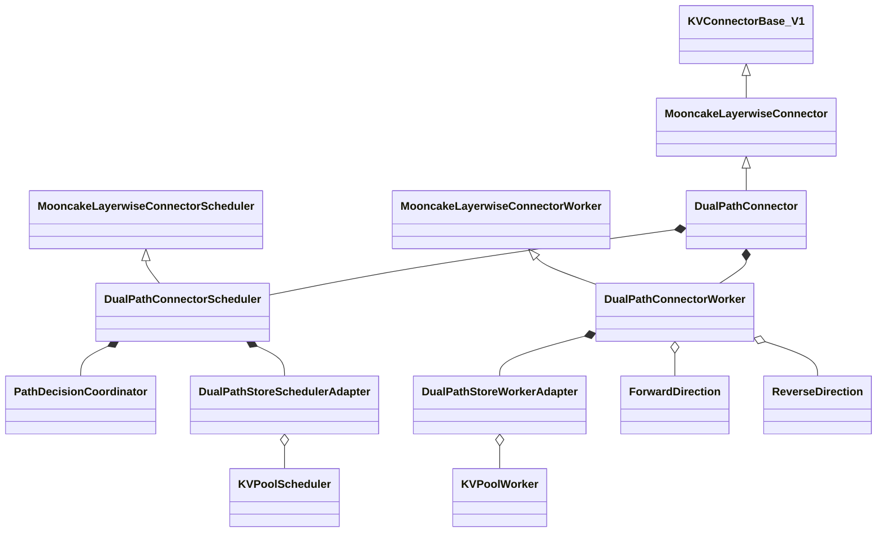
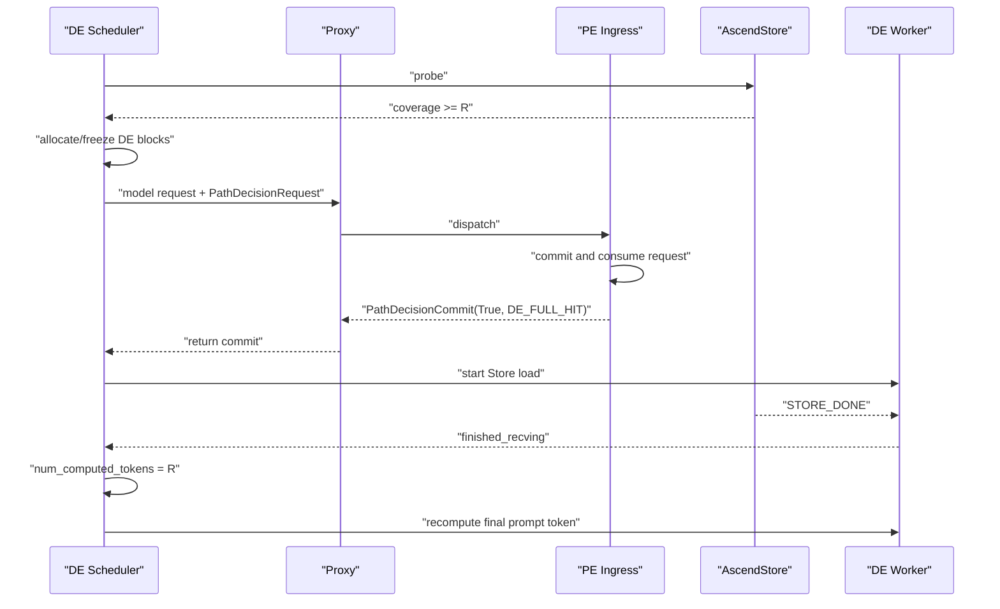
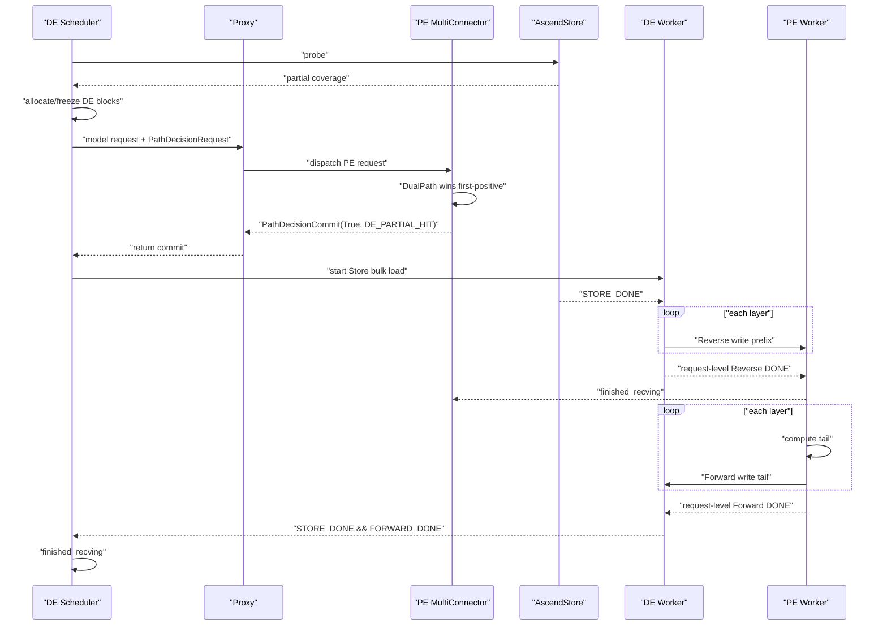

# DualPathConnector Stage 1 方案 A″ 详细开发设计

> 状态：独立设计评审稿，尚未进入实现
> 方案：外层 `AscendMultiConnector` first-positive 编排
> 适用范围：当前 `dev/dualpath` 分支中的 vLLM Ascend 仓库
> 核心目标：打通外层 AscendStore 路径、`DE_FULL_HIT` 与
> `DE_PARTIAL_HIT`
> 互斥关系：不得与方案 B 的内部编排拓扑混合实现
> 总览索引：`2026-07-23-dual-path-connector-stage1-detailed-design.md`

## 1. 文档目标

本文定义 DualPathConnector Stage 1 方案 A″ 的可实施开发设计。实现人员
应能依据本文：

1. 确定 Connector、Scheduler、Worker、Store adapter 和 Proxy 控制面的
   边界；
2. 实现 PE 唯一提交的 DualPath 决策；
3. 复用一套 Mooncake Layerwise runtime 完成 Forward 和 Reverse；
4. 正确处理 token accounting、请求 ID、正式 KV blocks 和异步完成；
5. 编写覆盖外层 AscendStore、两种 DualPath kind 及失败路径的测试。

本文中的内容分为：

- **已确认决策**：评审已达成一致，实现不得自行改变；
- **现有代码事实**：来自当前分支和当前 vLLM Connector 契约；
- **Stage 1 限制**：为控制首阶段风险主动收窄的能力。

本文是工作设计，不表示对应数据面已经实现或验证。

## 2. 目标与非目标

### 2.1 Stage 1 目标

Stage 1 支持三种最终执行结果：

1. **DualPath 未采用**：PE 外层 `AscendStoreConnector` 可被选中；若它也
   未命中，则 PE 正常计算。PE 随后通过 Forward 把 DE 缺失的完整
   decode-ready KV 写回 DE。
2. **`DE_FULL_HIT`**：DE 从 AscendStore 加载完整 decode-ready prefix，
   在 DE 本地重算最后一个 prompt token，不进入 PE Scheduler/model。
3. **`DE_PARTIAL_HIT`**：DE 从 AscendStore 加载命中前缀，通过 Reverse
   写入 PE；PE 计算尾部，再通过 Forward 写回 DE。

同时必须满足：

- 路径策略静态、确定；
- PE 是 DualPath decision 的唯一提交方；
- Store load、Reverse 和 Forward 只能在 commit 后启动；
- Mooncake 数据传输保持逐层；
- 每个方向只发布请求级最终 DONE/FAILED；
- 已提交路径的必要操作失败后，请求进入 `FINISHED_ERROR`；
- 失败后不隐式切路。

### 2.2 Stage 1 非目标

Stage 1 不实现：

- Value Function 驱动的 active 自动选路；
- LinkMonitor 驱动的运行时切路；
- post-commit fallback 或局部恢复；
- token striping；
- Store 逐层读取；
- Reverse 与 PE compute 的跨层重叠；
- Relay staging 或额外中转 HBM；
- 独立的 Scheduler ZMQ 控制通道；
- Worker ZMQ 承担路径决策；
- 应用层 decision 重试协议；
- 请求级多次 transfer attempt；
- 跨 PP stage 或 DP replica 的 DualPath；
- 修改现有 `AscendMultiConnector`、`AscendStoreConnector`、
  `MooncakeLayerwiseConnector` 或上游 vLLM。

Value Function 与 LinkMonitor 可以继续作为 shadow 观测，但不得改变
Stage 1 active decision。

## 3. 已确认的硬约束

### 3.1 代码修改边界

实现范围限定在：

```text
vllm_ascend/distributed/kv_transfer/kv_p2p/dual_path/
tests/ut/distributed/kv_transfer/dual_path/
tests/e2e/.../dual_path/
docs/
```

允许复用公开接口和现有类，不修改既有 Connector 源码。

### 3.2 继承与 runtime 所有权

公共类保持：

```python
class DualPathConnector(MooncakeLayerwiseConnector):
    ...


class DualPathConnectorScheduler(MooncakeLayerwiseConnectorScheduler):
    ...


class DualPathConnectorWorker(MooncakeLayerwiseConnectorWorker):
    ...
```

`DualPathConnectorWorker` 本身就是唯一的 Mooncake Layerwise Worker：

- 只执行一次父 Worker 初始化；
- 只注册一次正式 KV buffers；
- 只启动一个 send thread；
- 只启动一个 recv thread；
- Forward 和 Reverse 是对这组线程的两个逻辑方向；
- 不嵌套第二个完整 Mooncake Worker 或 Connector。

### 3.3 Store 组合边界

DualPath 内部不创建完整 `AscendStoreConnector`。DE 侧只按职责组合：

- `KVPoolScheduler`：Store lookup 和 load metadata；
- `KVPoolWorker`：Store 到正式 HBM KV blocks 的 bulk load；
- `LookupKeyServer`：仅在现有 KVPool 调用约束要求时创建。

PE Store load 仍由外层独立 `AscendStoreConnector` sibling 负责。

### 3.4 KV 内存边界

Store、Reverse 和 Forward 均直接访问模型最终使用的正式 KV blocks。

禁止：

- Store 专属 staging blocks；
- Reverse staging blocks；
- 从中转区到正式 blocks 的二次复制。

安全性由严格的操作顺序、互不重叠的 token 区间和框架请求生命周期保证，
不增加一套独立 block owner 状态机。

### 3.5 生命周期表达

实现不定义通用生命周期枚举或状态转移表。请求事实由有类型的容器表达：

```python
pending_candidates: dict[DualPathRequestKey, PathDecisionRequest]
committed_decisions: dict[DualPathRequestKey, PathDecisionCommit]
terminal_requests: dict[DualPathRequestKey, TerminalRecord]
```

约束：

- candidate 被接受或拒绝时都产生唯一 commit；
- commit 后不得改成另一种结果；
- terminal 后禁止启动新操作；
- transport drain 只负责资源安全，不改变请求终态。

## 4. 现有组件事实与设计影响

### 4.1 AscendMultiConnector

Scheduler 侧仍是配置顺序的 first-positive：

1. 依次调用 child 的 `get_num_new_matched_tokens()`；
2. 第一个返回正数的 child 成为 Scheduler accounting winner；
3. 后续 child 仍可能被查询，但不能覆盖 winner；
4. `AscendMultiConnector.update_state_after_alloc()` 会把真实 blocks 传给
   winner，也会传给所有 `MooncakeLayerwiseConnector` 子类；
5. 真实 blocks 传递不代表该 child 赢得 accounting，也不授权数据面副作用。

因此 DualPath 必须排在 `AscendStoreConnector` 前面，并以 commit 作为所有
Store/Reverse/Forward 副作用的 gate。

### 4.2 MooncakeLayerwiseConnector

现有 Mooncake Layerwise 数据面是单边写：

- KV buffers 在 Worker 初始化阶段注册一次；
- recv thread 初始化后长期监听；
- sender 首次访问目标 peer 时通过 `GET_META_MSG` 获取远端地址和 TE
  session，随后缓存；
- 每层由 sender 调用 `batch_transfer_sync_write()` 写入远端正式 blocks；
- sender 在最后一层且最后一个 chunk 完成后发送请求级 DONE/FAILED；
- receiver 只维护请求级 done/failed 集合，不提供逐层远端完成事件。

Stage 1 必须复用这一语义，不额外增加请求级 arm barrier 或逐层 ACK。

### 4.3 AscendStoreConnector

现有 AscendStore：

- Scheduler lookup 与 Worker load 分离；
- load 是 request-level bulk load；
- `load_async=True` 时，完成通过
  `KVPoolWorker.get_finished(finished_req_ids, metadata)` 返回；
- `loading_req_ids` 决定哪些 Store receive completion 可以被公开；
- 内部 Store save 的 delayed-free/WorkerMetadata 逻辑与 Stage 1 DE read
  无关。

DE Store adapter 只复用 lookup、metadata 和 bulk load，不复用内部 save。

### 4.4 最后一个 prompt token

设原始 prompt 长度为 `P`：

```text
R = max(P - 1, 0)
```

`R` 是 DE 第一次本地 forward 前必须具备的 decode-ready KV prefix。

- Store coverage 最大只计到 `R`；
- PE 模型请求也只计算到 `R`；
- `DE_FULL_HIT` 在 DE 设置 `num_computed_tokens = R` 后重算最后一个
  prompt token。

## 5. 统一术语与 token accounting

### 5.1 角色

| 简写 | 含义 |
|---|---|
| PE | Prefill Engine |
| DE | Decode Engine |
| Store | AscendStore backend |
| Forward | PE 到 DE 的 Mooncake Layerwise 写入 |
| Reverse | DE 到 PE 的 Mooncake Layerwise 写入 |

### 5.2 Token 变量

| 变量 | 含义 |
|---|---|
| `P` | 原始 prompt token 数 |
| `R` | `max(P - 1, 0)` |
| `L_DE` | DE 已拥有的连续可复用 token 数 |
| `L_PE` | PE 已拥有的连续可复用 token 数 |
| `S_DE_raw` | DE Store probe 返回的绝对命中前缀 |
| `S_PE_raw` | PE 外层 Store lookup 返回的绝对命中前缀 |
| `G` | Store transfer granularity |
| `S_DE` | `min(floor(S_DE_raw / G) * G, R)` |
| `S_PE` | `min(floor(S_PE_raw / G) * G, R)` |
| `K_DE` | `min(max(L_DE, S_DE), R)` |
| `K_PE` | `min(max(L_PE, S_PE), R)` |
| `H_DE` | `max(K_DE - L_DE, 0)` |
| `H_PE` | `max(K_PE - L_PE, 0)` |
| `E_DE` | `max(R - L_DE, 0)` |

Scheduler accounting：

| Engine / 结果 | 返回值 | `load_async` | 含义 |
|---|---:|---:|---|
| DE / 任意远端结果 | `E_DE` | `E_DE > 0` | DE 等待最终 KV 到达 |
| PE / 外层 AscendStore winner | `H_PE` | `H_PE > 0` | Store 写入 PE 的新增前缀 |
| PE / `DE_PARTIAL_HIT` | `max(K_DE - L_PE, 0)` | 正数时为真 | Reverse 写入 PE 的新增前缀 |
| PE / `DE_FULL_HIT` | 不进入 Scheduler | 不适用 | PE ingress 短路 |

边界：

- `E_DE == 0`：不创建 DualPath candidate；
- `K_DE >= R`：full-hit candidate；
- `L_DE < K_DE < R` 且 `L_PE < K_DE`：partial-hit candidate；
- `H_DE == 0`：拒绝 partial-hit candidate；
- DE Store 新增区间为 `[L_DE, K_DE)`；
- DE 的 Reverse 可读前缀为 `[0, K_DE)`；
- Reverse 实际传输和写入 PE 缺失区间 `[L_PE, K_DE)`；
- partial Forward 为 `[K_DE, R)`；
- DualPath 未采用时，Forward 必须覆盖 DE 完整缺失区间 `[L_DE, R)`，
  而不只是 PE 新计算的尾部。

### 5.3 StoreCoverage

```python
@dataclass(frozen=True)
class StoreCoverage:
    raw_hit_tokens: int
    aligned_hit_tokens: int
    local_tokens: int
    ready_prefix_tokens: int
    decode_ready_tokens: int
    store_load_tokens: int
    prefill_tail_tokens: int
    is_full_hit: bool
```

`StoreCoverage` 只描述已验证、对齐后的 coverage，不表示 Store load 已
完成。PE 与 DE 的 coverage 和 local token 数不得互相复用。

## 6. 请求 ID 与传输身份

### 6.1 控制面关联键

```python
@dataclass(frozen=True)
class DualPathRequestKey:
    de_engine_incarnation: str
    de_engine_local_request_id: str
```

该 key 不生成新的 route UUID。它复用 DE Engine-local request identity，
并加 DE incarnation 避免进程重启后的 ID 冲突。

### 6.2 数据面身份

```python
@dataclass(frozen=True)
class DualPathTransferIds:
    request_key: DualPathRequestKey
    pe_engine_local_request_id: str | None
    forward_wire_external_id: str
    reverse_wire_external_id: str
```

约束：

- `pe_engine_local_request_id` 在 full hit 时为 `None`；
- Forward/Reverse wire ID 由 `request_key + direction` 确定性派生；
- 两个方向的 wire ID 不得相同；
- Proxy dispatch ID 和 Store request key 继续由各自子系统管理，不进入
  DualPath 核心 identity；
- 同一请求被框架重复派发时复用原 key 和 wire IDs；
- 新请求不得复用仍可能产生迟到完成通知的 wire ID；
- `finished_*` 只能包含当前 Engine 的 local request ID。

Stage 1 不支持同一 key 下重新启动第二次传输尝试。

## 7. DualPath 内部结果模型

```python
class DualPathKind(str, Enum):
    DE_FULL_HIT = "DE_FULL_HIT"
    DE_PARTIAL_HIT = "DE_PARTIAL_HIT"
```

外层 `AscendStoreConnector` winner 不属于该枚举。

### 7.1 结果含义

| DualPath kind | Store | Reverse | PE compute | Forward | DE 成功条件 |
|---|---|---|---|---|---|
| `DE_FULL_HIT` | DE | 无 | 无 | 无 | `STORE_DONE` |
| `DE_PARTIAL_HIT` | DE | 有 | 尾部 | 有 | `STORE_DONE && FORWARD_DONE` |

DualPath 未采用时：

```text
use_dual_path=False
dual_path_kind=None
```

此时外层 AscendStore 或 PE 正常计算负责准备 PE KV，DE 只等待
`FORWARD_DONE`。

### 7.2 静态策略

```python
class StaticPartialHitPolicy(str, Enum):
    PREFER_PE = "prefer_pe"
    PREFER_DE = "prefer_de"
```

决策顺序：

1. DE coverage 满足 full hit：接受 `DE_FULL_HIT`；
2. partial coverage、策略为 `PREFER_DE` 且所有准入条件通过：接受
   `DE_PARTIAL_HIT`；
3. 其他情况：拒绝 DualPath。

### 7.3 准入条件

共同条件：

- request key 有效；
- DE blocks 已分配并冻结；
- PE/DE 模型、dtype、block size 和 KV layout 一致；
- TP rank mapping 一致；
- 共享 Mooncake runtime 已完成本地 buffer 注册；
- 对应远端 receiver endpoint 可解析。

partial 额外要求：

- `L_DE < K_DE < R`；
- `L_PE < K_DE`；
- DE Store bulk load 可用；
- Reverse 和 Forward 均可建立目标 metadata。

任一条件失败时，PE 提交 DualPath 未采用，而不是启动部分数据面。

## 8. 路径决策协议

### 8.1 核心类型

```python
@dataclass(frozen=True)
class PathDecisionRequest:
    request_key: DualPathRequestKey
    de_store_coverage: StoreCoverage


@dataclass(frozen=True)
class PathDecisionCommit:
    request_key: DualPathRequestKey
    use_dual_path: bool
    dual_path_kind: DualPathKind | None
```

不变量：

- `use_dual_path=True` 时 kind 必须非空；
- `use_dual_path=False` 时 kind 必须为 `None`；
- 相同 key 的相同 commit 幂等；
- 相同 key 的不同二次 commit 是协议错误。

### 8.2 调用顺序

以下是调用顺序，不是四轮 barrier：

```text
PROBE -> ALLOCATE_AND_DISPATCH -> COMMIT -> DATA_START
```

具体步骤：

1. DE 计算 `E_DE`；
2. `E_DE == 0` 时返回 `(0, False)`；
3. DE Store adapter 执行无 HBM I/O 的 probe；
4. DE Scheduler 返回 `(E_DE, True)` 并分配正式 blocks；
5. DE 冻结本地 block manifest，但不启动 I/O；
6. DE 通过统一 Proxy model-request envelope 发送
   `PathDecisionRequest`；
7. full-hit candidate 在 PE ingress 调用 decision coordinator，提交后
   不进入 PE Scheduler/model；
8. 其他 candidate 进入 PE Scheduler；
9. PE DualPath child 决定接受 partial 或返回 `(0, False)`；
10. PE 通过 Proxy/RPC 返回唯一 `PathDecisionCommit`；
11. DualPath 未采用时，PE Multi 继续选择外层 AscendStore；
12. PE/DE 各自绑定本地 Worker plan；
13. 每侧仅在本地 commit、plan 和 request terminal 条件满足后启动被授权
    的操作。

### 8.3 统一 Proxy request

三种最终结果都发送 model-request envelope：

- full hit：PE ingress 消费 envelope，返回 commit，不创建 PE model
  request；
- partial hit：创建 PE model request，DualPath 成为 first-positive
  winner；
- DualPath 未采用：创建 PE model request，后续 AscendStore 可成为
  winner，也可能全部 miss 后正常计算。

路径决策属于 Scheduler/Proxy 控制面：

- 不复用 Worker `side_channel_port`；
- 不增加 Scheduler ZMQ endpoint；
- 不定义业务层确认消息；
- 不实现 DualPath 自身的 retry loop；
- Proxy dispatch 或 commit return timeout 使请求失败。

`PathDecisionRequest` 只是 decision payload。DE endpoint、block manifest
和既有 Mooncake 参数继续作为统一 `kv_transfer_params` envelope 中的同级
字段传递，不扩充 `PathDecisionRequest`。

实现前必须验证现有 Proxy/RPC 能把 PE commit 返回正确 DE Scheduler。
若不能，必须重新评审控制面范围。

### 8.4 PE 请求截断

非 full-hit PE model request 必须幂等截断到 `R`：

```python
def truncate_pe_request_to_decode_ready_prefix(
    request: Request,
    decode_ready_tokens: int,
) -> None:
    ...
```

同步更新：

- `prompt_token_ids` 或 `prompt_embeds`；
- `_all_token_ids`；
- `num_prompt_tokens`；
- `max_tokens = 1`；
- 一个防止重复截断的内部 flag。

### 8.5 本地记录

```python
class PathDecisionCoordinator:

    def register_candidate(
        self,
        request: PathDecisionRequest,
    ) -> None: ...

    def decide_on_pe(
        self,
        request: PathDecisionRequest,
        pe_local_tokens: int | None,
    ) -> PathDecisionCommit: ...

    def commit_once(
        self,
        decision: PathDecisionCommit,
    ) -> PathDecisionCommit: ...

    def get_committed(
        self,
        request_key: DualPathRequestKey,
    ) -> PathDecisionCommit | None: ...

    def mark_terminal(
        self,
        request_key: DualPathRequestKey,
        error_code: str | None,
    ) -> None: ...
```

data-start gate：

```python
def can_start_data(
    committed: PathDecisionCommit | None,
    local_plan_ready: bool,
    terminal: bool,
) -> bool:
    return committed is not None and local_plan_ready and not terminal
```

### 8.6 raw completion 早到

Mooncake receiver 可能在本地 request mapping 建立前收到 wire terminal。
Worker 必须保留：

```python
pending_raw_done: set[str]
pending_raw_failed: set[str]
```

每次 `get_finished()`：

1. 合并 recv thread 新返回的 raw IDs；
2. 对已建立 mapping 的 ID 发布 Engine-local completion；
3. 未建立 mapping 的 ID 继续保留；
4. 失败 raw ID 按同样方式处理；
5. 发布后删除对应 raw ID。

不得因 mapping 尚未建立而丢弃 DONE/FAILED。

## 9. 类与职责设计

### 9.1 类图



`ForwardDirection` 和 `ReverseDirection` 是私有 helper：

- 不拥有 KV buffers；
- 不创建线程；
- 不关闭 runtime；
- 只负责把方向特定 plan 转换成父 Worker 的 `ReqMeta`/`SendTask`；
- 都访问同一个 `DualPathConnectorWorker` 的 send/recv thread。

### 9.2 角色映射

| Engine | send thread | recv thread |
|---|---|---|
| PE | Forward producer | Reverse consumer |
| DE | Reverse producer | Forward consumer |

每个 Engine 只接收一个逻辑方向，因此只需要一个 role-local receiver
endpoint。

### 9.3 DualPathConnector

```python
class DualPathConnector(MooncakeLayerwiseConnector):

    def __init__(
        self,
        vllm_config: VllmConfig,
        role: KVConnectorRole,
        kv_cache_config: KVCacheConfig | None = None,
    ) -> None: ...

    def get_num_new_matched_tokens(
        self,
        request: Request,
        num_computed_tokens: int,
    ) -> tuple[int | None, bool]: ...

    def update_state_after_alloc(
        self,
        request: Request,
        blocks: KVCacheBlocks,
        num_external_tokens: int,
    ) -> None: ...

    def build_connector_meta(
        self,
        scheduler_output: SchedulerOutput,
    ) -> KVConnectorMetadata: ...

    def register_kv_caches(
        self,
        kv_caches: dict[str, torch.Tensor],
    ) -> None: ...

    def start_load_kv(
        self,
        forward_context: ForwardContext,
        **kwargs: Any,
    ) -> None: ...

    def wait_for_layer_load(
        self,
        layer_name: str,
    ) -> None: ...

    def save_kv_layer(
        self,
        layer_name: str,
        kv_layer: list[torch.Tensor],
        attn_metadata: AttentionMetadata,
        **kwargs: Any,
    ) -> None: ...

    def get_finished(
        self,
        finished_req_ids: set[str],
    ) -> tuple[set[str] | None, set[str] | None]: ...

    def get_block_ids_with_load_errors(
        self,
    ) -> set[int]: ...

    def request_finished_all_groups(
        self,
        request: Request,
        block_ids: tuple[list[int], ...],
    ) -> tuple[bool, dict[str, Any] | None]: ...
```

与父 facade 不同，DualPath 的 `get_finished(finished_req_ids)` 必须把参数
传给 Worker，用于清理已结束但未启动的数据计划和 delayed-free。

### 9.4 Scheduler

Scheduler 负责：

- DE probe 和统一 `E_DE` accounting；
- PE candidate decision 和 first-positive accounting；
- commit 容器；
- DE block plan 冻结；
- PE/DE local Worker metadata 构建；
- probe handle commit/abort；
- request finish 时清理 Scheduler-side 记录。

Scheduler 不负责：

- 轮询 Worker thread；
- 维护 TP rank barrier；
- 读取 Worker 内存中的进行中操作。

### 9.5 Worker

Worker 负责：

- 调用父 Worker `register_kv_caches()` 一次；
- 绑定 step-local plan；
- 启动 DE Store load；
- Store 完成后逐层提交 Reverse send；
- 在 PE 模型 callback 中逐层提交 Forward send；
- 从唯一 recv thread 收集 request-level DONE/FAILED；
- 保存 mapping 尚未建立的 raw completion；
- 生成精确 Engine-local `finished_recving`；
- 聚合失败 block IDs；
- 沿用现有 sender delayed-free 契约。

Worker 不实现通用事件分发器。

### 9.6 WorkerMetadata

公开 receive completion 和 invalid blocks 使用框架已有独立通道：

```text
worker.get_finished()
  -> KVOutputAggregator
  -> connector_output.finished_*

worker.get_block_ids_with_load_errors()
  -> KVOutputAggregator
  -> Scheduler invalidation
```

Stage 1 内部 Store save 关闭，因此 DualPath 不为 read completion 新增
`KVConnectorWorkerMetadata`。如果底层 KVPool 在具体模型组合下返回既有
Store metadata，facade 只做最小透传，不把它用于路径完成判定。

### 9.7 Store adapter

Scheduler adapter：

```python
@dataclass(frozen=True)
class StoreProbeHandle:
    handle_id: str
    request_key: DualPathRequestKey
    coverage: StoreCoverage


class DualPathStoreSchedulerAdapter:

    def probe(
        self,
        request: Request,
        local_tokens: int,
    ) -> StoreProbeHandle | None: ...

    def abort_probe(
        self,
        handle: StoreProbeHandle,
    ) -> None: ...

    def commit_after_alloc(
        self,
        handle: StoreProbeHandle,
        request: Request,
        blocks: KVCacheBlocks,
        store_load_tokens: int,
    ) -> AscendConnectorMetadata: ...
```

Worker adapter：

```python
class DualPathStoreWorkerAdapter:

    def register_kv_caches(
        self,
        kv_caches: dict[str, torch.Tensor],
    ) -> None: ...

    def start_load_kv(
        self,
        metadata: AscendConnectorMetadata,
    ) -> None: ...

    def get_finished(
        self,
        finished_req_ids: set[str],
        metadata: AscendConnectorMetadata,
    ) -> tuple[set[str], set[str]]: ...

    def get_block_ids_with_load_errors(
        self,
    ) -> set[int]: ...
```

派生 Store config 强制：

```text
use_layerwise = false
load_async = true
consumer_is_to_load = true
consumer_is_to_put = false
```

每个 probe handle 必须且只能 commit 或 abort 一次。

## 10. 请求计划与 metadata

### 10.1 方向计划

```python
class TransferDirection(str, Enum):
    FORWARD = "FORWARD"
    REVERSE = "REVERSE"


@dataclass(frozen=True)
class LayerwiseDirectionPlan:
    direction: TransferDirection
    wire_external_id: str
    local_request_id: str
    token_start: int
    token_end: int
    local_block_ids: tuple[tuple[int, ...], ...]
    remote_block_ids: tuple[tuple[int, ...], ...]
    remote_block_size: tuple[int, ...]
    remote_engine_id: str
    remote_host: str
    remote_port: int
    remote_tp_size: int
    remote_pcp_size: int
    remote_dcp_size: int
```

layer address、block byte length 和 tensor group 信息继续来自初始化时注册的
`layer_metadata`，不重复放入请求计划。

### 10.2 Worker plan

```python
@dataclass(frozen=True)
class DualPathWorkerPlan:
    ids: DualPathTransferIds
    decision: PathDecisionCommit
    store_coverage: StoreCoverage
    store_metadata: AscendConnectorMetadata | None
    reverse: LayerwiseDirectionPlan | None
    forward: LayerwiseDirectionPlan | None
```

合法组合：

| 结果 | Store metadata | Reverse | Forward |
|---|---|---|---|
| DualPath 未采用 / PE | 无 | 无 | send |
| DualPath 未采用 / DE | 无 | 无 | receive |
| `DE_FULL_HIT` / DE | 有 | 无 | 无 |
| `DE_PARTIAL_HIT` / DE | 有 | send | receive |
| `DE_PARTIAL_HIT` / PE | 无 | receive | send |

Scheduler-side probe handle 不序列化到 Worker。

### 10.3 metadata 构建

```python
@dataclass
class DualPathConnectorMetadata(KVConnectorMetadata):
    plans: tuple[DualPathWorkerPlan, ...]
```

Worker 只能消费冻结后的 blocks 和 endpoint，不得重新根据 token 数计算
边界。

### 10.4 完成事实

```python
@dataclass
class RequestCompletionFacts:
    store_done: bool = False
    reverse_done: bool = False
    forward_done: bool = False
    failed: bool = False
    error_code: str | None = None
```

路径 commit 是控制面事实，不属于 transfer completion。

## 11. 数据依赖

### 11.1 `DE_PARTIAL_HIT`

```text
STORE_DONE
  -> enqueue Reverse SendTask for every layer
  -> receiver request-level REVERSE_DONE
  -> PE finished_recving
  -> PE model execution
  -> save_kv_layer() enqueues Forward SendTask per layer
  -> receiver request-level FORWARD_DONE
```

关键点：

- Store 是 bulk load；
- Reverse/Forward 是逐层写；
- 远端只发布请求级 final completion；
- PE 必须等完整 Reverse request completion 后才进入模型；
- PE 每执行完一层，就可按父 callback 顺序发送该层 Forward；
- 最后一层最后一个 chunk 完成后，sender 发送请求级 DONE/FAILED。

### 11.2 不增加逐层远端完成事件

Reverse 不与 PE compute 重叠，PE 只关心整个 Reverse 是否完成。

Forward 的逐层依赖由 PE 本地 callback 和 sender queue 顺序保证：

```text
PE layer compute complete
  -> save_kv_layer(layer)
  -> batch_transfer_sync_write(layer)
```

DE 在所有层完成前不会收到请求级 Forward terminal。

### 11.3 TP rank

每个 TP Worker 维护本 rank completion。公开 barrier 由框架
`KVOutputAggregator` 完成：

- 任一 rank 失败则请求失败；
- 所有 rank 返回同一 Engine-local ID 后才形成公开 terminal；
- Connector Scheduler 不维护第二套 rank 集合。

## 12. KV block 生命周期

### 12.1 分配

- DE 在 decision 前按 `E_DE` 分配最终 blocks；
- PE 按 first-positive accounting 分配最终 blocks；
- plan 冻结后不得替换 block IDs；
- Store/P2P 直接写这些 blocks。

### 12.2 写入范围

`DE_PARTIAL_HIT`：

```text
DE Store writes [L_DE, K_DE)
DE Forward receiver writes [K_DE, R)
```

Reverse：

```text
DE reads [L_PE, K_DE)
PE receiver writes [L_PE, K_DE)
```

DualPath 未采用：

```text
PE Forward source covers [L_DE, R)
DE Forward receiver writes [L_DE, R)
```

### 12.3 生命周期规则

- Store load 完成前不得读取 DE Store target；
- Reverse request completion 前 PE 不执行模型或公开 prefix cache；
- Forward request completion 前 DE 不解除 remote-KV 等待；
- framework request 生命周期内 blocks 不被复用；
- sender 若在请求结束后仍需读取 source blocks，沿用
  `request_finished_all_groups()` delayed-free；
- 失败时请求计划涉及的 blocks 整体 invalid。

不增加细粒度 block owner registry。

## 13. 完成与释放语义

### 13.1 成功谓词

```python
def de_receive_succeeded(
    decision: PathDecisionCommit,
    facts: RequestCompletionFacts,
) -> bool:
    if not decision.use_dual_path:
        return facts.forward_done
    if decision.dual_path_kind is DualPathKind.DE_FULL_HIT:
        return facts.store_done
    if decision.dual_path_kind is DualPathKind.DE_PARTIAL_HIT:
        return facts.store_done and facts.forward_done
    raise AssertionError(decision)
```

PE partial 的 remote-KV 成功条件为 `facts.reverse_done`。

### 13.2 `finished_recving`

| Engine / 结果 | 发布条件 |
|---|---|
| PE / `DE_PARTIAL_HIT` | Reverse request DONE |
| DE / DualPath 未采用 | Forward request DONE |
| DE / `DE_FULL_HIT` | Store load DONE |
| DE / `DE_PARTIAL_HIT` | Store DONE 且 Forward request DONE |

失败请求也必须最终发布本地 receive terminal，使框架结束等待：

- failed block IDs 不晚于 failed receive terminal；
- failure 后不启动新操作；
- sender/receiver 明确终止或返回请求级 FAILED 后才释放相关 blocks。

### 13.3 `finished_sending`

`finished_sending` 只用于：

1. Scheduler request-finish hook 曾返回 delayed-free；
2. sender 已完成最后一次 source-block 读取；
3. framework 可以释放延迟持有的 blocks。

DualPath 复用父 Mooncake sender delayed-free tracking。

### 13.4 Store completion

DE Store adapter 从 `KVPoolWorker.get_finished()` 获得 completion：

- full hit：满足 DE receive success；
- partial hit：只设置 `store_done`；
- Store failure：聚合 failed block IDs 并进入 failed terminal。

### 13.5 raw wire completion 映射

```text
wire external ID
  -> DualPathRequestKey
  -> Engine-local request ID
```

只有 Engine-local ID 可以进入框架 `finished_*`。

## 14. 三种执行结果时序

### 14.1 DualPath 未采用

```mermaid
sequenceDiagram
    participant DES as "DE Scheduler"
    participant Proxy as "Proxy"
    participant PEI as "PE Ingress"
    participant Multi as "PE MultiConnector"
    participant AS as "PE AscendStore"
    participant PEW as "PE Worker"
    participant DEW as "DE Worker"

    DES->>DES: "probe DE Store; allocate DE blocks"
    DES->>Proxy: "model request + PathDecisionRequest"
    Proxy->>PEI: "dispatch"
    PEI->>Multi: "create PE request"
    Multi->>Multi: "DualPath returns (0, False)"
    PEI-->>Proxy: "PathDecisionCommit(False, None)"
    Proxy-->>DES: "return commit"
    Multi->>AS: "continue Store lookup"
    alt "AscendStore hit"
        AS-->>PEW: "bulk load PE blocks"
    else "AscendStore miss"
        Multi->>PEW: "normal PE compute"
    end
    loop "each layer"
        PEW->>DEW: "Forward write [L_DE, R)"
    end
    PEW-->>DEW: "request-level Forward DONE"
    DEW-->>DES: "finished_recving"
```

### 14.2 `DE_FULL_HIT`



### 14.3 `DE_PARTIAL_HIT`



## 15. 方案 A″ 外层 first-positive 编排

### 15.1 拓扑

PE：

```text
AscendMultiConnector
├── DualPathConnector
└── AscendStoreConnector
```

DE：

```text
DualPathConnector
```

配置顺序是行为契约：

```text
DualPathConnector -> AscendStoreConnector
```

### 15.2 选择与 accounting

PE 将 decision 和 accounting 分成两个函数：

```python
def decide_on_pe(
    request: PathDecisionRequest,
    pe_local_tokens: int | None,
    policy: StaticPartialHitPolicy,
    capabilities: LocalCapabilities,
) -> PathDecisionCommit:
    ...


def matched_tokens_from_commit(
    request: PathDecisionRequest,
    decision: PathDecisionCommit,
    pe_local_tokens: int,
) -> tuple[int, bool]:
    if not decision.use_dual_path:
        return 0, False
    if decision.dual_path_kind is DualPathKind.DE_PARTIAL_HIT:
        count = max(
            request.de_store_coverage.decode_ready_tokens - pe_local_tokens,
            0,
        )
        return count, count > 0
    raise AssertionError("full hit never enters PE Scheduler")
```

### 15.3 child 行为

- DualPath partial 返回正数时成为 first-positive winner；
- DualPath rejected 返回 `(0, False)`；
- 后续 AscendStore 可成为 winner；
- 非 winner AscendStore 不得生成 Worker GET；
- Layerwise child 即使不是 winner 仍获得真实 blocks；
- 真实 blocks 不绕过 commit gate。

### 15.4 sibling 生命周期

DualPath 未采用时：

- PE Store load completion 由 AscendStore child 发布；
- PE Forward completion 由 DualPath 在 DE 侧发布；
- PE Store 失败时模型不执行，Forward 不启动；
- finished request IDs 用于清理未启动的 DualPath plans；
- 已启动 sender 的 source blocks 按父 delayed-free 语义释放。

不增加跨 sibling 私有 outcome 对象。

## 16. 配置设计

### 16.1 Active 配置

PE 示例：

```yaml
kv_transfer_config:
  kv_connector: MultiConnector
  kv_role: kv_producer
  kv_load_failure_policy: fail
  kv_connector_extra_config:
    connectors:
      - kv_connector: DualPathConnector
        kv_role: kv_both
        kv_port: 20000
        kv_connector_extra_config:
          role: pe
          orchestration_mode: outer_first_positive
          partial_hit_policy: prefer_de
          enable_value_function_shadow: false
          enable_link_monitor_shadow: false
      - kv_connector: AscendStoreConnector
        kv_role: kv_producer
```

DE 示例：

```yaml
kv_transfer_config:
  kv_connector: DualPathConnector
  kv_role: kv_both
  kv_port: 20000
  kv_load_failure_policy: fail
  kv_connector_extra_config:
    role: de
    orchestration_mode: outer_first_positive
    partial_hit_policy: prefer_de
    store:
      use_layerwise: false
      load_async: true
      consumer_is_to_load: true
      consumer_is_to_put: false
```

每个 Engine 只有一个 role-local receiver endpoint。remote endpoint 由请求
metadata 指定。

### 16.2 foundation 配置迁移

当前 `config.py` 中与下列能力相关的字段必须删除或明确降为 shadow：

- Worker ZMQ decision control；
- relay data plane；
- active Value Function；
- active adaptive strategy；
- multi-path slicing planner。

Proxy/RPC commit return 是部署集成能力，不放入 Worker transport 配置。

### 16.3 校验

- `role` 是 `pe` 或 `de`；
- 两侧 `kv_role=kv_both`；
- `kv_load_failure_policy=fail`；
- policy 是已知静态值；
- PE Multi child 顺序正确；
- DE Store config 关闭 put/save；
- topology 满足第 17 章；
- Proxy/RPC 支持 commit return。

## 17. Stage 1 拓扑限制

Stage 1 fail-fast：

- `pipeline_parallel_size == 1`；
- `data_parallel_size == 1`；
- PE/DE `tensor_parallel_size` 相同；
- PE/DE TP rank 一一对应；
- 单一 KV cache group；
- 普通 Attention KV layout；
- PCP/DCP 关闭；
- PE/DE 模型、dtype、block size 和 KV layout 相同。

原因：

- Store adapter 尚未验证 hybrid/multi-group metadata；
- direction plan 尚未编码 PP/DP identity；
- Stage 1 先验证共享 Worker 双向数据通路和 request-level completion。

这些限制不代表父 Mooncake 本身不支持更复杂拓扑。

## 18. 初始化与 endpoint 获取

### 18.1 本地初始化

1. `DualPathConnector` 直接调用 `KVConnectorBase_V1.__init__()`；
2. 创建一个 DualPath Scheduler 或 Worker；
3. Worker 调用一次父 Worker 初始化；
4. 创建 DE Store adapters；
5. 校验 config/topology；
6. 验证 Proxy/RPC commit return；
7. `register_kv_caches()` 调用父完整注册函数一次；
8. `kv_both` runtime 启动唯一 send/recv thread；
9. recv thread ready 后 Connector 可接收请求。

### 18.2 远端 endpoint

沿用现有 Mooncake：

- receiver 长期监听 `side_channel_port + tp_rank`；
- sender 首次向 peer/port 发送时调用 `GET_META_MSG`；
- 返回远端 TE RPC port 和 layer addresses；
- sender 按 peer/port 缓存 metadata；
- 后续请求复用缓存。

Forward：

```text
PE sender -> DE receiver
```

Reverse：

```text
DE sender -> PE receiver
```

两者使用不同 wire external ID。每个 Engine 只接收一个方向，因此不启动
两个 recv ports。

### 18.3 data-start ready

- commit 已保存；
- local plan 已绑定；
- recv mapping 已登记；
- request 未 terminal。

不等待额外请求级 ready RPC。

## 19. 失败处理

### 19.1 错误分类

```python
class DualPathErrorCode(str, Enum):
    CONFIGURATION_ERROR = "CONFIGURATION_ERROR"
    DECISION_PROTOCOL_ERROR = "DECISION_PROTOCOL_ERROR"
    DECISION_TIMEOUT = "DECISION_TIMEOUT"
    STORE_LOOKUP_ERROR = "STORE_LOOKUP_ERROR"
    STORE_LOAD_ERROR = "STORE_LOAD_ERROR"
    REVERSE_TRANSFER_ERROR = "REVERSE_TRANSFER_ERROR"
    FORWARD_TRANSFER_ERROR = "FORWARD_TRANSFER_ERROR"
    TOPOLOGY_MISMATCH = "TOPOLOGY_MISMATCH"
```

### 19.2 处理规则

- config/topology/Proxy capability 错误：初始化失败；
- DE probe miss/unknown：DualPath 未采用；
- DE probe RPC 失败且未 commit：按 unknown 处理；
- Proxy dispatch/commit timeout：请求失败；
- commit 后 Store/Reverse/Forward 失败：请求失败；
- 相同 completion 重复到达：幂等忽略；
- identity/direction 冲突：协议错误；
- 失败后不启动新操作，也不切路。

### 19.3 失败终止

1. 将 request key 记入 `terminal_requests`；
2. 禁止新 Store/P2P；
3. abort 未 commit probe；
4. 收集计划涉及的 block IDs；
5. 发布 invalid block IDs；
6. 等待现有数据面返回请求级 terminal；
7. 发布 Engine-local failed `finished_recving`；
8. framework 结束请求并释放 blocks；
9. 删除 local plan 和 mapping。

### 19.4 取消与 shutdown

取消：

- pending candidate：abort probe；
- committed 未启动：删除 plan；
- 已启动：禁止新任务，等待 request-level terminal。

shutdown：

- 停止新 candidate；
- abort pending probes；
- drain 已入队 sender tasks；
- 关闭 Store adapter；
- 最后关闭父 Mooncake runtime。

## 20. 并发与幂等

必须保证：

- candidate registration 幂等；
- commit 只接受唯一 payload；
- Store load 每个 key 最多启动一次；
- Reverse request plan 最多启动一次；
- Forward 每层沿用父 `SendReqInfo` 的单调 token 记录；
- request-level DONE/FAILED 每方向最多公开一次；
- raw completion 早到不丢失；
- request finish 与 sender callback 并发时不提前释放 blocks；
- terminal 后不重启请求。

## 21. 代码布局

更新现有目录：

```text
vllm_ascend/distributed/kv_transfer/kv_p2p/dual_path/
├── __init__.py
├── connector.py
├── config.py
├── metadata.py
├── path_decision.py
├── store_adapter.py
└── layerwise_transfer.py
```

| 文件 | 职责 |
|---|---|
| `connector.py` | facade、Scheduler/Worker 子类和 vLLM hooks |
| `config.py` | active/shadow config 和 fail-fast |
| `metadata.py` | identity、coverage、commit、plan、completion facts |
| `path_decision.py` | PE decision、commit-once、accounting |
| `store_adapter.py` | DE KVPool probe/commit/abort/load |
| `layerwise_transfer.py` | 同一 Worker 的 Forward/Reverse helpers |

若 `connector.py` 过大，再按实现职责拆 `scheduler.py` 和 `worker.py`。

## 22. 实施门槛

开发前必须验证：

1. PE→DE commit 可通过现有 Proxy/RPC 返回；
2. full-hit request 可在 PE ingress 消费；
3. 三种结果都发送统一 model request；
4. KVPool 临时 lookup 状态可由 handle 安全 commit/abort；
5. `kv_both` 父 Worker 只有一组 send/recv threads；
6. DE 可从已注册 caches 构造 Reverse `SendTask`；
7. PE `save_kv_layer()` 可选择正确 Forward region；
8. 两方向 raw terminal 可映射到 Engine-local ID；
9. first-positive 与 Layerwise real blocks 不产生双 accounting；
10. PE Store failure 不启动模型或 Forward。

任一失败都必须回到评审，不能用第二个 runtime 或新增 Worker 控制通道绕过。

## 23. 测试设计

### 23.1 决策与 accounting

- full → `DE_FULL_HIT`；
- partial + prefer-de → `DE_PARTIAL_HIT`；
- partial + prefer-pe、miss、unknown → rejected；
- outer Store 不进入 `DualPathKind`；
- same commit duplicate 幂等；
- different second commit 失败；
- full 不进入 PE accounting；
- partial PE accounting 是 `K_DE - L_PE`；
- DE accounting 是 `R - L_DE`；
- coverage clamp、granularity、`P=0/1`。

### 23.2 Proxy 控制面

- 三种结果使用同一 envelope；
- request/commit schema 精确；
- full 在 PE ingress 短路；
- partial/rejected 进入 Scheduler；
- commit 返回相同 request key；
- timeout 进入 `DECISION_TIMEOUT`；
- 无 Worker decision 消息。

### 23.3 共享 runtime

- 父 Worker 初始化一次；
- buffers 注册一次；
- 一个 send thread 和一个 recv thread；
- PE send=Forward、recv=Reverse；
- DE send=Reverse、recv=Forward；
- wire IDs 不同；
- endpoint 按角色选择；
- GET_META 首次获取并缓存；
- 不进入父 consumer-first dispatch。

### 23.4 completion

- raw DONE/FAILED 在 mapping 前保留；
- mapping 后发布正确 local ID；
- duplicate 不重复公开；
- PE partial 等 Reverse DONE；
- DE rejected 等 Forward DONE；
- DE full 等 Store DONE；
- DE partial 等 Store + Forward；
- TP rank 失败；
- invalid blocks 不晚于 failed terminal；
- delayed-free 只用于 sender source blocks。

### 23.5 Store adapter

- probe 不启动 load；
- handle 只 commit/abort 一次；
- shutdown abort pending handles；
- committed metadata 含 `loading_req_ids`；
- async completion 转为 `STORE_DONE`；
- Store failure 产生 invalid blocks；
- internal save 关闭。

### 23.6 MultiConnector

- child 顺序；
- partial accepted 的 winner；
- rejected 后 outer Store winner；
- 全 miss 后 PE compute；
- Layerwise child 获得真实 blocks；
- blocks 不绕过 commit；
- 非 winner Store 不启动 GET；
- sibling local IDs 不混用。

### 23.7 NPU E2E

1. PE Store hit + PE tail + Forward；
2. PE Store miss + PE compute + Forward；
3. full hit + DE 最后 token 重算；
4. partial hit + Store + Reverse + PE tail + Forward；
5. Store failure；
6. Reverse failure；
7. Forward failure；
8. TP rank failure；
9. raw completion 早到；
10. cancel/shutdown drain。

校验输出 token、accounting、传输区间、最终状态、invalid blocks、无 block
泄漏和无方向串线。

## 24. 可观测性

日志字段：

```text
de_engine_incarnation
de_engine_local_request_id
pe_engine_local_request_id
forward_wire_external_id
reverse_wire_external_id
use_dual_path
dual_path_kind
outer_connector_winner
raw_hit_tokens
aligned_hit_tokens
store_load_tokens
reverse_tokens
forward_tokens
store_done
reverse_done
forward_done
error_code
```

指标：

- accepted/rejected 请求数；
- full/partial 成功率；
- outer Store winner 数；
- Store probe/load latency；
- Reverse/Forward request latency；
- decision latency；
- Proxy timeout；
- post-commit failure；
- pending raw completion 数量/驻留时间；
- duplicate completion 数量。

逐层 sender latency 仅作为 telemetry。shadow 指标使用 `shadow_*` 前缀。

## 25. 验收标准

- [ ] shadow foundation 已替换为 active static decision；
- [ ] 保持 Mooncake Layerwise 继承；
- [ ] 未修改既有 Connector 或上游 vLLM；
- [ ] PE/DE 拓扑正确；
- [ ] 一个 Worker 只有一套 Mooncake runtime；
- [ ] buffers 只注册一次；
- [ ] 每个 Engine 只有一个 send/recv thread；
- [ ] Forward/Reverse 共享 runtime；
- [ ] 方向 wire ID 不同；
- [ ] 数据逐层写，完成按请求发布；
- [ ] pending raw DONE/FAILED 不丢失；
- [ ] PE 唯一提交 decision；
- [ ] request/commit schema 精确；
- [ ] DualPath kind 只有 full/partial；
- [ ] 统一 model request；
- [ ] full 在 PE ingress 短路；
- [ ] commit 经 Proxy/RPC 返回；
- [ ] commit 前无 Store/P2P I/O；
- [ ] rejected 后 outer Store/PE compute 正常；
- [ ] external Forward 覆盖 `[L_DE, R)`；
- [ ] full 在 DE 重算最后一个 prompt token；
- [ ] partial Store/Forward 区间不重叠；
- [ ] PE 等 Reverse request DONE；
- [ ] DE partial 等 Store + Forward；
- [ ] failure 不切路并进入 `FINISHED_ERROR`；
- [ ] invalid blocks 顺序正确；
- [ ] sender delayed-free 复用框架语义；
- [ ] 不支持 topology fail-fast；
- [ ] UT/NPU E2E 覆盖成功和失败。

## 26. 开发顺序

1. Proxy ingress/commit-return spike；
2. active config migration；
3. decision、commit-once 和 accounting；
4. Store probe commit/abort spike；
5. DE Store adapter；
6. 单 Worker shared runtime；
7. Forward/Reverse helpers；
8. raw completion mapping；
9. Scheduler/Multi integration；
10. failure、cancel、delayed-free、shutdown；
11. UT；
12. NPU E2E；
13. 性能与显存审计。

不得先实现第二套 transport、逐层确认协议或通用状态框架来绕过尚未验证的
集成点。
